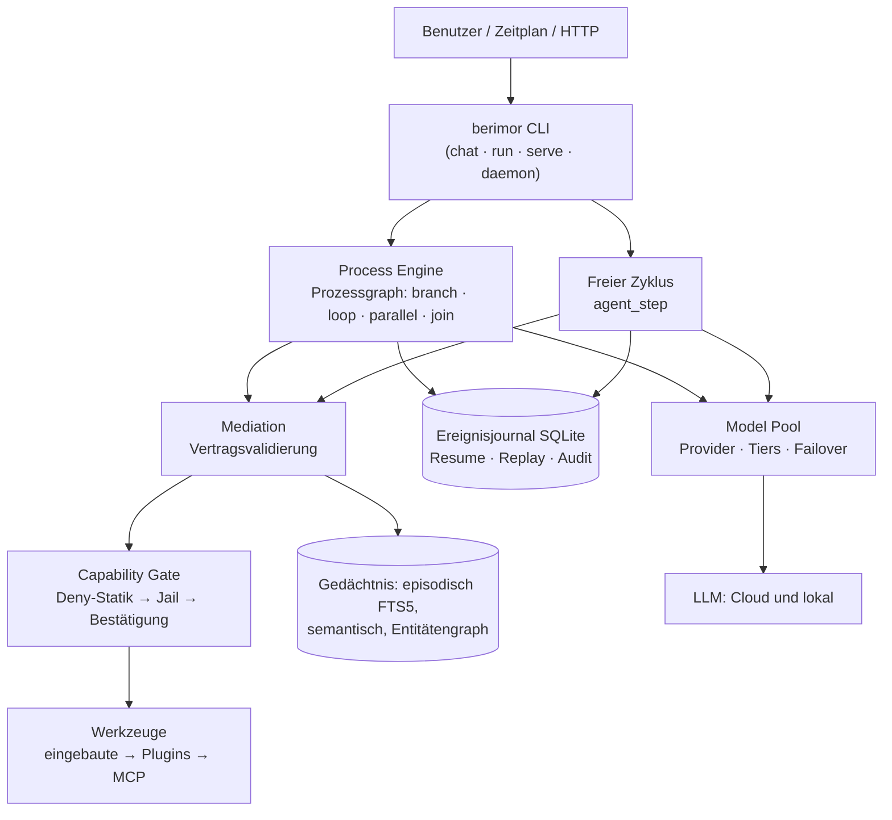
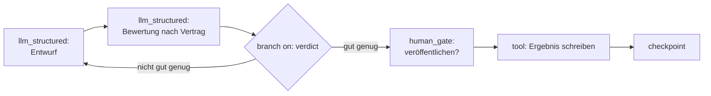

<div align="center">


**Das Modell denkt. Der Code entscheidet.**

[Русский](README.md) · [English](README.en.md) · **[Deutsch](README.de.md)** · [Français](README.fr.md) · [Español](README.es.md) · [简体中文](README.zh-CN.md) · [日本語](README.ja.md) · [한국어](README.ko.md)

</div>

Ein universeller LLM-Agent mit deterministischem Kern: Aufgabenrouting, Prozessverzweigung, Kontextauswahl und Ausführungsfreigabe entscheidet der Code — das Modell führt enge, prüfbare Schritte aus. Arbeitet mit lokalen und Cloud-Modellen, schwachen wie starken.

[](https://github.com/devpilgrin/berimor/releases/latest)
[](https://www.npmjs.com/package/berimor)
[](https://github.com/devpilgrin/berimor/actions/workflows/ci.yml)
[](LICENSE)
[](#projektinfrastruktur)


[](https://socket.dev/npm/package/berimor)


---

## Wozu das Ganze

Die meisten „KI-Agenten“ sind gleich aufgebaut: Das Modell bekommt einen Satz Werkzeuge und soll selbst entscheiden, was zu tun ist. Für eine Demo praktisch. In der Praxis unzuverlässig: Das Modell vergisst Schritte, erfindet Fakten, schwenkt in die falsche Richtung — und ein gefährlicher Befehl rutscht mit einem automatisch getippten „y“ ins Terminal.

Berimor baut auf der entgegengesetzten Annahme auf: **Dem Modell kann man keine Orchestrierung anvertrauen — anvertrauen kann man ihm nur die Ausführung.** Die Aufgabe wird vorab in Schritte zerlegt oder von einer deterministischen Schleife gesteuert; alles, was das Modell ausgibt, durchläuft eine strenge Prüfung, bevor man sich darauf verlassen kann; alles, was Schaden anrichten kann, läuft über ein Gate, das sich nicht mit Enter wegdrücken lässt.

| | Typischer Agenten-CLI | Berimor |
|---|---|---|
| Wer entscheidet, was als Nächstes passiert | Das Modell (Hoffnung auf Vernunft) | Der Code (Prozessgraph, deterministische Schleife) |
| Abbruch mitten in der Aufgabe | „Neu starten und beten“ | Ereignisjournal: Fortsetzung exakt am Abbruchpunkt |
| Gefährliche Aktion | Eine Bestätigung, die Müdigkeit in YOLO verwandelt | Deny-Statik: Verbotenes wird gar nicht erst erfragt |
| Schwaches/lokales Modell | „Kaufen Sie ein teureres Modell“ | Mediation: Retry mit Fehlererklärung → Eskalation an den Menschen |
| Erweiterungen | Ein Plugin bekommt alles | Subagent/Plugin bekommt eine Teilmenge der Elternrechte — per Code durchgesetzt |
| Reproduzierbarkeit | Keine | Vollständig: Journal → Replay → Zustand zu jedem beliebigen Zeitpunkt |

## Was es unterscheidet

**1. Entscheidungen sind deterministischer Code, kein Text im Prompt.**
Verzweigungen, Schleifen, Timeouts, parallele Zweige mit Join-Barriere, Versionsmigration eines laufenden Prozesses — all das ist die Process Engine, nicht die Hoffnung, dass das Modell sich an seine Anweisungen erinnert. Schwachen Modellen darf man Kontextauswahl und Routing nicht anvertrauen — also übernimmt das der Code.

**2. Sicherheit ist Struktur, nicht Disziplin des Nutzers.**
Die Deny-Tabelle destruktiver Operationen lässt sich nicht per Bestätigung überstimmen. Das Dateisystem-Jail verlässt das Arbeitsverzeichnis nie. Das Netzwerk-Gate lässt nichts in private Bereiche (inklusive NAT64-/6to4-/Teredo-Tarnungen und Umgehungen über Redirects und Userinfo in URLs). Secrets werden an jeder Leckstelle maskiert — doch das Zulassungs-Gate sieht die echten Werte: Die Maskierung blendet die Prüfung nicht.

**3. Freie Schleife — unter Aufsicht.**
Der Modus „Reasoning → Aktion → Beobachtung“ für Aufgaben, die sich nicht vorab in Schritte zerlegen lassen. Jede Aktion darin durchläuft dasselbe Capability-Gate wie ein Prozessschritt — Freiheit des Denkens bedeutet nicht Freiheit von Regeln. Optional: Selbstkritik und die Strategie „vorschlagen — ausführen — verifizieren“.

**4. Modellgenerierter Code läuft in einer echten Sandbox.**
Für „merge diese 12 Tabellen und finde Anomalien“ schreibt das Modell ein JavaScript-Programm. Es durchläuft eine statische Analyse mit einem echten Parser (Identifier-Allowlist — `eval`/`Function`/`Math.random` werden vor der Ausführung abgelehnt) und läuft dann unter QuickJS innerhalb von WebAssembly (Wasmtime) mit Fuel, Speicherlimit und Obergrenze für Tool-Aufrufe. WASI kommt mit einem leeren Capability-Set: weder Dateien noch Netzwerk, nicht einmal potenziell. Die einzige Host-Funktion läuft über dasselbe Gate.

**5. Speicher als Ingenieurssystem, nicht als Puffer.**
Der Arbeitsspeicher wird bei Budgetüberschreitung kompaktiert. Episodisch — Volltextsuche (FTS5). Semantisch — Deduplizierung von Fakten; Konflikte werden nie stillschweigend überschrieben; ein Speicherausfall ist von „keine Fakten vorhanden“ nicht zu unterscheiden und erzeugt keine falschen Duplikate. Ein Entitätengraph — Beziehungen zwischen Fakten, persistent. Skills — wiederverwendbare Rezepte zur Lösung ähnlicher Aufgaben, als lesbare Dateien.

**6. Ein Erweiterungsökosystem mit Rechte-Obergrenze.**
- **Skills** (SKILL.md) — Expertenrollen für den Chat: Das Triggern erfolgt per Code (nicht durch das Modell); die Tool-Obergrenze wird durch den Filter des Dispatchers durchgesetzt.
- **Subagenten** (agent.yaml) — eine verschachtelte Agentenschleife mit eigenem Budget und Journal; die Rechte des Kindes = Schnittmenge mit den Rechten des Elternteils; ausweiten lassen sie sich nicht. Verschachteltes Spawnen nur mit explizitem `allow_spawn: true`; die Tiefe ist per Code begrenzt.
- **Plugins** — isolierte Prozesse mit ACL-Manifest und Keyless-Signatur per sigstore: Installation aus einer Trusted List mit TOFU-Bestätigung, wie bei SSH.
- **MCP** — externe Tool-Server über das offene Model Context Protocol (offizielles Rust-SDK rmcp, ADR-0023): Sie werden über einen Abschnitt `[[mcp_servers]]` in der Konfiguration angebunden, reihen sich im gemeinsamen Dispatcher nach den eingebauten Tools und Plugins ein und durchlaufen dasselbe Capability-Gate wie jeder Prozessschritt. Es funktioniert auch umgekehrt: Berimor kann eigene Tools über MCP anbieten. Eine kuratierte Serverliste mit fertigen Konfigurationsblöcken — [`docs/mcp-servers.md`](docs/mcp-servers.md).

All das installiert sich mit einem einzigen Befehl — aus dem Katalog oder aus **beliebigen git-Repositories**: `berimor skill install code-review-ru --from https://github.com/...`.

## Fähigkeiten

### Eingebaute Werkzeuge

Die Werkzeuge sind im Binary eingebaut (keine Plugins); jeder Aufruf durchläuft das Capability-Gate: **mutierende** Aufrufe (mit * markiert) erfordern je nach Gate-Modus eine Bestätigung, lesende werden ohne Rückfrage ausgeführt.

| Gruppe | Werkzeuge | Was sie tun |
|---|---|---|
| Dateien | `files.read`, `files.list`, `files.write`*, `files.edit`* | lesen/auflisten; komplettes Schreiben; punktuelle Bearbeitung per String-Anker (old_string → new_string, Eindeutigkeitsprüfung) |
| Suche | `files.search`, `session.search` | Regex über Dateiinhalte (mit Zeilennummern und Kontext) oder Glob über Namen — `.git`/`target`/`node_modules` werden übersprungen; Teilstringsuche über die Verläufe früherer Sitzungen mit Auszug |
| VCS | `vcs.git` | git status/diff/log/show — nur lesend: Repository-Helfer (fsmonitor, externes Diff, textconv) sind deaktiviert, beliebige Flags werden nicht angenommen |
| Terminal | `terminal.exec`*, `terminal.start`*, `terminal.output`, `terminal.kill` | Befehl mit Timeout und Ausgabebegrenzung; Hintergrundprozesse mit Polling und Stopp (bis zu 32 gleichzeitig) |
| Netzwerk | `http.fetch`, `web.search` | GET mit Body-Limit und Netzwerk-Gate; DuckDuckGo-Suchergebnisse (Titel/Link/Snippet) |
| Speicher | `memory.search`, `memory.save` | Suche nach Fakten im semantischen Speicher; Speichern eines Fakts mit Deduplizierung — standardmäßig deaktiviert (bewusst aktivieren: `[memory] tool_writes = true`), Geheimnisse werden vor dem Speichern maskiert |
| Organisation | `todo.read`, `todo.write`, `human.ask` | Aufgabenliste der Sitzung (gespeichert in `.berimor/todo.json`); Frage an den Nutzer direkt aus der Agentenschleife |
| Snapshots | `snapshot.list`, `snapshot.restore`* | automatisch: vor jedem Überschreiben einer Datei wird ihr Zustand gespeichert (Rotation 50); list — Label und Pfade, restore — Zurücksetzen (selbst ebenfalls mit Snapshot) |
| Subagenten | `agents.run` | Beauftragung eines verschachtelten Agenten mit Rechte-Schnittmenge |

Über die eingebauten hinaus — Werkzeuge von Plugins und MCP-Servern (gleiche Gate-Politik). Die vollständige Liste im Chat: die Startzeile „Werkzeuge: …".

### Chat-Menü (TUI)

Geben Sie `/` ein — die Palette zeigt Befehle mit Beschreibungen in der Sprache der Oberfläche und filtert während der Eingabe. Untermenüs funktionieren per Leertaste: `/config ` zeigt die Fortsetzungen.

| Befehl | Was er tut |
|---|---|
| `/help` | Befehlsliste |
| `/models` | Provider: Liste, `/models add` — Assistent (Presets → Auswahl → Schlüssel/OAuth), Entfernen — über Picker mit Bestätigung |
| `/skills`, `/agents` | Skills und Subagenten (global/projektbezogen), Skill per Enter auf der Zeile öffnen |
| `/config` | **Einstellungsmenü**: Anzeige der effektiven Konfiguration und der Punkt „Sprache der Oberfläche" (mit dem aktuellen Wert) → Sprachauswahl aus 8 (ru, en, de, fr, es, zh-CN, ja, ko). Wird in der lokalen Konfiguration gespeichert (`[ui]`), wirkt sofort. Shortcut: `/config locale ja` |
| `/mouse` | Maus-Umschalter: gefangen — das Rad scrollt das Journal (rechts eine Scrollbar mit Position), ein Klick ins Journal gibt ihm den Scroll-Fokus; freigegeben — Auswahlmodus: Info-Panel ausgeblendet, Journal in voller Breite, native Auswahl erfasst nur das Journal (bei Fang Auswahl per Shift) |
| `/copy` | letzte Agentenantwort — in die Zwischenablage (wl-copy/xclip/xsel/pbcopy) |
| `/clear`, `/exit` | Journal des Dialogs leeren; Beenden |

Der Rest der Oberfläche: **Bestätigungs-Modals** für gefährliche Aktionen (Optionen „einmal / bis zum Ende der Sitzung / für das Projekt" — Auswahl per Pfeiltasten ←→↑↓, y/n — sofort); **Fragen des Agenten** (`human.ask`) — Modal mit freier Eingabe, Enter — antworten, Esc — ablehnen; **mehrzeilige Eingabe** — Alt+Enter fügt einen Zeilenumbruch ein, das Feld wächst bis zu einem Drittel des Bildschirms, Einfügen aus der Zwischenablage — als ein einziges Ereignis; **Maus** — Rad und Klick-Fokus (siehe `/mouse`).

## Prozesse: Graphen-Agenten

Der zentrale „Kampfmodus" von berimor ist der **Prozess**: ein deklarativer YAML-Plan, der als Graph ausgeführt wird. Das ist derselbe Ansatz wie bei „Graphen-Agenten" (LangGraph und Ähnliche): Knoten sind Schritte, Kanten sind Übergänge, der Zustand ist ein geteiltes Objekt; der Unterschied: Topologie und Routing sind bei berimor deterministisch — **das Modell wählt niemals den Zweig**: es kann über einen strengen Vertrag einen Wert vorschlagen, das Routing übernimmt Code (Invariante I1).

**Graphknoten** (Typen von Prozessschritten):

| Knoten | Zweck |
|---|---|
| `sequential` | normaler Schritt — Übergang zum nächsten |
| `tool` | Werkzeugaufruf (Argumente — Vorlagen aus dem Zustand) |
| `llm_structured` | Modellaufruf mit strengem Antwortvertrag (JSON Schema — wird bis zur Annahme abgelehnt) |
| `codeact` | Modellprogramm in der WASM-Sandbox (QuickJS, Fuel, Aufruf-Whitelist) |
| `agent_step` | freier „Denken → Handeln → Beobachten"-Zyklus als Knoten: `max_turns`, optional Selbstkritik und „vorschlagen—ausführen—prüfen" |
| `branch` | bedingte Kanten: `on` — Zustandsfeld, `cases` — Zweige nach Werten |
| `loop` | Schleife über eine Bedingung |
| `parallel` | parallele Zweige mit Join-Barriere |
| `human_gate` | Pause für einen Menschen: Grund, Timeout, Timeout-Politik (fail/Zweig/Eskalation) |
| `checkpoint` | expliziter Wiederherstellungspunkt |

Das Ereignisjournal deckt das Checkpointing mit Reserve ab: Jeder Lauf kann exakt an der Stelle des Abbruchs fortgesetzt und der Zustand zu jedem Zeitpunkt reproduziert werden (Replay).

**Ehrliche Grenze des Ansatzes** (nach den Ergebnissen unabhängiger Feldtests von 0.27.0): Ein Vertrag prüft **die Form, nicht den Sinn** — `branch` routet Code, aber nach einem Wert, den das Modell vorgeschlagen hat; Vertrauen ist nicht beseitigt, sondern auf die Ebene „der Wert, nach dem die Route berechnet wird“ abgesenkt. Semantisch bedeutsame Routen zusätzlich absichern: mit Vertrags-Policy-Regeln (Bereiche/Aufzählungen), einem Verifikationsschritt durch ein starkes Modell oder `human_gate`. Die zweite Grenze sind schwache (lokale) Modelle: Einen strengen Vertrag einfacher Form halten sie ein, aber das interne Protokoll der freien Schleife erfordert ein Modell der Mittelklasse oder höher; das Szenario „vollständig lokal“ ist heute für `llm_structured`-Schritte realistisch, nicht für `agent_step`.

**Verträge aus der Konfiguration** (0.28.0): eigene Verträge ohne Fork und Neubuild — eine `[[contracts]]`-Sektion in der Konfiguration mit JSON Schema (inline `schema` oder `schema_path`), danach referenzieren `llm_structured`/`codeact`/`agent_step` sie per Name gleichberechtigt mit den im Code eingebauten. Die Modellausgabe wird gegen das Schema validiert (crate `jsonschema`), ein Validierungsfehler wandert in den Retry-Prompt — derselbe Mediationszyklus. Einschränkungen: Konfig-Verträge haben keine Policy-Regeln (Zustandsreferenzen) und keine Schema-Versionen, `publishable` ist das gesamte Objekt, die Registry wird beim Start gelesen (eine Konfigänderung bedeutet einen neuen Lauf). Beispiel — [`fixtures/golden/processes/config-contracts/`](fixtures/golden/processes/config-contracts/).

**SGR: Das Schema führt die Argumentation** (0.30.0): Ein Vertrag kann Begründungsfelder VOR den Zielfeldern deklarieren — `risk_factors` (nicht-leere Liste) vor `risk` in `ClassificationOut`; nach dem Auflisten der Faktoren vergibt das Modell die Bewertung begründet statt beliebig. Die Feldreihenfolge im JSON Schema entspricht der Deklarationsreihenfolge (schemars `preserve_order`). Bei Providern mit Constrained Decoding (`response_format = "json_schema"` in `[[providers]]`: OpenAI-kompatible, Ollama via `format`, llama.cpp) wird die Generierungsreihenfolge physisch durch das Schema erzwungen — das Modell kann die Zahl nicht ausgeben, ohne die Faktoren auszufüllen. Bei Providern ohne Constrained Decoding (DeepSeek, Kimi — nur `json_object`) gilt die weiche Ebene: Feldreihenfolge im Prompt + Pflicht per Schema + Mediations-Validierung. Regel für Konfigurationsverträge: Begründungsfelder vor den Zielfeldern deklarieren. Das autonome in-process llama.cpp erzwingt die Reihenfolge über eine aus dem Vertragsschema gebaute GBNF-Grammatik (0.31.0).

**Welle E: Memory** (0.42.0): Qdrant-Adapter für die Facts-Schicht — `[memory] qdrant_url = "http://127.0.0.1:6333"` (+ `qdrant_collection`, `qdrant_api_key_env`): semantische Suche über HNSW-Index statt Vollscan der SQLite (reines HTTP/JSON, kein gRPC-Client); upsert/scroll/cosine/hybrid/delete live gegen ein echtes Qdrant geprüft. Cache der Modellantworten per EXAKTEM Hash — `[agent] response_cache = true`: wiederholter Aufruf mit gleichem Input erreicht den Provider nicht (Treffer schreibt kein Usage — es gab keinen Aufruf); Ablage in separater `<storage>.cache.db` (Löschen = Invalidierung); Ähnlichkeits-Cache per Embeddings wird bewusst nicht gebaut (Antwort-Nichtdeterminismus).

**Welle D: Rego-Gate-Regeln** (0.41.0): externe OPA/Rego-Policy über den statischen Regeln des Capability-Gates — via regorus (in-process, ohne Sidecar). `[gate] rego_policy = "policy.rego"` + `environment = "prod"`: die Policy (`package berimor`, `deny contains msg if { ... }`) sieht `input.tool`, `input.args`, `input.mutates`, `input.environment` und kann nur strenger verbieten als die Statik — niemals schwächer erlauben, der Kern bleibt deterministisch. Parse-Fehler = Startabbruch, Auswertungsfehler = fail-closed. Das angefragte Beispiel funktioniert: „terminal.exec ist in der prod-Umgebung verboten".

**Welle C: LLM-as-a-Judge** (0.40.0): `berimor eval <dir> --judge` — nach dem Golden-Set-Lauf bewertet ein starker Provider (erster in der Failover-Reihenfolge) den Endzustand jedes abgeschlossenen Szenarios: Score 1-5 und Begründung werden als `judge_score`-Event ins Journal des Szenarios geschrieben und ausgegeben. Kriterien aus `<szenario>.judge.md` (sonst Standardrubrik: Vollständigkeit, Genauigkeit, keine erfundenen Fakten, Form). `--judge-threshold <N>` — CI-Gate: Durchschnitt unter der Schwelle = Kommando-Fehler. Die Antwort des Richters wird durch die gleiche Mediation-EOF-Reparatur gelesen; nicht abgeschlossene Szenarien werden ehrlich übersprungen.

**Welle B: Observability** (0.39.0): `berimor otlp <run> --endpoint <url>` — ein Prozesslauf als Trace in OTLP/HTTP JSON: Root-Span des Laufs, Span pro Graph-Knoten, LLM-Aufruf-Span (Latenz + Tokens als Attribute), human_gate (Intervall bis Antwort/Timeout), Tool-Züge der freien Schleife. traceId/spanId sind deterministisch (Re-Export idempotent). Wird von Jaeger- und Grafana-Tempo-Kollektoren (Port 4318) und Langfuse akzeptiert — ein OTLP, keine separaten Exporter; Auth-Header via `--header 'Name: value'`.

**Welle A: Resilienz und Kosten** (0.38.0): Circuit Breaker im Model Pool — N aufeinanderfolgende Transportfehler öffnen den Automaten, der Provider wird bis zur halboffenen Probe nach der Cooldown übersprungen, mit sichtbarem Alarm „<Name> → circuit-open" (`[agent] breaker_failures`, `breaker_cooldown_secs`; 0 = aus). Kostenattribution: jeder Modellaufruf journalisiert Usage (Tokens, Latenz, Schritt — Event `model_usage`); das lokale llama.cpp zählt Tokens per Tokenizer; `berimor cost <run>` — Bericht pro Schritt und Summe (Preise aus `cost_per_1k_tokens` des Providers; ohne Preis — ehrliche Tokens ohne erfundene Beträge).

**Regel-Ebene und berimor als MCP-Server** (0.37.0, nach Harness AI 3.0): (1) **Regeln** — Markdown-Standards aus `~/.config/berimor/rules/` und `.berimor/rules/` werden VOR der Generierung in den Kontext aller Modellschritte gemischt (weiche Ebene; die harte bleibt die Mediation); Projektregeln schlagen globale; (2) **`berimor mcp-serve`** — MCP-Server über stdio: externe Agenten (Claude Code, Cursor) steuern berimor-Prozesse über `process.list`/`process.run`/`trace.read` — das Modell denkt außen, der Code entscheidet innen; (3) **GitHub Action** `devpilgrin/berimor-action@v1` — Prozesse als CI-Schritte.

**Übernommen aus DeepSeek Harness** (0.36.0): (1) **Observation-Pruner** — lange Tool-Ergebnisse werden im Prompt gekürzt (Kopf+Markierung+Ende, das Original bleibt im Journal; `[agent] tool_result_max_chars`, 0 = aus); (2) **Landlock-Sandbox** für `terminal.exec`/`terminal.start` — eigene libc-Implementierung (kein externes Binary): der Subprozess kann den Workspace physisch nicht verlassen, Systemverzeichnisse sind read-only; `[sandbox] landlock = off|auto|require`, require ist fail-closed; (3) **Chat-Compaction** — Verläufe über dem Schwellwert werden vom Top-Provider zu einer Notiz verdichtet, das Ende bleibt wörtlich, ein Fehler bei der Zusammenfassung bricht den Zug nie ab (`[agent] compact_threshold_chars`, 0 = aus).

**Robustheit gegen abgebrochene Generierung** (0.35.2): Ein lokales Modell am Token-Limit schneidet JSON ab („EOF while parsing“) — früher verbrannte das 3 Versuche und stoppte den Prozess per Eskalation. Jetzt ergänzt die Parse-Stufe der Mediation den Abbruch strukturell (schließende Anführungszeichen/Klammern; Inhalt unberührt; Müll wird weiterhin abgelehnt), die Reparatur wird journaliert (`mediation_parse_repaired`) — Retries und Eskalation bleiben für echte Fehler. Der Kontext des lokalen Providers wurde auf 8192 angehoben und ist konfigurierbar (`local_ctx_tokens`).

**Zugbudget des freien Zyklus** (0.34.0): Obergrenze pro Nachricht — `[agent] max_turns` (Standard 32, vorher 12). Schleifenschutz ist von der Längenbegrenzung getrennt: die Wiederholung derselben Aktion (Tool + identische Argumente) löst eine Prompt-Warnung aus, vier in Folge stoppen mit sprechendem `StuckLoop`; lange UNTERSCHIEDLICHE Arbeit (Projektanalyse über Dutzende Reads) wird nicht bestraft. Bei ~20% vor der Obergrenze fügt die Engine dem Prompt einen Hinweis hinzu: „noch N Züge — Ergebnis in Finish zusammenfassen“.

**Pentest mit PoC-Validierung** (0.33.0, nach usestrix/strix): Referenzprozess [`fixtures/golden/processes/pentest/`](fixtures/golden/processes/pentest/) — Aufklärung → Hypothesen (evidence vor class, SGR) → `human_gate` → aktive Prüfung → Bericht, in dem ein Befund nur mit Ausführungsnachweis zählt; Unbestätigtes landet ehrlich in `unconfirmed`. Guardrails sind Pflicht: Ziele aus explizitem Scope, aktive Aktionen über einen Menschen, alles im Journal. Außerdem: Ein statischer Deny der Capability-Schicht ist im freien Zyklus nun eine Zug-Beobachtung statt Laufabbruch — das Modell korrigiert die Aktion nach den Regeln, das Gate blockiert weiterhin jeden Versuch.

**Erweiterungs-Governance** (0.32.0): `berimor skill lint` / `berimor agent lint` — statische Manifestprüfungen (Namenskontrakt, bekannte Tools, `permissions` — net/exec/fs-write/spawn — konsistent zur Tools-Obergrenze); Katalog-Installationen sind fail-closed: ein Lint-Fehler rollt zurück. `berimor skill review` / `agent review` — Multi-Modell-Review des Inhalts als nicht vertrauenswürdige Daten: jeder konfigurierte Provider gibt ein unabhängiges Urteil ab, das Ergebnis per Quorum (ein fail = fail), JSON-Bericht mit Befunden. Releases enthalten `release-evidence.json` (Hashes, Signaturen, SBOM, CI-Spur) und `release-smoke-linux-x64.json`.

**Turn-Form-Normalisierer** (0.29.0): schwache Modelle liefern oft eine „fast protokollkonforme“ Antwort — die flache Form `{"thought", "tool", "args"}`, `"action": "tool"` als String, ein Top-Level-`reply` oder am Tokenlimit abgerissenes JSON. Bekannte Formen werden VOR der Mediation deterministisch in das Protokoll ergänzt (Reparaturen werden als `agent_turn_normalized`-Ereignisse journaliert; über den Sinn entscheiden weiterhin Validierung und Gate). Der Turn-Prompt erhielt ein Paar Few-Shot-Beispiele.

**Graphen-Idiome als Prozesse.** Die klassischen Muster (Routing, Prompt Chaining, Parallelisierung, Orchestrator-Workers, Evaluator-Optimizer) lassen sich ohne neuen Code ausdrücken: `llm_structured` schreibt die Routing-Entscheidung in den Zustand → `branch` routet nach dem validierten Wert; Evaluator-Optimizer ist ein `loop` mit Verdikt; Orchestrator-Workers ist `parallel` + Join. Prozessbeispiele — in [`fixtures/golden/processes/`](fixtures/golden/processes/).

### Agentenarchitektur



### Beispiel für einen Prozessgraphen (Evaluator-Optimizer)



Das Modell schlägt das `verdict` vor — aber in `cases` landet nur ein Wert, der den Vertrag passiert hat; die Wahl des Zweigs berechnet Code.

## Projektinfrastruktur

**Rust-Workspace mit einem Crate pro Komponente** — Process Engine, Mediation, Executors, Memory, Capability, Model Pool, Actors, Tool Runtime, Context Engine, Eval, Storage. Das WASM-Gastmodul (`codeact-guest/`) lebt als separates Crate und ist als fertiges Artefakt eingecheckt — der normale Build wird nicht verlangsamt.

**Prüfdisziplin.** Jedes Release: `cargo fmt` + `clippy -D warnings` + `cargo test --workspace` (992 Tests: Unit-, Integrations-, E2E-Tests über das echte Binary, goldene Fixtures von Prozessen und bösartigen Eingaben). Kritische Komponenten durchlaufen ein obligatorisches unabhängiges Review. Ein vollständiges eigenständiges Audit (`docs/audit-2026-07-31.md`) — **alle Befunde sind geschlossen oder bewusst dokumentiert**.

**Supply Chain auf erwachsenem Niveau.** Plattformübergreifende Releases (Linux x64/arm64, macOS arm64, Windows x64) mit Keyless-Signatur per cosign/sigstore — der private Schlüssel existiert nirgendwo. Verifikation: `berimor verify <Archiv>`. npm-Veröffentlichung mit Provenance, SBOM (CycloneDX) in der Pipeline, Selbstaktualisierung (`berimor self-update`) auf Primitiven der Process Engine implementiert — dasselbe Journal und dieselbe Fehlerwiederherstellung wie bei gewöhnlichen Prozessen, kein Ad-hoc-Skript.

**Architektur ist vor dem Code dokumentiert.** `docs/arch/` — eine eigenständige Spezifikation, auf jedem Stack implementierbar; `docs/ADR/` — ein Entscheidungsjournal mit den verworfenen Alternativen; `docs/ROADMAP.md` — die Aufgabenwarteschlange mit der jeweils zugewiesenen Modellklasse des Ausführers.

## Installation

### Weg 1: npm (am einfachsten)

```sh
npm install -g berimor
berimor --version
```

Der Installer erkennt Ihre Plattform automatisch, lädt das signierte Binary aus dem neuesten GitHub-Release herunter und prüft den SHA-256 vor dem Entpacken. Das Paket wird mit Provenance veröffentlicht (Build-Nachweis, an den CI-Workflow gebunden).

### Weg 2: Fertiges Binary von GitHub

Aktuelle Versionen finden Sie auf der [Releases](https://github.com/devpilgrin/berimor/releases/latest)-Seite. Nachfolgend die Download-Befehle; die Version wird automatisch eingesetzt (letztes Release).

**Linux** (x64 oder arm64):

```sh
VERSION=$(curl -s https://api.github.com/repos/devpilgrin/berimor/releases/latest | grep '"tag_name"' | cut -d '"' -f 4)
ARCH=x64   # oder arm64
curl -LO "https://github.com/devpilgrin/berimor/releases/download/${VERSION}/berimor-${VERSION}-linux-${ARCH}.tar.gz"
tar -xzf "berimor-${VERSION}-linux-${ARCH}.tar.gz"
chmod +x berimor
sudo mv berimor /usr/local/bin/
berimor --version
```

**macOS** (nur Apple Silicon — M1/M2/M3 und neuer; Intel-Builds werden derzeit nicht veröffentlicht, für Intel-Macs siehe Weg 3 unten):

```sh
VERSION=$(curl -s https://api.github.com/repos/devpilgrin/berimor/releases/latest | grep '"tag_name"' | cut -d '"' -f 4)
curl -LO "https://github.com/devpilgrin/berimor/releases/download/${VERSION}/berimor-${VERSION}-darwin-arm64.tar.gz"
tar -xzf "berimor-${VERSION}-darwin-arm64.tar.gz"
xattr -d com.apple.quarantine berimor   # das Binary ist noch nicht von Apple signiert — sonst verweigert Gatekeeper den Start
chmod +x berimor
sudo mv berimor /usr/local/bin/
berimor --version
```

**Windows** (x64), PowerShell:

```powershell
$Version = (Invoke-RestMethod "https://api.github.com/repos/devpilgrin/berimor/releases/latest").tag_name
Invoke-WebRequest -Uri "https://github.com/devpilgrin/berimor/releases/download/$Version/berimor-$Version-win32-x64.zip" -OutFile berimor.zip
Expand-Archive -Path berimor.zip -DestinationPath .\
.\berimor.exe --version
```

Das Binary ist noch nicht signiert — Windows SmartScreen zeigt möglicherweise die Warnung „Der Computer wurde durch Windows geschützt“ an: „Weitere Informationen“ → „Trotzdem ausführen“. Um `berimor` aus jedem Ordner aufrufen zu können, verschieben Sie `berimor.exe` in ein Verzeichnis, das bereits im `PATH` liegt, oder fügen Sie den aktuellen Ordner selbst zum `PATH` hinzu.

Jedes Archiv wird von einer Datei `<Archiv>.sigstore.json` begleitet — einer Keyless-Signatur per cosign/sigstore, gebunden an die Identität des CI-Workflows, mit dem das Release gebaut wurde (ADR-0026). Verifizieren mit: `berimor verify <Archiv>` — der Befehl steckt bereits im heruntergeladenen Binary (beim ersten Aufruf installiert er über das Netzwerk eine frische sigstore-Vertrauenswurzel). Das ist eine von Apple/Microsoft unabhängige Signatur — die oben genannten Gatekeeper-/SmartScreen-Warnungen hebt sie nicht auf; diese betreffen einen separaten, noch nicht umgesetzten Schritt.

### Weg 3: Aus dem Quellcode bauen (jedes OS)

Sie brauchen nur [Rust](https://rustup.rs/) (stabile Version):

```sh
git clone https://github.com/devpilgrin/berimor.git
cd berimor
cargo build --release -p berimor-cli
./target/release/berimor --version
```

Unter Windows lautet der letzte Befehl `.\target\release\berimor.exe --version`.

## Schnellstart

```sh
berimor          # = berimor chat: interaktiver Dialog mit dem Agenten
```

Beim ersten Start bietet der Assistent an, Modelle aus Presets anzubinden (Kimi, DeepSeek, OpenAI, Claude via OpenRouter, lokale Modelle via Ollama/llama.cpp/LM Studio) — wählen Sie Nummern oder Namen, fügen Sie den API-Schlüssel ein (er landet in `~/.config/berimor/secrets.env` mit den Rechten „nur Eigentümer“, nicht in der Konfiguration). Statt eines API-Schlüssels können Sie sich auch mit einem Abonnement anmelden — `berimor login` (OAuth mit PKCE: Claude Pro/Max, ChatGPT Plus/Pro; Tokens landen in derselben `secrets.env`, die Erneuerung erfolgt transparent). Später geht dasselbe mit `berimor setup` oder direkt im Chat mit dem Befehl `/models add`.

Nützliche Chat-Befehle: `/help`, `/models`, `/skills`, `/config`, `/exit`. Die Sprache der TUI-Oberfläche — `/config locale` (8 Sprachen: ru, en, de, fr, es, zh-CN, ja, ko; die Auswahl wird in der lokalen Konfiguration gespeichert, Abschnitt `[ui]`).

Deterministische Prozesse (deklarativer YAML-Plan mit strengen Verträgen — der primäre „Kampfmodus“): `berimor run <process.yaml>`. Beispiele für Prozesse und Konfigurationen finden sich in [`fixtures/golden/processes/`](fixtures/golden/processes/) und [`CONTRIBUTING.md`](CONTRIBUTING.md).

Automatisierung auf Basis von Prozessen: `berimor schedule add` + `berimor daemon` — zeitgesteuerte Ausführung von Prozessen (der Daemon und der HTTP-Dienst haben kein Terminal: Eine Bestätigungsanfrage wird als Ablehnung mit Diagnose gewertet — zur Automatisierung mutierender Schritte nutzen Sie gezielte Auto-Bestätigungen in `.berimor/allow` oder das Flag `berimor run --non-interactive` / `BERIMOR_NON_INTERACTIVE=1` in eigenen Skripten); `berimor serve` — ein HTTP-Dienst auf Basis von run/schedule/sessions (mit Token, ohne anonymen Zugriff); `berimor sessions` — ein Register der laufenden Sitzungen des Hosts; `berimor trace <Instanz>` — menschenlesbare Journal-Nachverfolgung eines beliebigen Laufs.

Erweiterungen mit einem Befehl:

```sh
berimor skill install code-review-ru                                    # aus dem Katalog
berimor skill install my-skill --from https://github.com/user/repo      # aus beliebigem git
berimor agent install researcher
berimor plugin install devpilgrin/berimor-plugin-hello                  # signiertes Plugin
berimor plugin install-local ./my-plugin --allow-unsigned               # lokal, bewusst
```

## Wie das Projekt aufgebaut ist

| Schicht | Verzeichnis | Inhalt |
|---|---|---|
| Agentenkern | `crates/` | Rust-Workspace — ein Crate pro Komponente: Process Engine, Mediation, Executors, Memory, Capability, Model Pool, Actors, Tool Runtime, Context Engine, Eval, Storage |
| CodeAct-Sandbox | `codeact-guest/` | QuickJS-Gast für wasm32-wasip1 — separates Crate, als fertiges Artefakt eingecheckt |
| Bootstrap | `bootstrap/` | npm-Paket für Installation/Updates (TypeScript), siehe „Installation“ oben |
| Architektur | `docs/arch/` | eigenständige Spezifikation — Prinzipien, Komponenten, Diagramme (`docs/arch/views/`). Siehe `docs/arch/README.md` |
| Entscheidungen | `docs/ADR/` | Journal der Architekturentscheidungen: Kontext, Alternativen, Konsequenzen. Siehe `docs/ADR/README.md` |
| Entwicklungsplan | `docs/ROADMAP.md` | Aufgabenwarteschlange nach Phasen, Zerlegung in Teilaufgaben, Komplexität, Modellklasse des Ausführers |
| Audit | `docs/audit-2026-07-31.md` | unabhängiges Sicherheitsaudit — alle Befunde geschlossen oder bewusst dokumentiert |
| Testdaten | `fixtures/golden/` | goldene Sets: Beispiele für Prozesse, Verträge, bösartige Eingaben |
| Forschung | `docs/rnd/` | unterstützende Schicht: Quellen und Analyse bestehender Agenten-Frameworks. Siehe `docs/rnd/README.md` |

`crates/` und `bootstrap/` sind der Agent selbst — Code, der aus der Warteschlange in `docs/ROADMAP.md` geschrieben wurde. `docs/arch/` ist die Schicht reiner Entscheidungen dahinter: Sie erwähnt keine konkreten Projekte und Produkte (mit Ausnahme von `docs/arch/deployment.md` und `docs/arch/stack.md`, wo dies eine bewusste Ausnahme ist) und beschreibt die Architektur so, dass sie auf jedem Stack implementiert werden kann. `docs/ADR/` hält fest, warum jede Entscheidung getroffen wurde, einschließlich der verworfenen Alternativen. `docs/rnd/` ist die unterstützende Quellenschicht, auf der das Design aufbaute; sie ist kein Teil des Agenten.

## Lizenz

Apache License 2.0 — siehe [`LICENSE`](LICENSE).

## Mitmachen

Siehe [`CONTRIBUTING.md`](CONTRIBUTING.md) und [`docs/ROADMAP.md`](docs/ROADMAP.md) zur Auswahl einer Aufgabe.
