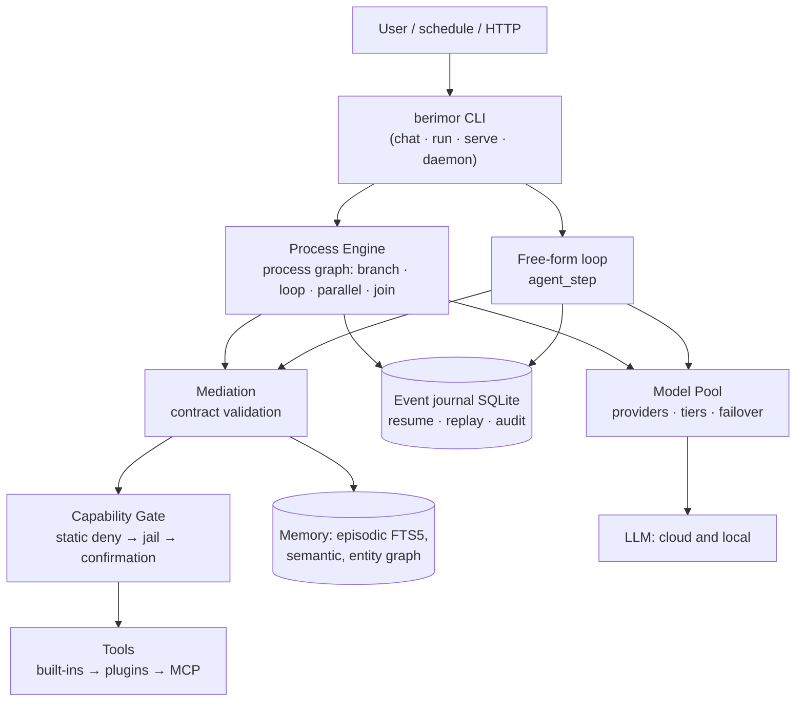
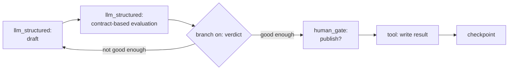

<div align="center">


**The model thinks. The code decides.**

[Русский](README.md) · **[English](README.en.md)** · [Deutsch](README.de.md) · [Français](README.fr.md) · [Español](README.es.md) · [简体中文](README.zh-CN.md) · [日本語](README.ja.md) · [한국어](README.ko.md)

</div>

A universal LLM agent with a deterministic core: task routing, process branching, context selection, and execution admission are decided by code — the model performs narrow, verifiable steps. Works with local and cloud models, weak and strong ones.

[](https://github.com/devpilgrin/berimor/releases/latest)
[](https://www.npmjs.com/package/berimor)
[](https://github.com/devpilgrin/berimor/actions/workflows/ci.yml)
[](LICENSE)
[](#project-infrastructure)


[](https://socket.dev/npm/package/berimor)


---

## Why it exists

Most "AI agents" are built the same way: the model is given a set of tools and asked to decide for itself what to do. Fine for a demo. Unreliable in real work: the model forgets steps, invents facts, veers off course — and a dangerous command slips into the terminal after a reflexive "y".

Berimor is built on the opposite assumption: **the model cannot be trusted with orchestration — it can be trusted with execution.** The task is decomposed into steps in advance or steered by a deterministic loop; everything the model outputs passes strict validation before it can be relied upon; everything that can cause harm goes through a gate that cannot be cancelled by pressing Enter.

| | Typical agentic CLI | Berimor |
|---|---|---|
| Who decides what to do next | The model (hope for its sound judgement) | Code (process graph, deterministic loop) |
| Failure mid-task | "Restart and pray" | Event journal: resume exactly at the point of interruption |
| Dangerous action | A confirmation that fatigue turns into YOLO | Deny statics: what is forbidden is never even asked about |
| Weak/local model | "Buy a more expensive model" | Mediation: retry with error explanation → escalation to a human |
| Extensions | A plugin gets everything | A subagent/plugin gets a subset of the parent's rights — enforced by code |
| Reproducibility | None | Full: journal → replay → state at any point in time |

## What makes it different

**1. Decisions are deterministic code, not text in a prompt.**
Branching, loops, timeouts, parallel branches with a join barrier, version migration of a running process — all of this is the Process Engine, not the hope that the model remembers its instructions. Weak models cannot be trusted with context selection and routing — so code does that.

**2. Security is structure, not user discipline.**
The deny table of destructive operations cannot be overridden by a confirmation. The filesystem jail never leaves the working directory. The network gate blocks access to private ranges (including NAT64/6to4/Teredo disguises and bypasses via redirects and URL userinfo). Secrets are masked at every leak point — but the admission gate sees the real values: masking does not blind validation.

**3. A free-running loop — under supervision.**
A "reason → act → observe" mode for tasks that cannot be decomposed into steps in advance. Every action inside it passes the same capability gate as a process step — freedom of reasoning does not mean freedom from rules. Optional: self-critique and a "propose — execute — verify" strategy.

**4. Model-generated code runs in a real sandbox.**
For "merge these 12 tables and find anomalies", the model writes a JavaScript program. It passes static analysis with a real parser (identifier allowlist — `eval`/`Function`/`Math.random` are rejected before execution), then runs under QuickJS inside WebAssembly (Wasmtime) with fuel, a memory limit, and a tool-call ceiling. WASI comes with an empty capability set: no files, no network, not even potentially. The single host function goes through the same gate.

**5. Memory as an engineering system, not a buffer.**
Working memory compacts when the budget overflows. Episodic — full-text search (FTS5). Semantic — fact deduplication; conflicts are never silently overwritten; a storage failure is indistinguishable from "no facts" and never creates spurious duplicates. An entity graph — relationships between facts, persistent. Skills — reusable recipes for solving similar tasks, readable files.

**6. An extension ecosystem with a rights ceiling.**
- **Skills** (SKILL.md) — expert roles for chat: triggering is done by code (not the model); the tool ceiling is enforced by the dispatcher's filter.
- **Subagents** (agent.yaml) — a nested agent loop with its own budget and journal; the child's rights = the intersection with the parent's rights; they cannot expand. Nested spawning requires explicit `allow_spawn: true`; depth is limited by code.
- **Plugins** — isolated processes with an ACL manifest and keyless sigstore signing: installation from a trusted list with TOFU confirmation, like SSH.
- **MCP** — external tool servers over the open Model Context Protocol (official Rust SDK rmcp, ADR-0023): they connect via a `[[mcp_servers]]` section in the config, join the shared dispatcher after the built-in tools and plugins, and pass the same capability gate as any process step. It works the other way too: Berimor can expose its own tools over MCP. A curated list of servers with ready-made config blocks — [`docs/mcp-servers.md`](docs/mcp-servers.md).

All of this installs with a single command — from a catalogue or **any git repository**: `berimor skill install code-review-ru --from https://github.com/...`.

## Capabilities

### Built-in tools

The tools are built into the binary (not plugins); every call passes the capability gate: **mutating** calls (marked with *) require confirmation according to the gate mode, read-only ones execute without questions.

| Group | Tools | What they do |
|---|---|---|
| Files | `files.read`, `files.list`, `files.write`*, `files.edit`* | read/list; full-file write; pinpoint edit by string anchor (old_string → new_string, uniqueness check) |
| Search | `files.search`, `session.search` | regex over file contents (with line numbers and context) or glob over names — `.git`/`target`/`node_modules` are skipped; substring search over past session transcripts with excerpts |
| VCS | `vcs.git` | git status/diff/log/show — read-only: repository helpers (fsmonitor, external diff, textconv) are disabled, arbitrary flags are not accepted |
| Terminal | `terminal.exec`*, `terminal.start`*, `terminal.output`, `terminal.kill` | command with timeout and output cap; background processes with polling and kill (up to 32 concurrently) |
| Network | `http.fetch`, `web.search` | GET with body cap and network gate; DuckDuckGo search results (title/link/snippet) |
| Memory | `memory.search`, `memory.save` | semantic memory fact search; saving a fact with deduplication — disabled by default (enable consciously: `[memory] tool_writes = true`), secrets are masked before saving |
| Organization | `todo.read`, `todo.write`, `human.ask` | session task list (stored in `.berimor/todo.json`); asking the user a question right from the agent loop |
| Snapshots | `snapshot.list`, `snapshot.restore`* | automatically: before every file overwrite its state is saved (rotation 50); list — labels and paths, restore — rollback (itself snapshotted too) |
| Subagents | `agents.run` | delegating to a nested agent with rights intersection |

Beyond the built-ins — plugin and MCP server tools (same gate policy). Full list in chat: the startup line "tools: …".

### Chat menu (TUI)

Type `/` — the palette shows commands with descriptions in the interface language and filters as you type. Submenus work via space: `/config ` shows the continuations.

| Command | What it does |
|---|---|
| `/help` | command list |
| `/models` | providers: list, `/models add` — wizard (presets → choice → key/OAuth), removal — via picker with confirmation |
| `/skills`, `/agents` | skills and subagents (global/project), open a skill with Enter on its row |
| `/config` | **settings menu**: shows the effective configuration and the "Interface locale" item (with the current value) → language choice from 8 (ru, en, de, fr, es, zh-CN, ja, ko). Saved to the local config (`[ui]`), takes effect immediately. Shortcut: `/config locale ja` |
| `/mouse` | mouse toggle: captured — the wheel scrolls the journal (a scrollbar with position on the right), clicking the journal gives it scroll focus; released — selection mode: the info panel hides, the journal takes full width, native selection covers only the journal (with capture on, select via Shift) |
| `/copy` | last agent reply — to clipboard (wl-copy/xclip/xsel/pbcopy) |
| `/clear`, `/exit` | clear the dialog journal; quit |

The rest of the interface: **confirmation modals** for dangerous actions (options "once / for the rest of the session / for the project" — choose with the ←→↑↓ arrows, y/n — instantly); **agent questions** (`human.ask`) — a free-input modal, Enter — answer, Esc — decline; **multiline input** — Alt+Enter inserts a line break, the field grows up to a third of the screen, clipboard paste is a single event; **mouse** — wheel and click-focus (see `/mouse`).

## Processes: graph agents

Berimor's main "combat" mode is a **process**: a declarative YAML plan executed as a graph. This is the same approach as "graph agents" (LangGraph and the like): nodes are steps, edges are transitions, state is a shared object; the difference is that berimor's topology and routing are deterministic — **the model never picks a branch**: it can propose a value through a strict contract, and code does the routing (invariant I1).

**Graph nodes** (process step types):

| Node | Purpose |
|---|---|
| `sequential` | a regular step — moves on to the next one |
| `tool` | tool call (arguments are templates from state) |
| `llm_structured` | model call with a strict response contract (JSON Schema — rejected until accepted) |
| `codeact` | the model's program in a WASM sandbox (QuickJS, fuel, call allowlist) |
| `agent_step` | a free-form "reasoning → action → observation" loop as a node: `max_turns`, optionally self-critique and "propose—execute—verify" |
| `branch` | conditional edges: `on` — a state field, `cases` — branches by value |
| `loop` | a loop over a condition |
| `parallel` | parallel branches with a join barrier |
| `human_gate` | pause for a human: reason, timeout, timeout policy (fail/branch/escalation) |
| `checkpoint` | an explicit restore point |

The event journal covers checkpointing with a margin: any run can be resumed exactly from the point of interruption, and the state can be reproduced at any moment (replay).

**Honest boundary of the approach** (based on independent field testing of 0.27.0): a contract checks **form, not meaning** — `branch` routes code, but by a value proposed by the model; trust is not eliminated, but lowered to the level of "the value by which the route is computed". Cover semantically significant routes additionally: with contract policy rules (ranges/enumerations), a verification step by a strong model, or `human_gate`. The second boundary is weak (local) models: they hold up under a strict contract of simple form, but the internal protocol of the free loop requires a mid-class model or better; a "fully local" scenario is realistic today for `llm_structured` steps, not for `agent_step`.

**Contracts from configuration** (0.28.0): custom contracts without forking and rebuilding — a `[[contracts]]` section in the config with JSON Schema (inline `schema` or `schema_path`), then `llm_structured`/`codeact`/`agent_step` reference it by name on par with the built-in code ones. Model output is validated against the schema (the `jsonschema` crate), a validation error goes into the retry prompt — the same mediation loop. Limitations: config contracts have no policy rules (state references) or schema versions, `publishable` is the whole object, the registry is read at startup (a config change means a new run). Example — [`fixtures/golden/processes/config-contracts/`](fixtures/golden/processes/config-contracts/).

**SGR: the schema leads the reasoning** (0.30.0): a contract may declare reasoning fields BEFORE target ones — `risk_factors` (non-empty list) ahead of `risk` in `ClassificationOut`; having listed the factors, the model assigns the score with grounding instead of arbitrarily. Field order in the JSON Schema matches the declaration order (schemars `preserve_order`). On providers with constrained decoding (`response_format = "json_schema"` in `[[providers]]`: OpenAI-compatible, Ollama via `format`, llama.cpp) the generation order is physically enforced by the schema — the model cannot emit the number without filling the factors first. On providers without constrained decoding (DeepSeek, Kimi — `json_object` only) the soft level applies: field order in the prompt + schema requiredness + mediation validation. Rule for config contracts: declare reasoning fields before target ones. The autonomous in-process llama.cpp enforces the order via a GBNF grammar built from the contract schema (0.31.0).

**Wave E: memory** (0.42.0): Qdrant adapter for the Facts layer — `[memory] qdrant_url = "http://127.0.0.1:6333"` (+ `qdrant_collection`, `qdrant_api_key_env`): semantic search over an HNSW index instead of a full SQLite scan (plain HTTP/JSON, no gRPC client added); upsert/scroll/cosine/hybrid/delete verified live against a real Qdrant. Exact-hash model response cache — `[agent] response_cache = true`: a repeated call with the same input never reaches the provider (a hit writes no usage — there was no call); storage is a separate `<storage>.cache.db` (deleting it = invalidation); embedding-similarity caching is deliberately not built (answer non-determinism).

**Wave D: Rego gate rules** (0.41.0): an external OPA/Rego policy on top of the capability gate's static rules — via regorus (in-process, no sidecar). `[gate] rego_policy = "policy.rego"` + `environment = "prod"`: the policy (`package berimor`, `deny contains msg if { ... }`) sees `input.tool`, `input.args`, `input.mutates`, `input.environment` and can only deny stricter than statics — it can never allow weaker, the core stays deterministic. Parse error = startup failure, evaluation error = fail-closed. The requested example works: "terminal.exec is forbidden in the prod environment".

**Wave F: berimor as a GitHub App** (0.43.0): `berimor serve` accepts GitHub webhooks at `POST /webhooks/github` — HMAC-SHA256 verification (webhook secret), RS256 JWT → installation token; a trigger marker in a comment (default `/berimor`) runs the process non-interactively and posts the outcome back as an issue/PR comment. 202 immediately, the process runs in the background. `[github_app]` config: app_id, private_key_path, process, trigger.

**Wave G: ACP — berimor in the editor** (0.44.0): `berimor acp` speaks the Agent Client Protocol over stdio — Zed and compatible editors connect berimor as an external agent. A session is a process run from `[acp] process`: a prompt runs the process (input `{text}`), journal events stream to the editor (tool turns, gates, mediation rejections), the reply arrives on completion; cancel stops waiting while the run finishes in the journal. Process output goes to stderr in ACP mode — stdout belongs to the protocol.

**Wave H: network in the sandbox** (0.45.0): `[sandbox] network = "restrict"` + `allow_connect_ports`/`allow_bind_ports` — terminal.exec/terminal.start subprocesses get Landlock network rules (ABI 4, kernel 6.7+): TCP connect/bind allowed only to listed ports, everything else is denied by the kernel (EACCES). On older kernels: auto — warn and skip network rules, require — fail-closed. Default `off` — behaviour unchanged.

**Wave I: federated journal** (0.46.0): `berimor journal export <instance> --out <file>` / `import <file>` — carry a run between machines as portable JSON with a sha256 fingerprint. Import verifies the hash (corrupted files are rejected), renames on id collision (`-imported-N`) — appending to an existing instance is impossible (the "single writer" rule holds across machines); event timestamps are preserved, not stamped at import time.

**Wave C: LLM-as-a-Judge** (0.40.0): `berimor eval <dir> --judge` — after the golden-set run, a strong provider (first in failover order) scores the final state of every finished scenario: a 1-5 score and rationale are written as a `judge_score` event into the scenario's journal and printed. Criteria come from a `<scenario>.judge.md` file next to the input (otherwise the default rubric: completeness, accuracy, no invented facts, contract form). `--judge-threshold <N>` — a CI gate: average score below the threshold = command failure. The judge's answer is parsed through the same mediation EOF repair; unfinished scenarios (gate, error) are honestly skipped.

**Wave B: observability** (0.39.0): `berimor otlp <run> --endpoint <url>` — a process run as a trace in OTLP/HTTP JSON: a root run span, a span per graph node, an LLM call span (latency + tokens as attributes), human_gate (interval until answer/timeout), tool turns of the free loop. traceId/spanId are deterministic (re-export is idempotent). Accepted by Jaeger and Grafana Tempo collectors (port 4318) and Langfuse — one OTLP, no per-backend exporters; auth headers via `--header 'Name: value'`.

**Wave A: resilience and cost** (0.38.0): circuit breaker in the Model Pool — N consecutive transport failures open the breaker, the provider is skipped until a half-open probe after the cooldown, with a visible "<name> → circuit-open" alert (`[agent] breaker_failures`, `breaker_cooldown_secs`; 0 = disabled). Cost attribution: every model call journals usage (tokens, latency, step — `model_usage` event); the local llama.cpp counts tokens via its tokenizer; `berimor cost <run>` — per-step report and totals (prices from the provider's `cost_per_1k_tokens`; without a price — honest tokens, no invented money).

**Rules layer and berimor as an MCP server** (0.37.0, after Harness AI 3.0): (1) **rules** — Markdown standards from `~/.config/berimor/rules/` and `.berimor/rules/` are injected into the context of every model step BEFORE generation (soft layer; the hard one is still mediation); project rules override global ones; (2) **`berimor mcp-serve`** — an MCP server over stdio: external agents and editors drive berimor processes via `process.list`/`process.run`/`trace.read` — the model thinks outside, the code decides inside; (3) **GitHub Action** `devpilgrin/berimor-action@v1` — processes as CI steps.

**Borrowed from DeepSeek Harness** (0.36.0): (1) **observation pruner** — long tool results are trimmed in the prompt (head+marker+tail, the original stays in the journal; `[agent] tool_result_max_chars`, 0 = off); (2) **Landlock sandbox** for `terminal.exec`/`terminal.start` — own libc implementation (no external binary): the subprocess physically cannot leave the workspace, system directories are read-only; `[sandbox] landlock = off|auto|require`, require is fail-closed; (3) **chat compaction** — history beyond the threshold is summarized into a note by the top provider, the tail is kept verbatim, a summarization failure never breaks the turn (`[agent] compact_threshold_chars`, 0 = off).

**Resilience to truncated generation** (0.35.2): a local model hitting the token cap cuts JSON off ("EOF while parsing") — this used to burn 3 retries and stop the process with an escalation. Now the mediation parse stage completes the truncation structurally (closing quotes/brackets; content untouched; garbage is still rejected), the repair is journaled (`mediation_parse_repaired`) — retries and escalation remain for genuine errors. The local provider context was raised to 8192 and is configurable (`local_ctx_tokens`).

**Free-loop turn budget** (0.34.0): per-message cap — `[agent] max_turns` (default 32, was 12). Loop protection is separate from the length cap: repeating the same action (tool + identical args) triggers a prompt warning, four in a row stops the loop with a telling `StuckLoop` error; long VARIED work (project analysis over dozens of reads) is not punished by the cap. At ~20% before the cap the engine adds a note to the prompt: "N turns left — wrap the result into Finish".

**Pentest with PoC validation** (0.33.0, inspired by usestrix/strix): reference process [`fixtures/golden/processes/pentest/`](fixtures/golden/processes/pentest/) — recon → hypotheses (evidence before class, SGR) → `human_gate` → active verification → report where a finding is accepted only with execution proof; the unconfirmed honestly lands in `unconfirmed`. Guardrails are mandatory: targets from explicit scope, active actions via a human, everything journaled. Also: a static capability-layer deny in the free loop is now a turn observation instead of a run-killer — the model adjusts the action to the rules while the gate still blocks every attempt.

**Extension governance** (0.32.0): `berimor skill lint` / `berimor agent lint` — static manifest checks (name contract, known tools, `permissions` — net/exec/fs-write/spawn — consistent with the tools ceiling); catalog installs are fail-closed: a lint error rolls back. `berimor skill review` / `agent review` — multi-model review of the content as untrusted data: every configured provider renders an independent verdict, the result is by quorum (any fail = fail), JSON report with findings. Releases carry `release-evidence.json` (hashes, signatures, SBOM, CI trace) and `release-smoke-linux-x64.json`.

**Turn-shape normalizer** (0.29.0): weak models often produce an "almost protocol" reply — a flat `{"thought", "tool", "args"}` form, `"action": "tool"` as a string, a top-level `reply`, or JSON truncated at the token limit. Known shapes are deterministically repaired into the protocol BEFORE mediation (repairs are journaled as `agent_turn_normalized` events; meaning is still decided by validation and the gate). The turn prompt gained a pair of few-shot examples.

**Graph idioms as processes.** The classic patterns (routing, prompt chaining, parallelization, orchestrator-workers, evaluator-optimizer) are expressed without new code: `llm_structured` writes the routing decision into state → `branch` routes by the validated value; evaluator-optimizer is a `loop` with a verdict; orchestrator-workers is `parallel` + join. Process examples are in [`fixtures/golden/processes/`](fixtures/golden/processes/).

### Agent architecture



### Example process graph (evaluator-optimizer)



The model proposes the `verdict` — but only a value that passed the contract makes it into `cases`; code computes the branch choice.

## Project infrastructure

**Rust workspace with one crate per component** — Process Engine, Mediation, Executors, Memory, Capability, Model Pool, Actors, Tool Runtime, Context Engine, Eval, Storage. The guest WASM module (`codeact-guest/`) lives as a separate crate and is committed as a ready-made artifact — normal builds are not slowed down.

**Verification discipline.** Every release: `cargo fmt` + `clippy -D warnings` + `cargo test --workspace` (992 tests: unit, integration, e2e through the real binary, golden fixtures of processes and malicious inputs). Critical components undergo mandatory independent review. A full standalone audit (`docs/audit-2026-07-31.md`) — **all findings are closed or consciously documented**.

**Grown-up supply chain.** Cross-platform releases (Linux x64/arm64, macOS arm64, Windows x64) with keyless cosign/sigstore signing — the private key exists nowhere. Verification: `berimor verify <archive>`. npm publication with provenance, SBOM (CycloneDX) in the pipeline, self-update (`berimor self-update`) implemented on Process Engine primitives — the same journal and failure recovery as ordinary processes, not an ad-hoc script.

**Architecture is documented before the code.** `docs/arch/` — a self-sufficient specification implementable on any stack; `docs/ADR/` — a decision journal with rejected alternatives; `docs/ROADMAP.md` — the task queue with the executor-model class assigned to each.

## Installation

### Option 1: npm (easiest)

```sh
npm install -g berimor
berimor --version
```

The installer detects your platform automatically, downloads the signed binary from the latest GitHub release, and verifies the SHA-256 before unpacking. The package is published with provenance (build attestation tied to the CI workflow).

### Option 2: prebuilt binary from GitHub

Current versions are on the [releases](https://github.com/devpilgrin/berimor/releases/latest) page. Below are the download commands; the version is substituted automatically (latest release).

**Linux** (x64 or arm64):

```sh
VERSION=$(curl -s https://api.github.com/repos/devpilgrin/berimor/releases/latest | grep '"tag_name"' | cut -d '"' -f 4)
ARCH=x64   # or arm64
curl -LO "https://github.com/devpilgrin/berimor/releases/download/${VERSION}/berimor-${VERSION}-linux-${ARCH}.tar.gz"
tar -xzf "berimor-${VERSION}-linux-${ARCH}.tar.gz"
chmod +x berimor
sudo mv berimor /usr/local/bin/
berimor --version
```

**macOS** (Apple Silicon only — M1/M2/M3 and newer; Intel builds are not published yet, use Option 3 below for Intel Macs):

```sh
VERSION=$(curl -s https://api.github.com/repos/devpilgrin/berimor/releases/latest | grep '"tag_name"' | cut -d '"' -f 4)
curl -LO "https://github.com/devpilgrin/berimor/releases/download/${VERSION}/berimor-${VERSION}-darwin-arm64.tar.gz"
tar -xzf "berimor-${VERSION}-darwin-arm64.tar.gz"
xattr -d com.apple.quarantine berimor   # the binary is not signed by Apple yet — otherwise Gatekeeper will refuse to run it
chmod +x berimor
sudo mv berimor /usr/local/bin/
berimor --version
```

**Windows** (x64), PowerShell:

```powershell
$Version = (Invoke-RestMethod "https://api.github.com/repos/devpilgrin/berimor/releases/latest").tag_name
Invoke-WebRequest -Uri "https://github.com/devpilgrin/berimor/releases/download/$Version/berimor-$Version-win32-x64.zip" -OutFile berimor.zip
Expand-Archive -Path berimor.zip -DestinationPath .\
.\berimor.exe --version
```

The binary is not signed yet — Windows SmartScreen may show a "Windows protected your PC" warning: "More info" → "Run anyway". To call `berimor` from any folder, move `berimor.exe` into a directory already on `PATH`, or add the current folder to `PATH` yourself.

Every archive is accompanied by a `<archive>.sigstore.json` file — a keyless cosign/sigstore signature bound to the identity of the CI workflow that built the release (ADR-0026). Verify with: `berimor verify <archive>` — the command is already in the downloaded binary (it installs a fresh sigstore trusted root over the network on first invocation). This is a signature independent of Apple/Microsoft — it does not lift the Gatekeeper/SmartScreen warnings above; those relate to a separate step that has not been done yet.

### Option 3: build from source (any OS)

You only need [Rust](https://rustup.rs/) (stable):

```sh
git clone https://github.com/devpilgrin/berimor.git
cd berimor
cargo build --release -p berimor-cli
./target/release/berimor --version
```

On Windows the last command is `.\target\release\berimor.exe --version`.

## Quick start

```sh
berimor          # = berimor chat: interactive conversation with the agent
```

On first launch, the wizard will offer to connect models from presets (Kimi, DeepSeek, OpenAI, Claude via OpenRouter, local models via Ollama/llama.cpp/LM Studio) — pick numbers or names, paste the API key (it lands in `~/.config/berimor/secrets.env` with "owner-only" permissions, not in the config). Instead of an API key, you can sign in with a subscription — `berimor login` (OAuth with PKCE: Claude Pro/Max, ChatGPT Plus/Pro; tokens live in the same `secrets.env`, refresh is transparent). Later, do the same with `berimor setup` or directly in chat with the `/models add` command.

Useful chat commands: `/help`, `/models`, `/skills`, `/config`, `/exit`. The TUI interface locale — `/config locale` (8 languages: ru, en, de, fr, es, zh-CN, ja, ko; the choice is saved in the local config, `[ui]` section).

Deterministic processes (a declarative YAML plan with strict contracts — the primary "production" mode): `berimor run <process.yaml>`. Examples of processes and configurations are in [`fixtures/golden/processes/`](fixtures/golden/processes/) and [`CONTRIBUTING.md`](CONTRIBUTING.md).

Automation on top of processes: `berimor schedule add` + `berimor daemon` — scheduled execution of processes (the daemon and the HTTP service have no terminal: a confirmation request is treated as a refusal with diagnostics — to automate mutating steps use targeted auto-confirmation in `.berimor/allow` or the `berimor run --non-interactive` flag / `BERIMOR_NON_INTERACTIVE=1` in your own scripts); `berimor serve` — an HTTP service on top of run/schedule/sessions (token-protected, no anonymous access); `berimor sessions` — a registry of live sessions on the host; `berimor trace <instance>` — human-readable journal tracing of any run.

Extensions with a single command:

```sh
berimor skill install code-review-ru                                    # from the catalogue
berimor skill install my-skill --from https://github.com/user/repo      # from any git
berimor agent install researcher
berimor plugin install devpilgrin/berimor-plugin-hello                  # signed plugin
berimor plugin install-local ./my-plugin --allow-unsigned               # local, consciously
```

## How the project is organized

| Layer | Directory | Contents |
|---|---|---|
| Agent core | `crates/` | Rust workspace — one crate per component: Process Engine, Mediation, Executors, Memory, Capability, Model Pool, Actors, Tool Runtime, Context Engine, Eval, Storage |
| CodeAct sandbox | `codeact-guest/` | QuickJS guest for wasm32-wasip1 — a separate crate, committed as a ready-made artifact |
| Bootstrap | `bootstrap/` | npm installer/updater package (TypeScript), see "Installation" above |
| Architecture | `docs/arch/` | self-sufficient specification — principles, components, diagrams (`docs/arch/views/`). See `docs/arch/README.md` |
| Decisions | `docs/ADR/` | architecture decision journal: context, alternatives, consequences. See `docs/ADR/README.md` |
| Development plan | `docs/ROADMAP.md` | task queue by phases, decomposition into subtasks, complexity, executor-model class |
| Audit | `docs/audit-2026-07-31.md` | independent security audit — all findings closed or consciously documented |
| Test data | `fixtures/golden/` | golden sets: examples of processes, contracts, malicious inputs |

`crates/` and `bootstrap/` are the agent itself — code written from the queue in `docs/ROADMAP.md`. `docs/arch/` is the layer of pure decisions behind it: it does not mention specific projects and products (except `docs/arch/deployment.md` and `docs/arch/stack.md`, where that is a deliberate exception), and presents the architecture so that it can be implemented on any stack. `docs/ADR/` records why each decision was made, including rejected alternatives.

## License

Apache License 2.0 — see [`LICENSE`](LICENSE).

## Contributing

See [`CONTRIBUTING.md`](CONTRIBUTING.md) and [`docs/ROADMAP.md`](docs/ROADMAP.md) to pick a task.
