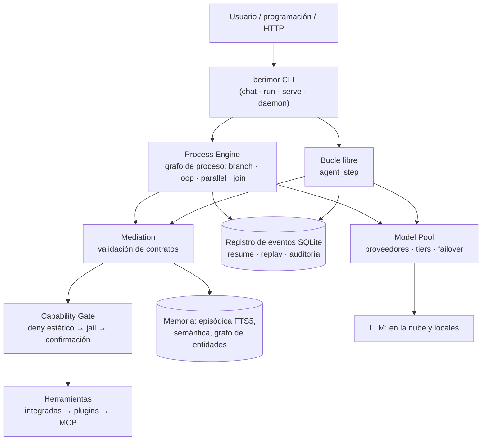
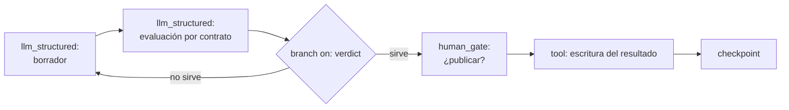

<div align="center">


**El modelo piensa. El código decide.**

[Русский](README.md) · [English](README.en.md) · [Deutsch](README.de.md) · [Français](README.fr.md) · **[Español](README.es.md)** · [简体中文](README.zh-CN.md) · [日本語](README.ja.md) · [한국어](README.ko.md)

</div>

Agente universal para LLM con núcleo determinista: el enrutamiento de tareas, la ramificación de procesos, la selección de contexto y la admisión a la ejecución los decide el código — el modelo ejecuta pasos estrechos y verificables. Funciona con modelos locales y en la nube, débiles y potentes.

[](https://github.com/devpilgrin/berimor/releases/latest)
[](https://www.npmjs.com/package/berimor)
[](https://github.com/devpilgrin/berimor/actions/workflows/ci.yml)
[](LICENSE)
[](#infraestructura-del-proyecto)


[](https://socket.dev/npm/package/berimor)


---

## Para qué sirve

La mayoría de los «agentes de IA» están construidos igual: se le da al modelo un conjunto de herramientas y se le pide que decida por sí mismo qué hacer. Para una demo — cómodo. En el trabajo — poco fiable: el modelo olvida pasos, inventa hechos, se desvía por el camino equivocado, y un comando peligroso sale al terminal con un «y» pulsado por inercia.

Berimor se construye sobre el supuesto contrario: **no se puede confiar la orquestación al modelo — se le puede confiar la ejecución.** La tarea se descompone en pasos por adelantado o la dirige un bucle determinista; todo lo que produce el modelo pasa una verificación estricta antes de poder confiar en ello; todo lo que puede dañar pasa por una barrera que no se anula pulsando Enter.

| | CLI agéntico típico | Berimor |
|---|---|---|
| Quién decide qué hacer después | El modelo (con la esperanza de que sea sensato) | El código (grafo de proceso, bucle determinista) |
| Fallo a mitad de la tarea | «Reinicia y reza» | Registro de eventos: continuación exactamente desde el punto de corte |
| Acción peligrosa | Confirmación que el cansancio convierte en YOLO | Deny-estática: lo prohibido ni siquiera se pregunta |
| Modelo débil/local | «Compra un modelo más caro» | Mediación: reintento con explicación del error → escalado al humano |
| Extensiones | El plugin lo recibe todo | El subagente/plugin recibe un subconjunto de los derechos del padre — por código |
| Reproducibilidad | Ninguna | Completa: registro → replay → estado en cualquier momento |

## En qué se diferencia

**1. Las decisiones — código determinista, no texto en el prompt.**
Ramificaciones, bucles, timeouts, ramas paralelas con barrera join, migración de versiones de un proceso en ejecución — todo esto es Process Engine, no la esperanza de que el modelo recuerde las instrucciones. A los modelos débiles no se les puede confiar la selección de contexto ni el enrutamiento — por tanto, de eso se encarga el código.

**2. La seguridad — estructura, no disciplina del usuario.**
La tabla deny de operaciones destructivas no se revoca con una confirmación. El jail de archivos no sale de la carpeta de trabajo. La barrera de red no deja pasar hacia rangos cerrados (incluidos los camuflajes NAT64/6to4/Teredo y los bypasses mediante redirecciones y userinfo en la URL). Los secretos se enmascaran en todos los puntos de fuga — pero la barrera de admisión ve los valores reales: el enmascaramiento no ciega la verificación.

**3. Bucle libre — bajo supervisión.**
Modo «razonamiento → acción → observación» para tareas que no se pueden descomponer en pasos por adelantado. Cada acción interna pasa por la misma barrera de capabilities que un paso de proceso — la libertad de razonamiento no significa libertad de las reglas. Opcional: autocrítica y estrategia «proponer — ejecutar — verificar».

**4. El código del modelo se ejecuta en una sandbox de verdad.**
Para «fusiona 12 tablas y encuentra anomalías», el modelo escribe un programa JavaScript. Este pasa un análisis estático con un parser real (lista blanca de identificadores — `eval`/`Function`/`Math.random` se rechazan antes de la ejecución), y se ejecuta con QuickJS dentro de WebAssembly (Wasmtime) con fuel, límite de memoria y techo de llamadas a herramientas. WASI — con un conjunto de derechos vacío: ni archivos ni red, ni siquiera potencialmente. La única función host pasa por la misma barrera.

**5. La memoria — como un sistema de ingeniería, no como un búfer.**
La memoria de trabajo se compacta al desbordar el presupuesto. La episódica — búsqueda de texto completo (FTS5). La semántica — deduplicación de hechos, los conflictos no se sobrescriben en silencio, un fallo del almacenamiento es indistinguible de «no hay hechos» y no genera duplicados falsos. Grafo de entidades — relaciones entre hechos, persistente. Skills — recetas reutilizables para resolver tareas similares, archivos legibles.

**6. Ecosistema de extensiones con techo de derechos.**
- **Skills** (SKILL.md) — roles expertos para el chat: disparador por código (no por el modelo), techo de herramientas por el filtro del dispatcher.
- **Subagentes** (agent.yaml) — bucle agéntico anidado con su propio presupuesto y registro; derechos del hijo = intersección con los del padre, no se pueden ampliar. El spawn anidado — solo con `allow_spawn: true` explícito, profundidad limitada por código.
- **Plugins** — procesos aislados con manifiesto ACL y firma keyless sigstore: instalación desde una lista de confianza con confirmación TOFU, como SSH.
- **MCP** — servidores de herramientas externos mediante el protocolo abierto Model Context Protocol (SDK oficial de Rust rmcp, ADR-0023): se conectan con la sección `[[mcp_servers]]` en la config, se incorporan al dispatcher común después de las herramientas integradas y los plugins, y pasan la misma barrera de capabilities que cualquier paso de proceso. Funciona también en sentido inverso: Berimor puede exponer sus propias herramientas por MCP. Una lista curada de servidores con bloques de configuración listos — [`docs/mcp-servers.md`](docs/mcp-servers.md).

Todo esto se instala con un solo comando — desde el catálogo o **cualquier repositorio git**: `berimor skill install code-review-ru --from https://github.com/...`.

## Capacidades

### Herramientas integradas

Las herramientas están integradas en el binario (no son plugins), todas las llamadas pasan por la barrera de capabilities: las **mutantes** (marcadas con *) requieren confirmación según el modo de la barrera, las de lectura se ejecutan sin preguntas.

| Grupo | Herramientas | Qué hacen |
|---|---|---|
| Archivos | `files.read`, `files.list`, `files.write`*, `files.edit`* | lectura/listado; escritura completa; edición puntual por ancla de texto (old_string → new_string, control de unicidad) |
| Búsqueda | `files.search`, `session.search` | regex sobre el contenido de archivos (con números de línea y contexto) o glob por nombres — se omiten `.git`/`target`/`node_modules`; subcadena en los hilos de sesiones pasadas con extracto |
| VCS | `vcs.git` | git status/diff/log/show — solo lectura: los helpers del repositorio (fsmonitor, diff externo, textconv) están desactivados, no se aceptan flags arbitrarios |
| Terminal | `terminal.exec`*, `terminal.start`*, `terminal.output`, `terminal.kill` | comando con timeout y tope de salida; procesos en segundo plano con sondeo y detención (hasta 32 simultáneos) |
| Red | `http.fetch`, `web.search` | GET con tope de cuerpo y barrera de red; resultados de búsqueda de DuckDuckGo (título/enlace/fragmento) |
| Memoria | `memory.search`, `memory.save` | búsqueda de hechos en la memoria semántica; escritura de un hecho con deduplicación — desactivada por defecto (se activa conscientemente: `[memory] tool_writes = true`), los secretos se enmascaran antes de la escritura |
| Organización | `todo.read`, `todo.write`, `human.ask` | lista de tareas de la sesión (se guarda en `.berimor/todo.json`); pregunta al usuario directamente desde el bucle agéntico |
| Snapshots | `snapshot.list`, `snapshot.restore`* | automático: antes de cada reescritura de un archivo se guarda su estado (rotación de 50); list — etiquetas y rutas, restore — reversión (también con snapshot) |
| Subagentes | `agents.run` | encargo a un agente anidado con intersección de derechos |

Además de las integradas — herramientas de plugins y servidores MCP (la misma política de barrera). La lista completa en el chat: la línea de inicio «herramientas: …».

### Menú del chat (TUI)

Escribe `/` — la paleta muestra los comandos con descripciones en el idioma de la interfaz y filtra a medida que escribes. Los submenús funcionan con el espacio: `/config ` muestra las continuaciones.

| Comando | Qué hace |
|---|---|
| `/help` | lista de comandos |
| `/models` | proveedores: lista, `/models add` — asistente (presets → elección → clave/OAuth), eliminación — mediante un selector con confirmación |
| `/skills`, `/agents` | skills y subagentes (globales/del proyecto), un skill — Enter sobre la línea |
| `/config` | **menú de parámetros**: muestra la configuración efectiva y el ítem «Localización de la interfaz» (con el valor actual) → elección del idioma entre 8 (ru, en, de, fr, es, zh-CN, ja, ko). Se guarda en la config local (`[ui]`), surte efecto de inmediato. Atajo: `/config locale ja` |
| `/mouse` | interruptor del ratón: capturado — la rueda desplaza el registro, un clic en el registro da el foco de desplazamiento; liberado — selección/copiado nativos del terminal (con captura, la selección — vía Shift) |
| `/copy` | última respuesta del agente — al portapapeles (wl-copy/xclip/xsel/pbcopy) |
| `/clear`, `/exit` | limpieza del registro del diálogo; salida |

El resto en la interfaz: **modales de confirmación** de acciones peligrosas (opciones «una vez / hasta el final de la sesión / para el proyecto» — elección con las flechas ←→↑↓, y/n — inmediato); **preguntas del agente** (`human.ask`) — modal con entrada libre, Enter — responder, Esc — rechazar; **entrada multilínea** — Alt+Enter inserta un salto de línea, el campo crece hasta un tercio de la pantalla, el pegado desde el portapapeles — en un solo evento; **ratón** — rueda y foco al clic (ver `/mouse`).

## Procesos: agentes de grafo

El principal modo «de combate» de berimor es el **proceso**: un plan YAML declarativo que se ejecuta como un grafo. Es el mismo enfoque de los «agentes de grafo» (LangGraph y similares): los nodos son pasos, las aristas son transiciones, el estado es un objeto compartido; la diferencia es que la topología y el enrutamiento de berimor son deterministas — **el modelo nunca elige la rama**: puede proponer un valor mediante un contrato estricto, pero quien enruta es el código (invariante I1).

**Nodos del grafo** (tipos de pasos de un proceso):

| Nodo | Propósito |
|---|---|
| `sequential` | paso ordinario — transición al siguiente |
| `tool` | llamada a herramienta (los argumentos son plantillas del estado) |
| `llm_structured` | llamada al modelo con contrato de respuesta estricto (JSON Schema — se rechaza hasta su aceptación) |
| `codeact` | programa del modelo en un sandbox WASM (QuickJS, fuel, lista blanca de llamadas) |
| `agent_step` | bucle libre «razonamiento → acción → observación» como nodo: `max_turns`, opcionalmente autocrítica y «propón—ejecuta—verifica» |
| `branch` | aristas condicionales: `on` — campo del estado, `cases` — ramas por valores |
| `loop` | bucle por condición |
| `parallel` | ramas paralelas con barrera de join |
| `human_gate` | pausa para el humano: motivo, timeout, política de timeout (fail/rama/escalación) |
| `checkpoint` | punto de recuperación explícito |

El registro de eventos cubre el checkpointing con margen: cualquier ejecución puede reanudarse exactamente en el punto de la interrupción y reproducir el estado en cualquier momento (replay).

**Límite honesto del enfoque** (según los resultados de las pruebas de campo independientes de la 0.27.0): el contrato verifica **la forma, no el sentido** — `branch` enruta el código, pero según un valor propuesto por el modelo; la confianza no se elimina, sino que se baja al nivel de «el valor sobre el que se calcula la ruta». Protege adicionalmente las rutas semánticamente significativas: con reglas de política del contrato (rangos/enumeraciones), un paso de verificación por un modelo potente o un `human_gate`. El segundo límite — los modelos débiles (locales): aguantan un contrato estricto de forma simple, pero el protocolo interno del bucle libre exige un modelo de clase media o superior; el escenario «totalmente local» hoy es realista para los pasos `llm_structured`, no para `agent_step`.

**Contratos desde la configuración** (0.28.0): tus propios contratos sin fork ni recompilación — sección `[[contracts]]` en la config con JSON Schema (inline `schema` o `schema_path`), luego `llm_structured`/`codeact`/`agent_step` se refieren a ella por nombre al igual que a los del código. La salida del modelo se valida contra el esquema (crate `jsonschema`), el error de validación va al prompt del reintento — el mismo ciclo de mediación. Limitaciones: sin reglas policy (referencias al estado) ni versiones de esquemas para los contratos de config, `publishable` — el objeto entero, el registro se lee al arrancar (cambio de config — nuevo arranque). Ejemplo — [`fixtures/golden/processes/config-contracts/`](fixtures/golden/processes/config-contracts/).

**Normalizador de forma de turno** (0.29.0): los modelos débiles a menudo producen una respuesta «casi de protocolo» — la forma plana `{"thought", "tool", "args"}`, `"action": "tool"` como cadena, un `reply` de nivel superior, o JSON truncado en el límite de tokens. Las formas conocidas se reparan determinísticamente al protocolo ANTES de la mediación (las reparaciones se journalan como eventos `agent_turn_normalized`; el significado lo siguen decidiendo la validación y la barrera). El prompt de turno ganó un par de ejemplos few-shot.

**Idioms de grafo como procesos.** Los patrones clásicos (routing, prompt chaining, parallelization, orchestrator-workers, evaluator-optimizer) se expresan sin código nuevo: `llm_structured` escribe una decisión de ruta en el estado → `branch` enruta según el valor validado; evaluator-optimizer es un `loop` con veredicto; orchestrator-workers es `parallel` + join. Ejemplos de procesos en [`fixtures/golden/processes/`](fixtures/golden/processes/).

### Arquitectura del agente



### Ejemplo de grafo de proceso (evaluator-optimizer)



El modelo propone un `verdict` — pero en `cases` solo llegará un valor que haya pasado el contrato; la elección de la rama la calcula el código.

## Infraestructura del proyecto

**Workspace Rust con un crate por componente** — Process Engine, Mediation, Executors, Memory, Capability, Model Pool, Actors, Tool Runtime, Context Engine, Eval, Storage. El módulo WASM invitado (`codeact-guest/`) vive como un crate separado y está commiteado como artefacto listo — el build normal no se ralentiza.

**Disciplina de verificación.** Cada release: `cargo fmt` + `clippy -D warnings` + `cargo test --workspace` (946 tests: unitarios, de integración, e2e a través del binario real, fixtures golden de procesos y de entradas maliciosas). Los componentes críticos pasan una revisión independiente obligatoria. Auditoría completa e independiente (`docs/audit-2026-07-31.md`) — **todos los hallazgos están cerrados o documentados conscientemente**.

**Supply chain como la gente seria.** Releases multiplataforma (Linux x64/arm64, macOS arm64, Windows x64) con firma keyless cosign/sigstore — la clave privada no existe en ningún sitio. Verificación: `berimor verify <archivo>`. Publicación npm con provenance, SBOM (CycloneDX) en el pipeline, la autoactualización (`berimor self-update`) está implementada sobre las primitivas del Process Engine — el mismo registro y la misma recuperación tras fallo que los procesos ordinarios, no un script ad hoc.

**Arquitectura documentada antes que el código.** `docs/arch/` — especificación autosuficiente, implementable en cualquier stack; `docs/ADR/` — registro de decisiones con las alternativas rechazadas; `docs/ROADMAP.md` — cola de tareas con la clase de modelo ejecutor para cada una.

## Instalación

### Método 1: npm (el más sencillo)

```sh
npm install -g berimor
berimor --version
```

El instalador detecta la plataforma por sí mismo, descarga el binario firmado desde la última release de GitHub y comprueba el SHA-256 antes de descomprimir. El paquete se publica con provenance (vinculación del build al workflow de CI).

### Método 2: binario listo desde GitHub

Las versiones actuales están en la página de [releases](https://github.com/devpilgrin/berimor/releases/latest). Abajo — los comandos de descarga; la versión se sustituye automáticamente (último release).

**Linux** (x64 o arm64):

```sh
VERSION=$(curl -s https://api.github.com/repos/devpilgrin/berimor/releases/latest | grep '"tag_name"' | cut -d '"' -f 4)
ARCH=x64   # o arm64
curl -LO "https://github.com/devpilgrin/berimor/releases/download/${VERSION}/berimor-${VERSION}-linux-${ARCH}.tar.gz"
tar -xzf "berimor-${VERSION}-linux-${ARCH}.tar.gz"
chmod +x berimor
sudo mv berimor /usr/local/bin/
berimor --version
```

**macOS** (solo Apple Silicon — M1/M2/M3 y más nuevos; los builds para Intel aún no se publican, para Mac Intel — método 3 más abajo):

```sh
VERSION=$(curl -s https://api.github.com/repos/devpilgrin/berimor/releases/latest | grep '"tag_name"' | cut -d '"' -f 4)
curl -LO "https://github.com/devpilgrin/berimor/releases/download/${VERSION}/berimor-${VERSION}-darwin-arm64.tar.gz"
tar -xzf "berimor-${VERSION}-darwin-arm64.tar.gz"
xattr -d com.apple.quarantine berimor   # el binario aún no está firmado por Apple — si no, Gatekeeper se negará a ejecutarlo
chmod +x berimor
sudo mv berimor /usr/local/bin/
berimor --version
```

**Windows** (x64), PowerShell:

```powershell
$Version = (Invoke-RestMethod "https://api.github.com/repos/devpilgrin/berimor/releases/latest").tag_name
Invoke-WebRequest -Uri "https://github.com/devpilgrin/berimor/releases/download/$Version/berimor-$Version-win32-x64.zip" -OutFile berimor.zip
Expand-Archive -Path berimor.zip -DestinationPath .\
.\berimor.exe --version
```

El binario aún no está firmado — Windows SmartScreen puede mostrar el aviso «Windows protegió su equipo»: «Más información» → «Ejecutar de todos modos». Para invocar `berimor` desde cualquier carpeta, mueve `berimor.exe` a un directorio que ya esté en el `PATH`, o añade tú mismo la carpeta actual al `PATH`.

Cada archivo va acompañado de un fichero `<archivo>.sigstore.json` — firma keyless cosign/sigstore vinculada a la identidad del workflow de CI con el que se construyó la release (ADR-0026). Verificar: `berimor verify <archivo>` — el propio comando ya está en el binario descargado (instala la raíz de confianza sigstore actualizada por red en la primera llamada). Es una firma independiente de Apple/Microsoft — no elimina los avisos de Gatekeeper/SmartScreen de arriba, que corresponden a un paso distinto, aún no realizado.

### Método 3: compilar desde las fuentes (cualquier SO)

Solo se necesita [Rust](https://rustup.rs/) (versión estable):

```sh
git clone https://github.com/devpilgrin/berimor.git
cd berimor
cargo build --release -p berimor-cli
./target/release/berimor --version
```

En Windows, el último comando es `.\target\release\berimor.exe --version`.

## Inicio rápido

```sh
berimor          # = berimor chat: diálogo interactivo con el agente
```

En el primer arranque, el asistente propondrá conectar modelos desde presets (Kimi, DeepSeek, OpenAI, Claude a través de OpenRouter, locales a través de Ollama/llama.cpp/LM Studio) — elige números o nombres, pega la clave de API (irá a `~/.config/berimor/secrets.env` con permisos «solo propietario», no a la config). En lugar de una clave de API, se puede iniciar sesión con una suscripción — `berimor login` (OAuth con PKCE: Claude Pro/Max, ChatGPT Plus/Pro; los tokens van al mismo `secrets.env`, la renovación es transparente). Más tarde, lo mismo — `berimor setup` o directamente en el chat con el comando `/models add`.

Comandos útiles del chat: `/help`, `/models`, `/skills`, `/config`, `/exit`. El idioma de la interfaz TUI — `/config locale` (8 idiomas: ru, en, de, fr, es, zh-CN, ja, ko; la elección se guarda en la configuración local, sección `[ui]`).

Procesos deterministas (plan YAML declarativo con contratos estrictos — el principal modo «de combate»): `berimor run <process.yaml>`. Ejemplos de procesos y configuraciones — en [`fixtures/golden/processes/`](fixtures/golden/processes/) y [`CONTRIBUTING.md`](CONTRIBUTING.md).

Automatización sobre los procesos: `berimor schedule add` + `berimor daemon` — ejecución de procesos según programación (el demonio y el servicio HTTP no tienen terminal: una solicitud de confirmación se trata como un rechazo con diagnóstico — para automatizar pasos mutantes usa la autoconfirmación puntual en `.berimor/allow` o bien el flag `berimor run --non-interactive` / `BERIMOR_NON_INTERACTIVE=1` en tus scripts); `berimor serve` — servicio HTTP sobre run/schedule/sessions (con token, sin acceso anónimo); `berimor sessions` — registro de las sesiones activas del host; `berimor trace <instance>` — trazado legible del registro de cualquier ejecución.

Extensiones con un comando:

```sh
berimor skill install code-review-ru                                    # desde el catálogo
berimor skill install my-skill --from https://github.com/user/repo      # desde cualquier git
berimor agent install researcher
berimor plugin install devpilgrin/berimor-plugin-hello                  # plugin firmado
berimor plugin install-local ./my-plugin --allow-unsigned               # local, conscientemente
```

## Estructura del proyecto

| Capa | Directorio | Contenido |
|---|---|---|
| Núcleo del agente | `crates/` | Workspace Rust — un crate por componente: Process Engine, Mediation, Executors, Memory, Capability, Model Pool, Actors, Tool Runtime, Context Engine, Eval, Storage |
| Sandbox CodeAct | `codeact-guest/` | Invitado QuickJS bajo wasm32-wasip1 — crate separado, commiteado como artefacto listo |
| Bootstrap | `bootstrap/` | Paquete npm del instalador/actualizador (TypeScript), ver «Instalación» arriba |
| Arquitectura | `docs/arch/` | Especificación autosuficiente — principios, componentes, diagramas (`docs/arch/views/`). Ver `docs/arch/README.md` |
| Decisiones | `docs/ADR/` | Registro de decisiones de arquitectura: contexto, alternativas, consecuencias. Ver `docs/ADR/README.md` |
| Plan de desarrollo | `docs/ROADMAP.md` | Cola de tareas por fases, descomposición en subtareas, complejidad, clase de modelo ejecutor |
| Auditoría | `docs/audit-2026-07-31.md` | Auditoría de seguridad independiente — todos los hallazgos cerrados o documentados conscientemente |
| Datos de prueba | `fixtures/golden/` | Conjuntos golden: ejemplos de procesos, contratos, entradas maliciosas |
| Investigación | `docs/rnd/` | Capa auxiliar: fuentes y análisis de frameworks agénticos existentes. Ver `docs/rnd/README.md` |

`crates/` y `bootstrap/` — el agente en sí, código escrito según la cola de `docs/ROADMAP.md`. `docs/arch/` — la capa de decisiones puras detrás de él: no menciona proyectos ni productos concretos (salvo `docs/arch/deployment.md` y `docs/arch/stack.md`, donde es una excepción consciente), expone la arquitectura de modo que pueda implementarse en cualquier stack. `docs/ADR/` registra por qué se tomó cada decisión, incluidas las alternativas rechazadas. `docs/rnd/` — capa auxiliar de fuentes en la que se apoyó el diseño, no forma parte del agente.

## Licencia

Apache License 2.0 — ver [`LICENSE`](LICENSE).

## Contribuir

Ver [`CONTRIBUTING.md`](CONTRIBUTING.md) y [`docs/ROADMAP.md`](docs/ROADMAP.md) para elegir una tarea.
