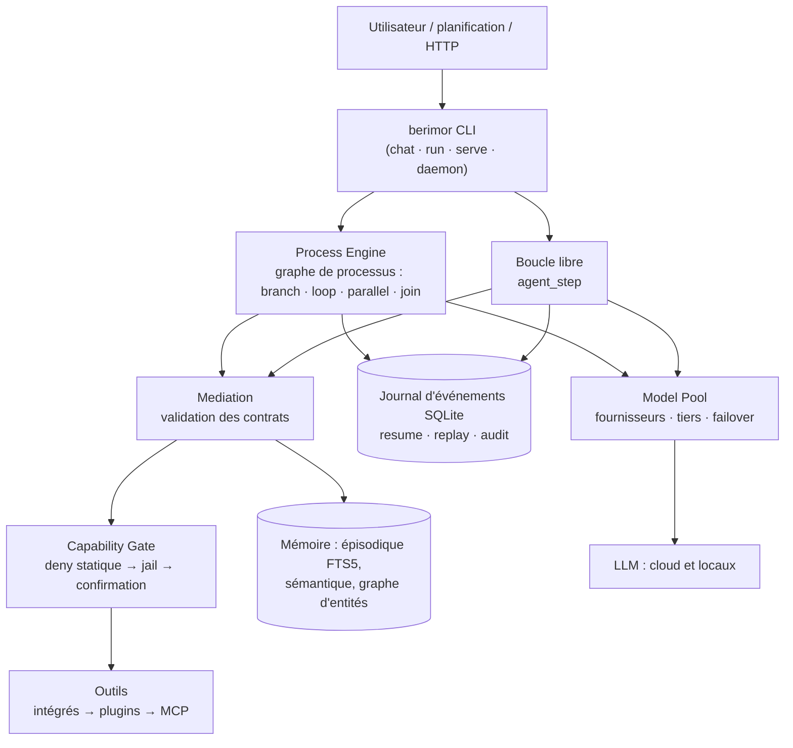
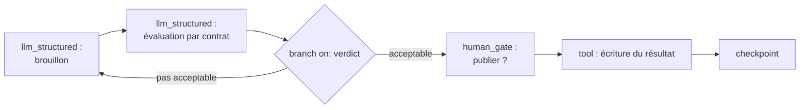

<div align="center">


**Le modèle pense. Le code décide.**

[Русский](README.md) · [English](README.en.md) · [Deutsch](README.de.md) · **[Français](README.fr.md)** · [Español](README.es.md) · [简体中文](README.zh-CN.md) · [日本語](README.ja.md) · [한국어](README.ko.md)

</div>

Agent universel pour LLM à noyau déterministe : le routage des tâches, le branchement des processus, la sélection du contexte et l'admission à l'exécution sont décidés par du code — le modèle exécute des étapes étroites et vérifiables. Fonctionne avec des modèles locaux et cloud, faibles et puissants.

[](https://github.com/devpilgrin/berimor/releases/latest)
[](https://www.npmjs.com/package/berimor)
[](https://github.com/devpilgrin/berimor/actions/workflows/ci.yml)
[](LICENSE)
[](#infrastructure-du-projet)


[](https://socket.dev/npm/package/berimor)


---

## Pourquoi c'est nécessaire

La plupart des « agents IA » sont construits de la même façon : on donne au modèle un ensemble d'outils et on lui demande de décider lui-même quoi faire. Pour une démo — pratique. En production — peu fiable : le modèle oublie des étapes, invente des faits, part dans la mauvaise direction, et une commande dangereuse part dans le terminal sur un « y » tapé machinalement.

Berimor repose sur le postulat inverse : **on ne peut pas confier l'orchestration au modèle — on peut lui confier l'exécution.** La tâche est décomposée en étapes à l'avance ou pilotée par une boucle déterministe ; tout ce que produit le modèle subit une vérification stricte avant que l'on puisse s'y fier ; tout ce qui peut nuire passe par une barrière qui ne s'annule pas d'une pression sur Entrée.

| | CLI agentique typique | Berimor |
|---|---|---|
| Qui décide de la suite | Le modèle (en espérant qu'il soit raisonnable) | Le code (graphe de processus, boucle déterministe) |
| Panne au milieu d'une tâche | « Relancez et priez » | Journal d'événements : reprise exactement au point d'interruption |
| Action dangereuse | Confirmation que la fatigue transforme en YOLO | Deny-statique : l'interdit n'est tout simplement pas demandé |
| Modèle faible/local | « Achetez un modèle plus cher » | Médiation : retry avec explication de l'erreur → escalade vers l'humain |
| Extensions | Le plugin reçoit tout | Le sous-agent/plugin reçoit un sous-ensemble des droits du parent — par le code |
| Reproductibilité | Aucune | Complète : journal → replay → état à n'importe quel instant |

## Ce qui le distingue

**1. Les décisions — du code déterministe, pas du texte dans un prompt.**
Branchements, boucles, timeouts, branches parallèles avec barrière join, migration de versions d'un processus en cours — tout cela relève du Process Engine, et non de l'espoir que le modèle se souvienne des instructions. On ne peut pas confier aux modèles faibles la sélection du contexte et le routage — c'est donc le code qui s'en charge.

**2. La sécurité — une structure, pas une discipline de l'utilisateur.**
La table deny des opérations destructives ne se contourne pas par une confirmation. Le jail de fichiers ne sort pas du dossier de travail. La barrière réseau ne laisse pas passer vers les plages fermées (y compris les camouflages NAT64/6to4/Teredo et les contournements par redirections et userinfo dans l'URL). Les secrets sont masqués à tous les points de fuite — mais la barrière d'admission voit les vraies valeurs : le masquage n'aveugle pas la vérification.

**3. Boucle libre — sous surveillance.**
Mode « raisonnement → action → observation » pour les tâches impossibles à décomposer en étapes à l'avance. Chaque action interne passe par la même barrière de capabilities qu'une étape de processus — la liberté de raisonnement ne signifie pas la liberté vis-à-vis des règles. En option : autocritique et stratégie « proposer — exécuter — vérifier ».

**4. Le code du modèle s'exécute dans une vraie sandbox.**
Pour « fusionne 12 tables et trouve les anomalies », le modèle écrit un programme JavaScript. Celui-ci passe une analyse statique par un vrai parseur (liste blanche d'identifiants — `eval`/`Function`/`Math.random` sont rejetés avant exécution), puis est exécuté par QuickJS au sein de WebAssembly (Wasmtime) avec du fuel, une limite mémoire et un plafond d'appels d'outils. WASI — avec un jeu de droits vide : ni fichiers ni réseau, même potentiellement. L'unique fonction hôte passe par la même barrière.

**5. La mémoire — comme un système d'ingénierie, pas comme un buffer.**
La mémoire de travail se compacte en cas de dépassement du budget. L'épisodique — recherche plein texte (FTS5). La sémantique — déduplication des faits, les conflits ne sont pas écrasés silencieusement, une panne du stockage est indiscernable de « pas de faits » et ne génère pas de faux doublons. Graphe d'entités — relations entre faits, persistant. Skills — recettes réutilisables pour résoudre des tâches similaires, sous forme de fichiers lisibles.

**6. Écosystème d'extensions avec plafond de droits.**
- **Skills** (SKILL.md) — rôles experts pour le chat : déclencheur par le code (pas par le modèle), plafond d'outils par le filtre du dispatcher.
- **Sous-agents** (agent.yaml) — boucle agentique imbriquée avec son propre budget et journal ; droits de l'enfant = intersection avec ceux du parent, extension impossible. Imbrication de spawn — uniquement avec `allow_spawn: true` explicite, profondeur limitée par le code.
- **Plugins** — processus isolés avec manifeste ACL et signature keyless sigstore : installation depuis une liste de confiance avec confirmation TOFU, comme SSH.
- **MCP** — serveurs d'outils externes via le protocole ouvert Model Context Protocol (SDK Rust officiel rmcp, ADR-0023) : ils se connectent par la section `[[mcp_servers]]` de la config, rejoignent le dispatcher commun après les outils intégrés et les plugins, et passent la même barrière de capabilities que n'importe quelle étape de processus. Fonctionne aussi dans l'autre sens : Berimor peut exposer ses propres outils via MCP. Une liste curée de serveurs avec des blocs de config prêts — [`docs/mcp-servers.md`](docs/mcp-servers.md).

Tout cela s'installe en une seule commande — depuis le catalogue ou **n'importe quel dépôt git** : `berimor skill install code-review-ru --from https://github.com/...`.

## Fonctionnalités

### Outils intégrés

Les outils sont intégrés au binaire (pas des plugins), tous les appels passent par la barrière de capabilities : les outils **mutants** (marqués d'un *) exigent une confirmation selon le mode de la barrière, les outils de lecture s'exécutent sans question.

| Groupe | Outils | Ce qu'ils font |
|---|---|---|
| Fichiers | `files.read`, `files.list`, `files.write`*, `files.edit`* | lecture/listage ; écriture complète ; modification ciblée par ancre textuelle (old_string → new_string, contrôle d'unicité) |
| Recherche | `files.search`, `session.search` | regex sur le contenu des fichiers (avec numéros de lignes et contexte) ou glob sur les noms — `.git`/`target`/`node_modules` sont ignorés ; sous-chaîne dans les fils des sessions passées avec extrait |
| VCS | `vcs.git` | git status/diff/log/show — lecture seule : les helpers du dépôt (fsmonitor, diff externe, textconv) sont désactivés, les flags arbitraires ne sont pas acceptés |
| Terminal | `terminal.exec`*, `terminal.start`*, `terminal.output`, `terminal.kill` | commande avec timeout et plafond de sortie ; processus en arrière-plan avec polling et arrêt (jusqu'à 32 simultanés) |
| Réseau | `http.fetch`, `web.search` | GET avec plafond de corps et barrière réseau ; résultats de recherche DuckDuckGo (titre/lien/extrait) |
| Mémoire | `memory.search`, `memory.save` | recherche de faits en mémoire sémantique ; écriture d'un fait avec déduplication — désactivée par défaut (activation consciente : `[memory] tool_writes = true`), les secrets sont masqués avant l'écriture |
| Organisation | `todo.read`, `todo.write`, `human.ask` | liste des tâches de la session (stockée dans `.berimor/todo.json`) ; question à l'utilisateur directement depuis la boucle agentique |
| Snapshots | `snapshot.list`, `snapshot.restore`* | automatique : avant chaque réécriture d'un fichier, son état est sauvegardé (rotation de 50) ; list — étiquettes et chemins, restore — retour en arrière (lui-même avec snapshot) |
| Sous-agents | `agents.run` | délégation à un agent imbriqué avec intersection des droits |

Au-delà des outils intégrés — les outils des plugins et des serveurs MCP (même politique de barrière). La liste complète dans le chat : la ligne de démarrage « outils : … ».

### Menu du chat (TUI)

Tapez `/` — la palette affiche les commandes avec des descriptions dans la langue de l'interface et filtre au fur et à mesure de la saisie. Les sous-menus s'ouvrent par l'espace : `/config ` montre les continuations.

| Commande | Ce qu'elle fait |
|---|---|
| `/help` | liste des commandes |
| `/models` | fournisseurs : liste, `/models add` — assistant (préréglages → choix → clé/OAuth), suppression — via un sélecteur avec confirmation |
| `/skills`, `/agents` | skills et sous-agents (globaux/projet), un skill — Entrée sur la ligne |
| `/config` | **menu des paramètres** : affichage de la configuration effective et item « Locale de l'interface » (avec la valeur courante) → choix de la langue parmi 8 (ru, en, de, fr, es, zh-CN, ja, ko). Enregistré dans la config locale (`[ui]`), effet immédiat. Raccourci : `/config locale ja` |
| `/mouse` | bascule de la souris : capturée — la molette fait défiler le journal, un clic sur le journal donne le focus de défilement ; relâchée — sélection/copie natives du terminal (lors de la capture, la sélection se fait via Maj) |
| `/copy` | dernière réponse de l'agent — dans le presse-papiers (wl-copy/xclip/xsel/pbcopy) |
| `/clear`, `/exit` | effacement du journal de dialogue ; sortie |

Le reste dans l'interface : **modales de confirmation** des actions dangereuses (options « une fois / jusqu'à la fin de la session / pour le projet » — choix par les flèches ←→↑↓, y/n — immédiat) ; **questions de l'agent** (`human.ask`) — modale avec saisie libre, Entrée — répondre, Échap — refuser ; **saisie multiligne** — Alt+Entrée saute une ligne, le champ grandit jusqu'à un tiers de l'écran, le collage depuis le presse-papiers — en un seul événement ; **souris** — molette et focus au clic (voir `/mouse`).

## Processus : agents en graphe

Le principal mode « de combat » de berimor est le **processus** : un plan YAML déclaratif qui s'exécute comme un graphe. C'est la même approche que celle des « agents en graphe » (LangGraph et consorts) : les nœuds sont des étapes, les arêtes sont des transitions, l'état est un objet partagé ; la différence est que la topologie et le routage de berimor sont déterministes — **le modèle ne choisit jamais la branche** : il peut proposer une valeur via un contrat strict, mais c'est le code qui route (invariant I1).

**Nœuds du graphe** (types d'étapes d'un processus) :

| Nœud | Rôle |
|---|---|
| `sequential` | étape ordinaire — passage à la suivante |
| `tool` | appel d'outil (les arguments sont des gabarits issus de l'état) |
| `llm_structured` | appel du modèle avec contrat de réponse strict (JSON Schema — rejeté jusqu'à acceptation) |
| `codeact` | programme du modèle dans un bac à sable WASM (QuickJS, fuel, liste blanche d'appels) |
| `agent_step` | boucle libre « raisonnement → action → observation » comme nœud : `max_turns`, autocritique et « propose—exécute—vérifie » en option |
| `branch` | arêtes conditionnelles : `on` — champ de l'état, `cases` — branches selon les valeurs |
| `loop` | boucle sur condition |
| `parallel` | branches parallèles avec barrière de join |
| `human_gate` | pause pour l'humain : raison, timeout, politique de timeout (fail/branche/escalade) |
| `checkpoint` | point de reprise explicite |

Le journal d'événements couvre le checkpointing avec marge : toute exécution peut reprendre exactement à l'endroit de l'interruption et reproduire l'état à tout moment (replay).

**Limite honnête de l'approche** (d'après les résultats des tests de terrain indépendants de la 0.27.0) : le contrat vérifie **la forme, pas le sens** — `branch` route le code, mais selon une valeur proposée par le modèle ; la confiance n'est pas éliminée, mais rétrogradée au niveau de « la valeur sur laquelle la route est calculée ». Protégez en plus les routes sémantiquement significatives : par des règles de politique du contrat (plages/énumérations), une étape de vérification par un modèle puissant ou un `human_gate`. La deuxième limite — les modèles faibles (locaux) : ils tiennent un contrat strict de forme simple, mais le protocole interne de la boucle libre exige un modèle de classe moyenne ou supérieure ; le scénario « entièrement local » est aujourd'hui réaliste pour les étapes `llm_structured`, pas pour `agent_step`.

**Contrats depuis la configuration** (0.28.0) : vos propres contrats sans fork ni rebuild — section `[[contracts]]` dans la config avec JSON Schema (inline `schema` ou `schema_path`), ensuite `llm_structured`/`codeact`/`agent_step` y font référence par le nom au même titre que les contrats du code. La sortie du modèle est validée selon le schéma (crate `jsonschema`), l'erreur de validation part dans le prompt de retry — le même cycle de médiation. Limites : pas de règles policy (références à l'état) ni de versions de schémas pour les contrats de config, `publishable` — l'objet entier, le registre est lu au démarrage (changement de config — nouveau lancement). Exemple — [`fixtures/golden/processes/config-contracts/`](fixtures/golden/processes/config-contracts/).

**SGR : le schéma guide le raisonnement** (0.30.0) : un contrat peut déclarer des champs de justification AVANT les champs cibles — `risk_factors` (liste non vide) avant `risk` dans `ClassificationOut` ; après avoir énuméré les facteurs, le modèle attribue la note de manière fondée plutôt qu'arbitraire. L'ordre des champs dans le JSON Schema suit l'ordre de déclaration (schemars `preserve_order`). Sur les providers à constrained decoding (`response_format = "json_schema"` dans `[[providers]]` : compatibles OpenAI, Ollama via `format`, llama.cpp), l'ordre de génération est physiquement imposé par le schéma — le modèle ne peut pas produire le nombre sans remplir les facteurs. Sur les providers sans constrained decoding (DeepSeek, Kimi — `json_object` uniquement), le niveau souple s'applique : ordre des champs dans le prompt + obligation par le schéma + validation de médiation. Règle pour les contrats de configuration : déclarer les champs de justification avant les champs cibles. Le llama.cpp autonome (in-process) impose l'ordre via une grammaire GBNF construite depuis le schéma du contrat (0.31.0).

**Normalisateur de forme de tour** (0.29.0) : les modèles faibles produisent souvent une réponse « presque au protocole » — la forme plate `{"thought", "tool", "args"}`, `"action": "tool"` en chaîne, un `reply` au niveau racine, ou du JSON tronqué à la limite de tokens. Les formes connues sont réparées de façon déterministe vers le protocole AVANT la médiation (les réparations sont journalisées comme événements `agent_turn_normalized` ; le sens reste décidé par la validation et le gate). Le prompt de tour a gagné une paire d'exemples few-shot.

**Les idiomes de graphe comme processus.** Les patterns classiques (routing, prompt chaining, parallelization, orchestrator-workers, evaluator-optimizer) s'expriment sans nouveau code : `llm_structured` écrit une décision de routage dans l'état → `branch` route selon la valeur validée ; evaluator-optimizer est un `loop` avec verdict ; orchestrator-workers est `parallel` + join. Des exemples de processus sont dans [`fixtures/golden/processes/`](fixtures/golden/processes/).

### Architecture de l'agent



### Exemple de graphe de processus (evaluator-optimizer)



Le modèle propose un `verdict` — mais seule une valeur ayant passé le contrat arrivera dans `cases` ; le choix de la branche est calculé par le code.

## Infrastructure du projet

**Workspace Rust à raison d'un crate par composant** — Process Engine, Mediation, Executors, Memory, Capability, Model Pool, Actors, Tool Runtime, Context Engine, Eval, Storage. Le module WASM invité (`codeact-guest/`) vit comme un crate séparé et est commité en tant qu'artefact prêt à l'emploi — le build normal n'est pas ralenti.

**Discipline de vérification.** Chaque release : `cargo fmt` + `clippy -D warnings` + `cargo test --workspace` (957 tests : unitaires, d'intégration, e2e via le vrai binaire, fixtures golden de processus et d'entrées malveillantes). Les composants critiques passent une revue indépendante obligatoire. Audit complet autonome (`docs/audit-2026-07-31.md`) — **tous les constats sont corrigés ou documentés en connaissance de cause**.

**Supply chain comme les grands.** Releases multiplateformes (Linux x64/arm64, macOS arm64, Windows x64) avec signature keyless cosign/sigstore — aucune clé privée n'existe nulle part. Vérification : `berimor verify <archive>`. Publication npm avec provenance, SBOM (CycloneDX) dans le pipeline, l'auto-mise à jour (`berimor self-update`) est implémentée sur les primitives du Process Engine — même journal et même reprise après panne que pour les processus ordinaires, et non un script ad hoc.

**Architecture documentée avant le code.** `docs/arch/` — spécification autosuffisante, implémentable sur n'importe quel stack ; `docs/ADR/` — journal des décisions avec les alternatives rejetées ; `docs/ROADMAP.md` — file de tâches avec la classe de modèle exécutant pour chacune.

## Installation

### Méthode 1 : npm (la plus simple)

```sh
npm install -g berimor
berimor --version
```

L'installateur détecte lui-même la plateforme, télécharge le binaire signé depuis la dernière release GitHub et vérifie le SHA-256 avant décompression. Le paquet est publié avec provenance (liaison du build au workflow CI).

### Méthode 2 : binaire prêt à l'emploi depuis GitHub

Les versions à jour se trouvent sur la page des [releases](https://github.com/devpilgrin/berimor/releases/latest). Ci-dessous — les commandes de téléchargement ; la version est substituée automatiquement (dernière release).

**Linux** (x64 ou arm64) :

```sh
VERSION=$(curl -s https://api.github.com/repos/devpilgrin/berimor/releases/latest | grep '"tag_name"' | cut -d '"' -f 4)
ARCH=x64   # ou arm64
curl -LO "https://github.com/devpilgrin/berimor/releases/download/${VERSION}/berimor-${VERSION}-linux-${ARCH}.tar.gz"
tar -xzf "berimor-${VERSION}-linux-${ARCH}.tar.gz"
chmod +x berimor
sudo mv berimor /usr/local/bin/
berimor --version
```

**macOS** (Apple Silicon uniquement — M1/M2/M3 et plus récent ; les builds Intel ne sont pas encore publiés, pour un Mac Intel — méthode 3 ci-dessous) :

```sh
VERSION=$(curl -s https://api.github.com/repos/devpilgrin/berimor/releases/latest | grep '"tag_name"' | cut -d '"' -f 4)
curl -LO "https://github.com/devpilgrin/berimor/releases/download/${VERSION}/berimor-${VERSION}-darwin-arm64.tar.gz"
tar -xzf "berimor-${VERSION}-darwin-arm64.tar.gz"
xattr -d com.apple.quarantine berimor   # le binaire n'est pas encore signé Apple — sinon Gatekeeper refusera de le lancer
chmod +x berimor
sudo mv berimor /usr/local/bin/
berimor --version
```

**Windows** (x64), PowerShell :

```powershell
$Version = (Invoke-RestMethod "https://api.github.com/repos/devpilgrin/berimor/releases/latest").tag_name
Invoke-WebRequest -Uri "https://github.com/devpilgrin/berimor/releases/download/$Version/berimor-$Version-win32-x64.zip" -OutFile berimor.zip
Expand-Archive -Path berimor.zip -DestinationPath .\
.\berimor.exe --version
```

Le binaire n'est pas encore signé — Windows SmartScreen peut afficher l'avertissement « Windows a protégé votre ordinateur » : « Informations complémentaires » → « Exécuter quand même ». Pour appeler `berimor` depuis n'importe quel dossier, déplacez `berimor.exe` dans un répertoire déjà présent dans le `PATH`, ou ajoutez vous-même le dossier courant au `PATH`.

Chaque archive est accompagnée d'un fichier `<archive>.sigstore.json` — signature keyless cosign/sigstore liée à l'identité du workflow CI qui a construit la release (ADR-0026). Vérifier : `berimor verify <archive>` — la commande est déjà dans le binaire téléchargé (installe la racine de confiance sigstore à jour via le réseau au premier appel). Il s'agit d'une signature indépendante d'Apple/Microsoft — elle ne lève pas les avertissements Gatekeeper/SmartScreen ci-dessus, qui concernent une étape distincte, pas encore réalisée.

### Méthode 3 : compiler depuis les sources (tout OS)

Seul [Rust](https://rustup.rs/) est nécessaire (version stable) :

```sh
git clone https://github.com/devpilgrin/berimor.git
cd berimor
cargo build --release -p berimor-cli
./target/release/berimor --version
```

Sous Windows, la dernière commande est `.\target\release\berimor.exe --version`.

## Démarrage rapide

```sh
berimor          # = berimor chat : dialogue interactif avec l'agent
```

Au premier lancement, l'assistant proposera de connecter des modèles depuis des presets (Kimi, DeepSeek, OpenAI, Claude via OpenRouter, locaux via Ollama/llama.cpp/LM Studio) — choisissez les numéros ou les noms, collez la clé API (elle ira dans `~/.config/berimor/secrets.env` avec des droits « propriétaire seul », pas dans la config). Au lieu d'une clé API, on peut se connecter par abonnement — `berimor login` (OAuth avec PKCE : Claude Pro/Max, ChatGPT Plus/Pro ; les jetons vont dans le même `secrets.env`, le rafraîchissement est transparent). Plus tard, la même chose — `berimor setup` ou directement dans le chat avec la commande `/models add`.

Commandes utiles du chat : `/help`, `/models`, `/skills`, `/config`, `/exit`. La langue de l'interface TUI — `/config locale` (8 langues : ru, en, de, fr, es, zh-CN, ja, ko ; le choix est enregistré dans la config locale, section `[ui]`).

Processus déterministes (plan YAML déclaratif à contrats stricts — le principal mode « combat ») : `berimor run <process.yaml>`. Exemples de processus et de configurations — dans [`fixtures/golden/processes/`](fixtures/golden/processes/) et [`CONTRIBUTING.md`](CONTRIBUTING.md).

Automatisation par-dessus les processus : `berimor schedule add` + `berimor daemon` — exécution des processus selon un calendrier (le démon et le service HTTP n'ont pas de terminal : une demande de confirmation est traitée comme un refus avec diagnostic — pour automatiser les étapes mutantes, utilisez l'auto-confirmation ciblée dans `.berimor/allow` ou bien le flag `berimor run --non-interactive` / `BERIMOR_NON_INTERACTIVE=1` dans vos scripts) ; `berimor serve` — service HTTP par-dessus run/schedule/sessions (avec jeton, sans accès anonyme) ; `berimor sessions` — registre des sessions actives de l'hôte ; `berimor trace <instance>` — traçage lisible du journal de n'importe quelle exécution.

Extensions en une commande :

```sh
berimor skill install code-review-ru                                    # depuis le catalogue
berimor skill install my-skill --from https://github.com/user/repo      # depuis n'importe quel git
berimor agent install researcher
berimor plugin install devpilgrin/berimor-plugin-hello                  # plugin signé
berimor plugin install-local ./my-plugin --allow-unsigned               # local, en connaissance de cause
```

## Structure du projet

| Couche | Répertoire | Contenu |
|---|---|---|
| Noyau de l'agent | `crates/` | Workspace Rust — un crate par composant : Process Engine, Mediation, Executors, Memory, Capability, Model Pool, Actors, Tool Runtime, Context Engine, Eval, Storage |
| Sandbox CodeAct | `codeact-guest/` | Invité QuickJS sous wasm32-wasip1 — crate séparé, commité comme artefact prêt à l'emploi |
| Bootstrap | `bootstrap/` | Paquet npm d'installation/mise à jour (TypeScript), voir « Installation » ci-dessus |
| Architecture | `docs/arch/` | Spécification autosuffisante — principes, composants, diagrammes (`docs/arch/views/`). Voir `docs/arch/README.md` |
| Décisions | `docs/ADR/` | Journal des décisions d'architecture : contexte, alternatives, conséquences. Voir `docs/ADR/README.md` |
| Plan de développement | `docs/ROADMAP.md` | File de tâches par phases, décomposition en sous-tâches, complexité, classe de modèle exécutant |
| Audit | `docs/audit-2026-07-31.md` | Audit de sécurité indépendant — tous les constats corrigés ou documentés en connaissance de cause |
| Données de test | `fixtures/golden/` | Jeux golden : exemples de processus, contrats, entrées malveillantes |
| Recherches | `docs/rnd/` | Couche auxiliaire : sources et analyse des frameworks agentiques existants. Voir `docs/rnd/README.md` |

`crates/` et `bootstrap/` — l'agent lui-même, du code écrit selon la file de `docs/ROADMAP.md`. `docs/arch/` — la couche de décisions pures derrière lui : ne mentionne pas de projets ni produits concrets (sauf `docs/arch/deployment.md` et `docs/arch/stack.md`, où c'est une exception assumée), expose l'architecture de façon à ce qu'elle puisse être implémentée sur n'importe quel stack. `docs/ADR/` consigne pourquoi chaque décision a été prise, y compris les alternatives rejetées. `docs/rnd/` — couche auxiliaire de sources sur laquelle s'est appuyée la conception, ne fait pas partie de l'agent.

## Licence

Apache License 2.0 — voir [`LICENSE`](LICENSE).

## Contribuer

Voir [`CONTRIBUTING.md`](CONTRIBUTING.md) et [`docs/ROADMAP.md`](docs/ROADMAP.md) pour choisir une tâche.
