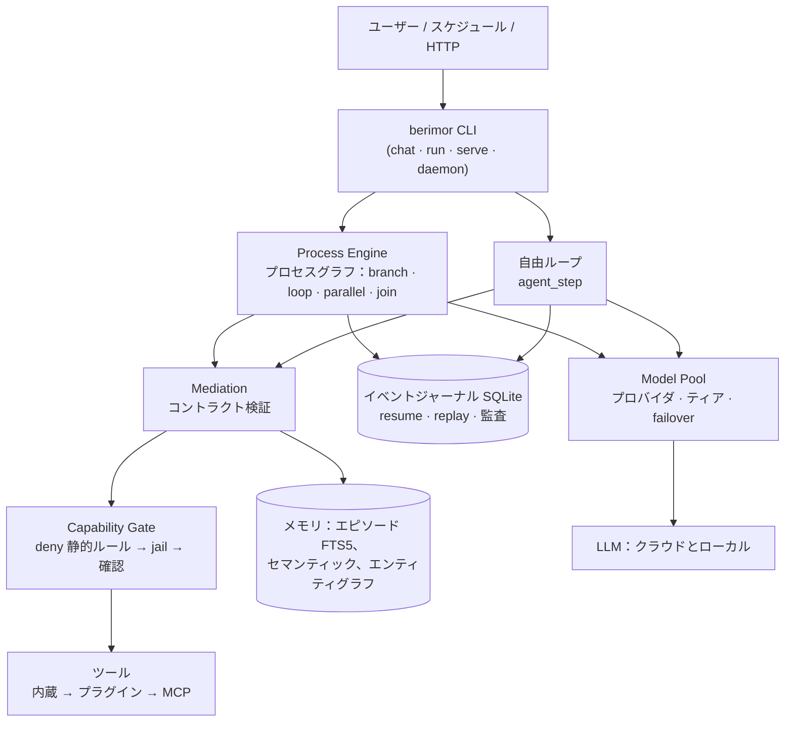
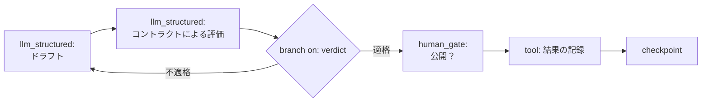

<div align="center">


**モデルは考える。コードが決める。**

[Русский](README.md) · [English](README.en.md) · [Deutsch](README.de.md) · [Français](README.fr.md) · [Español](README.es.md) · [简体中文](README.zh-CN.md) · **[日本語](README.ja.md)** · [한국어](README.ko.md)

</div>

決定論的コアを持つ LLM 向けユニバーサルエージェント：タスクのルーティング、プロセスの分岐、コンテキストの選別、実行許可はコードが決定し、モデルは狭く検証可能なステップを実行するだけです。ローカルモデルにもクラウドモデルにも、弱いモデルにも強いモデルにも対応します。

[](https://github.com/devpilgrin/berimor/releases/latest)
[](https://www.npmjs.com/package/berimor)
[](https://github.com/devpilgrin/berimor/actions/workflows/ci.yml)
[](LICENSE)
[](#プロジェクトのインフラ)


[](https://socket.dev/npm/package/berimor)


---

## なぜ必要なのか

ほとんどの「AI エージェント」は同じ構造をしています：モデルにツール群を与え、何をすべきかをモデル自身に決めさせる。デモには便利ですが、実務には頼りません：モデルはステップを忘れ、事実をでっち上げ、方向を誤り、危険なコマンドは「y」を反射的に押した拍子にターミナルへ流れていきます。

Berimor は逆の前提に基づいて構築されています：**モデルにオーケストレーションは任せられない——任せられるのは実行だけ。** タスクは事前にステップへ分解されるか、決定論的ループによって駆動されます。モデルが出力するものはすべて、信頼に足る前に厳格な検証を通ります。害を及ぼし得るものはすべて、Enter キーでは取り消せないゲートを通ります。

| | 典型的なエージェント CLI | Berimor |
|---|---|---|
| 次に何をするか決めるのは | モデル（分別があることへの期待） | コード（プロセスグラフ、決定論的ループ） |
| タスク途中での失敗 | 「再起動して祈れ」 | イベントジャーナル：中断した場所から正確に再開 |
| 危険な操作 | 疲労が YOLO に変えてしまう確認プロンプト | Deny 静的ルール：禁止事項はそもそも問い合わせない |
| 弱い／ローカルモデル | 「もっと高いモデルを買え」 | メディエーション：エラー説明付きリトライ → 人間へエスカレーション |
| 拡張 | プラグインがすべての権限を得る | サブエージェント／プラグインは親の権限の部分集合を得る——コードによって保証 |
| 再現性 | なし | 完全：ジャーナル → リプレイ → 任意時点の状態 |

## 何が違うのか

**1. 決定は決定論的コードであり、プロンプト内のテキストではない。**
分岐、ループ、タイムアウト、join バリア付きの並列ブランチ、実行中プロセスのバージョンマイグレーション——これらはすべて Process Engine の仕事であり、モデルが指示を覚えていることへの期待ではありません。弱いモデルにコンテキスト選別やルーティングは任せられない——だからコードが担当します。

**2. セキュリティは構造であり、ユーザーの規律ではない。**
破壊的操作の Deny テーブルは確認によって覆せません。ファイルシステムの jail は作業ディレクトリの外に出られません。ネットワークゲートは閉じたレンジを通しません（NAT64/6to4/Teredo による偽装や、リダイレクトや URL の userinfo 経由のバイパスを含む）。シークレットはすべての漏洩ポイントでマスクされます——しかし許可ゲートは実際の値を見ます：マスキングはチェックを盲目にしません。

**3. 自由ループ——監督の下で。**
事前にステップへ分解できないタスクのための「推論 → 行動 → 観察」モード。ループ内の各行動は、プロセスのステップと同じ capability ゲートを通ります——推論の自由はルールからの自由を意味しません。オプション：自己批評と「提案 — 実行 — 検証」戦略。

**4. モデルが書いたコードは本物のサンドボックスで実行される。**
「12 のテーブルをマージして異常を見つけて」のようなタスクでは、モデルが JavaScript プログラムを書きます。それは本物のパーサーによる静的解析を通り（識別子ホワイトリスト——`eval`/`Function`/`Math.random` は実行前に拒否）、WebAssembly（Wasmtime）内の QuickJS で、フューエル、メモリ上限、ツール呼び出し回数の上限付きで実行されます。WASI は空の権限セット：ファイルもネットワークも潜在的にさえ存在しません。唯一のホスト関数も同じゲートを通ります。

**5. メモリはバッファではなく、工学システムとして。**
ワーキングメモリは予算超過時に圧縮されます。エピソード記憶——全文検索（FTS5）。セマンティック記憶——ファクトの重複排除、競合は黙って上書きされず、ストレージ障害は「ファクトがない」状態と区別がつかず、偽の重複を生みません。エンティティグラフ——ファクト間の関連、永続化。スキル——類似タスクを解くための再利用可能なレシピで、可読なファイルです。

**6. 権限の天井がある拡張エコシステム。**
- **スキル**（SKILL.md）——チャット用のエキスパートロール：トリガーはコードで（モデルではなく）、ツールの天井はディスパッチャのフィルタで保証。
- **サブエージェント**（agent.yaml）——独自の予算とジャーナルを持つ入れ子のエージェントループ；子の権限 = 親の権限との積集合で、拡大は不可。入れ子のスポーンは明示的な `allow_spawn: true` のみ、深さはコードで制限。
- **プラグイン**——ACL マニフェストと sigstore キーレス署名を持つ分離プロセス：SSH のように、信頼リストからのインストールと TOFU 確認。
- **MCP**——オープンプロトコル Model Context Protocol による外部ツールサーバー（公式 Rust SDK rmcp、ADR-0023）：設定の `[[mcp_servers]]` セクションで接続し、ビルトインツールとプラグインの後ろで共通ディスパッチャに登録され、プロセスのどのステップとも同じ capability ゲートを通ります。逆方向にも動作します：Berimor は自身のツールを MCP 経由で提供できます。設定ブロック付きの厳選サーバーリストは [`docs/mcp-servers.md`](docs/mcp-servers.md) を参照。

これらすべてを 1 コマンドでインストールできます——カタログから、または**任意の git リポジトリ**から：`berimor skill install code-review-ru --from https://github.com/...`。

## 機能

### 内蔵ツール

ツールはバイナリに内蔵されており（プラグインではない）、すべての呼び出しは capability ゲートを通ります：**変更系**（* 印）はゲートモードに応じて確認が必要で、読み取り系は確認なしで実行されます。

| グループ | ツール | 内容 |
|---|---|---|
| ファイル | `files.read`、`files.list`、`files.write`*、`files.edit`* | 読み取り/一覧；全体の書き込み；文字列アンカーによるピンポイント編集（old_string → new_string、一意性チェック） |
| 検索 | `files.search`、`session.search` | ファイル内容への regex（行番号とコンテキスト付き）またはファイル名への glob——`.git`/`target`/`node_modules` はスキップ；過去のセッションのフィードへの部分文字列検索（抜粋付き） |
| VCS | `vcs.git` | git status/diff/log/show——読み取り専用：リポジトリヘルパー（fsmonitor、外部 diff、textconv）は無効化され、任意のフラグは受け付けません |
| ターミナル | `terminal.exec`*、`terminal.start`*、`terminal.output`、`terminal.kill` | タイムアウトと出力キャップ付きのコマンド；ポーリングと停止が可能なバックグラウンドプロセス（同時最大 32） |
| ネットワーク | `http.fetch`、`web.search` | ボディキャップとネットワークゲート付きの GET；DuckDuckGo の検索結果（タイトル/リンク/スニペット） |
| メモリ | `memory.search`、`memory.save` | セマンティックメモリのファクト検索；重複排除付きのファクト書き込み——デフォルトでは無効（明示的に有効化：`[memory] tool_writes = true`）、シークレットは書き込み前にマスクされます |
| 組織 | `todo.read`、`todo.write`、`human.ask` | セッションのタスクリスト（`.berimor/todo.json` に保存）；エージェントループから直接ユーザーへの質問 |
| スナップショット | `snapshot.list`、`snapshot.restore`* | 自動：ファイルを上書きするたびにその状態を保存（50 ローテーション）；list——ラベルとパス、restore——ロールバック（これ自体もスナップショット付き） |
| サブエージェント | `agents.run` | 権限の積集合での入れ子エージェントへの委託 |

ビルトインに加えて、プラグインと MCP サーバーのツール（同じゲートポリシー）もあります。チャットでの完全なリスト：開始行「ツール：…」。

### チャットメニュー (TUI)

`/` と入力すると——パレットがインターフェース言語の説明付きでコマンドを表示し、入力に応じてフィルタリングします。サブメニューはスペースで展開：`/config ` で続きが表示されます。

| コマンド | 内容 |
|---|---|
| `/help` | コマンド一覧 |
| `/models` | プロバイダー：一覧、`/models add`——ウィザード（プリセット → 選択 → キー/OAuth）、削除——確認付きピッカー経由 |
| `/skills`、`/agents` | スキルとサブエージェント（グローバル/プロジェクト）、行で Enter で詳細 |
| `/config` | **パラメータメニュー**：有効な設定の表示と「インターフェース言語」項目（現在値付き）→ 8 言語から選択（ru, en, de, fr, es, zh-CN, ja, ko）。ローカル設定（`[ui]`）に保存され、即時反映。ショートカット：`/config locale ja` |
| `/mouse` | マウス切り替え：キャプチャ時——ホイールでジャーナルスクロール（右に位置付きスクロールバー）、ジャーナルのクリックでスクロールフォーカス；解放時——選択モード：情報パネル非表示、ジャーナルが全幅、ネイティブ選択はジャーナルのみ（キャプチャ時は Shift 併用） |
| `/copy` | エージェントの最後の回答をクリップボードへ（wl-copy/xclip/xsel/pbcopy） |
| `/clear`、`/exit` | 会話ジャーナルのクリア；終了 |

インターフェースのその他：危険な操作の**確認モーダル**（選択肢「1 回だけ / セッション終了まで / このプロジェクト」—— ←→↑↓ キーで選択、y/n——即時）；**エージェントの質問**（`human.ask`）——自由入力のモーダル、Enter——回答、Esc——拒否；**複数行入力**——Alt+Enter で改行、フィールドは画面の 3 分の 1 まで拡大、クリップボードからの貼り付けは 1 イベントとして挿入；**マウス**——ホイールとクリックフォーカス（`/mouse` 参照）。

## プロセス：グラフエージェント

berimor の主な「実戦」モードは**プロセス**——グラフとして実行される宣言的な YAML プランです。これは「グラフエージェント」（LangGraph など）と同じアプローチです：ノードはステップ、エッジは遷移、状態は共有オブジェクト。違いは、berimor ではトポロジーとルーティングが決定的であること——**モデルはブランチを決して選びません**：厳密なコントラクトを通じて値を提案することはできますが、ルーティングはコードが行います（不変条件 I1）。

**グラフのノード**（プロセスステップの種類）：

| ノード | 用途 |
|---|---|
| `sequential` | 通常のステップ——次へ遷移 |
| `tool` | ツール呼び出し（引数は状態からのテンプレート） |
| `llm_structured` | 厳密な応答コントラクト付きのモデル呼び出し（JSON Schema——受理されるまで拒否される） |
| `codeact` | WASM サンドボックス内のモデルプログラム（QuickJS、燃料、呼び出しホワイトリスト） |
| `agent_step` | 「推論 → 行動 → 観察」の自由ループをノードとして：`max_turns`、オプションで自己批評と「提案—実行—検証」 |
| `branch` | 条件付きエッジ：`on`——状態フィールド、`cases`——値ごとのブランチ |
| `loop` | 条件によるループ |
| `parallel` | join バリア付きの並列ブランチ |
| `human_gate` | 人間による一時停止：理由、タイムアウト、タイムアウトポリシー（fail/ブランチ/エスカレーション） |
| `checkpoint` | 明示的な復旧ポイント |

イベントジャーナルはチェックポイントを余裕をもってカバーします：どの実行も中断した場所から正確に再開でき、任意の時点の状態を再生（replay）できます。

**アプローチの正直な境界**（0.27.0 の独立したフィールドテストの結果に基づく）：コントラクトが検証するのは**意味ではなく形式**です——`branch` をルーティングするのはコードですが、その値を提案するのはモデルです。信頼は排除されたのではなく、「ルートが計算される値」のレベルに下げられたのです。意味的に重要なルートは追加で保護してください：コントラクトの policy ルール（範囲/列挙）、強いモデルによる検証ステップ、または `human_gate`。2 つ目の境界は弱い（ローカル）モデルです：単純な形式の厳格なコントラクトなら耐えられますが、自由ループの内部プロトコルには中クラス以上のモデルが必要です。「完全にローカル」というシナリオは、今日では `llm_structured` ステップには現実的ですが、`agent_step` にはそうではありません。

**設定からのコントラクト**（0.28.0）：フォークや再ビルドなしで独自のコントラクト——設定の `[[contracts]]` セクションにJSON Schema（インライン `schema` または `schema_path`）で定義し、あとは `llm_structured`/`codeact`/`agent_step` がビルトインと同列に名前で参照します。モデルの出力はスキーマで検証され（crate `jsonschema`）、検証エラーはリトライプロンプトへ送られます——同じメディエーションループです。制約：設定コントラクトには policy ルール（状態への参照）とスキーマのバージョンはなく、`publishable` はオブジェクト全体、レジストリは起動時に読み込まれます（設定変更は再起動が必要）。例——[`fixtures/golden/processes/config-contracts/`](fixtures/golden/processes/config-contracts/)。

**SGR：スキーマが推論を導く**（0.30.0）：コントラクトは対象フィールドの前に根拠フィールドを宣言できます — `ClassificationOut` では `risk_factors`（非空リスト）が `risk` の前。要因を列挙してからスコアを付けるため、モデルの評価は恣意的ではなく根拠に基づきます。JSON Schema のフィールド順は宣言順に一致します（schemars `preserve_order`）。constrained decoding 対応プロバイダ（`[[providers]]` の `response_format = "json_schema"`：OpenAI 互換、Ollama は `format` 経由、llama.cpp）では生成順がスキーマによって物理的に強制され、要因を埋めずに数値を出力できません。非対応プロバイダ（DeepSeek、Kimi — `json_object` のみ）ではソフトレベルが働きます：プロンプト内のフィールド順 + スキーマ必須 + メディエーション検証。設定コントラクトの規則：根拠フィールドは対象フィールドより先に宣言してください。 自律的な in-process llama.cpp は、コントラクトスキーマから構築された GBNF 文法で順序を強制します（0.31.0）。

**自由ループのターン予算**（0.34.0）：メッセージあたりの上限は `[agent] max_turns`（デフォルト 32、従来 12）。ループ防止は長さ制限と分離：同一アクション（ツール＋同一引数）の連続はプロンプト警告、4連続で `StuckLoop` として明示的に停止。長い多様な作業（数十回の読み取りを伴うプロジェクト分析）は制限で罰せられません。上限の約20%手前で、エンジンはプロンプトに「残り N ターン — 結果を Finish にまとめて」という注意を追加します。

**PoC 検証付きペンテスト**（0.33.0、usestrix/strix に着想）：リファレンスプロセス [`fixtures/golden/processes/pentest/`](fixtures/golden/processes/pentest/) — 偵察 → 仮説（evidence が class より先、SGR）→ `human_gate` → 能動検証 → レポート。発見は実行証拠がある場合のみ受理され、未確認のものは正直に `unconfirmed` に入ります。ガードレールは必須：ターゲットは明示的な scope から、能動的アクションは人間経由、すべてジャーナルに記録。あわせて、自由ループでの capability 層の静的 deny はランを殺すのではなくターンの観測になりました — モデルはルールに合わせてアクションを修正し、ゲートは毎回の試行を引き続き遮断します。

**拡張ガバナンス**（0.32.0）：`berimor skill lint` / `berimor agent lint` — マニフェストの静的チェック（名前の契約、既知ツール、`permissions`（net/exec/fs-write/spawn）と tools 上限の整合性）。カタログからのインストールは fail-closed：lint エラーでロールバック。`berimor skill review` / `agent review` — 内容を信頼できないデータとして扱うマルチモデルレビュー：設定済みの各プロバイダが独立に判定し、結果はクォーラム（1件の fail で fail）、所見付きの JSON レポート。リリースには `release-evidence.json`（ハッシュ、署名、SBOM、CI トレース）と `release-smoke-linux-x64.json` が付属します。


**ターンフォーム正規化器**（0.29.0）：弱いモデルは「ほぼプロトコルどおり」の応答を返しがちです——フラットな `{"thought", "tool", "args"}` 形式、文字列の `"action": "tool"`、トップレベルの `reply`、トークン上限で途切れた JSON。既知の形はメディエーションの前に決定論的にプロトコルへ修復されます（修復は `agent_turn_normalized` イベントとして記録され、意味の判断は引き続き検証とゲートが行います）。ターンプロンプトに few-shot 例のペアが追加されました。
**プロセスとしてのグラフイディオム。** 古典的なパターン（routing、prompt chaining、parallelization、orchestrator-workers、evaluator-optimizer）は新しいコードなしで表現できます：`llm_structured` がルーティング決定を状態に書き込み → `branch` が検証済みの値でルーティング；evaluator-optimizer は verdict 付きの `loop`；orchestrator-workers は `parallel` + join。プロセスの例は [`fixtures/golden/processes/`](fixtures/golden/processes/) にあります。

### エージェントのアーキテクチャ



### プロセスグラフの例（evaluator-optimizer）



モデルは `verdict` を提案します——しかし `cases` に入るのはコントラクトを通過した値だけです。ブランチの選択はコードが計算します。

## プロジェクトのインフラ

**コンポーネントごとに 1 クレートの Rust workspace**——Process Engine、Mediation、Executors、Memory、Capability、Model Pool、Actors、Tool Runtime、Context Engine、Eval、Storage。ゲスト WASM モジュール（`codeact-guest/`）は独立した crate として存在し、ビルド済みアーティファクトとしてコミットされています——通常のビルドは遅くなりません。

**チェックの規律。** すべてのリリースで：`cargo fmt` + `clippy -D warnings` + `cargo test --workspace`（968 テスト：ユニット、統合、実バイナリ経由の e2e、プロセスと悪意ある入力のゴールデンフィクスチャ）。重要コンポーネントは必須の独立レビューを通ります。完全な独立監査（`docs/audit-2026-07-31.md`）——**すべての指摘は解決済みか、意図的に文書化済み**。

**大人のサプライチェーン。** クロスプラットフォームリリース（Linux x64/arm64、macOS arm64、Windows x64）に cosign/sigstore キーレス署名——秘密鍵はどこにも存在しません。検証：`berimor verify <アーカイブ>`。npm 公開は provenance 付き、パイプラインに SBOM（CycloneDX）、セルフアップデート（`berimor self-update`）は Process Engine のプリミティブ上に実装——通常のプロセスと同じジャーナルと障害復旧で、アドホックなスクリプトではありません。

**アーキテクチャはコードより先に文書化。** `docs/arch/`——任意のスタックで実装可能な自己完結的な仕様；`docs/ADR/`——却下された代替案を含む決定ジャーナル；`docs/ROADMAP.md`——各タスクに実行モデルのクラスを付記したタスクキュー。

## インストール

### 方法 1：npm（最も簡単）

```sh
npm install -g berimor
berimor --version
```

インストーラーはプラットフォームを自動判別し、GitHub の最新リリースから署名済みバイナリをダウンロードし、展開前に SHA-256 を照合します。パッケージは provenance 付きで公開されます（ビルドが CI ワークフローに紐付け）。

### 方法 2：GitHub のビルド済みバイナリ

最新バージョンは[リリースページ](https://github.com/devpilgrin/berimor/releases/latest)にあります。以下はダウンロード用コマンドです。バージョンは自動で代入されます（最新リリース）。

**Linux**（x64 または arm64）：

```sh
VERSION=$(curl -s https://api.github.com/repos/devpilgrin/berimor/releases/latest | grep '"tag_name"' | cut -d '"' -f 4)
ARCH=x64   # または arm64
curl -LO "https://github.com/devpilgrin/berimor/releases/download/${VERSION}/berimor-${VERSION}-linux-${ARCH}.tar.gz"
tar -xzf "berimor-${VERSION}-linux-${ARCH}.tar.gz"
chmod +x berimor
sudo mv berimor /usr/local/bin/
berimor --version
```

**macOS**（Apple Silicon のみ——M1/M2/M3 以降；Intel 向けビルドはまだ公開されていません。Intel Mac は下の方法 3 を）：

```sh
VERSION=$(curl -s https://api.github.com/repos/devpilgrin/berimor/releases/latest | grep '"tag_name"' | cut -d '"' -f 4)
curl -LO "https://github.com/devpilgrin/berimor/releases/download/${VERSION}/berimor-${VERSION}-darwin-arm64.tar.gz"
tar -xzf "berimor-${VERSION}-darwin-arm64.tar.gz"
xattr -d com.apple.quarantine berimor   # バイナリはまだ Apple 署名されていない——このままでは Gatekeeper が起動を拒否する
chmod +x berimor
sudo mv berimor /usr/local/bin/
berimor --version
```

**Windows**（x64）、PowerShell：

```powershell
$Version = (Invoke-RestMethod "https://api.github.com/repos/devpilgrin/berimor/releases/latest").tag_name
Invoke-WebRequest -Uri "https://github.com/devpilgrin/berimor/releases/download/$Version/berimor-$Version-win32-x64.zip" -OutFile berimor.zip
Expand-Archive -Path berimor.zip -DestinationPath .\
.\berimor.exe --version
```

バイナリはまだ署名されていません——Windows SmartScreen が「Windows によって PC が保護されました」という警告を表示することがあります：「詳細情報」→「実行」。任意のフォルダから `berimor` を呼べるようにするには、`berimor.exe` をすでに `PATH` にあるディレクトリに移すか、現在のフォルダを自分で `PATH` に追加してください。

各アーカイブには `<アーカイブ>.sigstore.json` が付随します——リリースをビルドした CI ワークフローのアイデンティティに紐付いた cosign/sigstore キーレス署名（ADR-0026）。検証：`berimor verify <アーカイブ>`——コマンド自体はダウンロードしたバイナリに含まれています（初回呼び出し時にネットワーク経由で最新の sigstore 信頼ルートをインストール）。これは Apple/Microsoft から独立した署名です——上記の Gatekeeper/SmartScreen の警告は消えません。それらは別の、まだ完了していないステップに関するものです。

### 方法 3：ソースからビルド（任意の OS）

必要なのは [Rust](https://rustup.rs/)（安定版）だけです：

```sh
git clone https://github.com/devpilgrin/berimor.git
cd berimor
cargo build --release -p berimor-cli
./target/release/berimor --version
```

Windows では最後のコマンドは `.\target\release\berimor.exe --version` です。

## クイックスタート

```sh
berimor          # = berimor chat：エージェントとの対話型チャット
```

初回起動時、ウィザードがプリセットからモデルを接続するよう提案します（Kimi、DeepSeek、OpenAI、OpenRouter 経由の Claude、Ollama/llama.cpp/LM Studio 経由のローカルモデル）——番号または名前を選び、API キーを貼り付けてください（`~/.config/berimor/secrets.env` に「所有者のみ」権限で保存され、設定ファイルには入りません）。API キーの代わりにサブスクリプションでログインすることもできます——`berimor login`（PKCE 付き OAuth：Claude Pro/Max、ChatGPT Plus/Pro；トークンは同じ `secrets.env` に保存され、更新は透過的）。後から同じことをするには `berimor setup`、またはチャット内で直接 `/models add` コマンドを使います。

便利なチャットコマンド：`/help`、`/models`、`/skills`、`/config`、`/exit`。TUI の表示言語は `/config locale`(8 言語: ru, en, de, fr, es, zh-CN, ja, ko。選択はローカル設定の `[ui]` セクションに保存されます)。

決定論的プロセス（厳格なコントラクトを持つ宣言的 YAML プラン——主要な「実戦」モード）：`berimor run <process.yaml>`。プロセスと設定の例は [`fixtures/golden/processes/`](fixtures/golden/processes/) と [`CONTRIBUTING.md`](CONTRIBUTING.md) にあります。

プロセスの上の自動化：`berimor schedule add` + `berimor daemon`——スケジュールに従ったプロセスの実行（デーモンと HTTP サービスにはターミナルがありません：確認リクエストは診断付きの拒否として扱われます——変更系ステップを自動化するには、`.berimor/allow` のピンポイント自動確認か、自分のスクリプトで `berimor run --non-interactive` / `BERIMOR_NON_INTERACTIVE=1` フラグを使ってください）；`berimor serve`——run/schedule/sessions の上に立つ HTTP サービス（トークン付き、匿名アクセスなし）；`berimor sessions`——ホストのライブセッションのレジストリ；`berimor trace <インスタンス>`——任意のランのジャーナルを人間が読める形でトレース。

1 コマンドで拡張をインストール：

```sh
berimor skill install code-review-ru                                    # カタログから
berimor skill install my-skill --from https://github.com/user/repo      # 任意の git から
berimor agent install researcher
berimor plugin install devpilgrin/berimor-plugin-hello                  # 署名済みプラグイン
berimor plugin install-local ./my-plugin --allow-unsigned               # ローカル、承知の上で
```

## プロジェクトの構成

| レイヤー | ディレクトリ | 内容 |
|---|---|---|
| エージェントコア | `crates/` | Rust workspace——コンポーネントごとに 1 クレート：Process Engine、Mediation、Executors、Memory、Capability、Model Pool、Actors、Tool Runtime、Context Engine、Eval、Storage |
| CodeAct サンドボックス | `codeact-guest/` | wasm32-wasip1 向け QuickJS ゲスト——独立した crate、ビルド済みアーティファクトとしてコミット |
| Bootstrap | `bootstrap/` | インストーラー／アップデーターの npm パッケージ（TypeScript）、上の「インストール」参照 |
| アーキテクチャ | `docs/arch/` | 自己完結的な仕様——原則、コンポーネント、図（`docs/arch/views/`）。`docs/arch/README.md` 参照 |
| 決定 | `docs/ADR/` | アーキテクチャ決定ジャーナル：コンテキスト、代替案、帰結。`docs/ADR/README.md` 参照 |
| 開発計画 | `docs/ROADMAP.md` | フェーズ別タスクキュー、サブタスクへの分解、複雑度、実行モデルのクラス |
| 監査 | `docs/audit-2026-07-31.md` | 独立セキュリティ監査——すべての指摘は解決済みか、意図的に文書化済み |
| テストデータ | `fixtures/golden/` | ゴールデンセット：プロセス、コントラクト、悪意ある入力の例 |
| リサーチ | `docs/rnd/` | 補助レイヤー：既存エージェントフレームワークのソースと分析。`docs/rnd/README.md` 参照 |

`crates/` と `bootstrap/` がエージェント本体で、`docs/ROADMAP.md` のキューに従って書かれたコードです。`docs/arch/` はその背後にある純粋な決定のレイヤー：具体的なプロジェクトや製品には言及せず（`docs/arch/deployment.md` と `docs/arch/stack.md` は意図的な例外）、任意のスタックで実装できる形でアーキテクチャを記述しています。`docs/ADR/` は却下された代替案を含め、各決定の理由を記録しています。`docs/rnd/` は設計の拠り所となった補助的なソースのレイヤーであり、エージェントの一部ではありません。

## ライセンス

Apache License 2.0——[`LICENSE`](LICENSE) を参照。

## コントリビューション

タスクの選択は [`CONTRIBUTING.md`](CONTRIBUTING.md) と [`docs/ROADMAP.md`](docs/ROADMAP.md) を参照してください。
