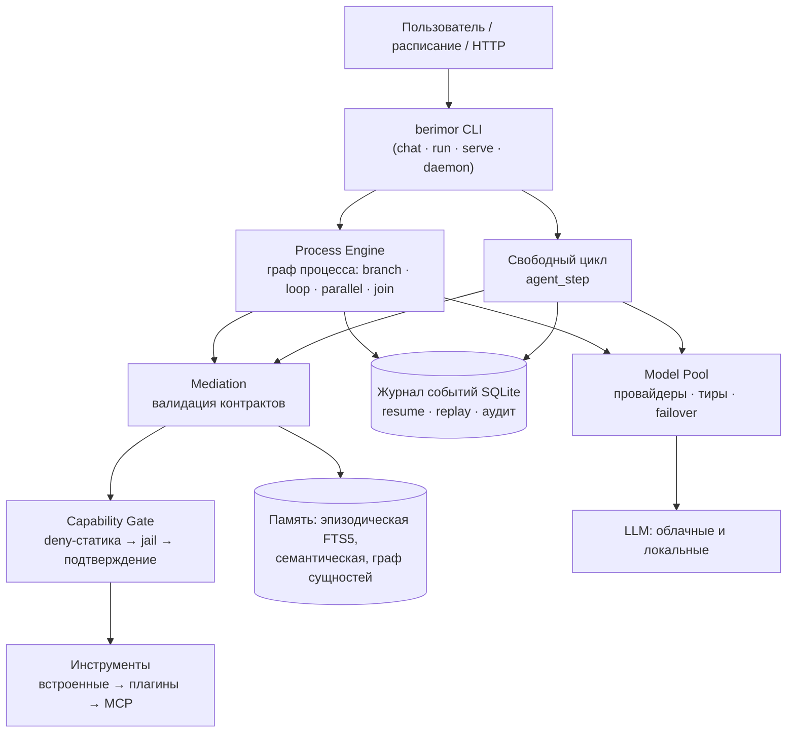
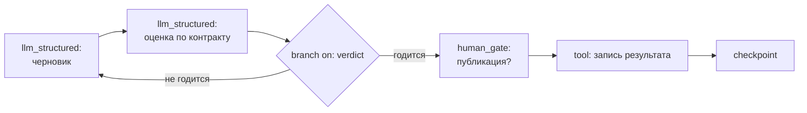

<div align="center">


**Модель думает. Код решает.**

**[Русский](README.md)** · [English](README.en.md) · [Deutsch](README.de.md) · [Français](README.fr.md) · [Español](README.es.md) · [简体中文](README.zh-CN.md) · [日本語](README.ja.md) · [한국어](README.ko.md)

</div>

Универсальный агент для LLM с детерминированным ядром: маршрутизацию задач, ветвление процесса, отбор контекста и допуск к выполнению решает код — модель исполняет узкие, проверяемые шаги. Работает с локальными и облачными моделями, слабыми и сильными.

[](https://github.com/devpilgrin/berimor/releases/latest)
[](https://www.npmjs.com/package/berimor)
[](https://github.com/devpilgrin/berimor/actions/workflows/ci.yml)
[](LICENSE)
[](#инфраструктура-проекта)


[](https://socket.dev/npm/package/berimor)


---

## Зачем это нужно

Большинство «ИИ-агентов» устроены одинаково: модели дают набор инструментов и просят её саму решить, что делать. Для демо — удобно. В работе — ненадёжно: модель забывает шаги, выдумывает факты, сворачивает не туда, а опасная команда уходит в терминал по нажатию «y» на автомате.

Berimor построен на противоположном допущении: **модели нельзя доверять оркестровку — ей можно доверить исполнение.** Задача раскладывается на шаги заранее или руководится детерминированным циклом; всё, что выдаёт модель, проходит строгую проверку прежде, чем на это можно положиться; всё, что может навредить, проходит через гейт, который не отменяется нажатием Enter.

| | Типичный агентный CLI | Berimor |
|---|---|---|
| Кто решает, что делать дальше | Модель (надежда на здравомыслие) | Код (граф процесса, детерминированный цикл) |
| Сбой посреди задачи | «Перезапустите и помолитесь» | Журнал событий: продолжение ровно с места обрыва |
| Опасное действие | Подтверждение, которое усталость превращает в YOLO | Deny-статика: запрещённое не спрашивается вообще |
| Слабая/локальная модель | «Купите модель подороже» | Медиация: ретрай с объяснением ошибки → эскалация человеку |
| Расширения | Плагин получает всё | Субагент/плагин получает подмножество прав родителя — кодом |
| Воспроизводимость | Нет | Полная: журнал → replay → состояние на любой момент |

## Чем отличается

**1. Решения — детерминированный код, не текст в промпте.**
Ветвление, циклы, таймауты, параллельные ветви с join-барьером, миграция версий работающего процесса — всё это Process Engine, а не надежда на то, что модель помнит инструкции. Слабым моделям нельзя доверять отбор контекста и маршрутизацию — значит, этим занимается код.

**2. Безопасность — структура, а не дисциплина пользователя.**
Deny-таблица деструктивных операций не переизбирается подтверждением. Файловый jail не выходит за рабочую папку. Сетевой гейт не пускает в закрытые диапазоны (включая NAT64/6to4/Teredo-маскировки и обходы через редиректы и userinfo в URL). Секреты маскируются на всех точках утечки — но гейт допуска видит настоящие значения: маскировка не ослепляет проверку.

**3. Свободный цикл — под надзором.**
Режим «рассуждение → действие → наблюдение» для задач, которые не разложить по шагам заранее. Каждое действие внутри проходит тот же capability-гейт, что и шаг процесса — свобода рассуждения не значит свобода от правил. Опционально: самокритика и стратегия «предложи — выполни — проверь».

**4. Код модели исполняется в настоящей песочнице.**
Для «смержи 12 таблиц и найди аномалии» модель пишет JavaScript-программу. Она проходит статический анализ реальным парсером (белый список идентификаторов — `eval`/`Function`/`Math.random` отклоняются до исполнения), а исполняется QuickJS внутри WebAssembly (Wasmtime) с топливом, лимитом памяти и потолком вызовов инструментов. WASI — с пустым набором прав: ни файлов, ни сети даже потенциально. Единственная host-функция идёт через тот же гейт.

**5. Память — как инженерная система, а не как буфер.**
Рабочая память сворачивается при переполнении бюджета. Эпизодическая — полнотекстовый поиск (FTS5). Семантическая — дедупликация фактов, конфликты не перезаписываются молча, сбой хранилища неотличим от «фактов нет» и не порождает ложных дублей. Граф сущностей — связи между фактами, персистентный. Навыки — переиспользуемые рецепты решения похожих задач, читаемые файлы.

**6. Экосистема расширений с потолком прав.**
- **Скилы** (SKILL.md) — экспертные роли для чата: триггер — кодом (не моделью), потолок инструментов — фильтром диспетча.
- **Субагенты** (agent.yaml) — вложенный агентный цикл с собственным бюджетом и журналом; права ребёнка = пересечение с правами родителя, расшириться нельзя. Вложенное порождение — только с явным `allow_spawn: true`, глубина ограничена кодом.
- **Плагины** — изолированные процессы с ACL-манифестом и keyless-подписью sigstore: установка из доверенного списка с TOFU-подтверждением, как SSH.
- **MCP** — внешние серверы инструментов по открытому протоколу Model Context Protocol (официальный Rust SDK rmcp, ADR-0023): подключаются секцией `[[mcp_servers]]` в конфиге, встают в общий диспетчер после встроенных инструментов и плагинов и проходят тот же capability-гейт, что и любой шаг процесса. Работает и в обратную сторону: Berimor может отдавать собственные инструменты по MCP. Курируемый список серверов с готовыми блоками конфига — [`docs/mcp-servers.md`](docs/mcp-servers.md).

Всё это устанавливается одной командой — из каталога или **любого git-репозитория**: `berimor skill install code-review-ru --from https://github.com/...`.

## Возможности

### Встроенные инструменты

Инструменты — встроенные в бинарник (не плагины), все вызовы проходят capability-гейт: **мутирующие** (помечены *) требуют подтверждения по режиму гейта, читающие исполняются без вопросов.

| Группа | Инструменты | Что делают |
|---|---|---|
| Файлы | `files.read`, `files.list`, `files.write`*, `files.edit`* | чтение/листинг; запись целиком; точечная правка по строковому якорю (old_string → new_string, контроль уникальности) |
| Поиск | `files.search`, `session.search` | regex по содержимому файлов (с номерами строк и контекстом) или glob по именам — `.git`/`target`/`node_modules` пропускаются; подстрока по лентам прошлых сессий с excerpt |
| VCS | `vcs.git` | git status/diff/log/show — только чтение: хелперы репозитория (fsmonitor, внешний diff, textconv) отключены, произвольные флаги не принимаются |
| Терминал | `terminal.exec`*, `terminal.start`*, `terminal.output`, `terminal.kill` | команда с таймаутом и капом вывода; фоновые процессы с опросом и остановкой (до 32 одновременно) |
| Сеть | `http.fetch`, `web.search` | GET с капом тела и сетевым гейтом; поисковая выдача DuckDuckGo (заголовок/ссылка/сниппет) |
| Память | `memory.search`, `memory.save` | поиск фактов семантической памяти; запись факта с дедупликацией — по умолчанию выключена (включается осознанно: `[memory] tool_writes = true`), секреты маскируются до записи |
| Организация | `todo.read`, `todo.write`, `human.ask` | список задач сессии (хранится в `.berimor/todo.json`); вопрос пользователю прямо из агентного цикла |
| Снапшоты | `snapshot.list`, `snapshot.restore`* | автоматически: перед каждой перезаписью файла его состояние сохраняется (ротация 50); list — метки и пути, restore — откат (сам тоже со снапшотом) |
| Субагенты | `agents.run` | поручение вложенному агенту с пересечением прав |

Сверх встроенных — инструменты плагинов и MCP-серверов (та же гейт-политика). Полный список в чате: стартовая строка «инструменты: …».

### Меню чата (TUI)

Наберите `/` — палитра покажет команды с описаниями на языке интерфейса и фильтрует по мере набора. Подменю работают по пробелу: `/config ` показывает продолжения.

| Команда | Что делает |
|---|---|
| `/help` | список команд |
| `/models` | провайдеры: список, `/models add` — мастер (пресеты → выбор → ключ/OAuth), удаление — через пикер с подтверждением |
| `/skills`, `/agents` | навыки и субагенты (глобальные/проектные), навык — Enter на строке |
| `/config` | **меню параметров**: показ эффективной конфигурации и пункт «Локаль интерфейса» (с текущим значением) → выбор языка из 8 (ru, en, de, fr, es, zh-CN, ja, ko). Сохраняется в локальный конфиг (`[ui]`), действует сразу. Шорткат: `/config locale ja` |
| `/mouse` | переключатель мыши: захвачена — колесо листает журнал, клик по журналу даёт фокус прокрутки; отпущена — нативное выделение/копирование терминала (при захвате выделение — через Shift) |
| `/copy` | последний ответ агента — в буфер обмена (wl-copy/xclip/xsel/pbcopy) |
| `/clear`, `/exit` | очистка журнала диалога; выход |

Остальное в интерфейсе: **модалки подтверждений** опасных действий (варианты «один раз / до конца сессии / для проекта» — выбор стрелками ←→↑↓, y/n — сразу); **вопросы агента** (`human.ask`) — модалка со свободным вводом, Enter — ответить, Esc — отказ; **многострочный ввод** — Alt+Enter переводит строку, поле растёт до трети экрана, вставка из буфера — одним событием; **мышь** — колесо и клик-фокус (см. `/mouse`).

## Процессы: графовые агенты

Основной «боевой» режим berimor — **процесс**: декларативный YAML-план, который исполняется как граф. Это тот же подход, что у «графовых агентов» (LangGraph и подобных): узлы — шаги, рёбра — переходы, состояние — разделяемый объект; отличие в том, что топология и маршрутизация у berimor детерминированы — **модель никогда не выбирает ветку**: она может предложить значение через строгий контракт, а маршрутизирует код (инвариант I1).

**Узлы графа** (типы шагов процесса):

| Узел | Назначение |
|---|---|
| `sequential` | обычный шаг — переход к следующему |
| `tool` | вызов инструмента (аргументы — шаблоны из состояния) |
| `llm_structured` | вызов модели со строгим контрактом ответа (JSON Schema — отклоняется до приёма) |
| `codeact` | программа модели в WASM-песочнице (QuickJS, топливо, белый список вызовов) |
| `agent_step` | свободный цикл «рассуждение → действие → наблюдение» как узел: `max_turns`, опционально самокритика и «предложи—выполни—проверь» |
| `branch` | условные рёбра: `on` — поле состояния, `cases` — ветки по значениям |
| `loop` | петля по условию |
| `parallel` | параллельные ветви с join-барьером |
| `human_gate` | пауза на человека: причина, таймаут, политика таймаута (fail/ветка/эскалация) |
| `checkpoint` | явная точка восстановления |

Журнал событий покрывает чекпоинтинг с запасом: любой прогон можно продолжить ровно с места обрыва и воспроизвести состояние на любой момент (replay).

**Честная граница подхода** (по результатам независимого полевого тестирования 0.27.0): контракт проверяет **форму, не смысл** — `branch` маршрутизирует код, но по значению, которое предложила модель; доверие не устранено, а спущено на уровень «значение, по которому вычисляется маршрут». Семантически значимые маршруты прикрывайте дополнительно: правилами политики контракта (диапазоны/перечисления), шагом верификации у сильной модели или `human_gate`. Вторая граница — слабые (локальные) модели: строгий контракт простой формы они выдерживают, а внутренний протокол свободного цикла требует модели среднего класса и выше; сценарий «полностью локально» сегодня реален для `llm_structured`-шагов, не для `agent_step`.

**Контракты из конфигурации** (0.28.0): свои контракты без форка и пересборки — секция `[[contracts]]` в конфиге с JSON Schema (inline `schema` или `schema_path`), дальше `llm_structured`/`codeact`/`agent_step` ссылаются на неё по имени наравне с кодовыми. Вывод модели валидируется по схеме (crate `jsonschema`), ошибка валидации уходит в промпт повтора — тот же цикл медиации. Ограничения: policy-правил (ссылки на состояние) и версий схем у конфиг-контрактов нет, `publishable` — весь объект, реестр читается при старте (смена конфига — новый запуск). Пример — [`fixtures/golden/processes/config-contracts/`](fixtures/golden/processes/config-contracts/).

**Нормализатор формы хода** (0.29.0): слабые модели часто пишут «почти протокольный» ответ — плоскую форму `{"thought", "tool", "args"}`, `"action": "tool"` строкой, верхнеуровневый `reply` или оборванный на лимите токенов JSON. Известные формы достраиваются детерминированно до протокола ДО медиации (ремонт журналируется событием `agent_turn_normalized`; смысл по-прежнему решают валидация и гейт). Промпт хода дополнен парой few-shot примеров.

**SGR: схема ведёт рассуждение** (0.30.0): контракт может объявлять поля-обоснования ДО целевых — `risk_factors` (непустой список) перед `risk` в `ClassificationOut`; заполнив факторы, модель назначает оценку с опорой, а не произвольно. Порядок полей в JSON Schema соответствует порядку объявления (schemars `preserve_order`). На провайдерах с constrained decoding (`response_format = "json_schema"` в `[[providers]]`: OpenAI-совместимые, Ollama через `format`, llama.cpp) порядок генерации принуждается схемой физически — модель не может выдать число, не заполнив факторы. На провайдерах без constrained decoding (DeepSeek, Kimi — только `json_object`) работает мягкий уровень: порядок полей в промпте + обязательность по схеме + валидация медиации. Правило для конфиг-контрактов: поля-обоснования объявляйте раньше целевых. Автономный llama.cpp (in-process) принуждает порядок GBNF-грамматикой, построенной из схемы контракта (0.31.0).

**Пентест с PoC-валидацией** (0.33.0, по мотивам usestrix/strix): эталонный процесс [`fixtures/golden/processes/pentest/`](fixtures/golden/processes/pentest/) — разведка → гипотезы (evidence перед классом, SGR) → `human_gate` → активная проверка → отчёт, где находка принимается только с доказательством исполнения; неподтверждённое честно попадает в `unconfirmed`. Гард-рейлы обязательны: цели из явного scope, активные действия через человека, всё в журнале. Попутно: статический deny capability-слоя в свободном цикле стал наблюдением хода, а не смертью прогона — модель корректирует действие под правила, гейт каждую попытку по-прежнему режет.

**Управляемость расширений** (0.32.0): `berimor skill lint` / `berimor agent lint` — статические проверки манифеста (контракт имени, известные инструменты, согласованность `permissions` — net/exec/fs-write/spawn — с потолком tools); установка из каталога fail-closed: ошибка линта — откат. `berimor skill review` / `agent review` — мультимодельное ревью содержимого как недоверенных данных: каждый настроенный провайдер выносит вердикт независимо, итог кворумом (fail любого = fail), JSON-отчёт с находками. В релизах — `release-evidence.json` (хэши, подписи, SBOM, след CI) и `release-smoke-linux-x64.json`.

**Графовые идиомы как процессы.** Классические паттерны (routing, prompt chaining, parallelization, orchestrator-workers, evaluator-optimizer) выражаются без нового кода: `llm_structured` пишет решение-маршрут в состояние → `branch` маршрутизирует по валидированному значению; evaluator-optimizer — это `loop` с вердиктом; orchestrator-workers — `parallel` + join. Примеры процессов — в [`fixtures/golden/processes/`](fixtures/golden/processes/).

### Архитектура агента



### Пример графа процесса (evaluator-optimizer)



Модель предлагает `verdict` — но в `cases` попадёт только значение, прошедшее контракт; выбор ветки вычисляет код.

## Инфраструктура проекта

**Rust-workspace по крейту на компонент** — Process Engine, Mediation, Executors, Memory, Capability, Model Pool, Actors, Tool Runtime, Context Engine, Eval, Storage. Гостевой WASM-модуль (`codeact-guest/`) живёт отдельным crate и закоммичен как готовый артефакт — обычная сборка не замедляется.

**Дисциплина проверок.** Каждый релиз: `cargo fmt` + `clippy -D warnings` + `cargo test --workspace` (966 тестов: юнит, интеграционные, e2e через настоящий бинарник, золотые фикстуры процессов и вредоносных вводов). Критические компоненты проходят обязательное независимое ревью. Полный самостоятельный аудит (`docs/audit-2026-07-31.md`) — **все находки закрыты или осознанно задокументированы**.

**Supply chain как у взрослых.** Кросс-платформенные релизы (Linux x64/arm64, macOS arm64, Windows x64) с keyless-подписью cosign/sigstore — приватного ключа не существует нигде. Проверка: `berimor verify <архив>`. npm-публикация с provenance, SBOM (CycloneDX) в пайплайне, самообновление (`berimor self-update`) реализовано на примитивах Process Engine — тот же журнал и восстановление после сбоя, что у обычных процессов, а не ad hoc скрипт.

**npm-установщик вообще без install-скриптов** (класс замечаний Socket.dev закрыт структурно, с 0.24.1): на этапе `npm install` не выполняется НИЧЕГО — в пакете нет ни одного life-cycle скрипта. Скачивание происходит при первом запуске — с фиксированного `github.com/devpilgrin/berimor/releases`, со сверкой SHA-256 скачанного архива против пина `checksums.json`, который CI кладёт в сам npm-пакет при публикации (доверие из npm-канала, независимого от раздающего GitHub Release). Сравнение — константным временем, несовпадение — отказ без распаковки.

**Архитектура задокументирована до кода.** `docs/arch/` — самодостаточная спецификация, реализуемая на любом стеке; `docs/ADR/` — журнал решений с отклонёнными альтернативами; `docs/ROADMAP.md` — очередь задач с классом модели-исполнителя на каждую.

## Установка

### Способ 1: npm (проще всего)

```sh
npm install -g berimor
berimor --version
```

Установщик сам определяет платформу, скачивает подписанный бинарник из последнего релиза GitHub и сверяет SHA-256 до распаковки. Пакет публикуется с provenance (привязка сборки к CI-workflow).

### Способ 2: готовый бинарник с GitHub

Актуальные версии — на странице [релизов](https://github.com/devpilgrin/berimor/releases/latest). Ниже — команды для скачивания; версия подставляется автоматически (последний выпуск).

**Linux** (x64 или arm64):

```sh
VERSION=$(curl -s https://api.github.com/repos/devpilgrin/berimor/releases/latest | grep '"tag_name"' | cut -d '"' -f 4)
ARCH=x64   # или arm64
curl -LO "https://github.com/devpilgrin/berimor/releases/download/${VERSION}/berimor-${VERSION}-linux-${ARCH}.tar.gz"
tar -xzf "berimor-${VERSION}-linux-${ARCH}.tar.gz"
chmod +x berimor
sudo mv berimor /usr/local/bin/
berimor --version
```

**macOS** (только Apple Silicon — M1/M2/M3 и новее; сборки под Intel пока не публикуются, для Intel-Mac — способ 3 ниже):

```sh
VERSION=$(curl -s https://api.github.com/repos/devpilgrin/berimor/releases/latest | grep '"tag_name"' | cut -d '"' -f 4)
curl -LO "https://github.com/devpilgrin/berimor/releases/download/${VERSION}/berimor-${VERSION}-darwin-arm64.tar.gz"
tar -xzf "berimor-${VERSION}-darwin-arm64.tar.gz"
xattr -d com.apple.quarantine berimor   # бинарник пока не подписан Apple — иначе Gatekeeper откажется его запускать
chmod +x berimor
sudo mv berimor /usr/local/bin/
berimor --version
```

**Windows** (x64), PowerShell:

```powershell
$Version = (Invoke-RestMethod "https://api.github.com/repos/devpilgrin/berimor/releases/latest").tag_name
Invoke-WebRequest -Uri "https://github.com/devpilgrin/berimor/releases/download/$Version/berimor-$Version-win32-x64.zip" -OutFile berimor.zip
Expand-Archive -Path berimor.zip -DestinationPath .
.\berimor.exe --version
```

Бинарник пока не подписан — Windows SmartScreen может показать предупреждение «Windows защитила ваш компьютер»: «Дополнительные сведения» → «Выполнить в любом случае». Чтобы вызывать `berimor` из любой папки, переложите `berimor.exe` в каталог, который уже есть в `PATH`, или добавьте текущую папку в `PATH` самостоятельно.

Каждый архив сопровождается файлом `<архив>.sigstore.json` — keyless-подпись cosign/sigstore, привязанная к идентичности CI-workflow, которым собран релиз (ADR-0026). Проверить: `berimor verify <архив>` — сама команда уже в скачанном бинарнике (устанавливает свежий доверенный корень sigstore по сети при первом вызове). Это независимая от Apple/Microsoft подпись — предупреждения Gatekeeper/SmartScreen выше она не снимает, они про отдельный, ещё не сделанный шаг.

### Способ 3: собрать из исходников (любая ОС)

Нужен только [Rust](https://rustup.rs/) (стабильная версия):

```sh
git clone https://github.com/devpilgrin/berimor.git
cd berimor
cargo build --release -p berimor-cli
./target/release/berimor --version
```

На Windows последняя команда — `.\target\release\berimor.exe --version`.

## Быстрый старт

```sh
berimor          # = berimor chat: интерактивный диалог с агентом
```

При первом запуске мастер предложит подключить модели из пресетов (Kimi, DeepSeek, OpenAI, Claude через OpenRouter, локальные через Ollama/llama.cpp/LM Studio) — выберите номера или имена, вставьте ключ API (он попадёт в `~/.config/berimor/secrets.env` с правами «только владелец», не в конфиг). Вместо API-ключа можно войти по подписке — `berimor login` (OAuth с PKCE: Claude Pro/Max, ChatGPT Plus/Pro; токены — в том же `secrets.env`, обновление — прозрачно). Позже то же самое — `berimor setup` или прямо в чате командой `/models add`.

Полезные команды чата: `/help`, `/models`, `/skills`, `/config`, `/exit`. Локаль интерфейса TUI — `/config locale` (8 языков: ru, en, de, fr, es, zh-CN, ja, ko; выбор сохраняется в локальном конфиге — секция `[ui]`).

Детерминированные процессы (декларативный YAML-план со строгими контрактами — основной «боевой» режим): `berimor run <process.yaml>`. Примеры процессов и конфигураций — в [`fixtures/golden/processes/`](fixtures/golden/processes/) и [`CONTRIBUTING.md`](CONTRIBUTING.md).

Автоматизация поверх процессов: `berimor schedule add` + `berimor daemon` — исполнение процессов по расписанию (у демона и HTTP-сервиса нет терминала: запрос подтверждения трактуется как отказ с диагностикой — для автоматизации мутирующих шагов используйте точечное автоподтверждение в `.berimor/allow` либо флаг `berimor run --non-interactive` / `BERIMOR_NON_INTERACTIVE=1` в своих скриптах); `berimor serve` — HTTP-сервис поверх run/schedule/sessions (с токеном, без анонимного доступа); `berimor sessions` — реестр живых сессий хоста; `berimor trace <инстанс>` — человекочитаемая трассировка журнала любого прогона.

Расширения одной командой:

```sh
berimor skill install code-review-ru                                    # из каталога
berimor skill install my-skill --from https://github.com/user/repo      # из любого git
berimor agent install researcher
berimor plugin install devpilgrin/berimor-plugin-hello                  # подписанный плагин
berimor plugin install-local ./my-plugin --allow-unsigned               # локальный, осознанно
```

## Как устроен проект

| Слой | Директория | Содержимое |
|---|---|---|
| Ядро агента | `crates/` | Rust-workspace — по одному крейту на компонент: Process Engine, Mediation, Executors, Memory, Capability, Model Pool, Actors, Tool Runtime, Context Engine, Eval, Storage |
| Песочница CodeAct | `codeact-guest/` | QuickJS-гость под wasm32-wasip1 — отдельный crate, закоммичен как готовый артефакт |
| Bootstrap | `bootstrap/` | npm-пакет установщика/обновления (TypeScript), см. «Установка» выше |
| Архитектура | `docs/arch/` | самодостаточная спецификация — принципы, компоненты, диаграммы (`docs/arch/views/`). См. `docs/arch/README.md` |
| Решения | `docs/ADR/` | журнал архитектурных решений: контекст, альтернативы, последствия. См. `docs/ADR/README.md` |
| План разработки | `docs/ROADMAP.md` | очередь задач по фазам, декомпозиция на подзадачи, сложность, класс модели-исполнителя |
| Аудит | `docs/audit-2026-07-31.md` | независимый аудит безопасности — все находки закрыты или осознанно задокументированы |
| Тестовые данные | `fixtures/golden/` | золотые наборы: примеры процессов, контрактов, вредоносных вводов |
| Исследования | `docs/rnd/` | вспомогательный слой: источники и анализ существующих агентных фреймворков. См. `docs/rnd/README.md` |

`crates/` и `bootstrap/` — сам агент, код, написанный по очереди из `docs/ROADMAP.md`. `docs/arch/` — слой чистых решений позади него: не упоминает конкретные проекты и продукты (кроме `docs/arch/deployment.md` и `docs/arch/stack.md`, где это осознанное исключение), излагает архитектуру так, чтобы её можно было реализовать на любом стеке. `docs/ADR/` фиксирует, почему принято каждое решение, включая отклонённые альтернативы. `docs/rnd/` — вспомогательный слой источников, на который опиралось проектирование, не часть агента.

## Лицензия

Apache License 2.0 — см. [`LICENSE`](LICENSE).

## Участие

См. [`CONTRIBUTING.md`](CONTRIBUTING.md) и [`docs/ROADMAP.md`](docs/ROADMAP.md) для выбора задачи.
