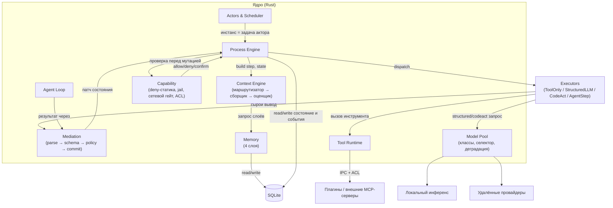

# Компонентная архитектура — C4 Component

> C4, уровень 3: внутренние модули ядра. См. `ideal-agent-architecture.md` §3, `process-engine.md` §6.

## 1. Диаграмма компонентов ядра

## 2. Таблица интерфейсов (сокращённая)

Полная версия — `process-engine.md` §6.

| Компонент | Интерфейс | Потребители |
|---|---|---|
| Context Engine | `build(step, state) → context` | Process Engine, Agent Loop |
| Executors | `run(step, ctx) → raw_output` | Process Engine |
| Mediation | `commit(step, output) → patch \| retry \| escalate` | Process Engine, Agent Loop, фоновые работники памяти |
| Capability | `check(call) → allow \| deny \| confirm` | Process Engine (перед мутирующим вызовом), Executors (внутри CodeAct на каждый вызов стаба) |
| Model Pool | `select(tier, step) → provider` | StructuredLLM, CodeAct |
| Memory | `write(candidate) → committed \| conflict`, `read(query) → layer-results` | Context Engine (чтение), фоновые работники (запись) |
| Actors & Scheduler | `assign(task) → actor`, `schedule(cron) → task` | внешний интейк, Process Engine |

## 3. Правила связей (инвариантны к реализации)

- Executors никогда не пишут в состояние напрямую — только через Mediation.
- Capability проверяется независимо от результата Mediation: валидный контракт не освобождает от deny-проверки.
- Context Engine — единственный путь чтения памяти в структурированных шагах; у модели нет инструмента «сама поищи в памяти» (см. `memory-model.md` §3).
- Actors & Scheduler не вызывают Executors напрямую — только инстанцируют Process Engine.

## 4. Связанные документы

`process-engine.md`; `mediation.md`; `executors.md`; `memory-model.md`; `security-model.md` §2 (L2–L3).
