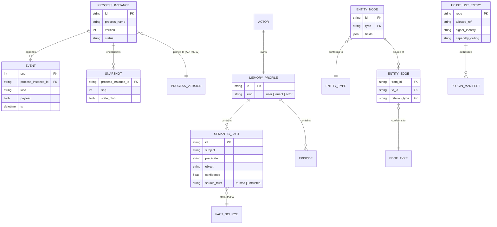
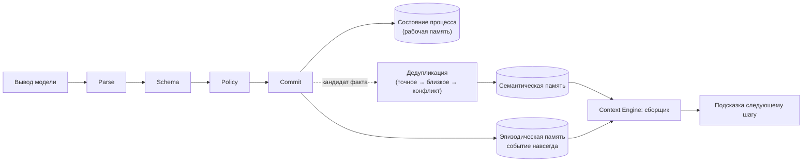

# Архитектура данных

> См. `memory-model.md`, `process-engine.md` §3, `stack.md` §3.

## 1. Модель данных (ER)

Единый файл SQLite — см. ADR-0021. Диаграмма — логическая схема, не DDL.

## 2. Поток данных: вывод модели → состояние → память

## 3. Жизненный цикл и хранение по слоям

| Слой | Где живёт | Когда сворачивается/устаревает | Кто читает |
|---|---|---|---|
| Рабочая | таблица состояния текущего инстанса | сворачивается суммаризацией при приближении к бюджету, оригинал остаётся в эпизодической | Process Engine, Context Engine |
| Эпизодическая | `EVENT`, append-only, WAL | не удаляется; уплотнение по политике хранения (не удаление) | поиск по сессиям (FTS5) |
| Семантическая | `SEMANTIC_FACT` + векторный индекс `sqlite-vec` | устаревание по неиспользованию → ревью человеком | Context Engine (гибридный поиск) |
| Процедурная | файлы навыков на диске + событие ревизии в `EVENT` | версионируется, меняется только через подтверждение | Context Engine (описания всегда; тело — по требованию) |
| Граф сущностей (опционально) | `ENTITY_NODE`/`ENTITY_EDGE` | согласованность типов — контракт Mediation, конфликт рёбер — событие человеку | запросы прецедентов по профилю процесса |

## 4. Границы данных, требующие маскировки

Аргументы/вывод инструментов, мост к хранилищу секретов, тексты подтверждений, запись в `EVENT`/`SEMANTIC_FACT` — везде проходит маскировщик до записи (см. `security-model.md` §2, слой L5). Ни одна из таблиц выше не хранит значение секрета, только алиас.

## 5. Связанные документы

`memory-model.md`; `process-engine.md` §3; `mediation.md` §4; `stack.md` §3; ADR-0005, ADR-0016, ADR-0021.
