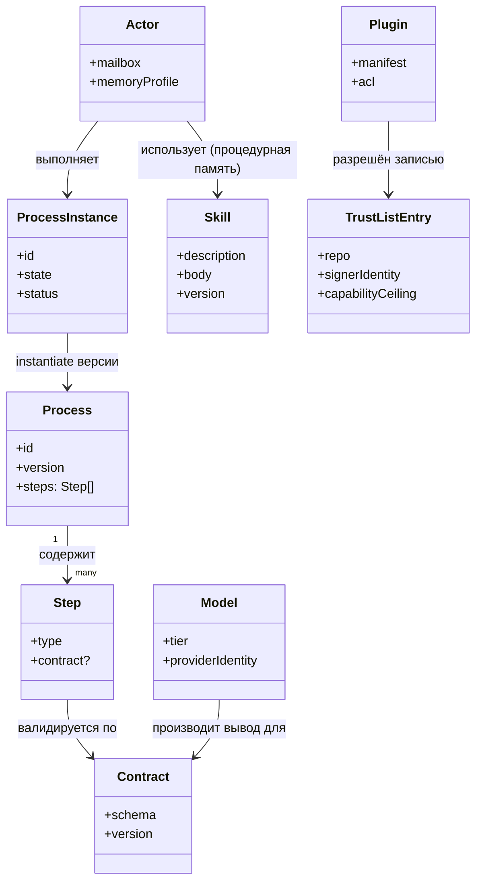

# Domain Glossary — единый словарь понятий

> Ubiquitous language: фиксирует, чтобы разные части системы не называли одно и то же по-разному и не путали похожие термины (например «шаг» и «действие», «навык» и «плагин»).

## 1. Диаграмма ключевых сущностей

## 2. Словарь терминов

| Термин | Значение | Не путать с |
|---|---|---|
| **Процесс (Process)** | Версионированный декларативный граф шагов | Инстанс процесса — конкретный запущенный прогон |
| **Инстанс процесса** | Одно исполнение процесса с собственным состоянием, привязанное к версии графа (ADR-0012) | Актор — может выполнять много инстансов последовательно |
| **Шаг (Step)** | Один узел графа с типом (`tool`/`llm_structured`/`codeact`/…) | Действие модели внутри свободного цикла (`agent_step`) |
| **Патч** | Декларативное описание изменения состояния, возвращаемое шагом | Событие — запись патча в журнал |
| **Событие (Event)** | Неизменяемая запись в журнале; свёртка событий = состояние | Снапшот — материализованный кэш свёртки на момент времени |
| **Контракт (Contract)** | Схема данных для вывода модели, версионируется вместе с шагом | Манифест плагина — про доступы, не про формат данных |
| **Mediation** | Единая точка `parse → schema → policy → commit` между выводом модели и состоянием | Capability — проверяет допустимость действия, не форму данных |
| **Capability** | Слой deny-статики, jail, сетевого гейта и подтверждений | Mediation — про данные; Capability — про действия |
| **Актор (Actor)** | Процессная модель + своя память (профиль) + почтовый ящик | Модель (Model) — исполнитель внутри шага актора, не сам актор |
| **Навык (Skill)** | Документ процедурной памяти — переиспользуемая процедура | Плагин — исполняемый код с доступом к внешним системам; навык — только описание/инструкция |
| **Плагин (Plugin)** | Изолированный процесс-коннектор с манифестом ACL | Исполнитель (Executor) — часть ядра, не внешний процесс |
| **Класс модели (Tier)** | Поле реестра, определяющее допуск к исполнителям и бюджет контекста | Провайдер — конкретный источник инференса; один tier может включать несколько провайдеров |
| **Доверенный список (Trust list)** | Локальный журналируемый список разрешённых источников обновлений/плагинов | ACL плагина — про права уже установленного плагина, не про то, откуда его можно ставить |
| **human_gate** | Обязательный тип шага, останавливающий процесс до подтверждения человека | Режим подтверждений (`smart`/`manual`) — общая политика, `human_gate` — конкретная точка остановки в графе |

## 3. Связанные документы

Все документы `arch/*.md` используют эти термины единообразно; это единственный документ, фиксирующий словарь централизованно.
