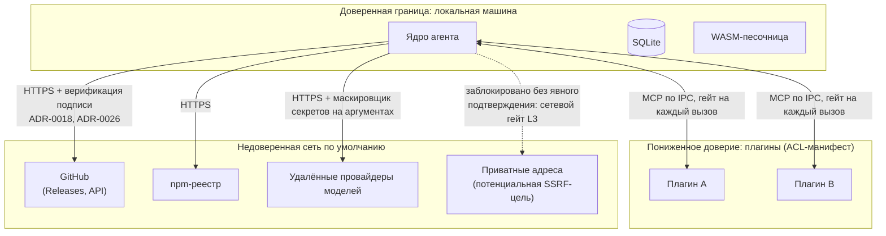

# Архитектура сетевых взаимодействий

> См. `security-model.md` §1–2, `deployment.md`, `stack.md` §6.

## 1. Топология и границы доверия

## 2. Протоколы и порты

| Канал | Протокол | Инициатор | Что передаётся | Граница доверия |
|---|---|---|---|---|
| Ядро ↔ плагин | MCP поверх локального IPC (stdio/сокет) | оба направления (двунаправленный протокол) | вызовы инструментов, ресурсы, шаблоны | пониженное доверие, ACL-манифест на каждый вызов |
| Ядро → GitHub | HTTPS (Releases API, скачивание артефактов) | ядро/bootstrap | платформенные бинарники, подписи, релизы плагинов | недоверенная сеть; артефакт не исполняется до верификации подписи |
| Ядро → npm-реестр | HTTPS | bootstrap | сам bootstrap-пакет, dist-tag канала | недоверенная сеть |
| Ядро → удалённые провайдеры моделей | HTTPS | Model Pool | запрос/ответ инференса | недоверенная сеть; аргументы и вывод проходят маскировщик (L5) до и после |
| Ядро → приватные адреса | любой | инструмент внутри шага | — | заблокировано по умолчанию; проходит только через подтверждение (сетевой гейт L3, защита от SSRF) |
| CI → сервис подписи | HTTPS + OIDC | CI | keyless-подпись артефакта | доверие к идентичности workflow, не к файлу ключа (ADR-0026) |

## 3. Правила гейта

- Любой сетевой вызов из CodeAct-песочницы возможен только через host-функцию (стаб инструмента) — прямых сетевых примитивов внутри WASM нет (структурная изоляция, ADR-0022).
- Приватные диапазоны адресов — только через подтверждение независимо от режима (`deny`/`smart`/`manual`), см. `security-model.md` §3.
- Плагин не может открыть сетевое соединение за пределами того, что заявлено в его манифесте и одобрено при установке (ADR-0014, ADR-0018).

## 4. Связанные документы

`security-model.md` §1–2, §4; `deployment.md` §4, §9; `stack.md` §6; ADR-0014, ADR-0018, ADR-0022, ADR-0023, ADR-0026.
