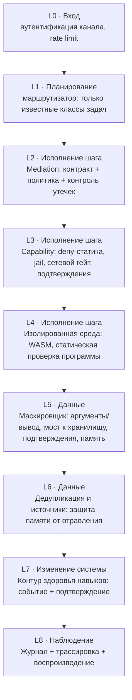
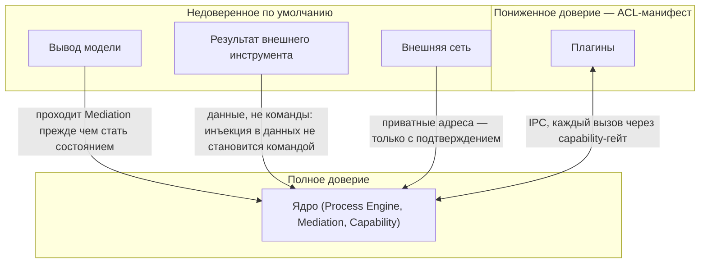

# Security View — эшелоны защиты и границы доверия

> Визуальное дополнение к `security-model.md` — те же слои и угрозы, но как картинка, поскольку эшелонированность (L0–L8) пространственное свойство, которое таблица передаёт хуже диаграммы.

## 1. Эшелонированная оборона (L0–L8)

## 2. Границы доверия по акторам системы

## 3. Отображение угроз на слои (сокращённая версия `security-model.md` §1)

| Угроза | Слой(и) | Механизм |
|---|---|---|
| Деструктивная команда | L3 | безусловный статический запрет (I6), не отменяется подтверждением |
| SSRF | L3 | сетевой гейт: приватные цели — только через подтверждение |
| Внедрение инструкций | L2, L4 | закрытые схемы, аргументы только из валидированных объектов, данные инструмента изолированы от команд |
| Утечка секретов | L5 | маскировщик на всех границах, модель видит только алиасы |
| Отравление памяти | L6 | дедупликация, обязательный источник, пониженный вес ненадёжных источников |
| Имперсонация компонента | граница reduced (плагины) | ACL манифеста — статический файл, плагин не может его переопределить |
| Эмерджентные циклы координации | L1 (диспетчер) | лимиты движка, правила диспетчера, аварийная заморозка |
| Тихая деградация модели | L2 (телеметрия Mediation) | доля отказов валидации как постоянная метрика → см. `state-view.md` §4 |
| Молчаливая мутация системы | L7 | событие + подтверждение на любое изменение навыка/конфигурации |

## 4. Связанные документы

`security-model.md`; `mediation.md` §4.2 (контроль утечек); ADR-0006, ADR-0007, ADR-0008.
