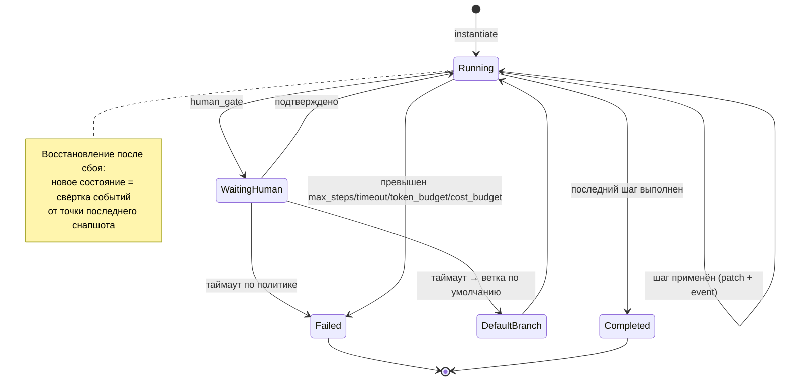
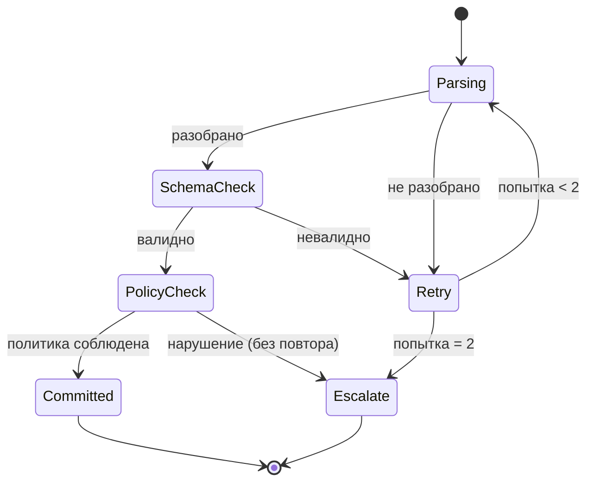
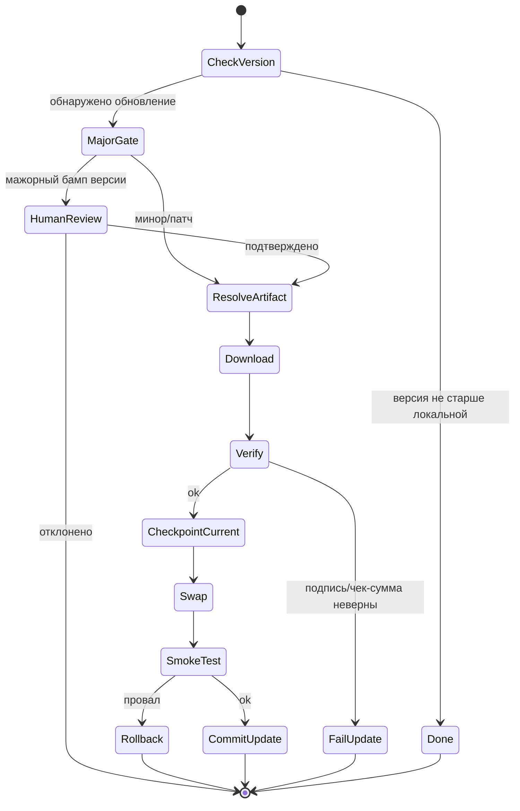
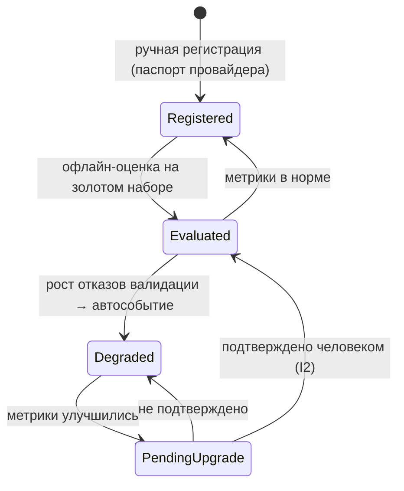

# State View — жизненные циклы ключевых сущностей

> См. `process-engine.md` §4–5, `deployment.md` §5, `ideal-agent-architecture.md` §3.10.

## 1. Инстанс процесса

## 2. Шаг с моделью (Mediation)

## 3. Само-обновление (см. также `runtime-view.md` §4)

## 4. Класс модели в реестре Model Pool

## 5. Связанные документы

`process-engine.md` §4–5; `mediation.md` §2, §5; `deployment.md` §5; `ideal-agent-architecture.md` §3.10; ADR-0010, ADR-0011, ADR-0012, ADR-0019.
