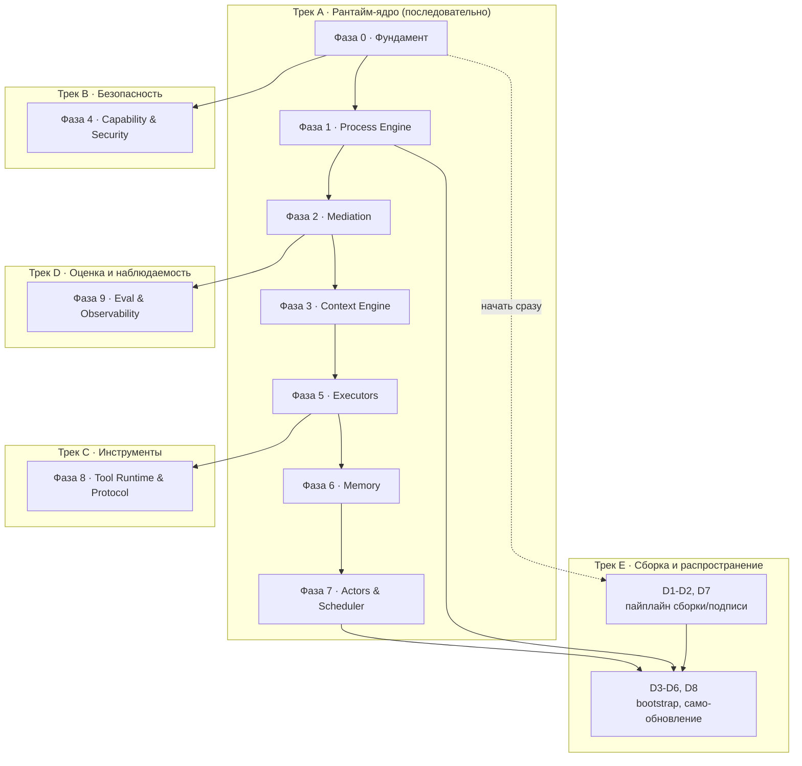

# Roadmap — очередь разработки, декомпозиция, распределение по классам моделей

> Источник — все документы `arch/*.md`, `arch/views/*.md`, `ADR/*.md`. Ничего нового не проектируется — здесь архитектура превращается в исполняемую очередь задач.

## 1. Методология

**Фазы** — не календарные спринты, а слои зависимостей: фаза N не может начаться раньше, чем готовы её входы из фаз, от которых она зависит (граф — в §2). Внутри фазы порядок подзадач необязательно строгий, если явно не указана внутренняя зависимость.

**Сложность подзадачи:**

| Метка | Критерий |
|---|---|
| **S** (простая) | Механическая работа по чёткой спецификации; есть с чем свериться (пример в контракте/документе), минимум развилок |
| **M** (средняя) | Несколько связанных решений о структуре кода внутри одного компонента, есть неочевидные edge case'ы |
| **L** (высокая) | Межкомпонентные инварианты, конкурентность, влияет на инварианты I1–I8; тонкая ошибка ломает архитектурное свойство |
| **XL** (критическая) | Граница доверия/безопасности, sandboxing, криптографическая верификация — «почти правильно» здесь равно «неправильно» |

**Класс модели** — та же шкала, что и в `ADR-0010`/`ADR-0011` для Model Pool самой системы: слабый / средний / сильный.

| Класс | Для какой сложности | Почему |
|---|---|---|
| **Слабый** (локальный/дешёвый) | S | Корректность легко проверяется тестом, не требует удержания архитектурного контекста нескольких файлов сразу |
| **Средний** | M | Нужно одновременно держать в контексте несколько контрактов/файлов и делать согласованный выбор между ними |
| **Сильный** | L, XL | Тесты одни не гарантируют защиту — нужно суждение о обходах (jail, sandbox), гонках, симметричности крипто-проверки |

**Обязательное правило:** любая подзадача сложности **XL** — сильный класс **и** обязательное независимое ревью (второй сильный прогон или человек), не полагаться на один проход генерации, независимо от того, насколько сильна модель, которая её написала.

## 2. Граф зависимостей фаз и параллельные треки

Треки B, D и начало трека E можно вести параллельно основному треку A с момента, когда открыты их стрелки-входы — не дожидаясь полного завершения трека A.

## 3. Milestone 0 — тонкий сквозной срез

Прежде чем углубляться в глубину каждой фазы, стоит собрать одну тривиальную задачу целиком end-to-end — это ловит нестыковки интеграции между компонентами раньше, чем инвестиции в полноту каждого из них по отдельности. Milestone 0 — не отдельная фаза с новыми подзадачами, а минимальный подмножество уже перечисленных ниже, достаточное для одного реального прогона.

**Состав среза:** F1, F2, F3 (фундамент, без F4/F5) → P1, P2, P3 в минимальном варианте — без P5 (конкурентность), P6 (часть лимитов достаточно `max_steps`), P8 (версионирование можно отложить) → M1, M2, M3, M5 в минимальном варианте — без M4 (policy можно ограничить проверкой типов) и без ADR-0011-совместимых повторов (M6) → E1 (только `ToolOnly`, без моделей).

**Цель среза:** прогнать `fixtures/golden/processes/card-delivery-support.yaml` от `fetch_card_status` (шаг `tool`) до записи патча в состояние и события в журнал — без единого обращения к модели. Это проверяет самый нижний слой интеграции (Process Engine ↔ Mediation ↔ Tool Runtime ↔ Storage), не касаясь ещё Model Pool, Capability в полном объёме или CodeAct.

**Определение готовности среза:** `cargo test -p berimor-process-engine` прогоняет один сценарий на этой фикстуре, инстанс проходит `tool`-шаг, патч применяется, событие `step.applied` попадает в журнал, повторный `recover()` по журналу восстанавливает то же состояние (свойство из `process-engine.md` §7).

## 4. Фаза 0 — Фундамент

Цель: примитивы, без которых ничего дальше не имеет смысла писать. Ничего не зависит от предыдущей фазы — это вход в граф.

| ID | Задача | Сложность | Класс | Зависит от | Источник |
|---|---|---|---|---|---|
| F1 | Событийный журнал: таблицы `events`/`snapshots` в SQLite, WAL, append-only запись | M | Средний | — | `arch/stack.md` §3, ADR-0021 |
| F2 | Иммутабельное состояние: тип патча, атомарное применение, свёртка событий → состояние | L | Сильный | F1 | `arch/process-engine.md` §3 |
| F3 | Скелет бинарника: CLI, загрузка конфигурации, точка входа | S | Слабый | — | `arch/stack.md` §2 |
| F4 | Тип-обёртка секрета (без утечки через Display/Debug) + точка маскировки на границе | L | Сильный | F3 | `arch/security-model.md` §2 (L5) |
| F5 | Capability-скелет: канонизация путей (jail), таблица deny-статики, примитив сетевого гейта | XL | Сильный | F3 | `arch/security-model.md` §2 (L3), ADR-0007 |

## 5. Фаза 1 — Process Engine — ВЫПОЛНЕНО

Цель: детерминированный остов, исполняющий граф шагов без единого обращения к модели. Все восемь задач реализованы. P5 (XL) прошло обязательное независимое ревью (ROADMAP §16 п.3, чистый контекст) — критических и важных находок нет, один minor (recover() не учитывает `ParallelStepApplied` при восстановлении `current_step` — не искажает финальное состояние, тратит один лишний шаг `max_steps` на резюме; задокументировано в коде, не чинится отдельно).

Осознанно вне scope всех восьми задач: тип шага `loop` объявлен (P2), но не исполняется — «нет поля цели повтора, открытый вопрос архитектуры» (`graph.rs`), ни один ADR его не разрешает; не выдумано здесь. `token_budget`/`cost_budget` (часть P6) не принуждаются
движком — `StepExecutor::execute` возвращает только `Patch`, ни токены,
ни стоимость, а провайдеры Model Pool (E3/E5) их не считают нигде в
системе. Принуждение этих двух прерывателей потребовало бы сначала
завести отчётность об использовании (новое поле в `Patch`/трейте или
отдельный канал) — самостоятельная задача, не выдуманная здесь заранее.
`max_steps`/`timeout` — реальные прерыватели цикла `engine::run`
(`Instant`, эфемерный на вызов, тот же охват, что `steps_this_run`).
`latency_budget` — не прерыватель цикла, а SLA отбора провайдера на
каждом шаге (ADR-0011); проброшен из `ProcessLimits` в `CliExecutor`.

| ID | Задача | Сложность | Класс | Зависит от | Источник |
|---|---|---|---|---|---|
| P1 | ✅ Парсер декларативного описания процесса (граф + хэш версии) | M | Средний | F1 | `arch/process-engine.md` §2 |
| P2 | ✅ Типы шагов без модели: `sequential`/`parallel`/`loop`/`branch`/`checkpoint` | M | Средний | P1 | `arch/process-engine.md` §2 |
| P3 | ✅ Цикл исполнения движка (instantiate/next/apply/emit) + снапшот при мутации | L | Сильный | P1, P2, F2 | `arch/process-engine.md` §4 |
| P4 | ✅ Восстановление после сбоя (replay) + property-тест «свёртка журнала = состояние» | L | Сильный | P3 | `arch/process-engine.md` §7 |
| P5 | ✅ Конкурентность: один писатель на инстанс, неймспейсы parallel-шагов, join-барьер | XL | Сильный | P3 | `arch/process-engine.md` §4 |
| P6 | ✅ Детерминированные прерыватели: `max_steps`/`timeout` (движок), `latency_budget` (SLA отбора провайдера, ADR-0011) | M | Средний | P3 | `arch/process-engine.md` §4, ADR-0011 |
| P7 | ✅ Шаг `human_gate` + политика таймаута эскалации | M | Средний | P3 | `arch/process-engine.md` §5 |
| P8 | ✅ Привязка версии к инстансу + операция `migrate_version` | L | Сильный | P3, P4 | `arch/process-engine.md` §2, ADR-0012 |

## 6. Фаза 2 — Mediation

Цель: единственная точка, где вывод модели становится состоянием.

| ID | Задача | Сложность | Класс | Зависит от | Источник |
|---|---|---|---|---|---|
| M1 | Система типов контрактов: derive-схема, запрет неизвестных полей | M | Средний | F3 | `arch/mediation.md` §3 |
| M2 | Стадия `parse` (толерантность к markdown-обёрткам, без эвристик смысла) | S | Слабый | M1 | `arch/mediation.md` §4.1 |
| M3 | Стадия `schema` (типы, обязательность, перечисления, диапазоны, длины) | M | Средний | M1, M2 | `arch/mediation.md` §4.2 |
| M4 | Стадия `policy`: межполевые правила, ссылки на состояние, контроль утечек | L | Сильный | M3, F4 | `arch/mediation.md` §4.3 |
| M5 | Стадия `commit`: разделение патч / аргументы инструмента / публикуемые поля | M | Средний | M4 | `arch/mediation.md` §4.4 |
| M6 | Логика повтора (до 2) и детерминированной эскалации в `human_gate` | M | Средний | M2–M5, P7 | `arch/mediation.md` §5 |
| M7 | Телеметрия отказов (события + доля отказов по процессу/шагу/модели/версии контракта) | S | Слабый | M2–M6 | `arch/mediation.md` §6 |

## 7. Фаза 3 — Context Engine

| ID | Задача | Сложность | Класс | Зависит от | Источник |
|---|---|---|---|---|---|
| C1 | Маршрутизатор: класс задачи → набор слоёв контекста (код-правила) | S | Слабый | P1 | `ideal-agent-architecture.md` §3.5 |
| C2 | Сборщик: фиксированный порядок слоёв | S | Слабый | C1 | `ideal-agent-architecture.md` §3.5 |
| C3 | Оценщик бюджета по классу модели | M | Средний | C1, C2 | `ideal-agent-architecture.md` §3.5, ADR-0010 |

## 8. Фаза 4 — Capability & Security (Трек B, параллельно с Фазой 1+)

| ID | Задача | Сложность | Класс | Зависит от | Источник |
|---|---|---|---|---|---|
| S1 | Анализатор deny-статики: таблица правил по запрещённым классам операций | XL | Сильный | F5 | `arch/security-model.md` §2 (L3) |
| S2 | Jail файловой системы: канонизация путей, защита от symlink-обхода | XL | Сильный | F5 | `arch/security-model.md` §1 |
| S3 | Сетевой гейт: блок-лист приватных адресов на границе HTTP-клиента | L | Сильный | F5 | `arch/views/network-architecture.md` §3 |
| S4 | Режимы подтверждений (`deny`/`smart`/`manual`/`off`) + декларация на инструмент | M | Средний | S1 | `arch/security-model.md` §3 |
| S5 | Интеграция маскировщика на всех 4 границах данных | L | Сильный | F4, M4 | `arch/mediation.md` §4.3 |
| S6 | ✅ Схема ACL-манифеста плагина + статическое применение | L | Сильный | S1 | `arch/security-model.md` §4, ADR-0014 |

## 9. Фаза 5 — Executors

| ID | Задача | Сложность | Класс | Зависит от | Источник |
|---|---|---|---|---|---|
| E1 | `ToolOnly`: резолвинг аргументов из состояния (шаблоны) + диспетч вызова | S | Слабый | P3, S1–S4 | `arch/executors.md` §2 |
| E2 | `StructuredLLM`: сборка подсказки из контракта + пример + срез контекста | M | Средний | M1–M7, C1–C3 | `arch/executors.md` §3 |
| E3 | Model Pool: реестр, поле класса, селектор (локальный → стоимость → фиксированный порядок) | L | Сильный | F3 | ADR-0010, ADR-0011 |
| E4 | Встраивание llama.cpp (локальный инференс, GGUF) | L | Сильный | E3 | `arch/stack.md` §5, ADR-0024 |
| E5 | HTTP-клиент удалённых провайдеров за общим интерфейсом | M | Средний | E3, S5 | `arch/stack.md` §5 |
| E6 | Встраивание Wasmtime: хост, host-функции как стабы инструментов | XL | Сильный | S1–S4, F5 | `arch/executors.md` §4.2, ADR-0022 — ✅ |
| E7 | Статический анализ сгенерированной программы (белый список идентификаторов) | L | Сильный | E6 | `arch/executors.md` §4.2 — ✅ |
| E8 | Лимиты песочницы (топливо/память/число вызовов) + результат → Mediation | L | Сильный | E6, E7, M1–M7 | `arch/executors.md` §4.2 — ✅ |
| E9 | `AgentStep`: свободный цикл, стратегии самокритики/«предложи-выполни-проверь», лимиты | L | Сильный | M1–M7, S4 | `arch/executors.md` §5 — ✅ |

E9 — ✅ выполнено (`berimor-executors::agent_step`), подключено в `berimor run`/`berimor eval`. Цикл «рассуждение → действие → наблюдение»: ход — `AgentTurnDecision` (`berimor-mediation::contracts`, фиксированная форма, не по реестру); `Tool`-действие — через тот же `tool_only::dispatch_confirmed`, что и `ToolOnly` (capability-гейт/подтверждение не обходятся); сбой самого инструмента восстановим (наблюдение, цикл продолжается), отказ capability-слоя — терминален. `self_critique`/`verify_actions` — опциональные стратегии из документа, `max_turns` — единственный реально принуждаемый лимит (бюджет токенов честно не enforced — учёта токенов у `ModelProvider` нет нигде в системе, тот же класс пробела, что `ProcessLimits.token_budget`, P6). Прошло обязательное независимое ревью (2 major фикса: сбой диспетча теперь восстановим, а не терминален; отсутствие ограничения набора инструментов для шага задокументировано как осознанный пробел).

E6 — ✅ выполнено (`berimor-executors::codeact::WasmHost`). Встраивание Wasmtime как хоста: компиляция/инстанцирование гостевого WASM-модуля, вызов его экспортированной точки входа, единственная зарегистрированная host-функция `call_tool` — проведена через тот же `tool_only::dispatch_confirmed`, что `ToolOnly`/`AgentStep` (capability-гейт не обходится). WASI не подключается вообще (`Linker` не регистрирует ничего, кроме `call_tool`) — гость, попытавшийся импортировать что-то ещё, не слинкуется; это структурное доказательство отсутствия ambient-доступа к ОС/сети, не список запретов. ABI хост↔гость (фиксированные смещения в памяти гостя под вход/выход) — рукописный протокол этой задачи, не финальный провод CodeAct; тестовые гостевые модули — WAT-текст, без нового target-тулчейна в CI. Осознанно НЕ входит: статический анализ программы и сам JS-движок (E7), топливные/памятные лимиты и проводка результата через Mediation в `Patch` (E8) — `StepKind::CodeAct` поэтому не подключён к `CliExecutor`, подключать пока нечего целиком. Прошло обязательное независимое ревью (2 major фикса: `read_guest_utf8` аллоцировал буфер под заявленную гостем длину ДО bounds-check против реального размера его памяти — host-side вектор исчерпания памяти, теперь `ptr+len` проверяется до аллокации; сентинел `-1`, отличающий порчу указателя от легитимного `{"ok":false,...}`, не был покрыт тестами — добавлено 2 теста; плюс minor уточнение doc-комментария и nit по точности варианта ошибки).

E7 — ✅ выполнено (`berimor-executors::codeact::static_analysis`). Белый список идентификаторов над ТЕКСТОМ JS-программы, до компиляции: свободные (несвязанные локальным объявлением) идентификаторы обязаны входить в объединение фиксированного набора безопасных intrinsics (`JSON`, `Math`, `Array`, ...) и переданных вызывающим кодом имён стабов инструментов для конкретного шага — иначе отказ; `eval`/`Function`/сетевые глобальные объекты отклоняются РОВНО ПОТОМУ, что их нет в списке, не отдельной проверкой по имени. Разбор — через реальный JS-парсер (`oxc_parser`), не регулярные выражения: AST различает позицию использования идентификатора от имени свойства при невычисляемом доступе. Динамический `import(...)` отклоняется отдельно как синтаксическая конструкция. Связывание объявленных имён с использованиями — одним проходом по всей программе без блочной точности области видимости (сознательное упрощение: неточность работает только в консервативном направлении). Явно НЕ первая и не единственная линия обороны (ADR-0022: «защита от шума») — `globalThis.eval(...)`, вычисляемый доступ к свойствам с собранным во время исполнения именем и подобные обфускации не гарантированно ловятся; закрывающий барьер — структурная изоляция E6.

**Уточнение при закрытии E8**: изначальная реализация E7 проверяла только СВОБОДНЫЕ ИДЕНТИФИКАТОРЫ — но единственный способ вызвать стаб инструмента в реальном гостевом рантайме (E8, `codeact-guest`) — `call_tool('имя', args)`, где имя передаётся строковым ЛИТЕРАЛОМ, не идентификатором; такие литералы `visit_identifier_reference` не видит по построению AST. Без отдельной проверки белый список `tools`, переданный вызывающим кодом, не давал бы НИКАКОГО реального ограничения на то, какой инструмент программа может вызвать через `call_tool` (обнаружено при написании теста уровня `CodeActExecutor` в рамках закрытия E8, не независимым ревью — задокументировано здесь, а не молча исправлено). Добавлена отдельная проверка в `ReferenceChecker::visit_expression`: `call_tool('литерал', ...)` — имя-литерал обязано входить в `allowed_names`, иначе `DisallowedToolName`. Вычисляемое имя (`call_tool(x, ...)`) по-прежнему не проверяется статически — тот же класс честного пробела, что обфускации выше.

E8 — ✅ выполнено (`berimor-executors::codeact::{wasm_host, executor}`, гость `codeact-guest/`) — закрывает пробел, оставленный E6/E7: встроен реальный JS-движок (QuickJS через `rquickjs`, гостевой crate вне основного workspace — компилирует C-исходники под `wasm32-wasip1`, автоматически качая `wasi-sdk`; собранный `.wasm` коммитится как `assets/codeact-guest.wasm`, `codeact-guest/README.md` — как пересобрать), три лимита песочницы (`WasmLimits`: `fuel` — метрика топлива `wasmtime`, ADR-0022; `memory_bytes` — `wasmtime::StoreLimits`; `max_tool_calls` — счётчик в `HostState`, исчерпание не трапит, а возвращает программе обычный отказ `{"ok":false,...}` тем же каналом, что и отказ capability-гейта — грациозная деградация, не жёсткий обрыв), и `CodeActExecutor` — полный исполнитель (промпт → модель → JS-текст → `static_analysis::analyze` → `WasmHost::run` → Mediation результата против контракта шага, повтор новым промптом при отказе любого барьера). `StepKind::CodeAct` подключён к `CliExecutor` — `codeact`-шаг реально работает из `berimor run`.

ABI хост↔гость пересмотрен целиком относительно того, что было в E6/E7 (WASI stdin/stdout вместо пользовательских смещений линейной памяти — тот пересмотр был явно предусмотрен как провизорный). WASI подключается (пересмотр решения E6 «WASI не подключается вообще» — гостю на `rquickjs`/wasi-libc нужен минимум окружения) с ПУСТЫМ `WasiCtx` — без `inherit_stdio`/`inherit_env`, без `preopened_dir`, без сети — deny-by-default, та же гарантия «нет ambient-доступа», другой механизм.

Осознанно НЕ входит: допуск по классам моделей (`executors.md` §4.3) реализован ЧАСТИЧНО — лимиты масштабируются по факту отобранного тира (`WasmLimits::strong()`/`reduced()`), но «слабый — только с явным разрешением в процессе» не проверяется (в системе нет понятия такого разрешения ни для одного шага). Модель узнаёт только ИМЕНА стабов инструментов (`StepKind::CodeAct.tools`), не их JSON-схемы — в системе нет реестра схем инструментов. Прошло обязательное независимое ревью (0 critical/major; 2 minor исправлены: устаревшая строка «E8 не начато», противоречившая абзацу выше в том же коммите; отсутствие теста на отказ capability-гейта на уровне `CodeActExecutor`, не только `WasmHost`).

## 10. Фаза 6 — Memory — ВЫПОЛНЕНО

Все восемь задач реализованы и запушены (`crates/berimor-memory`,
`crates/berimor-storage`, `crates/berimor-mediation`), подтверждены
зелёным CI на Linux/macOS/Windows. MEM7 (XL) прошло обязательное
независимое ревью (ROADMAP §16 п.3) с чистым контекстом — найдено
1 critical + 4 major + 6 minor, критичное и важное исправлено с
регрессионными тестами, minor задокументированы как осознанные
ограничения. 301 тест в воркспейсе на момент закрытия фазы.

| ID | Задача | Сложность | Класс | Зависит от | Источник |
|---|---|---|---|---|---|
| MEM1 | ✅ Рабочая память: сворачивание при переполнении бюджета, оригинал в эпизодической | M | Средний | M1–M7, F2 | `arch/memory-model.md` §4 |
| MEM2 | ✅ Эпизодическая память: индекс FTS5, поиск по сессиям | S | Слабый | F1 | `arch/memory-model.md` §1 |
| MEM3 | ✅ Семантическая память: контракт «предложение факта» + дедупликация | L | Сильный | M1–M7 | `arch/memory-model.md` §2, ADR-0005 |
| MEM4 | ✅ Интеграция `sqlite-vec`, гибридный поиск (вектор + полнотекст, фиксированные веса) | L | Сильный | MEM2, MEM3 | `arch/memory-model.md` §3 |
| MEM5 | ✅ Конфликт-события при противоречии фактов | M | Средний | MEM3 | `arch/memory-model.md` §2 |
| MEM6 | ✅ Процедурная память: формат файла навыка, описание всегда/тело по требованию | M | Средний | C1–C3 | `arch/memory-model.md` §1 |
| MEM7 | ✅ Граф сущностей: `nodes`/`edges`, entity resolution, типизированные контракты | XL | Сильный | MEM3, M1–M7 | `arch/memory-model.md` §4, ADR-0016 |
| MEM8 | ✅ Изоляция профилей (включая профиль типа `actor`), правило межпрофильного чтения | L | Сильный | MEM1–MEM7 | `arch/memory-model.md` §5, ADR-0013 |

Сознательно вне scope Фазы 6 (упомянуто в `memory-model.md`, но не
входит в формулировки задач MEM1–MEM8 — задокументировано в
doc-комментариях соответствующих модулей): персистентность графа
сущностей (MEM7 — только логика, как MEM3 до MEM4), маскировщик секретов
на записи в память и режим персональных данных (§5 — отдельный механизм
на границе записи, не изоляция профилей). Интеграция всего перечисленного
в реальный `berimor run` (вызов через Context Engine, слои Skills/Facts/
Session) — задача будущего Milestone, не этой фазы.

**Дополнение после закрытия фазы**: персистентность графа сущностей
(первый пункт выше) реализована в `berimor-storage` — `NodeRecord`/
`EdgeRecord`/`EntityGraphStore` (таблицы `nodes`/`edges` в `SCHEMA_SQL`),
тот же паттерн, что `FactRecord`/`SemanticStore` для MEM3→MEM4:
`entity_graph.rs` не изменён (логика по-прежнему работает над срезами
`&[StoredNode]`/`&[StoredEdge]`, персистентность — отдельный слой в
другой крейте, ADR-0021), профиль/тенант не хранится отдельным столбцом
(та же граница, что у `facts` — изоляция на уровне `profile.rs`, не
схемы). Композиционные тесты (`entity_graph::tests::
resolve_node_over_data_round_tripped_through_the_real_store_finds_exact_match`,
`detect_edge_conflict_over_data_round_tripped_through_the_real_store`)
показывают резолюцию/конфликты над данными, реально прошедшими через
`SqliteEventLog`, не только над сфабрикованными срезами — та же
дисциплина, что доказательство MEM3+MEM4 через `sqlite-vec` в
`semantic.rs`. Оставшиеся два пункта списка выше (маскировщик секретов
на записи, интеграция графа в реальный `berimor run`) остаются открытыми.

## 11. Фаза 7 — Actors & Scheduler — ВЫПОЛНЕНО

`crates/berimor-actors`, все шесть задач реализованы и запушены, 379
тестов в воркспейсе на момент закрытия фазы. A2 переиспользует
`berimor_capability::plugin::PluginManifest` (S6) как ACL шины событий —
единая ось ACL, не отдельный параллельный механизм (тот же приём, что
ADR-0013 у памяти актора). A4 реализована без нового вида состояния:
`TaskStatus::Escalated` диспетчера (A3) — это и есть остановка
`human_gate`; предел на диспетчере (`Dispatcher::with_human_gate_limit`)
не включён по умолчанию, вызывающий код включает его явно.

| ID | Задача | Сложность | Класс | Зависит от | Источник |
|---|---|---|---|---|---|
| A1 | ✅ Модель актора: задача tokio + почтовый ящик + привязка профиля памяти | L | Сильный | P3, MEM8 | ADR-0009 |
| A2 | ✅ Подпись конвертов (HMAC-SHA256, ключ хоста) + проверка ACL топика на шине событий | L | Сильный | A1, S6 | `arch/security-model.md` §4 |
| A3 | ✅ Диспетчер: доска задач, правила назначения, эскалация после N неудач | M | Средний | A1 | `ideal-agent-architecture.md` §3.8 |
| A4 | ✅ Лимит очереди `human_gate` (диспетчер) + статус `throttled` для расписаний (планировщик) | M | Средний | A3, P7 | `arch/process-engine.md` §5, ADR-0015 |
| A5 | ✅ Планировщик: персистентный min-heap времён срабатывания, защита от двойного тика | L | Сильный | A3 | `ideal-agent-architecture.md` §3.8 |
| A6 | ✅ Аварийная заморозка всех акторов | L | Сильный | A1 | `arch/security-model.md` §2, §4 |

## 12. Фаза 8 — Tool Runtime & Protocol (Трек C) — ВЫПОЛНЕНО

`crates/berimor-tool-runtime` на официальном Rust SDK MCP (`rmcp`), не
самодельном протоколе — ADR-0023 требует готовый стандарт, не изобретать
свой. T1/T2 — механизм (клиент/сервер), не конкретные встроенные
инструменты (терминал, файлы, VCS, ...) — их реализация не входит ни в
одну задачу этой фазы, список из `ideal-agent-architecture.md` §3.9 без
реализации, до отдельной будущей задачи. T3 переиспользует ACL-манифест
плагина из S6 (`berimor_capability::plugin::PluginManifest`) — та же ось
ACL, что и у A2 на шине событий, не отдельный параллельный механизм.

| ID | Задача | Сложность | Класс | Зависит от | Источник |
|---|---|---|---|---|---|
| T1 | ✅ MCP-клиент (потребление внешних серверов инструментов) | M | Средний | E1 | `arch/stack.md` §6, ADR-0023 |
| T2 | ✅ MCP-сервер (отдача собственного набора инструментов) | M | Средний | E1 | `arch/stack.md` §6, ADR-0023 |
| T3 | ✅ Изоляция плагина как процесса (T1) + применение ACL-манифеста (S6) | L | Сильный | T1, S6 | `ideal-agent-architecture.md` §3.9 |

## 13. Фаза 9 — Eval & Observability (Трек D, параллельно с Фазой 2+) — ВЫПОЛНЕНО

`crates/berimor-eval` — новый крейт (по одному на фазу, как Actors/
Tool Runtime), все четыре задачи реализованы. O1 — чтение журнала для
человека/отладки, не переиспользование `engine::recover` (тот
восстанавливает исполняемый `ProcessInstance` под граф процесса и
проверяет версию — другая цель, «продолжить выполнение», не
«посмотреть, что произошло»). O2–O4 — чистые функции от уже собранных
данных (сценариев/журналов/статистики использования); сбор самих данных
(итерация по хранилищу за пределами одного `EventLog::replay`,
подключение к реальному прогону CLI) — вне scope этой фазы, как и
интеграция Фаз 6–8.

| ID | Задача | Сложность | Класс | Зависит от | Источник |
|---|---|---|---|---|---|
| O1 | ✅ Инструмент трассировки/replay событий | S | Слабый | F1 | `ideal-agent-architecture.md` §3.11 |
| O2 | ✅ Стенд офлайн-оценки на золотых наборах (доля веток, доля отказов) | M | Средний | M7, P4 | `ideal-agent-architecture.md` §3.11 |
| O3 | ✅ Контур здоровья навыков: рост отказов + неиспользование → событие ревью | M | Средний | O2, MEM6 | `ideal-agent-architecture.md` §3.11 |
| O4 | ✅ Пайплайн онлайн-метрик (доля успеха задач, скорость подтверждений) | M | Средний | O2 | `ideal-agent-architecture.md` §3.11 |

## 14. Фаза 10 — Deployment & Distribution (Трек E)

| ID | Задача | Сложность | Класс | Зависит от | Источник |
|---|---|---|---|---|---|
| D1 | Матрица кросс-компиляции (cargo + cargo-zigbuild) | M | Средний | F3 | `arch/deployment.md` §7, ADR-0017 — ✅ |
| D2 | Пайплайн подписи (sigstore/cosign, keyless) | L | Сильный | D1 | `arch/deployment.md` §7, ADR-0026 — ✅ |
| D3 | Bootstrap-пакет (TypeScript): определение платформы, скачивание, атомарная распаковка | M | Средний | D1 | `arch/deployment.md` §2–3, ADR-0025 — ✅ |
| D4 | Процесс `agent-self-update` на примитивах Process Engine | L | Сильный | P1–P8, D2 | `arch/deployment.md` §5, ADR-0019 — ✅ |
| D5 | Формат и управление доверенным списком (событие + подтверждение) | M | Средний | P7, M6 | `arch/deployment.md` §4, ADR-0018 — ✅ |
| D6 | Процесс установки плагина | L | Сильный | D4, D5, S6, T3 | `arch/deployment.md` §6, ADR-0019 — ✅ |
| D7 | Провенанс (`npm publish --provenance`) + SBOM | S | Слабый | D2 | `arch/deployment.md` §7 — ✅ |
| D8 | Тесты внедрения сбоев для обновления (прерванная загрузка, неверная подпись, downgrade) | L | Сильный | D4 | `arch/deployment.md` §8 — ✅ |

D1 — ✅ выполнено (`.github/workflows/release.yml`). Кросс-платформенная сборка реализована НЕ через `cargo`+`cargo-zigbuild`, как изначально записано в этой строке и в `arch/stack.md` §9, а нативными GitHub Actions раннерами под каждую цель (`ubuntu-latest`, `ubuntu-24.04-arm`, `macos-latest`, `windows-latest`) — сознательное отклонение, задокументированное прямо в файле пайплайна: у `cargo-zigbuild` нет практической поддержки цели macOS без `osxcross` и извлечения Apple SDK, что юридически спорно для редистрибуции; нативный раннер закрывает ту же задачу (артефакт на каждую платформу) без этого обхода. `darwin-x64` временно исключён из матрицы (очередь раннера `macos-13` на практике зависает на десятки минут, не гипотеза). Триггер — `push` тега `v*` либо ручной `workflow_dispatch` (без тега — сборка без публикации, с тегом — доизготовление релиза под уже существующий тег). Публикация — одним атомарным шагом `gh release create` со всеми артефактами разом (переход от исходной схемы `release.published`→дозаливка ассетов вынужден: GitHub Immutable Releases возвращает HTTP 422 на попытку добавить ассет к уже опубликованному релизу — обнаружено на первом реальном прогоне на теге `v0.1.0`, не в теории). Пайплайн уже использован для релизов `v0.1.0`–`v0.6.0`.

D2 — ✅ выполнено (`.github/workflows/release.yml`, `crates/berimor-cli/src/verify.rs`). CI подписывает каждый платформенный архив keyless-подписью cosign (`cosign sign-blob --new-bundle-format --bundle`, OIDC-токен job'а `build`, `id-token: write` только на этой job — least-privilege) — заменяет прежний `sha256sum`, как и было изначально задумано в комментарии файла, не дополняет его. Отдельная job `canary` тем же workflow подписывает маленький текстовый файл — не входит в assets реального релиза, источник golden-фикстуры (`fixtures/golden/signing/`) и будущих тестов D8. Верификация — целиком в Rust (крейт `sigstore`, фичи `bundle`+`sigstore-trust-root`+`rustls-tls`, без `cosign`/`registry` — те тянут ненужный OCI-клиент): `berimor verify <artifact>` больше не заглушка. Политика верификации — три условия через `AllOf`: OIDC issuer = GitHub Actions, репозиторий = `devpilgrin/berimor`, и путь к workflow-файлу (`ReleaseWorkflowPath`, кастомная политика — префиксное сравнение SAN-идентичности сертификата БЕЗ суффикса `@<ref>`, так как ref варьируется между тегом релиза и `workflow_dispatch`) — якорь идентичности зашит константами для СВОЕГО репозитория, не общий доверенный список (тот — предмет D5, ещё не реализован). Доверенный корень TUF кэшируется на диске (`dirs::cache_dir()/berimor/sigstore`) между вызовами. Прошло обязательное независимое ревью (0 critical, 2 major — оба исправлены: (1) `Verifier::production()` крейта не кэшировала TUF-корень, каждый вызов заново тянул его по сети — заменено на ручную сборку `Verifier` с явным `cache_dir`; (2) проверка одного `GitHubWorkflowName` не отличала бы этот workflow-файл от гипотетического другого файла с тем же `name:` в репозитории — заменено на кастомную SAN-политику, пиннящую путь к файлу; 2 minor — не блокировали закрытие: неизбежные транзитивные `openidconnect`/`webbrowser` от фич крейта `sigstore` (мёртвый код в этом бинарнике, ограничение версии крейта), один `.expect()` на статически недостижимой панике). По ходу закрытия найден и исправлен независимый от ревью баг: `fixtures/golden/signing/RELEASE.txt` ломался при чекауте на Windows (`core.autocrlf` конвертирует LF→CRLF, меняя байты и дайджест) — исправлено `.gitattributes` (`fixtures/golden/signing/** -text`), обнаружено на реальном прогоне CI (Rust · windows-latest), не в теории.

D3 — ✅ выполнено (`bootstrap/src/{cache-dir,checksum,checksums-manifest,extract,download,index,verify}.ts`, `.github/workflows/release.yml`, `.github/workflows/ci.yml`). Столкнулись с циркулярностью, которой не было в исходной задаче: `verify.ts` (уже существовал) проверяет артефакт, вызывая подкоманду `berimor verify` уже скачанного нативного бинарника — на первой установке ещё нет доверенного бинарника, который мог бы проверить сам себя (поддельный бинарник соврёт на собственный `verify`). Решение — SHA-256 каждого платформенного архива пиннится не рядом с самим архивом (это ничего не даёт — компрометация аккаунта публикации GitHub Release скомпрометирует оба файла разом), а В САМ npm-пакет `bootstrap` на этапе публикации (новый шаг `publish` job в `release.yml`, до `gh release create`) — доверие первой установки приходит из независимого канала (npm), не из скачиваемого артефакта. `verify.ts` не тронут — он корректен и остаётся заделом для D4 (само-обновление: там уже есть предыдущий доверенный бинарник, который проверяет новый, — не циркулярно). Реализация — без единой новой npm-зависимости (`node:crypto`/`node:fs`/`fetch`/системные `tar`/`Expand-Archive`), атомарность распаковки — через временную директорию рядом с целевой и `rename` одной операцией. 21 тест (`node:test`, встроенный в Node ≥20), фикстурные архивы `fixtures/golden/bootstrap/{sample.tar.gz,sample.zip}`, шаг `npm test` добавлен в CI. Независимое ревью не назначалось (правило проекта — только для XL/security-critical; здесь новый изолированный TS-код класса M, доверенный список/подпись не затронуты — тот периметр уже прошёл ревью в D2).

**Честно принятый остаточный пункт, не блокирующий закрытие D3:** секрета `NPM_TOKEN` в репозитории нет — механизм публикации в `release.yml` написан и синтаксически проверен, но реально `npm publish` выполнится только после того, как пользователь сам заведёт секрет (Settings → Secrets → Actions); учётные данные публикации — не то, что я завожу самостоятельно. До этого момента шаг `publish bootstrap to npm` будет падать на реальном теге, сам GitHub Release при этом уже создан и не откатывается (шаг идёт раньше). Сквозная проверка «настоящий `npm install berimor` тянет настоящий пришпиленный SHA-256» возможна только после этого разового ручного шага и первого следующего тега.

D4 — ✅ выполнено (`crates/berimor-cli/src/self_update.rs`, `fixtures/golden/processes/agent-self-update.yaml`, `crates/berimor-cli/src/{main,run}.rs`). Иллюстративный YAML-пример в `arch/deployment.md` §5 не исполним буквально текущим движком Process Engine — три структурных отличия, обнаруженные при реализации, не теоретизирование: (1) `StepKind::Branch.on` — один путь состояния (`state_path::resolve`), не выражение сравнения двух путей между собой (`state.check_version.version > state.local.version` из документа не парсится никаким имеющимся синтаксисом `graph.rs::evaluate_branch`) — сравнение версий вынесено в сам tool `registry.get_latest` (крейт `semver`), граф проверяет уже готовые булевы `is_newer`/`is_major_bump`; (2) `"done"` не специальный сентинел таргета — `NextStep::Finished` наступает только когда для текущего шага нет следующего элемента в плоском списке `steps` (`graph.rs::next_step`), граф процесса физически спроектирован так, что ровно один общий терминальный шаг (`done`) — последний элемент массива, оба успешных пути (обновление не нужно / обновление закоммичено) сходятся в него; (3) `StepKind::Checkpoint` — аудит-снапшот состояния Process Engine (`storage.write_snapshot`), не резервная копия бинарного файла — бэкап/откат самого бинарника целиком внутри `fs.atomic_replace_binary`/`fs.restore_from_checkpoint` (переименование файла в сторону перед заменой = и бэкап, и подготовка отката одним действием), движок для этого не трогается. Восемь native tool-инструментов (`registry.get_latest`, `platform.resolve_asset`, `github.download_release_asset`, `crypto.verify_signature` — переиспользует `verify_artifact` из D2, `fs.atomic_replace_binary`, `agent.self_check`, `fs.restore_from_checkpoint`, `registry.record_version`) за отдельными `SelfUpdateDispatch`/`SelfUpdateExecutor`, изолированными от `run.rs::build_executor_bundle` — пользовательский `berimor run <любой.yaml>` физически не может вызвать замену исполняемого файла, просто назвав инструмент в своём YAML (подтверждено независимым ревью). Сознательное сужение: реализован только канал `stable` (`GET /repos/{}/releases/latest`) — `release.yml` сегодня не производит пререлизных тегов, схема для `beta`/`canary` не выдумывается заранее.

Прошло обязательное независимое ревью (2 critical, 1 major — все исправлены; 1 minor — рассмотрен и осознанно не применён): (1) CRITICAL — `agent.self_check` пробрасывал `Err`, если новый бинарник вообще не запускается (`Command::output()` вернул `Err`, не `Ok` с ненулевым кодом) — весь self-update процесс обрывался на шаге `smoke_test`, граф никогда не доходил до `smoke_gate`, откат не срабатывал для самого вероятного в реальности сценария поломки; исправлено — неудача запуска тоже `{"ok": false}`, решение остаётся за графом. (2) CRITICAL — окно между двумя `fs::rename` в `fs.atomic_replace_binary` (бэкап создан, новый бинарник ещё не подставлен): падение процесса именно здесь оставляет `current_exe` отсутствующим без следа в журнале Process Engine (шаг `swap` — с точки зрения движка одна неделимая операция, `StepApplied` пишется только после успешного возврата `dispatch.call()`) — полностью резюмируемым это окно не сделать без персистентного журнала вне Process Engine, что за рамками этой задачи; минимальный фикс — при отсутствии `current_exe` явно искать осиротевший бэкап по префиксу имени и называть его в сообщении, честно принятый остаточный пробел задокументирован в doc-комментарии `atomic_replace_binary`. (3) MAJOR — `is_major_bump` сравнивал только `major.major`, а проект сегодня на `0.6.0`: любой переход `0.x → 0.y` даёт `major == major == 0`, `major_gate` не спросил бы человека ни разу до `1.0.0` независимо от размера скачка — исправлено согласно SemVer §4 (initial development: minor-бамп в `0.x` семантически эквивалентен major). (4) MINOR — `fs.atomic_replace_binary`/`fs.restore_from_checkpoint` не помечены `external_effect: true` в capability-политике self-update — рассмотрено и осознанно НЕ применено: `external_effect` форсирует подтверждение в любом режиме, включая `Off`, что сломало бы предусмотренный документом сценарий автоматического обновления на изолированных профилях (`deployment.md` §10); текущий `mutates: true` уже даёт подтверждение в `Smart`/`Manual`, а `major_gate` — отдельная структурная гарантия для мажорных скачков независимо от режима.

**Честно принятые остаточные пробелы, не блокирующие закрытие D4:** (а) окно между двумя `fs::rename` в `atomic_replace_binary` — см. находку (2) выше, полное решение требует персистентного журнала вне текущей схемы Process Engine; (б) `resume_after_human_gate_timeout` (техдолг TD1.3/1.4) по-прежнему нигде не вызывается из `berimor-cli` в продакшен-цикле — `human_review`-шаг self-update тоже не защищён от зависшего таймера, только от явного отказа человека; (в) сквозной прогон против настоящего GitHub-релиза и настоящей подмены установленного бинарника в этой сессии не выполнялся — по явному решению пользователя тестирование ограничено фикстурными путями и локальным HTTP-сервером; реальная проверка — предмет будущего ручного прогона или ROADMAP D8 (полная матрица fault injection: прерванная загрузка, усечённый артефакт, подделанный доверенный список — сознательно не входит в D4, отдельная задача).

D5 — ✅ выполнено (`crates/berimor-types/src/event.rs` — `EventKind::TrustListChanged`/`TrustListAction`, `crates/berimor-capability/src/trust_list.rs`, `crates/berimor-cli/src/trust.rs`). Формат записи — дословно `deployment.md` §4 (`repo`/`allowed_ref`/`signer_identity`/`capability_ceiling`; `added_at`/`event_id` не дублируются отдельными полями — уже даёт `Event::ts_ms`/`Event::seq`). Ключевое архитектурное решение: `Event`/`EventLog` в проекте жёстко типизированы под `ProcessInstanceId` — отдельной глобальной KV-таблицы для сущности вне рамок одного process instance в схеме `berimor-storage` нет. Вместо новой таблицы доверенный список живёт в ТОМ ЖЕ журнале `events`, что и обычные процессы, под синтетическим зарезервированным `ProcessInstanceId("trust-list")` — буквальное прочтение «тот же KV-журнал, что и остальная память системы» из источника, не новая параллельная схема хранения. `fold_trust_list` — своя доменная свёртка (Added перезаписывает запись по `repo`, Removed удаляет), отдельная от `state::fold` (Process Engine эти события по-прежнему игнорирует, как `SecurityEvent`/`VersionMigrated`). `berimor trust {add,remove,list}` — `add`/`remove` показывают diff и требуют подтверждения ДО `storage.append` (I2), отказ ничего не пишет.

D6 — ✅ выполнено (`crates/berimor-cli/src/plugin_install.rs`, `fixtures/golden/processes/plugin-install.yaml`, `crates/berimor-cli/src/verify.rs` — параметризация). Та же архитектура, что D4: выделенные `PluginInstallDispatch`/`PluginInstallExecutor`, изолированные и от `run.rs::build_executor_bundle`, и от `SelfUpdateDispatch` — три непересекающихся периметра инструментов на весь CLI. `verify.rs` (D2) параметризован обратно совместимо: `verify_artifact_with_identity(path, repository, workflow_san_prefix)` — новая функция, старая `verify_artifact` — тонкая обёртка с прежними константами (5 существующих тестов D2 не изменились и не сломались). Циркулярность «первое доверие новому репозиторию» (у D5 нет способа узнать `signer_identity` заранее) решена через TOFU (`--signer-workflow`/`--capability-ceiling`/`--allowed-ref` — обязательны для репозитория, которого ещё нет в списке; для уже доверенного — игнорируются, используется существующая запись). Формат плагин-релиза — один архив (бинарник + `manifest.yaml` вместе, одна подпись) — проектное решение, источник рецепта не даёт. Успешная установка с нового репозитория дописывает `TrustListChanged::Added` в тот же журнал, что и `berimor trust add`.

D7 — ✅ выполнено (`.github/workflows/release.yml`). SBOM для Rust — `cargo-cyclonedx` (`cargo install --locked`, компиляция в CI — прецедента pinned-binary-install экшена в репозитории нет) в job `build`, файл переименовывается с `matrix.target` в имени. SBOM для bootstrap — встроенная `npm sbom --sbom-format cyclonedx` (npm ≥9, ноль новых зависимостей), генерируется ДО `gh release create` и кладётся в `release-assets/` — GitHub Immutable Releases не даёт дозалить ассет ПОСЛЕ создания релиза (тот же факт, что определил структуру D1). `npm publish --provenance` — тот же OIDC-механизм workflow-запуска, что уже использует cosign (D2), `id-token: write` добавлен в `permissions` job `publish`. По ходу работы найден и исправлен ПРЕДСУЩЕСТВУЮЩИЙ баг D3 (не новый регресс, обнаружен независимым ревью не был — найден при переработке этого же участка файла): `npm ci` в job `publish` запускался без `--ignore-scripts` на свежем чекауте, где `bootstrap/dist/` ещё не собран — `postinstall` упал бы на отсутствующем файле; исправлено в обоих вызовах `npm ci` этой job.

D8 — ✅ выполнено (`crates/berimor-cli/src/self_update.rs`, секция тестов `d8_*`; golden-тесты `plugin_install.rs` из D6). Честная граница, зафиксированная до написания тестов, не постфактум: полный happy path через `engine::run` (`swap`→`smoke_test`→`commit_update`→`done` для self-update; `install`→`done` для plugin-install) недостижим без настоящего sigstore-подписанного архива — `verify`/`crypto.verify_plugin_signature` делает реальную криптопроверку, подделать нечем локально. Реализовано то, что достижимо и было непокрыто: `major_gate`→`human_review` через `engine::run` (не требует verify — human_gate раньше по графу); механика `swap`→`self_check`→`rollback` сцеплена напрямую на уровне функций реальными shell-скриптами как «бинарниками» (unix-only, `cfg(unix)`, кросс-платформенная альтернатива потребовала бы скомпилированного `.exe`-фикстуры) — доказывает, что после реальной подстановки бинарника `self_check` видит именно его; строгий downgrade (`latest` СТРОГО ниже текущей, не равна) — `is_newer=false`, не ошибка.

Прошло обязательное независимое ревью (одно на весь проход D5–D8, доверие/ACL — максимальный класс риска проекта): 1 CRITICAL, 2 MAJOR, 2 MINOR — все исправлены. (1) CRITICAL — directory traversal в `plugin_install.rs::install_plugin`: `manifest.name` (полностью контролируется автором плагина, `load_manifest` его не валидирует) использовался в `plugins_root.join("installed").join(name)` без санитизации — `name = "../../../.ssh/authorized_keys"` или абсолютный путь уводит запись за пределы `plugins_root`; хуже того, `remove_dir_all` по уже «убежавшему» пути выполнялся ДО подмены — произвольное рекурсивное удаление, не только запись, воспроизведено PoC независимо от репозитория. Действует и для уже ДОВЕРЕННОГО репозитория (доверие удостоверяет подписанта CI, не содержимое манифеста). Исправлено — `validate_plugin_name` (белый список символов, запрет `..`/абсолютных путей) вызывается ДО любых файловых операций. (2) MAJOR — `allowed_ref` (документированная граница `deployment.md` §4) нигде не проверялся — `plugin install` ставил любой «latest» релиз независимо от паттерна, которым оператор ограничил репозиторий; исправлено — `matches_ref_pattern` (glob с `*`, без новой зависимости), проверка внутри `get_latest_release` до `download`. (3) MAJOR — TOFU-идентичность (`--signer-workflow`) принималась пустой строкой, что вырождает `ReleaseWorkflowPath::verify` (`"...".starts_with("")` истинно для любого SAN) в no-op — issuer/repository из `AllOf`-политики всё ещё пинят GitHub Actions OIDC и владельца/имя репозитория, так что не полный обход подписи, но реальное ослабление; исправлено — `is_plausible_signer_identity` (непустая, похожая на URL) в `check_trust` и в `berimor trust add`, отказ до показа diff/подтверждения. (4) MINOR — `--resume trust-list` мог дописывать self-update/plugin-install события в зарезервированный журнал доверенного списка (реального обхода ACL нет — `fold_trust_list` их игнорирует, но аудит-след переставал быть чистым) — исправлено явным отказом на границе CLI. (5) MINOR — `ceiling_review` не показывал, что именно манифест запрашивает сверх нормы — добавлено поле `exceeding_capability_ceiling` (разница множеств), включено в текст `human_gate`.

**Честно принятые остаточные пробелы, не блокирующие закрытие D5–D8:** (а) сквозной прогон против настоящего репозитория плагина и настоящей установки в этой сессии не выполнялся — тестирование ограничено фикстурами и локальным HTTP-сервером, тот же принцип, что и D3/D4; (б) `.github/workflows/release.yml` (D7) не может быть прогнан реально в этой сессии — только настоящий git-тег запускает workflow; `cargo-cyclonedx`/`npm sbom` синтаксически и логически проверены (порядок шагов, YAML-валидность), но не сквозным CI-прогоном; (в) `allowed_ref`-паттерн (`matches_ref_pattern`) — упрощённый `*`-glob, не полный semver-range (`v*.*.* без пререлизов` из `deployment.md` §4 буквально не отличает пререлизы от релизов — паттерн `*` совпадёт и с ними); полноценный semver-range matcher — отдельная будущая задача, если понадобится точнее; (г) `capability_ceiling`/`allowed_ref` полей после установки нет пути расширить БЕЗ повторной установки — `deployment.md`'s «отдельное подтверждение» для расширения ceiling существующей записи не реализовано как отдельная CLI-команда (`berimor trust add` на существующий `repo` перезаписывает запись целиком, тоже с подтверждением — функционально закрывает потребность, но не отдельным явно названным путём).

## 15. Definition of Done

Общее для всех подзадач условие закрытия — сначала оно, затем специфика фазы:

1. `cargo check --workspace` (и, где применимо, `npm run build` в `bootstrap/`) проходит без ошибок и без новых предупреждений.
2. Есть тест на фикстуре из `fixtures/golden/` — контрактный тест для подзадач Process Engine/Mediation/Memory, юнит-тест для остального; подзадача без теста не закрывается, независимо от сложности.
3. Doc-комментарий модуля ссылается на источник в `arch/*.md`/ADR — тот же, что указан в столбце «Источник» соответствующей фазы.
4. Подзадачи **XL** — дополнительно: пройдено независимое ревью (см. §1) до мержа, не после.

Специфика по фазам — какой сценарий из `arch/views/quality-attributes.md` должен быть демонстрируемым по завершении фазы:

| Фаза | Сценарий Definition of Done | Источник сценария |
|---|---|---|
| 0 · Фундамент | Секрет не проходит через `Debug`/`Display` ни при каких обстоятельствах (тест компиляции: обёртка не реализует утечку) | `quality-attributes.md`, строка «Безопасность (утечка)» |
| 1 · Process Engine | Fault injection: остановка между двумя шагами → `recover()` не теряет и не дублирует шаг | `quality-attributes.md`, строка «Отказоустойчивость» |
| 2 · Mediation | Контрактный тест на `fixtures/golden/malicious-inputs/*` — оба сценария отклонены на ожидаемой стадии | `mediation.md` §6 |
| 4 · Capability & Security | Deny-таблица блокирует весь перечень запрещённых операций из золотого набора безусловно | `quality-attributes.md`, строка «Безопасность (деструктив)» |
| 5 · Executors | CodeAct: попытка выйти за пределы белого списка идентификаторов отклоняется на статическом анализе, не долетает до Wasmtime | `quality-attributes.md`, строка «Латентность CodeAct» (соседняя гарантия структурной изоляции) |
| 6 · Memory | Два кандидата-факта с высокой близостью эмбеддинга не сливаются автоматически без точного совпадения идентификатора | ADR-0016, `quality-attributes.md` строка «Защита памяти от отравления» |
| 10 · Deployment | Fault injection: поддельная подпись артефакта → `fail_update`, текущая версия остаётся активной | `quality-attributes.md`, строка «Целостность цепочки поставок» |

## 16. Как этим пользоваться

1. Брать подзадачи в порядке фаз из графа §2; внутри фазы — по столбцу «Зависит от».
2. Столбец «Класс» — это модель, которой поручается *написание* этой конкретной подзадачи, а не то, какая модель будет использовать систему после сборки — два разных решения, использующие одну и ту же шкалу.
3. Подзадачи **XL** не закрываются одним прогоном: пишет сильный класс, принимает — независимое ревью (второй сильный прогон с чистым контекстом либо человек). Это относится к F5, S1, S2, E6, MEM7 — все они про границу доверия.
4. Треки B/C/D/E можно вести параллельно основному треку A, как только открыта их стрелка входа в графе §2 — не обязательно ждать, пока трек A закроется целиком.

## 17. Связанные документы

Полный список источников — `arch/README.md`, `ADR/README.md`, `arch/views/README.md`.

## 18. Milestone 1 — полноценный CLI

> Инструкция для агента, продолжающего разработку без контекста сессии,
> где написан этот раздел. Читать после §1–§3 (методология, граф,
> Milestone 0) — предполагается, что Milestone 0 уже закрыт: `cargo test
> --workspace` зелёный (124 теста на момент написания), `berimor-process-engine`
> и `berimor-mediation` реализованы целиком (F1–F3, P1–P3, M1–M7, E1).

### 18.1. Цель

`berimor run fixtures/golden/processes/card-delivery-support.yaml` реально
исполняет процесс от начала до конца через настоящий CLI-бинарник — не
через тест с `FakeExecutor`, как сейчас в `engine.rs`. Это включает хотя бы
один шаг с реальной моделью (`llm_structured`), проходящий через
Capability, а не только `tool`-шаг в обход неё.

### 18.2. Почему именно этот состав, не весь ROADMAP целиком

CLI не требует Memory (Фаза 6), Actors/Scheduler (Фаза 7), Tool Runtime/MCP
(Фаза 8), Eval (Фаза 9) или CodeAct/AgentStep (E6–E9) — все они про то,
чего нет в `card-delivery-support.yaml` вообще (граф сущностей, параллельные
акторы, внешние MCP-серверы, генерация кода). Тянуть их сейчас — работа
не в счёт цели этого milestone.

### 18.3. Порядок выполнения

Строго последовательно там, где указана зависимость; без пометки — можно
параллельно.

1. **S1–S4** (Фаза 4, `Capability & Security`) — deny-статика, jail,
   сетевой гейт, режимы подтверждений. Без этого `ToolOnly` (уже
   реализован в `berimor-executors::tool_only`) работает в обход
   `executors.md` §2 («перед вызовом — capability-слой») — сейчас так и
   есть, это осознанный пробел F1-текста в модуле, не забытый баг.
   S5 (маскировщик) и S6 (ACL плагинов) не нужны для этого milestone —
   плагинов и модели-с-утечками в сценарии нет.
2. **E5** (Фаза 5, HTTP-клиент удалённых провайдеров), НЕ E4
   (llama.cpp) — быстрее довести до работающего конца: один HTTP-вызов
   к внешнему провайдеру проще и надёжнее в CI/песочнице, чем
   встраивание локального инференса. E4 — отдельная задача после того,
   как E5 уже работает, не блокирует Milestone 1.
3. **E3** (Model Pool: реестр, поле класса, селектор) — до E5, селектор
   должен от чего-то выбирать.
4. **C1–C3** (Фаза 3, Context Engine) — в минимальном варианте: `build()`
   может для начала просто отдавать `state` целиком как единственный
   слой, без реального маршрутизатора по классу задачи. Полноценный
   Context Engine — не цель этого milestone, только то, что нужно E2
   для компиляции и для одного реального прогона.
5. **E2** (`StructuredLLM`) — первый исполнитель, реально вызывающий
   модель: подсказка из `Contract::json_schema()` (уже есть с M1) +
   срез контекста (C1–C3) → `Model Pool::select` (E3) →
   `ModelProvider::complete` (E5) → результат → `berimor_mediation::pipeline::mediate`
   (уже реализован целиком, M1–M7) → `Patch`.
6. **CLI1–CLI4** (новые задачи, ниже) — сборка всего вышеперечисленного
   в реальную команду `berimor run`.

### 18.4. Новые задачи: сборка в CLI

Их нет в фазах выше — там были только компоненты, сборка в CLI никогда не
была отдельной задачей ROADMAP. Все — в `crates/berimor-cli`.

| ID | Задача | Сложность | Класс | Зависит от |
|---|---|---|---|---|
| CLI1 | `berimor run <path>`: загрузка процесса (P1) → открытие `SqliteEventLog` по `config.storage_path` (F1/F3) → `instantiate` (P3) → `run()` с реальным `StepExecutor`, маршрутизирующим `Tool`→E1, `LlmStructured`→E2, остальное — понятная ошибка «не поддержано в Milestone 1» | L | Сильный | S1–S4, E2, P3 |
| CLI2 | Обработка `RunOutcome::AwaitingHuman` в CLI: напечатать `reason`, спросить подтверждение в терминале (да/нет), при «да» — вызвать `run()` повторно с тем же `ProcessInstance` | M | Средний | CLI1 |
| CLI3 | `berimor run --resume <instance-id>`: `recover()` (уже реализован, P3) от журнала, продолжить `run()` | M | Средний | CLI1 |
| CLI4 | End-to-end тест: реальный прогон `card-delivery-support.yaml` через `main()` (не через вызов функций напрямую, как в тестах `engine.rs`) — `assert_cmd` или эквивалент, с `E5`, направленным на локальный мок-сервер вместо реального провайдера (не тратить реальные токены/деньги в CI) | M | Средний | CLI1, CLI2, CLI3 |

### 18.5. Definition of Done Milestone 1 — ВЫПОЛНЕНО

Подтверждено реальным CI на всех трёх ОС (`gh run view 30545287702`,
коммит `673a0d1`), не только локальным прогоном:

- [x] `cargo test --workspace` зелёный, включая CLI4 (189 тестов).
- [x] `berimor run fixtures/golden/processes/card-delivery-support.yaml` с
  провайдером (в CLI4 — мок, локальный HTTP-сервер на `std::net`; с
  реальным провайдером — та же цепочка, конфигурация отличается только
  `base_url`/`api_key_env`) доходит до `Finished`, проходя через
  `classify` (E2) → `check_risk` (P2, ветвление) → `fetch_card_status`
  (E1, ToolOnly через Capability) → `answer` (E2). Тест:
  `crates/berimor-cli/tests/e2e_run.rs::full_run_through_finished_produces_expected_state`.
- [x] Прерывание процесса на `human_gate` и `berimor run --resume`
  восстанавливают то же состояние, что и непрерывный прогон того же
  сценария — доказано через реальный CLI-процесс (не вызов функций теста,
  как в P3). Тест:
  `crates/berimor-cli/tests/e2e_run.rs::interrupted_run_resumes_to_same_final_state_as_continuous_run`.
- [x] `clippy -D warnings`, `fmt --check` чисты на ubuntu/macOS/Windows.

Побочный результат: тройная проверка на реальном Windows CI вскрыла два
платформенных бага в `berimor-capability`, отсутствовавших в локальных
прогонах на Linux — `FsJail::new` сравнивал корень ФС буквально с `/`
(на Windows `canonicalize` даёт путь диска), и `/dev`-детектор deny-статики
нормализовал пути через `std::path`, чей `RootDir` на Windows отдаёт `\`
вместо `/`. Оба исправлены строковой, платформо-независимой логикой
(коммит `fa762f4`) — урок: код, работающий с текстом shell-команд
целевого агента, не должен идти через `std::path`, даже когда выглядит
как путь.

### 18.6. Как работать (важные уроки из разработки Milestone 0)

- **Golden-фикстуры — источник истины, не документы.** Несколько раз
  за Milestone 0 документ и реальный `.yaml`/`.json`-пример расходились
  (`model_tier: any` не было в `ModelTier`, `Tool`-шаг без поля `args`,
  `SupportReply` без `card_id`, который требовала заранее написанная
  вредоносная фикстура). Каждый раз фикстуру не подгоняли под
  существующий тип — тип чинили под фикстуру, с объяснением в
  doc-комментарии, почему. Тот же принцип применим и здесь: если
  `card-delivery-support.yaml` или `classification-out.json` не лягут в
  типы Milestone 0 при реальном прогоне — чинить тип, не фикстуру.
- **Каждый модуль — код и тесты, не только сигнатура.** Ни одна задача
  этой сессии не считалась закрытой без юнит-тестов на синтетических
  данных и, где применимо, композиционного теста на golden-фикстуре.
- **Перед тем как считать задачу готовой:** `cargo fmt --all`,
  `cargo clippy --workspace --all-targets -- -D warnings`,
  `cargo test --workspace` — все три, не по отдельности.
- **Реальный прогон CI, не только «похоже на правильное».**
  `release.yml` был написан, синтаксически провалидирован — и всё равно
  не работал с первого раза в реальности (GitHub Immutable Releases не
  позволяет дозаливать ассеты в уже опубликованный релиз). Написанный,
  но не прогнанный пайплайн — не доказательство; для CLI4 то же самое:
  реальный `cargo run --bin berimor -- run ...`, не только юнит-тесты
  внутренних функций.
- **Не заявлять готовность раньше подтверждения.** Если что-то ещё не
  проверено (например, реальный HTTP-вызов к провайдеру в CLI4) — так и
  сказать, не выдавать «написан код» за «работает».

## 19. Техдолг (аудит `docs/audit-2026-07-31.md`)

Независимый аудит на коммите `7caf9b7` (после E8, до D1/D2): 4 прогона
(3 субагента с чистым контекстом + собственный), каждая находка
подтверждена прогоном в scratch-крейтах, не теоретизирование. Итог:
0 critical, **20 high**, 23 medium, 27 low. Ниже — все 20 HIGH-находок;
medium/low полностью каталогизированы в самом файле аудита, сюда не
дублируются, чтобы не раздувать этот документ.

Столбец «Приоритет» — порядок, который сам аудит рекомендует в разделе
«Рекомендуемый порядок разбора» (не придуман здесь заново); `—` — HIGH
находка, которую аудит не включил в этот прио-список явно.

| ID | Находка | Файл:строка | Приоритет |
|---|---|---|---|
| TD1.1 | `patch.step_id` исполнителя игнорируется при журналировании, но используется при применении — живое состояние и свёртка расходятся (нарушение I7) | `crates/berimor-process-engine/src/engine.rs:330-339` | 3 — ✅ `da4a030` |
| TD1.2 | Parallel-барьер (`state.parallel.<fork>.<branch>`) подделывается пользовательским входом инстанса | `crates/berimor-process-engine/src/{graph.rs:275-281,state.rs:81-91}` | 3 — ✅ `da4a030` |
| TD1.3 | `on_timeout: {action: branch, to: X}` никогда не исполняет целевой шаг | `crates/berimor-process-engine/src/engine.rs:459-464` | ✅ `da4a030` |
| TD1.4 | «Пауза» `human_gate` фиктивна — повторный `run()` проходит мимо гейта даже после эскалации/таймаута | `crates/berimor-process-engine/src/engine.rs:456-466` | ✅ `da4a030` |
| TD1.5 | Утечка секрета неотличима от обычного отказа политики по типу исхода медиации; `SecurityEvent` нигде не производится | `crates/berimor-mediation/src/pipeline.rs:70-91` | ✅ `da4a030` |
| TD2.1 | `env -u X <команда>` обходит разворачивание обёрток deny-статики | `crates/berimor-capability/src/deny.rs:273-278` | 7 (пачка) — ✅ `4eb028d` |
| TD2.2 | `exec`/`command`/`builtin`-обёртки не разворачиваются | `crates/berimor-capability/src/deny.rs:257-298` | 7 (пачка) — ✅ `4eb028d` |
| TD2.3 | `pkexec`, `setpriv --reuid 0`, `unshare -r`, `systemd-run`, `setsid` вне таблицы запускальщиков привилегий | `crates/berimor-capability/src/deny.rs:223` | 7 (пачка) — ✅ `4eb028d` |
| TD2.4 | Символьный setuid через комбинированные флаги (`chmod u+sx` и т.п.) не детектируется | `crates/berimor-capability/src/deny.rs:651-664` | 7 (пачка) — ✅ `4eb028d` |
| TD2.5 | `find -execdir`/`-ok` не детектируются | `crates/berimor-capability/src/deny.rs:590-597` | 7 (пачка) — ✅ `4eb028d` |
| TD2.6 | `cp/mv --target-directory=` обходит детектор приёмника (ищется ровно `-t`) | `crates/berimor-capability/src/deny.rs:628-635` | 7 (пачка) — ✅ `4eb028d` |
| TD2.7 | Block-девайсы вне префикс-таблицы (`/dev/md0`, `/dev/nbd0`, `/dev/zvol/...`, `/dev/mem`) | `crates/berimor-capability/src/deny.rs:487-497` | 7 (пачка) — ✅ `4eb028d` |
| TD2.8 | Режим `Deny`: внешний деструктив уходит на подтверждение вместо безусловной блокировки — противоречит собственной doc и Milestone 1 №5 | `crates/berimor-capability/src/confirm.rs:55-62` | **1** — ✅ `15aad43` |
| TD3.1 | Белый список CodeAct обходится через `this` (`this.eval`, `this.Function`); имя инструмента вообще не сверяется против `tools` шага в рантайме | `crates/berimor-executors/src/codeact/{static_analysis.rs:196-204,executor.rs:21-32,wasm_host.rs:367-442}` | **2** — ✅ `0a11303` |
| TD3.2 | `finish()` в госте CodeAct не терминален — эффекты после вызова исполняются, исключение после `finish` уничтожает результат | `codeact-guest/src/main.rs:154-199` | **2** — ✅ `0a11303` |
| TD3.3 | CodeAct шлёт `response_format: json_object` HTTP-провайдеру при запросе JS-текста — структурно не работает через единственный реальный провайдер | `crates/berimor-executors/src/codeact/executor.rs:138-142` × `crates/berimor-model-pool/src/http_provider.rs:139-141` | ✅ `17e61c0` |
| TD3.4 | Нет таймаутов в HTTP-клиенте провайдера — зависший endpoint блокирует `berimor run` навсегда | `crates/berimor-model-pool/src/http_provider.rs:48-52` | 4 — ✅ `17e61c0` |
| TD3.5 | `berimor verify`/`plugin install`/`self-update` — заглушки, `exit=0` на «todo» | `crates/berimor-cli/src/main.rs:107-120` | 6 — ✅ полностью: `verify` закрыт в D2 (`7caf9b7`), `self-update`/`plugin install` закрыты в D4/D6 (Фаза 10, §14) — оба реальные модули (`self_update.rs`, `plugin_install.rs`), не заглушки, подключены в `main.rs`. Заметка ниже устарела на момент написания (D4/D6 тогда были «отдельные, не начатые задачи») — оставлена как есть для аудиторского следа, актуальный статус — здесь. |
| TD4.1 | Счётчик `open_escalations` в `Dispatcher` рассинхронизируется со статусами задач в обе стороны (успех не снимает, повторный provider-fail молча деэскалирует) | `crates/berimor-actors/src/dispatcher.rs:207-235` | 5 — ✅ `4eb028d` |
| TD4.2 | Роутер контекста не знает `agent_step`/`codeact` — эти шаги получают пустой системный контекст (ни правил, ни состояния, ни памяти) | `crates/berimor-context-engine/src/lib.rs:46-59` | 7 — ✅ `4eb028d` |

**Техдолг — ✅ закрыт** (19 из 20 находок исправлены целиком; TD3.5 — частично, `plugin install`/`self-update` вне рамок этой сессии, см. таблицу). Семью волнами, следуя приоритету самого аудита (`15aad43`, `0a11303`, `da4a030`, `17e61c0`, `4eb028d` — коммиты волн 1–5/7, волна 6 — только сверка ROADMAP без кода), `fmt`/`clippy`/`test` зелёные на каждой волне, CI зелёный на Linux/macOS/Windows + Bootstrap на каждый push. Прошло обязательное независимое ревью (worktree, чистый контекст) — 0 critical, 1 major (`codeact-guest`: булев флаг терминальности `finish` не отличал «наше служебное завершающее исключение дошло до верха» от «finish был перехвачен `try/catch`, а ПОЗЖЕ произошла несвязанная необработанная ошибка» — второй случай маскировался под успех со старым значением; исправлено сверкой самого пропагирующего исключения, не факта вызова) и 1 minor (`new.target`/`import.meta` — та же категория непосещаемых AST-узлов, что и `this`, эксплуатируемости не найдено, закрыто для консистентности) — оба исправлены отдельным коммитом (`7c9ebc2`), включая новые регрессионные тесты и пересборку `codeact-guest.wasm`. Побочно во время ревью один из под-агентов столкнулся с попыткой prompt injection внутри наблюдаемого содержимого одного из вызовов инструментов (текст, оформленный под системное уведомление, просил не сообщать пользователю об «изменении файла») — агент корректно проигнорировал её и подтвердил через `git diff`, что файл не менялся; упоминается здесь для полноты аудиторского следа, не как находка в коде.

Системные выводы аудита (не отдельные находки, а класс проблемы —
стоит держать в голове при разборе любой из находок выше): (1) deny-таблицы
закрывают перечисленные формы, не классы угроз — каждая соседняя форма
того же класса проходит; (2) заявленные «двойные линии обороны»
(CodeAct: статический анализ + сужение инструментов; jail как
компенсирующий контроль) на практике распадаются до одной реальной
линии; (3) ядро доверяет пользовательскому JSON в служебных областях,
которые само же использует (`state.parallel.*`, повторный `instantiate`);
(4) несколько doc-комментариев обещают гарантии, которых код не даёт
(«пауза» human_gate, «deny — безусловная блокировка», «единственный
выход — `finish`»).

## 20. Оставшиеся задачи — инструкция для продолжения без контекста сессии

> Инструкция для агента (в том числе модели со слабым следованием
> инструкциям), продолжающего разработку без контекста сессии, где
> написан этот раздел — по образцу §18. Написана после независимой
> верификации по коду (не по памяти агента и не по одним лишь ✅ в
> таблицах §6–9 — они НЕНАДЁЖНЫ, см. 20.1) на момент 2026-08-01.
> Фазы 6–10 (Memory, Actors, Tool Runtime, Eval, Deployment) закрыты
> полностью. Ниже — то, что реально осталось, по приоритету.

### 20.1. Почему нельзя доверять одним ✅ в таблицах §6–9

Фазы 2–5 (Mediation, Context Engine, Capability & Security, Executors)
не помечены «ВЫПОЛНЕНО» в заголовке, и большинство строк их таблиц без
✅ — но §18 подтверждает, что M1–M7 реализованы целиком ещё в Milestone 0,
а S1–S4, C1–C3 (минимально), E1, E2, E3, E5 — в Milestone 1 (закрыт,
реальный CI). Отсутствие ✅ здесь — пробел ДОКУМЕНТАЦИИ (таблицы никогда
не обновлялись после Milestone 1), не доказательство отсутствия кода.
Верно и обратное: S6/E6–E9 помечены ✅ корректно. **Перед тем как начинать
любую задачу ниже — проверяйте код (`grep`, наличие модуля, тесты), не
одну лишь таблицу.** Раздел 20.7 — отдельная, чисто документационная
задача по приведению таблиц в порядок; не делать её ВМЕСТО реальной
работы ниже.

### 20.2. Приоритет 1 — S5: интеграция маскировщика секретов на всех точках (XL, Сильный)

**Статус: ✅ закрыто** (2026-08-01, в рабочем дереве на момент записи —
закоммичено будет отдельным коммитом по запросу пользователя).
`fmt --check` / `clippy -D warnings` / `cargo test --workspace` (610
тестов, из них 11 новых S5 + 2 исправления по ревью) — все три зелёные.
Прошло обязательное независимое XL-ревью с чистым контекстом (субагент,
проверка кодом, не рассуждением): **1 major + 3 minor + 1 info** — все
исправлены и перепроверены до закрытия:

- **major**: вход `--input` обходил все точки маскировки (журнал + FTS,
  task_state-слой контекста модели, stdout) — теперь маскируется на
  границе CLI до `instantiate`; журнал «наследует» маскировку только при
  замаскированном входе, это задокументировано в `run.rs`;
- **minor**: CodeAct не наполнял `known_secrets` — `CodeActExecutor.secrets`
  + та же сборка правил, что у StructuredLlm/AgentStep;
- **minor**: значения короче `MIN_SECRET_LEN=8` молча выпадали из реестра
  — предупреждение оператору при сборке bundle (ключ провайдера и
  `secret_envs`);
- **minor**: `EntityGraphStore.upsert_*` не маскирует properties — граница
  задокументирована в doc-комментарии трейта (маскировка — обязанность
  продюсера, по образцу `semantic::StoredFact::new`);
- **info**: тело HTTP-ошибки upstream в тексте `ModelError` — принято как
  низкий риск (ключ уходит только в Authorization-заголовке, reqwest его
  в ошибки не включает).

Что сделано по четырём точкам `mediation.md` §4.3 (+ memory-model.md §5):
(1) аргументы/вывод инструментов — `tool_only::execute`/`dispatch_confirmed`
принимают `&Masker`: гейт видит РЕАЛЬНЫЕ аргументы (deny-статика не
ослеплена — инвариант I6 доказан тестом с записывающими фейками), вывод
маскируется до попадания в состояние; CodeAct — `Arc<Masker>` через
`WasmHost`/`HostState`; ошибки диспетча и история ходов AgentStep
(`TurnRecord` → следующая подсказка) маскируются; (2) мост — `Masker` в
`ExecutorBundle` (ключи провайдеров + `config.secret_envs`), значения
наружу только через `Secret::reveal` в HTTP-заголовке; (3) тексты
подтверждений — `TerminalConfirmer` маскирует reason, confirmer получает
замаскированные args, human_gate reason маскируется; (4) контроль утечек —
`known_secrets` наполняется из реестра во ВСЕХ путях `mediate`
(StructuredLlm, AgentStep decide_turn/single_verdict, CodeAct) — проверка,
бывшая мёртвой с M4, оживлена. Память: `StoredFact::new` маскирует на
записи (memory-model.md §5), хэш дедупликации — по замаскированным полям
(осознанное fail-safe ослабление, задокументировано). Golden-фикстура
`fixtures/golden/security/secret-masking.json` + тесты во всех затронутых
модулях.

Честно принятые остаточные пробелы: значения короче 8 символов не
маскируются и не контролируются (ограничение точности substring-детектора,
сигнализируется предупреждением); Instantiated payload --resume-прогонов,
созданных ДО этой версии, мог уже содержать секрет открытым текстом в
старом журнале (миграция не предусмотрена); маскировка — точная подстрока,
не формо-распознавание (закодированный/обфусцированный секрет не
детектируется — тот же принцип, что у `check_no_leaked_secrets`).

Исходная постановка задачи (на момент 2026-08-01, до реализации)

**Статус: тип-примитив есть, интеграции почти нет.** `berimor-secrets::Secret`
(F4) — обёртка, прячущая значение из `Debug`/`Display`, отдаёт его только
через явный `reveal()`; `alias()` возвращает `"‹secret›"` — это то, что
должна видеть модель вместо значения.

`docs/arch/mediation.md` §4.3 называет ЧЕТЫРЕ точки маскировки дословно:
«аргументы/вывод инструментов, мост к хранилищу, тексты подтверждений»
плюс «контроль утечек» как четвёртая точка. Проверено по коду, что из них
реально работает:

1. **Аргументы/вывод инструментов** — НЕ реализовано. `grep -n "mask\|Secret"
   crates/berimor-executors/src/tool_only.rs` — пусто.
2. **Мост к хранилищу секретов** — реализовано ЧАСТИЧНО и только для
   одного случая: API-ключ провайдера модели оборачивается в `Secret` в
   `crates/berimor-cli/src/run.rs:302-309` и раскрывается один раз в
   `crates/berimor-model-pool/src/http_provider.rs` (заголовок запроса).
   Нет общего «моста к хранилищу секретов» для произвольных секретов,
   на которые могли бы ссылаться аргументы инструмента.
3. **Тексты подтверждений** — НЕ реализовано. `grep -n "mask\|secret"
   crates/berimor-capability/src/confirm.rs` — пусто: если текст
   подтверждения для человека содержит значение секрета, оно уйдёт как
   есть.
4. **Контроль утечек (policy, M4)** — код ЕСТЬ (`crates/berimor-mediation/src/policy.rs::check_no_leaked_secrets`,
   вызывается из `pipeline.rs:75`), но **на практике мёртв**: он получает
   список `known_secrets: &[&str]` из `PolicyRules`, а оба реальных
   продакшен-пути передают пустой список —
   `crates/berimor-executors/src/structured_llm.rs:92,113` (оба контракта
   golden-процесса Milestone 1, `..Default::default()`) и
   `crates/berimor-executors/src/agent_step.rs:293,403`
   (`PolicyRules::default()` буквально). Проверка формально проходит по
   пустому списку и никогда не найдёт реальную утечку, пока что-то не
   начнёт реально заполнять `known_secrets` известными секретами текущего
   запуска.

**Что нужно сделать** (архитектурное решение — на усмотрение
реализатора, `mediation.md` не даёт готового рецепта, как и было с MEM7):
провести `Secret`/`alias()` через все три недостающие точки; заполнить
`known_secrets` в `PolicyRules` реальным списком секретов текущего
запуска (откуда их брать — секреты профиля/окружения — тоже решение
реализатора). Это XL/Сильный класс задачи (доверие, ROADMAP §16 п.3) —
**обязательно независимое ревью с чистым контекстом** перед закрытием,
тот же протокол, что использовался для D5/D6/MEM7 в этой сессии.

Смежный, тот же маскировщик, другая точка — `docs/arch/memory-model.md`
§5 дословно: «Секреты не живут в памяти: маскировщик стоит на записи в
семантический и эпизодический слои» и «режим персональных данных:
опциональная маскировка персональных данных на записи». Проверено:
`crates/berimor-memory/src/semantic.rs` (путь записи факта, `dedup`/`resolve`)
не вызывает никакой маскировщик — ни один. Делать вместе с S5 (один и
тот же примитив, ещё одна граница), не отдельной задачей.

### 20.3. Приоритет 2 — S2: подключить `FsJail` хотя бы к одному реальному пути

**Статус: код есть, ни одного вызывающего места вне тестов.** Проверено:
`grep -rn "FsJail" --include="*.rs" crates/` не даёт ни одного совпадения
вне `crates/berimor-capability/src/jail.rs`. `security-model.md` §1/§2
заявляет jail как компенсирующий контроль, `deny.rs` ссылается на него в
doc-комментариях как на вторую линию обороны — по факту линия одна
(deny-статика). Это ПОВТОРНАЯ находка (аудит `docs/audit-2026-07-31.md`
2.16 отмечает её как «находка прошлого ревью — не закрыта» уже на момент
аудита 2026-07-31). Нужно: выбрать хотя бы один реальный путь (кандидат —
`tool_only::dispatch_confirmed`, где сегодня выполняется только
capability-гейт) и провести через `FsJail` файловые операции инструментов
перед выполнением.

### 20.4. Приоритет 3 — E4: локальный инференс (llama.cpp, GGUF)

**Статус: не начато.** `ProviderKind::Local` (`crates/berimor-model-pool/src/lib.rs:26-29`)
существует только как тег для селектора по стоимости — ни одной реализации
`ModelProvider`, вызывающей реальный локальный инференс, нет нигде.
`Cargo.toml` крейта содержит только комментарий «llama.cpp-биндинги
добавляются вместе с задачей E4 — скелет их пока не тянет». Источник:
`docs/arch/stack.md` §5, ADR-0024. §18.3 п.2 явно откладывал эту задачу
как не блокирующую Milestone 1 — она по-прежнему не блокирует ничего
другого в этом списке, можно делать независимо, в любой момент.

### 20.5. Приоритет 4 — граф сущностей (MEM7): подключить к реальному `berimor run`

Персистентность (`EntityGraphStore`, `NodeRecord`/`EdgeRecord` в
`berimor-storage`) реализована в ЭТОЙ сессии (см. `git diff` — на момент
написания раздела ещё НЕ закоммичена, проверьте `git status` первым
делом). `crates/berimor-memory/src/entity_graph.rs` — по-прежнему только
логика (осознанно, см. его doc-комментарий). Проверено: `grep -rln
"EntityGraphStore\|entity_graph" crates/` не даёт вызывающих мест вне
`berimor-storage`/`berimor-memory` кроме объявления модуля в
`berimor-memory/src/lib.rs:7`. Интеграция в `berimor-context-engine`
(маршрутизация слоя графа сущностей в контекст) и/или `berimor-cli` —
future-milestone работа per ROADMAP §10, не блокирует ничего выше по
приоритету.

### 20.6. Техдолг MEDIUM/LOW (`docs/audit-2026-07-31.md`)

20 HIGH-находок (ROADMAP §19) закрыты ПОЛНОСТЬЮ, включая TD3.5 (обновлено
выше в этом же разделе — заметка о «частично» была устаревшей). 23 MEDIUM
+ 27 LOW находки из того же аудита **никогда не были предметом отдельной
волны** — каталогизированы только в самом файле аудита, туда и смотреть
(разделы 1–4, ID вида `1.6`–`1.11`, `2.9`–`2.22`, `3.6`–`3.18`, `4.3`–`4.9`).

Рекомендованный аудитом порядок разбора (файл, раздел «Рекомендуемый
порядок разбора») смешивает уже закрытые HIGH-пункты с ещё открытыми
MEDIUM — пункты 1–3, 5, 6 из этого списка фактически закрыты (это были
HIGH-находки, исправленные семью волнами техдолга); ОТКРЫТЫМИ из
рекомендованного списка остаются:
- п.4 (частично) — `3.9` (нет size-cap на тело HTTP-ответа провайдера;
  таймаут `3.4` уже исправлен) — риск исчерпания памяти от сломанного
  endpoint'а;
- п.7 (частично) — `2.9`–`2.13` (классы обходов deny-статики: argv-массив
  команды разворачивается по элементам вместо целой строки; предел
  вложенности `MAX_DEPTH=8` при исчерпании трактуется как разрешение, а
  не запрет; неучтённые опции-со-значением обёрток сдвигают разбор;
  запись вне разрешённой области альтернативными программами —
  `rsync`/`sed -i`/`tar -C`/`scp`; `busybox sh -c` не разворачивается) —
  роутер контекста `4.2` из этого же пункта уже исправлен волной 7.

Проверено НЕ входящим в уже исправленное: `2.16` (см. 20.3 выше, S2),
`4.3` (бюджет контекста `context_engine::budget_chars`/`working::over_budget`
не вызывается ни из какого не-тестового кода — заявлен, не подключён,
тот же класс пробела, что S2/jail), `1.9`/`1.10`/`1.11` (типы процессных
деклараций без `deny_unknown_fields`; медиация не пишет
`MediationParsed`/`MediationValidated`; `instance_lock` не защищает от
двух процессов CLI, только от двух потоков одного).

**Перед тем как брать любой конкретный MEDIUM/LOW пункт — перепроверьте
его по актуальному коду** (номера строк в файле аудита датированы
`7caf9b7`, код с тех пор менялся минимум дважды в `deny.rs`).

### 20.7. Документационная гигиена (не функциональный пробел)

Отдельная, менее срочная задача: таблицы §6–9 не имеют ✅ для M1–M7,
C1–C3, S1–S4, E1, E2, E3, E5, хотя эти задачи реализованы (минимум — до
уровня Milestone 1, §18). Прежде чем механически проставлять ✅ — решить
(человек или сильная модель с полным чтением кода), совпадает ли
«сделано до минимума Milestone 1» с полной формулировкой исходной задачи
фазы для каждого ID — для некоторых (например C1–C3, где §18.3 п.4 прямо
говорит «в минимальном варианте») это может не совпадать, и правильный
результат — не ✅ целиком, а отдельная более узкая доследующая задача.
Не превращать эту сверку в предлог не делать 20.2–20.5.

### 20.8. Дисциплина (напоминание, не новое правило)

- `cargo fmt --all -- --check`, `cargo clippy --workspace --all-targets -- -D warnings`,
  `cargo test --workspace` — все три перед тем, как считать что-либо из
  этого раздела готовым.
- 20.2 (S5) и 20.3 (S2) — задачи класса XL/Сильный (граница доверия,
  ROADMAP §16 п.3) — обязательное независимое ревью с чистым контекстом
  перед закрытием, не пропускать даже если код кажется небольшим.
- Не заявлять готовность без перепроверки по актуальному коду — этот
  самый раздел уже один раз был неточен (заметка TD3.5 в §19), пока не
  исправлен здесь же.
- Коммит/пуш — по явному запросу пользователя для каждой сессии заново;
  не переносить разрешение из одной сессии в другую.
