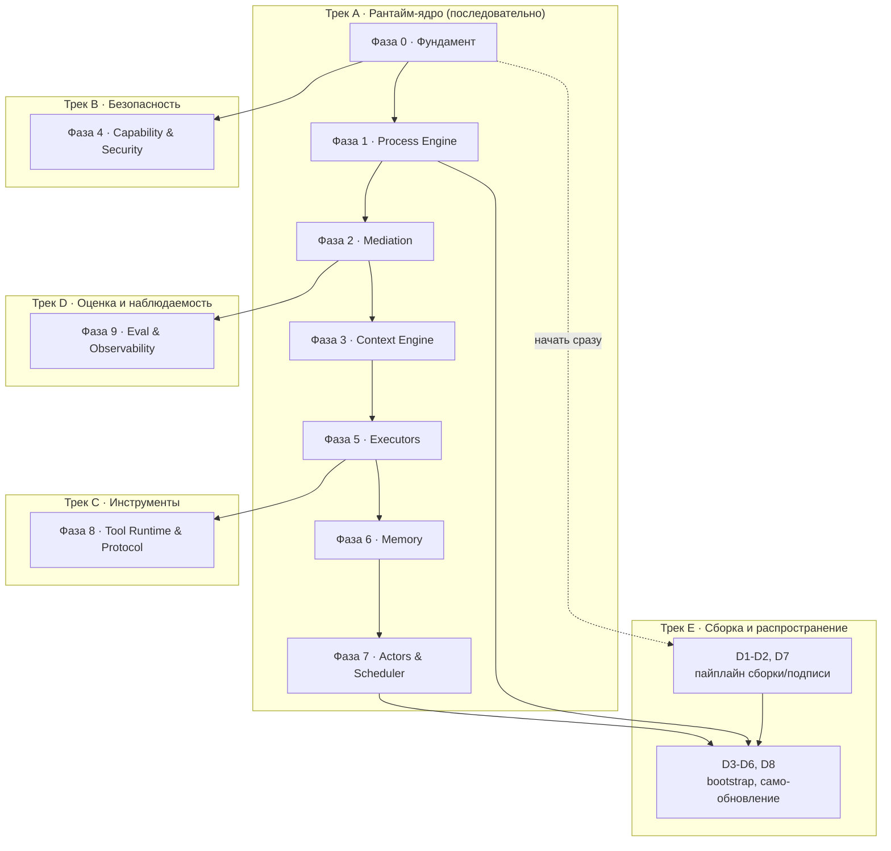

# Roadmap — очередь разработки, декомпозиция, распределение по классам моделей

> Источник — все документы `arch/*.md`, `arch/views/*.md`, `ADR/*.md`. Ничего нового не проектируется — здесь архитектура превращается в исполняемую очередь задач.

## 1. Методология

**Фазы** — не календарные спринты, а слои зависимостей: фаза N не может начаться раньше, чем готовы её входы из фаз, от которых она зависит (граф — в §2). Внутри фазы порядок подзадач необязательно строгий, если явно не указана внутренняя зависимость.

**Сложность подзадачи:**

| Метка | Критерий |
|---|---|
| **S** (простая) | Механическая работа по чёткой спецификации; есть с чем свериться (пример в контракте/документе), минимум развилок |
| **M** (средняя) | Несколько связанных решений о структуре кода внутри одного компонента, есть неочевидные edge case'ы |
| **L** (высокая) | Межкомпонентные инварианты, конкурентность, влияет на инварианты I1–I8; тонкая ошибка ломает архитектурное свойство |
| **XL** (критическая) | Граница доверия/безопасности, sandboxing, криптографическая верификация — «почти правильно» здесь равно «неправильно» |

**Класс модели** — та же шкала, что и в `ADR-0010`/`ADR-0011` для Model Pool самой системы: слабый / средний / сильный.

| Класс | Для какой сложности | Почему |
|---|---|---|
| **Слабый** (локальный/дешёвый) | S | Корректность легко проверяется тестом, не требует удержания архитектурного контекста нескольких файлов сразу |
| **Средний** | M | Нужно одновременно держать в контексте несколько контрактов/файлов и делать согласованный выбор между ними |
| **Сильный** | L, XL | Тесты одни не гарантируют защиту — нужно суждение о обходах (jail, sandbox), гонках, симметричности крипто-проверки |

**Обязательное правило:** любая подзадача сложности **XL** — сильный класс **и** обязательное независимое ревью (второй сильный прогон или человек), не полагаться на один проход генерации, независимо от того, насколько сильна модель, которая её написала.

## 2. Граф зависимостей фаз и параллельные треки



Треки B, D и начало трека E можно вести параллельно основному треку A с момента, когда открыты их стрелки-входы — не дожидаясь полного завершения трека A.

## 3. Milestone 0 — тонкий сквозной срез

Прежде чем углубляться в глубину каждой фазы, стоит собрать одну тривиальную задачу целиком end-to-end — это ловит нестыковки интеграции между компонентами раньше, чем инвестиции в полноту каждого из них по отдельности. Milestone 0 — не отдельная фаза с новыми подзадачами, а минимальный подмножество уже перечисленных ниже, достаточное для одного реального прогона.

**Состав среза:** F1, F2, F3 (фундамент, без F4/F5) → P1, P2, P3 в минимальном варианте — без P5 (конкурентность), P6 (часть лимитов достаточно `max_steps`), P8 (версионирование можно отложить) → M1, M2, M3, M5 в минимальном варианте — без M4 (policy можно ограничить проверкой типов) и без ADR-0011-совместимых повторов (M6) → E1 (только `ToolOnly`, без моделей).

**Цель среза:** прогнать `fixtures/golden/processes/card-delivery-support.yaml` от `fetch_card_status` (шаг `tool`) до записи патча в состояние и события в журнал — без единого обращения к модели. Это проверяет самый нижний слой интеграции (Process Engine ↔ Mediation ↔ Tool Runtime ↔ Storage), не касаясь ещё Model Pool, Capability в полном объёме или CodeAct.

**Определение готовности среза:** `cargo test -p berimor-process-engine` прогоняет один сценарий на этой фикстуре, инстанс проходит `tool`-шаг, патч применяется, событие `step.applied` попадает в журнал, повторный `recover()` по журналу восстанавливает то же состояние (свойство из `process-engine.md` §7).

## 4. Фаза 0 — Фундамент

Цель: примитивы, без которых ничего дальше не имеет смысла писать. Ничего не зависит от предыдущей фазы — это вход в граф.

| ID | Задача | Сложность | Класс | Зависит от | Источник |
|---|---|---|---|---|---|
| F1 | Событийный журнал: таблицы `events`/`snapshots` в SQLite, WAL, append-only запись | M | Средний | — | `arch/stack.md` §3, ADR-0021 |
| F2 | Иммутабельное состояние: тип патча, атомарное применение, свёртка событий → состояние | L | Сильный | F1 | `arch/process-engine.md` §3 |
| F3 | Скелет бинарника: CLI, загрузка конфигурации, точка входа | S | Слабый | — | `arch/stack.md` §2 |
| F4 | Тип-обёртка секрета (без утечки через Display/Debug) + точка маскировки на границе | L | Сильный | F3 | `arch/security-model.md` §2 (L5) |
| F5 | Capability-скелет: канонизация путей (jail), таблица deny-статики, примитив сетевого гейта | XL | Сильный | F3 | `arch/security-model.md` §2 (L3), ADR-0007 |

## 5. Фаза 1 — Process Engine — ВЫПОЛНЕНО

Цель: детерминированный остов, исполняющий граф шагов без единого обращения к модели. Все восемь задач реализованы. P5 (XL) прошло обязательное независимое ревью (ROADMAP §16 п.3, чистый контекст) — критических и важных находок нет, один minor (recover() не учитывает `ParallelStepApplied` при восстановлении `current_step` — не искажает финальное состояние, тратит один лишний шаг `max_steps` на резюме; задокументировано в коде, не чинится отдельно).

Осознанно вне scope всех восьми задач: тип шага `loop` объявлен (P2), но не исполняется — «нет поля цели повтора, открытый вопрос архитектуры» (`graph.rs`), ни один ADR его не разрешает; не выдумано здесь. `token_budget`/`cost_budget` (часть P6) не принуждаются
движком — `StepExecutor::execute` возвращает только `Patch`, ни токены,
ни стоимость, а провайдеры Model Pool (E3/E5) их не считают нигде в
системе. Принуждение этих двух прерывателей потребовало бы сначала
завести отчётность об использовании (новое поле в `Patch`/трейте или
отдельный канал) — самостоятельная задача, не выдуманная здесь заранее.
`max_steps`/`timeout` — реальные прерыватели цикла `engine::run`
(`Instant`, эфемерный на вызов, тот же охват, что `steps_this_run`).
`latency_budget` — не прерыватель цикла, а SLA отбора провайдера на
каждом шаге (ADR-0011); проброшен из `ProcessLimits` в `CliExecutor`.

| ID | Задача | Сложность | Класс | Зависит от | Источник |
|---|---|---|---|---|---|
| P1 | ✅ Парсер декларативного описания процесса (граф + хэш версии) | M | Средний | F1 | `arch/process-engine.md` §2 |
| P2 | ✅ Типы шагов без модели: `sequential`/`parallel`/`loop`/`branch`/`checkpoint` | M | Средний | P1 | `arch/process-engine.md` §2 |
| P3 | ✅ Цикл исполнения движка (instantiate/next/apply/emit) + снапшот при мутации | L | Сильный | P1, P2, F2 | `arch/process-engine.md` §4 |
| P4 | ✅ Восстановление после сбоя (replay) + property-тест «свёртка журнала = состояние» | L | Сильный | P3 | `arch/process-engine.md` §7 |
| P5 | ✅ Конкурентность: один писатель на инстанс, неймспейсы parallel-шагов, join-барьер | XL | Сильный | P3 | `arch/process-engine.md` §4 |
| P6 | ✅ Детерминированные прерыватели: `max_steps`/`timeout` (движок), `latency_budget` (SLA отбора провайдера, ADR-0011) | M | Средний | P3 | `arch/process-engine.md` §4, ADR-0011 |
| P7 | ✅ Шаг `human_gate` + политика таймаута эскалации | M | Средний | P3 | `arch/process-engine.md` §5 |
| P8 | ✅ Привязка версии к инстансу + операция `migrate_version` | L | Сильный | P3, P4 | `arch/process-engine.md` §2, ADR-0012 |

## 6. Фаза 2 — Mediation — ВЫПОЛНЕНО

Цель: единственная точка, где вывод модели становится состоянием.

| ID | Задача | Сложность | Класс | Зависит от | Источник |
|---|---|---|---|---|---|
| M1 | Система типов контрактов: derive-схема, запрет неизвестных полей | M | Средний | F3 | `arch/mediation.md` §3 — ✅ |
| M2 | Стадия `parse` (толерантность к markdown-обёрткам, без эвристик смысла) | S | Слабый | M1 | `arch/mediation.md` §4.1 — ✅ |
| M3 | Стадия `schema` (типы, обязательность, перечисления, диапазоны, длины) | M | Средний | M1, M2 | `arch/mediation.md` §4.2 — ✅ |
| M4 | Стадия `policy`: межполевые правила, ссылки на состояние, контроль утечек | L | Сильный | M3, F4 | `arch/mediation.md` §4.3 — ✅ |
| M5 | Стадия `commit`: разделение патч / аргументы инструмента / публикуемые поля | M | Средний | M4 | `arch/mediation.md` §4.4 — ✅ |
| M6 | Логика повтора (до 2) и детерминированной эскалации в `human_gate` | M | Средний | M2–M5, P7 | `arch/mediation.md` §5 — ✅ |
| M7 | Телеметрия отказов (события + доля отказов по процессу/шагу/модели/версии контракта) | S | Слабый | M2–M6 | `arch/mediation.md` §6 — ✅ |

Проверено по коду 2026-08-02 (задача §20.7): M1 — 10 контрактов с
`deny_unknown_fields` (`contracts.rs`); M4 — контроль утечек получает
реальный реестр секретов со всех путей (S5, §20.2 — до него проверка
была мёртвой); M6 — retry-цикл исполняется всеми тремя исполнителями с
моделью (E2/E8/E9); M7 — события пишутся в журнал реальных прогонов
через `on_attempt`-хуки, включая события стадий (аудит 1.10), а
агрегация доли отказов имеет не-тестового потребителя
(`berimor-eval::skill_health`). Уровень — не «минимум Milestone 1», а
полные формулировки строк.

## 7. Фаза 3 — Context Engine — ВЫПОЛНЕНО

| ID | Задача | Сложность | Класс | Зависит от | Источник |
|---|---|---|---|---|---|
| C1 | Маршрутизатор: класс задачи → набор слоёв контекста (код-правила) | S | Слабый | P1 | `ideal-agent-architecture.md` §3.5 — ✅ |
| C2 | Сборщик: фиксированный порядок слоёв | S | Слабый | C1 | `ideal-agent-architecture.md` §3.5 — ✅ |
| C3 | Оценщик бюджета по классу модели | M | Средний | C1, C2 | `ideal-agent-architecture.md` §3.5, ADR-0010 — ✅ |

Проверено по коду 2026-08-02 (задача §20.7): C1 — реальный роутер
`layers_for_step` (класс задачи = тип шага на текущем уровне системы:
llm_structured/agent_step/codeact → пять слоёв, шаги без модели → без
контекста), НЕ «state целиком одним слоем» из минимума Milestone 1 — к
Skills/Session добавлен слой EntityGraph (§20.5); C2 — `assemble` даёт
канонический порядок, зафиксированный тестом; C3 — `apply_budget`
применяется на единственном пути `build()` обоих построителей (аудит
4.3 — до волны 2026-08-02 бюджет был API без потребителей). Полные
формулировки строк, доследующих задач нет.

## 8. Фаза 4 — Capability & Security (Трек B, параллельно с Фазой 1+) — ВЫПОЛНЕНО

| ID | Задача | Сложность | Класс | Зависит от | Источник |
|---|---|---|---|---|---|
| S1 | Анализатор deny-статики: таблица правил по запрещённым классам операций | XL | Сильный | F5 | `arch/security-model.md` §2 (L3) — ✅ |
| S2 | Jail файловой системы: канонизация путей, защита от symlink-обхода | XL | Сильный | F5 | `arch/security-model.md` §1 — ✅ |
| S3 | Сетевой гейт: блок-лист приватных адресов на границе HTTP-клиента | L | Сильный | F5 | `arch/views/network-architecture.md` §3 — ✅ |
| S4 | Режимы подтверждений (`deny`/`smart`/`manual`/`off`) + декларация на инструмент | M | Средний | S1 | `arch/security-model.md` §3 — ✅ |
| S5 | Интеграция маскировщика на всех 4 границах данных | L | Сильный | F4, M4 | `arch/mediation.md` §4.3 — ✅ |
| S6 | ✅ Схема ACL-манифеста плагина + статическое применение | L | Сильный | S1 | `arch/security-model.md` §4, ADR-0014 |

Проверено по коду 2026-08-02 (задача §20.7): S1 — контрактный тест
блокирует весь golden-набор (87 denied/25 allowed, включая классы
обходов из двух волн ревью); S2 — jail не просто реализован, а слой 1.5
в `StandardCapability::check` на реальном пути (§20.3 — до него у
модуля было 0 вызывающих мест); S3 — гейт стоит в HTTP-провайдере (E5)
перед каждым соединением; S4 — `ToolOnly`/`AgentStep`/`CodeAct` идут
через гейт; S5 — `Masker` на четырёх точках + запись в семантику (§20.2).
S1–S4 и S5 прошли независимые XL-ревью, находки отработаны (см. §20.2,
§20.3). Полные формулировки строк.

## 9. Фаза 5 — Executors — ВЫПОЛНЕНО

| ID | Задача | Сложность | Класс | Зависит от | Источник |
|---|---|---|---|---|---|
| E1 | `ToolOnly`: резолвинг аргументов из состояния (шаблоны) + диспетч вызова | S | Слабый | P3, S1–S4 | `arch/executors.md` §2 — ✅ |
| E2 | `StructuredLLM`: сборка подсказки из контракта + пример + срез контекста | M | Средний | M1–M7, C1–C3 | `arch/executors.md` §3 — ✅ |
| E3 | Model Pool: реестр, поле класса, селектор (локальный → стоимость → фиксированный порядок) | L | Сильный | F3 | ADR-0010, ADR-0011 — ✅ |
| E4 | Встраивание llama.cpp (локальный инференс, GGUF) | L | Сильный | E3 | `arch/stack.md` §5, ADR-0024 — ✅ |
| E5 | HTTP-клиент удалённых провайдеров за общим интерфейсом | M | Средний | E3, S5 | `arch/stack.md` §5 — ✅ |
| E6 | Встраивание Wasmtime: хост, host-функции как стабы инструментов | XL | Сильный | S1–S4, F5 | `arch/executors.md` §4.2, ADR-0022 — ✅ |
| E7 | Статический анализ сгенерированной программы (белый список идентификаторов) | L | Сильный | E6 | `arch/executors.md` §4.2 — ✅ |
| E8 | Лимиты песочницы (топливо/память/число вызовов) + результат → Mediation | L | Сильный | E6, E7, M1–M7 | `arch/executors.md` §4.2 — ✅ |
| E9 | `AgentStep`: свободный цикл, стратегии самокритики/«предложи-выполни-проверь», лимиты | L | Сильный | M1–M7, S4 | `arch/executors.md` §5 — ✅ |

E9 — ✅ выполнено (`berimor-executors::agent_step`), подключено в `berimor run`/`berimor eval`. Цикл «рассуждение → действие → наблюдение»: ход — `AgentTurnDecision` (`berimor-mediation::contracts`, фиксированная форма, не по реестру); `Tool`-действие — через тот же `tool_only::dispatch_confirmed`, что и `ToolOnly` (capability-гейт/подтверждение не обходятся); сбой самого инструмента восстановим (наблюдение, цикл продолжается), отказ capability-слоя — терминален. `self_critique`/`verify_actions` — опциональные стратегии из документа, `max_turns` — единственный реально принуждаемый лимит (бюджет токенов честно не enforced — учёта токенов у `ModelProvider` нет нигде в системе, тот же класс пробела, что `ProcessLimits.token_budget`, P6). Прошло обязательное независимое ревью (2 major фикса: сбой диспетча теперь восстановим, а не терминален; отсутствие ограничения набора инструментов для шага задокументировано как осознанный пробел).

E6 — ✅ выполнено (`berimor-executors::codeact::WasmHost`). Встраивание Wasmtime как хоста: компиляция/инстанцирование гостевого WASM-модуля, вызов его экспортированной точки входа, единственная зарегистрированная host-функция `call_tool` — проведена через тот же `tool_only::dispatch_confirmed`, что `ToolOnly`/`AgentStep` (capability-гейт не обходится). WASI не подключается вообще (`Linker` не регистрирует ничего, кроме `call_tool`) — гость, попытавшийся импортировать что-то ещё, не слинкуется; это структурное доказательство отсутствия ambient-доступа к ОС/сети, не список запретов. ABI хост↔гость (фиксированные смещения в памяти гостя под вход/выход) — рукописный протокол этой задачи, не финальный провод CodeAct; тестовые гостевые модули — WAT-текст, без нового target-тулчейна в CI. Осознанно НЕ входит: статический анализ программы и сам JS-движок (E7), топливные/памятные лимиты и проводка результата через Mediation в `Patch` (E8) — `StepKind::CodeAct` поэтому не подключён к `CliExecutor`, подключать пока нечего целиком. Прошло обязательное независимое ревью (2 major фикса: `read_guest_utf8` аллоцировал буфер под заявленную гостем длину ДО bounds-check против реального размера его памяти — host-side вектор исчерпания памяти, теперь `ptr+len` проверяется до аллокации; сентинел `-1`, отличающий порчу указателя от легитимного `{"ok":false,...}`, не был покрыт тестами — добавлено 2 теста; плюс minor уточнение doc-комментария и nit по точности варианта ошибки).

E7 — ✅ выполнено (`berimor-executors::codeact::static_analysis`). Белый список идентификаторов над ТЕКСТОМ JS-программы, до компиляции: свободные (несвязанные локальным объявлением) идентификаторы обязаны входить в объединение фиксированного набора безопасных intrinsics (`JSON`, `Math`, `Array`, ...) и переданных вызывающим кодом имён стабов инструментов для конкретного шага — иначе отказ; `eval`/`Function`/сетевые глобальные объекты отклоняются РОВНО ПОТОМУ, что их нет в списке, не отдельной проверкой по имени. Разбор — через реальный JS-парсер (`oxc_parser`), не регулярные выражения: AST различает позицию использования идентификатора от имени свойства при невычисляемом доступе. Динамический `import(...)` отклоняется отдельно как синтаксическая конструкция. Связывание объявленных имён с использованиями — одним проходом по всей программе без блочной точности области видимости (сознательное упрощение: неточность работает только в консервативном направлении). Явно НЕ первая и не единственная линия обороны (ADR-0022: «защита от шума») — `globalThis.eval(...)`, вычисляемый доступ к свойствам с собранным во время исполнения именем и подобные обфускации не гарантированно ловятся; закрывающий барьер — структурная изоляция E6.

**Уточнение при закрытии E8**: изначальная реализация E7 проверяла только СВОБОДНЫЕ ИДЕНТИФИКАТОРЫ — но единственный способ вызвать стаб инструмента в реальном гостевом рантайме (E8, `codeact-guest`) — `call_tool('имя', args)`, где имя передаётся строковым ЛИТЕРАЛОМ, не идентификатором; такие литералы `visit_identifier_reference` не видит по построению AST. Без отдельной проверки белый список `tools`, переданный вызывающим кодом, не давал бы НИКАКОГО реального ограничения на то, какой инструмент программа может вызвать через `call_tool` (обнаружено при написании теста уровня `CodeActExecutor` в рамках закрытия E8, не независимым ревью — задокументировано здесь, а не молча исправлено). Добавлена отдельная проверка в `ReferenceChecker::visit_expression`: `call_tool('литерал', ...)` — имя-литерал обязано входить в `allowed_names`, иначе `DisallowedToolName`. Вычисляемое имя (`call_tool(x, ...)`) по-прежнему не проверяется статически — тот же класс честного пробела, что обфускации выше.

E8 — ✅ выполнено (`berimor-executors::codeact::{wasm_host, executor}`, гость `codeact-guest/`) — закрывает пробел, оставленный E6/E7: встроен реальный JS-движок (QuickJS через `rquickjs`, гостевой crate вне основного workspace — компилирует C-исходники под `wasm32-wasip1`, автоматически качая `wasi-sdk`; собранный `.wasm` коммитится как `assets/codeact-guest.wasm`, `codeact-guest/README.md` — как пересобрать), три лимита песочницы (`WasmLimits`: `fuel` — метрика топлива `wasmtime`, ADR-0022; `memory_bytes` — `wasmtime::StoreLimits`; `max_tool_calls` — счётчик в `HostState`, исчерпание не трапит, а возвращает программе обычный отказ `{"ok":false,...}` тем же каналом, что и отказ capability-гейта — грациозная деградация, не жёсткий обрыв), и `CodeActExecutor` — полный исполнитель (промпт → модель → JS-текст → `static_analysis::analyze` → `WasmHost::run` → Mediation результата против контракта шага, повтор новым промптом при отказе любого барьера). `StepKind::CodeAct` подключён к `CliExecutor` — `codeact`-шаг реально работает из `berimor run`.

ABI хост↔гость пересмотрен целиком относительно того, что было в E6/E7 (WASI stdin/stdout вместо пользовательских смещений линейной памяти — тот пересмотр был явно предусмотрен как провизорный). WASI подключается (пересмотр решения E6 «WASI не подключается вообще» — гостю на `rquickjs`/wasi-libc нужен минимум окружения) с ПУСТЫМ `WasiCtx` — без `inherit_stdio`/`inherit_env`, без `preopened_dir`, без сети — deny-by-default, та же гарантия «нет ambient-доступа», другой механизм.

Осознанно НЕ входит: допуск по классам моделей (`executors.md` §4.3) реализован ЧАСТИЧНО — лимиты масштабируются по факту отобранного тира (`WasmLimits::strong()`/`reduced()`), но «слабый — только с явным разрешением в процессе» не проверяется (в системе нет понятия такого разрешения ни для одного шага). Модель узнаёт только ИМЕНА стабов инструментов (`StepKind::CodeAct.tools`), не их JSON-схемы — в системе нет реестра схем инструментов. Прошло обязательное независимое ревью (0 critical/major; 2 minor исправлены: устаревшая строка «E8 не начато», противоречившая абзацу выше в том же коммите; отсутствие теста на отказ capability-гейта на уровне `CodeActExecutor`, не только `WasmHost`).

## 10. Фаза 6 — Memory — ВЫПОЛНЕНО

Все восемь задач реализованы и запушены (`crates/berimor-memory`,
`crates/berimor-storage`, `crates/berimor-mediation`), подтверждены
зелёным CI на Linux/macOS/Windows. MEM7 (XL) прошло обязательное
независимое ревью (ROADMAP §16 п.3) с чистым контекстом — найдено
1 critical + 4 major + 6 minor, критичное и важное исправлено с
регрессионными тестами, minor задокументированы как осознанные
ограничения. 301 тест в воркспейсе на момент закрытия фазы.

| ID | Задача | Сложность | Класс | Зависит от | Источник |
|---|---|---|---|---|---|
| MEM1 | ✅ Рабочая память: сворачивание при переполнении бюджета, оригинал в эпизодической | M | Средний | M1–M7, F2 | `arch/memory-model.md` §4 |
| MEM2 | ✅ Эпизодическая память: индекс FTS5, поиск по сессиям | S | Слабый | F1 | `arch/memory-model.md` §1 |
| MEM3 | ✅ Семантическая память: контракт «предложение факта» + дедупликация | L | Сильный | M1–M7 | `arch/memory-model.md` §2, ADR-0005 |
| MEM4 | ✅ Интеграция `sqlite-vec`, гибридный поиск (вектор + полнотекст, фиксированные веса) | L | Сильный | MEM2, MEM3 | `arch/memory-model.md` §3 |
| MEM5 | ✅ Конфликт-события при противоречии фактов | M | Средний | MEM3 | `arch/memory-model.md` §2 |
| MEM6 | ✅ Процедурная память: формат файла навыка, описание всегда/тело по требованию | M | Средний | C1–C3 | `arch/memory-model.md` §1 |
| MEM7 | ✅ Граф сущностей: `nodes`/`edges`, entity resolution, типизированные контракты | XL | Сильный | MEM3, M1–M7 | `arch/memory-model.md` §4, ADR-0016 |
| MEM8 | ✅ Изоляция профилей (включая профиль типа `actor`), правило межпрофильного чтения | L | Сильный | MEM1–MEM7 | `arch/memory-model.md` §5, ADR-0013 |

Сознательно вне scope Фазы 6 (упомянуто в `memory-model.md`, но не
входит в формулировки задач MEM1–MEM8 — задокументировано в
doc-комментариях соответствующих модулей): маскировщик секретов
на записи в память и режим персональных данных (§5 — отдельный механизм
на границе записи, не изоляция профилей). Интеграция всего перечисленного
в реальный `berimor run` (вызов через Context Engine, слои Skills/Facts/
Session) — задача будущего Milestone, не этой фазы.

**Дополнение после закрытия фазы**: персистентность графа сущностей
(первый пункт выше) реализована в `berimor-storage` — `NodeRecord`/
`EdgeRecord`/`EntityGraphStore` (таблицы `nodes`/`edges` в `SCHEMA_SQL`),
тот же паттерн, что `FactRecord`/`SemanticStore` для MEM3→MEM4:
`entity_graph.rs` не изменён (логика по-прежнему работает над срезами
`&[StoredNode]`/`&[StoredEdge]`, персистентность — отдельный слой в
другой крейте, ADR-0021), профиль/тенант не хранится отдельным столбцом
(та же граница, что у `facts` — изоляция на уровне `profile.rs`, не
схемы). Композиционные тесты (`entity_graph::tests::
resolve_node_over_data_round_tripped_through_the_real_store_finds_exact_match`,
`detect_edge_conflict_over_data_round_tripped_through_the_real_store`)
показывают резолюцию/конфликты над данными, реально прошедшими через
`SqliteEventLog`, не только над сфабрикованными срезами — та же
дисциплина, что доказательство MEM3+MEM4 через `sqlite-vec` в
`semantic.rs`. Оставшиеся два пункта списка выше (маскировщик секретов
на записи, интеграция графа в реальный `berimor run`) остаются открытыми.

**Дополнение 2026-08-02**: оба оставшихся пункта закрыты. Маскировщик
на записи — задача S5 (§20.2): `StoredFact::new` маскирует через
`berimor_secrets::Masker`. Интеграция графа в реальный `berimor run` —
задача §20.5: слой `LayerKind::EntityGraph` в Context Engine
(`MemoryContextBuilder.entity_layer` читает `EntityGraphStore` того же
журнала: релевантные узлы + соседи в одно ребро), включается
`[memory] entity_graph` в конфигурации («профилем, не глобально», §4);
e2e-доказательство дохода слоя до модели —
`berimor-cli/tests/entity_graph_cli.rs`.

## 11. Фаза 7 — Actors & Scheduler — ВЫПОЛНЕНО

`crates/berimor-actors`, все шесть задач реализованы и запушены, 379
тестов в воркспейсе на момент закрытия фазы. A2 переиспользует
`berimor_capability::plugin::PluginManifest` (S6) как ACL шины событий —
единая ось ACL, не отдельный параллельный механизм (тот же приём, что
ADR-0013 у памяти актора). A4 реализована без нового вида состояния:
`TaskStatus::Escalated` диспетчера (A3) — это и есть остановка
`human_gate`; предел на диспетчере (`Dispatcher::with_human_gate_limit`)
не включён по умолчанию, вызывающий код включает его явно.

| ID | Задача | Сложность | Класс | Зависит от | Источник |
|---|---|---|---|---|---|
| A1 | ✅ Модель актора: задача tokio + почтовый ящик + привязка профиля памяти | L | Сильный | P3, MEM8 | ADR-0009 |
| A2 | ✅ Подпись конвертов (HMAC-SHA256, ключ хоста) + проверка ACL топика на шине событий | L | Сильный | A1, S6 | `arch/security-model.md` §4 |
| A3 | ✅ Диспетчер: доска задач, правила назначения, эскалация после N неудач | M | Средний | A1 | `ideal-agent-architecture.md` §3.8 |
| A4 | ✅ Лимит очереди `human_gate` (диспетчер) + статус `throttled` для расписаний (планировщик) | M | Средний | A3, P7 | `arch/process-engine.md` §5, ADR-0015 |
| A5 | ✅ Планировщик: персистентный min-heap времён срабатывания, защита от двойного тика | L | Сильный | A3 | `ideal-agent-architecture.md` §3.8 |
| A6 | ✅ Аварийная заморозка всех акторов | L | Сильный | A1 | `arch/security-model.md` §2, §4 |

## 12. Фаза 8 — Tool Runtime & Protocol (Трек C) — ВЫПОЛНЕНО

`crates/berimor-tool-runtime` на официальном Rust SDK MCP (`rmcp`), не
самодельном протоколе — ADR-0023 требует готовый стандарт, не изобретать
свой. T1/T2 — механизм (клиент/сервер), не конкретные встроенные
инструменты (терминал, файлы, VCS, ...) — их реализация не входит ни в
одну задачу этой фазы, список из `ideal-agent-architecture.md` §3.9 без
реализации, до отдельной будущей задачи. T3 переиспользует ACL-манифест
плагина из S6 (`berimor_capability::plugin::PluginManifest`) — та же ось
ACL, что и у A2 на шине событий, не отдельный параллельный механизм.

| ID | Задача | Сложность | Класс | Зависит от | Источник |
|---|---|---|---|---|---|
| T1 | ✅ MCP-клиент (потребление внешних серверов инструментов) | M | Средний | E1 | `arch/stack.md` §6, ADR-0023 |
| T2 | ✅ MCP-сервер (отдача собственного набора инструментов) | M | Средний | E1 | `arch/stack.md` §6, ADR-0023 |
| T3 | ✅ Изоляция плагина как процесса (T1) + применение ACL-манифеста (S6) | L | Сильный | T1, S6 | `ideal-agent-architecture.md` §3.9 |

## 13. Фаза 9 — Eval & Observability (Трек D, параллельно с Фазой 2+) — ВЫПОЛНЕНО

`crates/berimor-eval` — новый крейт (по одному на фазу, как Actors/
Tool Runtime), все четыре задачи реализованы. O1 — чтение журнала для
человека/отладки, не переиспользование `engine::recover` (тот
восстанавливает исполняемый `ProcessInstance` под граф процесса и
проверяет версию — другая цель, «продолжить выполнение», не
«посмотреть, что произошло»). O2–O4 — чистые функции от уже собранных
данных (сценариев/журналов/статистики использования); сбор самих данных
(итерация по хранилищу за пределами одного `EventLog::replay`,
подключение к реальному прогону CLI) — вне scope этой фазы, как и
интеграция Фаз 6–8.

| ID | Задача | Сложность | Класс | Зависит от | Источник |
|---|---|---|---|---|---|
| O1 | ✅ Инструмент трассировки/replay событий | S | Слабый | F1 | `ideal-agent-architecture.md` §3.11 |
| O2 | ✅ Стенд офлайн-оценки на золотых наборах (доля веток, доля отказов) | M | Средний | M7, P4 | `ideal-agent-architecture.md` §3.11 |
| O3 | ✅ Контур здоровья навыков: рост отказов + неиспользование → событие ревью | M | Средний | O2, MEM6 | `ideal-agent-architecture.md` §3.11 |
| O4 | ✅ Пайплайн онлайн-метрик (доля успеха задач, скорость подтверждений) | M | Средний | O2 | `ideal-agent-architecture.md` §3.11 |

## 14. Фаза 10 — Deployment & Distribution (Трек E)

| ID | Задача | Сложность | Класс | Зависит от | Источник |
|---|---|---|---|---|---|
| D1 | Матрица кросс-компиляции (cargo + cargo-zigbuild) | M | Средний | F3 | `arch/deployment.md` §7, ADR-0017 — ✅ |
| D2 | Пайплайн подписи (sigstore/cosign, keyless) | L | Сильный | D1 | `arch/deployment.md` §7, ADR-0026 — ✅ |
| D3 | Bootstrap-пакет (TypeScript): определение платформы, скачивание, атомарная распаковка | M | Средний | D1 | `arch/deployment.md` §2–3, ADR-0025 — ✅ |
| D4 | Процесс `agent-self-update` на примитивах Process Engine | L | Сильный | P1–P8, D2 | `arch/deployment.md` §5, ADR-0019 — ✅ |
| D5 | Формат и управление доверенным списком (событие + подтверждение) | M | Средний | P7, M6 | `arch/deployment.md` §4, ADR-0018 — ✅ |
| D6 | Процесс установки плагина | L | Сильный | D4, D5, S6, T3 | `arch/deployment.md` §6, ADR-0019 — ✅ |
| D7 | Провенанс (`npm publish --provenance`) + SBOM | S | Слабый | D2 | `arch/deployment.md` §7 — ✅ |
| D8 | Тесты внедрения сбоев для обновления (прерванная загрузка, неверная подпись, downgrade) | L | Сильный | D4 | `arch/deployment.md` §8 — ✅ |

D1 — ✅ выполнено (`.github/workflows/release.yml`). Кросс-платформенная сборка реализована НЕ через `cargo`+`cargo-zigbuild`, как изначально записано в этой строке и в `arch/stack.md` §9, а нативными GitHub Actions раннерами под каждую цель (`ubuntu-latest`, `ubuntu-24.04-arm`, `macos-latest`, `windows-latest`) — сознательное отклонение, задокументированное прямо в файле пайплайна: у `cargo-zigbuild` нет практической поддержки цели macOS без `osxcross` и извлечения Apple SDK, что юридически спорно для редистрибуции; нативный раннер закрывает ту же задачу (артефакт на каждую платформу) без этого обхода. `darwin-x64` временно исключён из матрицы (очередь раннера `macos-13` на практике зависает на десятки минут, не гипотеза). Триггер — `push` тега `v*` либо ручной `workflow_dispatch` (без тега — сборка без публикации, с тегом — доизготовление релиза под уже существующий тег). Публикация — одним атомарным шагом `gh release create` со всеми артефактами разом (переход от исходной схемы `release.published`→дозаливка ассетов вынужден: GitHub Immutable Releases возвращает HTTP 422 на попытку добавить ассет к уже опубликованному релизу — обнаружено на первом реальном прогоне на теге `v0.1.0`, не в теории). Пайплайн уже использован для релизов `v0.1.0`–`v0.6.0`.

D2 — ✅ выполнено (`.github/workflows/release.yml`, `crates/berimor-cli/src/verify.rs`). CI подписывает каждый платформенный архив keyless-подписью cosign (`cosign sign-blob --new-bundle-format --bundle`, OIDC-токен job'а `build`, `id-token: write` только на этой job — least-privilege) — заменяет прежний `sha256sum`, как и было изначально задумано в комментарии файла, не дополняет его. Отдельная job `canary` тем же workflow подписывает маленький текстовый файл — не входит в assets реального релиза, источник golden-фикстуры (`fixtures/golden/signing/`) и будущих тестов D8. Верификация — целиком в Rust (крейт `sigstore`, фичи `bundle`+`sigstore-trust-root`+`rustls-tls`, без `cosign`/`registry` — те тянут ненужный OCI-клиент): `berimor verify <artifact>` больше не заглушка. Политика верификации — три условия через `AllOf`: OIDC issuer = GitHub Actions, репозиторий = `devpilgrin/berimor`, и путь к workflow-файлу (`ReleaseWorkflowPath`, кастомная политика — префиксное сравнение SAN-идентичности сертификата БЕЗ суффикса `@<ref>`, так как ref варьируется между тегом релиза и `workflow_dispatch`) — якорь идентичности зашит константами для СВОЕГО репозитория, не общий доверенный список (тот — предмет D5, ещё не реализован). Доверенный корень TUF кэшируется на диске (`dirs::cache_dir()/berimor/sigstore`) между вызовами. Прошло обязательное независимое ревью (0 critical, 2 major — оба исправлены: (1) `Verifier::production()` крейта не кэшировала TUF-корень, каждый вызов заново тянул его по сети — заменено на ручную сборку `Verifier` с явным `cache_dir`; (2) проверка одного `GitHubWorkflowName` не отличала бы этот workflow-файл от гипотетического другого файла с тем же `name:` в репозитории — заменено на кастомную SAN-политику, пиннящую путь к файлу; 2 minor — не блокировали закрытие: неизбежные транзитивные `openidconnect`/`webbrowser` от фич крейта `sigstore` (мёртвый код в этом бинарнике, ограничение версии крейта), один `.expect()` на статически недостижимой панике). По ходу закрытия найден и исправлен независимый от ревью баг: `fixtures/golden/signing/RELEASE.txt` ломался при чекауте на Windows (`core.autocrlf` конвертирует LF→CRLF, меняя байты и дайджест) — исправлено `.gitattributes` (`fixtures/golden/signing/** -text`), обнаружено на реальном прогоне CI (Rust · windows-latest), не в теории.

D3 — ✅ выполнено (`bootstrap/src/{cache-dir,checksum,checksums-manifest,extract,download,index,verify}.ts`, `.github/workflows/release.yml`, `.github/workflows/ci.yml`). Столкнулись с циркулярностью, которой не было в исходной задаче: `verify.ts` (уже существовал) проверяет артефакт, вызывая подкоманду `berimor verify` уже скачанного нативного бинарника — на первой установке ещё нет доверенного бинарника, который мог бы проверить сам себя (поддельный бинарник соврёт на собственный `verify`). Решение — SHA-256 каждого платформенного архива пиннится не рядом с самим архивом (это ничего не даёт — компрометация аккаунта публикации GitHub Release скомпрометирует оба файла разом), а В САМ npm-пакет `bootstrap` на этапе публикации (новый шаг `publish` job в `release.yml`, до `gh release create`) — доверие первой установки приходит из независимого канала (npm), не из скачиваемого артефакта. `verify.ts` не тронут — он корректен и остаётся заделом для D4 (само-обновление: там уже есть предыдущий доверенный бинарник, который проверяет новый, — не циркулярно). Реализация — без единой новой npm-зависимости (`node:crypto`/`node:fs`/`fetch`/системные `tar`/`Expand-Archive`), атомарность распаковки — через временную директорию рядом с целевой и `rename` одной операцией. 21 тест (`node:test`, встроенный в Node ≥20), фикстурные архивы `fixtures/golden/bootstrap/{sample.tar.gz,sample.zip}`, шаг `npm test` добавлен в CI. Независимое ревью не назначалось (правило проекта — только для XL/security-critical; здесь новый изолированный TS-код класса M, доверенный список/подпись не затронуты — тот периметр уже прошёл ревью в D2).

**Честно принятый остаточный пункт, не блокирующий закрытие D3:** секрета `NPM_TOKEN` в репозитории нет — механизм публикации в `release.yml` написан и синтаксически проверен, но реально `npm publish` выполнится только после того, как пользователь сам заведёт секрет (Settings → Secrets → Actions); учётные данные публикации — не то, что я завожу самостоятельно. До этого момента шаг `publish bootstrap to npm` будет падать на реальном теге, сам GitHub Release при этом уже создан и не откатывается (шаг идёт раньше). Сквозная проверка «настоящий `npm install berimor` тянет настоящий пришпиленный SHA-256» возможна только после этого разового ручного шага и первого следующего тега.

**Дополнение 2026-08-03 — остаточный пункт ЗАКРЫТ, сквозная проверка пройдена.** Секрет заведён пользователем; `berimor@0.9.0` и `berimor@0.9.1` опубликованы; `npm install -g berimor` + `berimor --version` → `berimor 0.9.1` (скачивание, сверка по пину, распаковка, делегирование нативному бинарнику). Первая реальная установка исполнила роль приёмочного теста и вскрыла цепочку дефектов, все закрыты: (1) `isMainModule` в index.ts — npm ставит bin симлинком, `argv[1]` (симлинк) != `import.meta.url` (реальный путь), main() молча не запускался → realpath перед сравнением; (2) имя артефакта в platform.ts без `v`-префикса при именовании build-матрицей `berimor-v<ver>-*` — manifest lookup fail-closed (верно); (3) поле `repository` в package.json — обязательно для `npm publish --provenance` (E422); (4) `gh release create` неидемпотентен — повторный прогон после падения npm жёг версию → пропуск при существующем релизе; (5) checksums при идемпотентном повторе обязаны считаться по артефактам, РЕАЛЬНО приложенным к релизу (сборки не байт-воспроизводимы — пин от пересборки не сходится с файлом пользователя, поймано реальной установкой). `berimor@0.9.0` в npm — нерабочий (пункты 1–2), рекомендуется `npm deprecate`; рабочая линия — с 0.9.1. Короткая команда релиза: `scripts/release.sh X.Y.Z`.

D4 — ✅ выполнено (`crates/berimor-cli/src/self_update.rs`, `fixtures/golden/processes/agent-self-update.yaml`, `crates/berimor-cli/src/{main,run}.rs`). Иллюстративный YAML-пример в `arch/deployment.md` §5 не исполним буквально текущим движком Process Engine — три структурных отличия, обнаруженные при реализации, не теоретизирование: (1) `StepKind::Branch.on` — один путь состояния (`state_path::resolve`), не выражение сравнения двух путей между собой (`state.check_version.version > state.local.version` из документа не парсится никаким имеющимся синтаксисом `graph.rs::evaluate_branch`) — сравнение версий вынесено в сам tool `registry.get_latest` (крейт `semver`), граф проверяет уже готовые булевы `is_newer`/`is_major_bump`; (2) `"done"` не специальный сентинел таргета — `NextStep::Finished` наступает только когда для текущего шага нет следующего элемента в плоском списке `steps` (`graph.rs::next_step`), граф процесса физически спроектирован так, что ровно один общий терминальный шаг (`done`) — последний элемент массива, оба успешных пути (обновление не нужно / обновление закоммичено) сходятся в него; (3) `StepKind::Checkpoint` — аудит-снапшот состояния Process Engine (`storage.write_snapshot`), не резервная копия бинарного файла — бэкап/откат самого бинарника целиком внутри `fs.atomic_replace_binary`/`fs.restore_from_checkpoint` (переименование файла в сторону перед заменой = и бэкап, и подготовка отката одним действием), движок для этого не трогается. Восемь native tool-инструментов (`registry.get_latest`, `platform.resolve_asset`, `github.download_release_asset`, `crypto.verify_signature` — переиспользует `verify_artifact` из D2, `fs.atomic_replace_binary`, `agent.self_check`, `fs.restore_from_checkpoint`, `registry.record_version`) за отдельными `SelfUpdateDispatch`/`SelfUpdateExecutor`, изолированными от `run.rs::build_executor_bundle` — пользовательский `berimor run <любой.yaml>` физически не может вызвать замену исполняемого файла, просто назвав инструмент в своём YAML (подтверждено независимым ревью). Сознательное сужение: реализован только канал `stable` (`GET /repos/{}/releases/latest`) — `release.yml` сегодня не производит пререлизных тегов, схема для `beta`/`canary` не выдумывается заранее.

Прошло обязательное независимое ревью (2 critical, 1 major — все исправлены; 1 minor — рассмотрен и осознанно не применён): (1) CRITICAL — `agent.self_check` пробрасывал `Err`, если новый бинарник вообще не запускается (`Command::output()` вернул `Err`, не `Ok` с ненулевым кодом) — весь self-update процесс обрывался на шаге `smoke_test`, граф никогда не доходил до `smoke_gate`, откат не срабатывал для самого вероятного в реальности сценария поломки; исправлено — неудача запуска тоже `{"ok": false}`, решение остаётся за графом. (2) CRITICAL — окно между двумя `fs::rename` в `fs.atomic_replace_binary` (бэкап создан, новый бинарник ещё не подставлен): падение процесса именно здесь оставляет `current_exe` отсутствующим без следа в журнале Process Engine (шаг `swap` — с точки зрения движка одна неделимая операция, `StepApplied` пишется только после успешного возврата `dispatch.call()`) — полностью резюмируемым это окно не сделать без персистентного журнала вне Process Engine, что за рамками этой задачи; минимальный фикс — при отсутствии `current_exe` явно искать осиротевший бэкап по префиксу имени и называть его в сообщении, честно принятый остаточный пробел задокументирован в doc-комментарии `atomic_replace_binary`. (3) MAJOR — `is_major_bump` сравнивал только `major.major`, а проект сегодня на `0.6.0`: любой переход `0.x → 0.y` даёт `major == major == 0`, `major_gate` не спросил бы человека ни разу до `1.0.0` независимо от размера скачка — исправлено согласно SemVer §4 (initial development: minor-бамп в `0.x` семантически эквивалентен major). (4) MINOR — `fs.atomic_replace_binary`/`fs.restore_from_checkpoint` не помечены `external_effect: true` в capability-политике self-update — рассмотрено и осознанно НЕ применено: `external_effect` форсирует подтверждение в любом режиме, включая `Off`, что сломало бы предусмотренный документом сценарий автоматического обновления на изолированных профилях (`deployment.md` §10); текущий `mutates: true` уже даёт подтверждение в `Smart`/`Manual`, а `major_gate` — отдельная структурная гарантия для мажорных скачков независимо от режима.

**Честно принятые остаточные пробелы, не блокирующие закрытие D4:** (а) окно между двумя `fs::rename` в `atomic_replace_binary` — см. находку (2) выше, полное решение требует персистентного журнала вне текущей схемы Process Engine; (б) `resume_after_human_gate_timeout` (техдолг TD1.3/1.4) по-прежнему нигде не вызывается из `berimor-cli` в продакшен-цикле — `human_review`-шаг self-update тоже не защищён от зависшего таймера, только от явного отказа человека; (в) сквозной прогон против настоящего GitHub-релиза и настоящей подмены установленного бинарника в этой сессии не выполнялся — по явному решению пользователя тестирование ограничено фикстурными путями и локальным HTTP-сервером; реальная проверка — предмет будущего ручного прогона или ROADMAP D8 (полная матрица fault injection: прерванная загрузка, усечённый артефакт, подделанный доверенный список — сознательно не входит в D4, отдельная задача).

D5 — ✅ выполнено (`crates/berimor-types/src/event.rs` — `EventKind::TrustListChanged`/`TrustListAction`, `crates/berimor-capability/src/trust_list.rs`, `crates/berimor-cli/src/trust.rs`). Формат записи — дословно `deployment.md` §4 (`repo`/`allowed_ref`/`signer_identity`/`capability_ceiling`; `added_at`/`event_id` не дублируются отдельными полями — уже даёт `Event::ts_ms`/`Event::seq`). Ключевое архитектурное решение: `Event`/`EventLog` в проекте жёстко типизированы под `ProcessInstanceId` — отдельной глобальной KV-таблицы для сущности вне рамок одного process instance в схеме `berimor-storage` нет. Вместо новой таблицы доверенный список живёт в ТОМ ЖЕ журнале `events`, что и обычные процессы, под синтетическим зарезервированным `ProcessInstanceId("trust-list")` — буквальное прочтение «тот же KV-журнал, что и остальная память системы» из источника, не новая параллельная схема хранения. `fold_trust_list` — своя доменная свёртка (Added перезаписывает запись по `repo`, Removed удаляет), отдельная от `state::fold` (Process Engine эти события по-прежнему игнорирует, как `SecurityEvent`/`VersionMigrated`). `berimor trust {add,remove,list}` — `add`/`remove` показывают diff и требуют подтверждения ДО `storage.append` (I2), отказ ничего не пишет.

D6 — ✅ выполнено (`crates/berimor-cli/src/plugin_install.rs`, `fixtures/golden/processes/plugin-install.yaml`, `crates/berimor-cli/src/verify.rs` — параметризация). Та же архитектура, что D4: выделенные `PluginInstallDispatch`/`PluginInstallExecutor`, изолированные и от `run.rs::build_executor_bundle`, и от `SelfUpdateDispatch` — три непересекающихся периметра инструментов на весь CLI. `verify.rs` (D2) параметризован обратно совместимо: `verify_artifact_with_identity(path, repository, workflow_san_prefix)` — новая функция, старая `verify_artifact` — тонкая обёртка с прежними константами (5 существующих тестов D2 не изменились и не сломались). Циркулярность «первое доверие новому репозиторию» (у D5 нет способа узнать `signer_identity` заранее) решена через TOFU (`--signer-workflow`/`--capability-ceiling`/`--allowed-ref` — обязательны для репозитория, которого ещё нет в списке; для уже доверенного — игнорируются, используется существующая запись). Формат плагин-релиза — один архив (бинарник + `manifest.yaml` вместе, одна подпись) — проектное решение, источник рецепта не даёт. Успешная установка с нового репозитория дописывает `TrustListChanged::Added` в тот же журнал, что и `berimor trust add`.

D7 — ✅ выполнено (`.github/workflows/release.yml`). SBOM для Rust — `cargo-cyclonedx` (`cargo install --locked`, компиляция в CI — прецедента pinned-binary-install экшена в репозитории нет) в job `build`, файл переименовывается с `matrix.target` в имени. SBOM для bootstrap — встроенная `npm sbom --sbom-format cyclonedx` (npm ≥9, ноль новых зависимостей), генерируется ДО `gh release create` и кладётся в `release-assets/` — GitHub Immutable Releases не даёт дозалить ассет ПОСЛЕ создания релиза (тот же факт, что определил структуру D1). `npm publish --provenance` — тот же OIDC-механизм workflow-запуска, что уже использует cosign (D2), `id-token: write` добавлен в `permissions` job `publish`. По ходу работы найден и исправлен ПРЕДСУЩЕСТВУЮЩИЙ баг D3 (не новый регресс, обнаружен независимым ревью не был — найден при переработке этого же участка файла): `npm ci` в job `publish` запускался без `--ignore-scripts` на свежем чекауте, где `bootstrap/dist/` ещё не собран — `postinstall` упал бы на отсутствующем файле; исправлено в обоих вызовах `npm ci` этой job.

**Найдено на реальном теге (2026-08-02, тег `v0.7.0`, пример «написанный, но не прогнанный пайплайн — не доказательство» из §18.6 буквально повторился и здесь)**: `cargo cyclonedx --format json` v0.5.9 пишет `<имя-пакета>.cdx.json`, а не `bom.json`, как утверждал doc-комментарий шага — `mv crates/berimor-cli/bom.json ...` падал с «No such file or directory» одинаково на всех 4 платформах сборки, GH Release не создавался (`Publish release` job — `skipped`, зависит от успеха всех сборок). Комментарий писался по документации/памяти, не по реальному запуску инструмента. Исправлено проверкой локально (`cargo install cargo-cyclonedx --locked && cargo cyclonedx --format json` в корне workspace, `find . -name '*.cdx.json'`) — правильный путь `crates/berimor-cli/berimor-cli.cdx.json`. GitHub-репозиторий запрещает удаление тегов правилом защиты (`GH013: Cannot delete this tag`) — `v0.7.0` остался в истории тегом без опубликованного релиза, фикс ушёл в `v0.7.1` (функционально идентичен `v0.7.0`). Реальный прогон релиза по `v0.7.1` подтвердил фикс — все 4 платформы собрались и SBOM сгенерировался; `Publish release` job упал на последнем шаге `npm publish` (`ENEEDAUTH` — секрета `NPM_TOKEN` в репозитории всё ещё нет, тот же честно принятый пробел D3/D7, не новый регресс) уже ПОСЛЕ того, как GitHub Release со всеми платформенными архивами, sigstore-подписями и SBOM был создан и опубликован (шаг `create release` в job идёт раньше `npm publish`, GitHub Immutable Releases не откатывает то, что уже создано) — то есть релиз для конечного пользователя полноценен, недостаёт только npm-паблиша `bootstrap/`.

D8 — ✅ выполнено (`crates/berimor-cli/src/self_update.rs`, секция тестов `d8_*`; golden-тесты `plugin_install.rs` из D6). Честная граница, зафиксированная до написания тестов, не постфактум: полный happy path через `engine::run` (`swap`→`smoke_test`→`commit_update`→`done` для self-update; `install`→`done` для plugin-install) недостижим без настоящего sigstore-подписанного архива — `verify`/`crypto.verify_plugin_signature` делает реальную криптопроверку, подделать нечем локально. Реализовано то, что достижимо и было непокрыто: `major_gate`→`human_review` через `engine::run` (не требует verify — human_gate раньше по графу); механика `swap`→`self_check`→`rollback` сцеплена напрямую на уровне функций реальными shell-скриптами как «бинарниками» (unix-only, `cfg(unix)`, кросс-платформенная альтернатива потребовала бы скомпилированного `.exe`-фикстуры) — доказывает, что после реальной подстановки бинарника `self_check` видит именно его; строгий downgrade (`latest` СТРОГО ниже текущей, не равна) — `is_newer=false`, не ошибка.

Прошло обязательное независимое ревью (одно на весь проход D5–D8, доверие/ACL — максимальный класс риска проекта): 1 CRITICAL, 2 MAJOR, 2 MINOR — все исправлены. (1) CRITICAL — directory traversal в `plugin_install.rs::install_plugin`: `manifest.name` (полностью контролируется автором плагина, `load_manifest` его не валидирует) использовался в `plugins_root.join("installed").join(name)` без санитизации — `name = "../../../.ssh/authorized_keys"` или абсолютный путь уводит запись за пределы `plugins_root`; хуже того, `remove_dir_all` по уже «убежавшему» пути выполнялся ДО подмены — произвольное рекурсивное удаление, не только запись, воспроизведено PoC независимо от репозитория. Действует и для уже ДОВЕРЕННОГО репозитория (доверие удостоверяет подписанта CI, не содержимое манифеста). Исправлено — `validate_plugin_name` (белый список символов, запрет `..`/абсолютных путей) вызывается ДО любых файловых операций. (2) MAJOR — `allowed_ref` (документированная граница `deployment.md` §4) нигде не проверялся — `plugin install` ставил любой «latest» релиз независимо от паттерна, которым оператор ограничил репозиторий; исправлено — `matches_ref_pattern` (glob с `*`, без новой зависимости), проверка внутри `get_latest_release` до `download`. (3) MAJOR — TOFU-идентичность (`--signer-workflow`) принималась пустой строкой, что вырождает `ReleaseWorkflowPath::verify` (`"...".starts_with("")` истинно для любого SAN) в no-op — issuer/repository из `AllOf`-политики всё ещё пинят GitHub Actions OIDC и владельца/имя репозитория, так что не полный обход подписи, но реальное ослабление; исправлено — `is_plausible_signer_identity` (непустая, похожая на URL) в `check_trust` и в `berimor trust add`, отказ до показа diff/подтверждения. (4) MINOR — `--resume trust-list` мог дописывать self-update/plugin-install события в зарезервированный журнал доверенного списка (реального обхода ACL нет — `fold_trust_list` их игнорирует, но аудит-след переставал быть чистым) — исправлено явным отказом на границе CLI. (5) MINOR — `ceiling_review` не показывал, что именно манифест запрашивает сверх нормы — добавлено поле `exceeding_capability_ceiling` (разница множеств), включено в текст `human_gate`.

**Честно принятые остаточные пробелы, не блокирующие закрытие D5–D8:** (а) сквозной прогон против настоящего репозитория плагина и настоящей установки в этой сессии не выполнялся — тестирование ограничено фикстурами и локальным HTTP-сервером, тот же принцип, что и D3/D4; (б) `.github/workflows/release.yml` (D7) не может быть прогнан реально в этой сессии — только настоящий git-тег запускает workflow; `cargo-cyclonedx`/`npm sbom` синтаксически и логически проверены (порядок шагов, YAML-валидность), но не сквозным CI-прогоном; (в) `allowed_ref`-паттерн (`matches_ref_pattern`) — упрощённый `*`-glob, не полный semver-range (`v*.*.* без пререлизов` из `deployment.md` §4 буквально не отличает пререлизы от релизов — паттерн `*` совпадёт и с ними); полноценный semver-range matcher — отдельная будущая задача, если понадобится точнее; (г) `capability_ceiling`/`allowed_ref` полей после установки нет пути расширить БЕЗ повторной установки — `deployment.md`'s «отдельное подтверждение» для расширения ceiling существующей записи не реализовано как отдельная CLI-команда (`berimor trust add` на существующий `repo` перезаписывает запись целиком, тоже с подтверждением — функционально закрывает потребность, но не отдельным явно названным путём).

## 15. Definition of Done

Общее для всех подзадач условие закрытия — сначала оно, затем специфика фазы:

1. `cargo check --workspace` (и, где применимо, `npm run build` в `bootstrap/`) проходит без ошибок и без новых предупреждений.
2. Есть тест на фикстуре из `fixtures/golden/` — контрактный тест для подзадач Process Engine/Mediation/Memory, юнит-тест для остального; подзадача без теста не закрывается, независимо от сложности.
3. Doc-комментарий модуля ссылается на источник в `arch/*.md`/ADR — тот же, что указан в столбце «Источник» соответствующей фазы.
4. Подзадачи **XL** — дополнительно: пройдено независимое ревью (см. §1) до мержа, не после.

Специфика по фазам — какой сценарий из `arch/views/quality-attributes.md` должен быть демонстрируемым по завершении фазы:

| Фаза | Сценарий Definition of Done | Источник сценария |
|---|---|---|
| 0 · Фундамент | Секрет не проходит через `Debug`/`Display` ни при каких обстоятельствах (тест компиляции: обёртка не реализует утечку) | `quality-attributes.md`, строка «Безопасность (утечка)» |
| 1 · Process Engine | Fault injection: остановка между двумя шагами → `recover()` не теряет и не дублирует шаг | `quality-attributes.md`, строка «Отказоустойчивость» |
| 2 · Mediation | Контрактный тест на `fixtures/golden/malicious-inputs/*` — оба сценария отклонены на ожидаемой стадии | `mediation.md` §6 |
| 4 · Capability & Security | Deny-таблица блокирует весь перечень запрещённых операций из золотого набора безусловно | `quality-attributes.md`, строка «Безопасность (деструктив)» |
| 5 · Executors | CodeAct: попытка выйти за пределы белого списка идентификаторов отклоняется на статическом анализе, не долетает до Wasmtime | `quality-attributes.md`, строка «Латентность CodeAct» (соседняя гарантия структурной изоляции) |
| 6 · Memory | Два кандидата-факта с высокой близостью эмбеддинга не сливаются автоматически без точного совпадения идентификатора | ADR-0016, `quality-attributes.md` строка «Защита памяти от отравления» |
| 10 · Deployment | Fault injection: поддельная подпись артефакта → `fail_update`, текущая версия остаётся активной | `quality-attributes.md`, строка «Целостность цепочки поставок» |

## 16. Как этим пользоваться

1. Брать подзадачи в порядке фаз из графа §2; внутри фазы — по столбцу «Зависит от».
2. Столбец «Класс» — это модель, которой поручается *написание* этой конкретной подзадачи, а не то, какая модель будет использовать систему после сборки — два разных решения, использующие одну и ту же шкалу.
3. Подзадачи **XL** не закрываются одним прогоном: пишет сильный класс, принимает — независимое ревью (второй сильный прогон с чистым контекстом либо человек). Это относится к F5, S1, S2, E6, MEM7 — все они про границу доверия.
4. Треки B/C/D/E можно вести параллельно основному треку A, как только открыта их стрелка входа в графе §2 — не обязательно ждать, пока трек A закроется целиком.

## 17. Связанные документы

Полный список источников — `arch/README.md`, `ADR/README.md`, `arch/views/README.md`.

## 18. Milestone 1 — полноценный CLI

> Инструкция для агента, продолжающего разработку без контекста сессии,
> где написан этот раздел. Читать после §1–§3 (методология, граф,
> Milestone 0) — предполагается, что Milestone 0 уже закрыт: `cargo test
> --workspace` зелёный (124 теста на момент написания), `berimor-process-engine`
> и `berimor-mediation` реализованы целиком (F1–F3, P1–P3, M1–M7, E1).

### 18.1. Цель

`berimor run fixtures/golden/processes/card-delivery-support.yaml` реально
исполняет процесс от начала до конца через настоящий CLI-бинарник — не
через тест с `FakeExecutor`, как сейчас в `engine.rs`. Это включает хотя бы
один шаг с реальной моделью (`llm_structured`), проходящий через
Capability, а не только `tool`-шаг в обход неё.

### 18.2. Почему именно этот состав, не весь ROADMAP целиком

CLI не требует Memory (Фаза 6), Actors/Scheduler (Фаза 7), Tool Runtime/MCP
(Фаза 8), Eval (Фаза 9) или CodeAct/AgentStep (E6–E9) — все они про то,
чего нет в `card-delivery-support.yaml` вообще (граф сущностей, параллельные
акторы, внешние MCP-серверы, генерация кода). Тянуть их сейчас — работа
не в счёт цели этого milestone.

### 18.3. Порядок выполнения

Строго последовательно там, где указана зависимость; без пометки — можно
параллельно.

1. **S1–S4** (Фаза 4, `Capability & Security`) — deny-статика, jail,
   сетевой гейт, режимы подтверждений. Без этого `ToolOnly` (уже
   реализован в `berimor-executors::tool_only`) работает в обход
   `executors.md` §2 («перед вызовом — capability-слой») — сейчас так и
   есть, это осознанный пробел F1-текста в модуле, не забытый баг.
   S5 (маскировщик) и S6 (ACL плагинов) не нужны для этого milestone —
   плагинов и модели-с-утечками в сценарии нет.
2. **E5** (Фаза 5, HTTP-клиент удалённых провайдеров), НЕ E4
   (llama.cpp) — быстрее довести до работающего конца: один HTTP-вызов
   к внешнему провайдеру проще и надёжнее в CI/песочнице, чем
   встраивание локального инференса. E4 — отдельная задача после того,
   как E5 уже работает, не блокирует Milestone 1.
3. **E3** (Model Pool: реестр, поле класса, селектор) — до E5, селектор
   должен от чего-то выбирать.
4. **C1–C3** (Фаза 3, Context Engine) — в минимальном варианте: `build()`
   может для начала просто отдавать `state` целиком как единственный
   слой, без реального маршрутизатора по классу задачи. Полноценный
   Context Engine — не цель этого milestone, только то, что нужно E2
   для компиляции и для одного реального прогона.
5. **E2** (`StructuredLLM`) — первый исполнитель, реально вызывающий
   модель: подсказка из `Contract::json_schema()` (уже есть с M1) +
   срез контекста (C1–C3) → `Model Pool::select` (E3) →
   `ModelProvider::complete` (E5) → результат → `berimor_mediation::pipeline::mediate`
   (уже реализован целиком, M1–M7) → `Patch`.
6. **CLI1–CLI4** (новые задачи, ниже) — сборка всего вышеперечисленного
   в реальную команду `berimor run`.

### 18.4. Новые задачи: сборка в CLI

Их нет в фазах выше — там были только компоненты, сборка в CLI никогда не
была отдельной задачей ROADMAP. Все — в `crates/berimor-cli`.

| ID | Задача | Сложность | Класс | Зависит от |
|---|---|---|---|---|
| CLI1 | `berimor run <path>`: загрузка процесса (P1) → открытие `SqliteEventLog` по `config.storage_path` (F1/F3) → `instantiate` (P3) → `run()` с реальным `StepExecutor`, маршрутизирующим `Tool`→E1, `LlmStructured`→E2, остальное — понятная ошибка «не поддержано в Milestone 1» | L | Сильный | S1–S4, E2, P3 |
| CLI2 | Обработка `RunOutcome::AwaitingHuman` в CLI: напечатать `reason`, спросить подтверждение в терминале (да/нет), при «да» — вызвать `run()` повторно с тем же `ProcessInstance` | M | Средний | CLI1 |
| CLI3 | `berimor run --resume <instance-id>`: `recover()` (уже реализован, P3) от журнала, продолжить `run()` | M | Средний | CLI1 |
| CLI4 | End-to-end тест: реальный прогон `card-delivery-support.yaml` через `main()` (не через вызов функций напрямую, как в тестах `engine.rs`) — `assert_cmd` или эквивалент, с `E5`, направленным на локальный мок-сервер вместо реального провайдера (не тратить реальные токены/деньги в CI) | M | Средний | CLI1, CLI2, CLI3 |

### 18.5. Definition of Done Milestone 1 — ВЫПОЛНЕНО

Подтверждено реальным CI на всех трёх ОС (`gh run view 30545287702`,
коммит `673a0d1`), не только локальным прогоном:

- [x] `cargo test --workspace` зелёный, включая CLI4 (189 тестов).
- [x] `berimor run fixtures/golden/processes/card-delivery-support.yaml` с
  провайдером (в CLI4 — мок, локальный HTTP-сервер на `std::net`; с
  реальным провайдером — та же цепочка, конфигурация отличается только
  `base_url`/`api_key_env`) доходит до `Finished`, проходя через
  `classify` (E2) → `check_risk` (P2, ветвление) → `fetch_card_status`
  (E1, ToolOnly через Capability) → `answer` (E2). Тест:
  `crates/berimor-cli/tests/e2e_run.rs::full_run_through_finished_produces_expected_state`.
- [x] Прерывание процесса на `human_gate` и `berimor run --resume`
  восстанавливают то же состояние, что и непрерывный прогон того же
  сценария — доказано через реальный CLI-процесс (не вызов функций теста,
  как в P3). Тест:
  `crates/berimor-cli/tests/e2e_run.rs::interrupted_run_resumes_to_same_final_state_as_continuous_run`.
- [x] `clippy -D warnings`, `fmt --check` чисты на ubuntu/macOS/Windows.

Побочный результат: тройная проверка на реальном Windows CI вскрыла два
платформенных бага в `berimor-capability`, отсутствовавших в локальных
прогонах на Linux — `FsJail::new` сравнивал корень ФС буквально с `/`
(на Windows `canonicalize` даёт путь диска), и `/dev`-детектор deny-статики
нормализовал пути через `std::path`, чей `RootDir` на Windows отдаёт `\`
вместо `/`. Оба исправлены строковой, платформо-независимой логикой
(коммит `fa762f4`) — урок: код, работающий с текстом shell-команд
целевого агента, не должен идти через `std::path`, даже когда выглядит
как путь.

### 18.6. Как работать (важные уроки из разработки Milestone 0)

- **Golden-фикстуры — источник истины, не документы.** Несколько раз
  за Milestone 0 документ и реальный `.yaml`/`.json`-пример расходились
  (`model_tier: any` не было в `ModelTier`, `Tool`-шаг без поля `args`,
  `SupportReply` без `card_id`, который требовала заранее написанная
  вредоносная фикстура). Каждый раз фикстуру не подгоняли под
  существующий тип — тип чинили под фикстуру, с объяснением в
  doc-комментарии, почему. Тот же принцип применим и здесь: если
  `card-delivery-support.yaml` или `classification-out.json` не лягут в
  типы Milestone 0 при реальном прогоне — чинить тип, не фикстуру.
- **Каждый модуль — код и тесты, не только сигнатура.** Ни одна задача
  этой сессии не считалась закрытой без юнит-тестов на синтетических
  данных и, где применимо, композиционного теста на golden-фикстуре.
- **Перед тем как считать задачу готовой:** `cargo fmt --all`,
  `cargo clippy --workspace --all-targets -- -D warnings`,
  `cargo test --workspace` — все три, не по отдельности.
- **Реальный прогон CI, не только «похоже на правильное».**
  `release.yml` был написан, синтаксически провалидирован — и всё равно
  не работал с первого раза в реальности (GitHub Immutable Releases не
  позволяет дозаливать ассеты в уже опубликованный релиз). Написанный,
  но не прогнанный пайплайн — не доказательство; для CLI4 то же самое:
  реальный `cargo run --bin berimor -- run ...`, не только юнит-тесты
  внутренних функций.
- **Не заявлять готовность раньше подтверждения.** Если что-то ещё не
  проверено (например, реальный HTTP-вызов к провайдеру в CLI4) — так и
  сказать, не выдавать «написан код» за «работает».

## 19. Техдолг (аудит `docs/audit-2026-07-31.md`)

Независимый аудит на коммите `7caf9b7` (после E8, до D1/D2): 4 прогона
(3 субагента с чистым контекстом + собственный), каждая находка
подтверждена прогоном в scratch-крейтах, не теоретизирование. Итог:
0 critical, **20 high**, 23 medium, 27 low. Ниже — все 20 HIGH-находок;
medium/low полностью каталогизированы в самом файле аудита, сюда не
дублируются, чтобы не раздувать этот документ.

Столбец «Приоритет» — порядок, который сам аудит рекомендует в разделе
«Рекомендуемый порядок разбора» (не придуман здесь заново); `—` — HIGH
находка, которую аудит не включил в этот прио-список явно.

| ID | Находка | Файл:строка | Приоритет |
|---|---|---|---|
| TD1.1 | `patch.step_id` исполнителя игнорируется при журналировании, но используется при применении — живое состояние и свёртка расходятся (нарушение I7) | `crates/berimor-process-engine/src/engine.rs:330-339` | 3 — ✅ `da4a030` |
| TD1.2 | Parallel-барьер (`state.parallel.<fork>.<branch>`) подделывается пользовательским входом инстанса | `crates/berimor-process-engine/src/{graph.rs:275-281,state.rs:81-91}` | 3 — ✅ `da4a030` |
| TD1.3 | `on_timeout: {action: branch, to: X}` никогда не исполняет целевой шаг | `crates/berimor-process-engine/src/engine.rs:459-464` | ✅ `da4a030` |
| TD1.4 | «Пауза» `human_gate` фиктивна — повторный `run()` проходит мимо гейта даже после эскалации/таймаута | `crates/berimor-process-engine/src/engine.rs:456-466` | ✅ `da4a030` |
| TD1.5 | Утечка секрета неотличима от обычного отказа политики по типу исхода медиации; `SecurityEvent` нигде не производится | `crates/berimor-mediation/src/pipeline.rs:70-91` | ✅ `da4a030` |
| TD2.1 | `env -u X <команда>` обходит разворачивание обёрток deny-статики | `crates/berimor-capability/src/deny.rs:273-278` | 7 (пачка) — ✅ `4eb028d` |
| TD2.2 | `exec`/`command`/`builtin`-обёртки не разворачиваются | `crates/berimor-capability/src/deny.rs:257-298` | 7 (пачка) — ✅ `4eb028d` |
| TD2.3 | `pkexec`, `setpriv --reuid 0`, `unshare -r`, `systemd-run`, `setsid` вне таблицы запускальщиков привилегий | `crates/berimor-capability/src/deny.rs:223` | 7 (пачка) — ✅ `4eb028d` |
| TD2.4 | Символьный setuid через комбинированные флаги (`chmod u+sx` и т.п.) не детектируется | `crates/berimor-capability/src/deny.rs:651-664` | 7 (пачка) — ✅ `4eb028d` |
| TD2.5 | `find -execdir`/`-ok` не детектируются | `crates/berimor-capability/src/deny.rs:590-597` | 7 (пачка) — ✅ `4eb028d` |
| TD2.6 | `cp/mv --target-directory=` обходит детектор приёмника (ищется ровно `-t`) | `crates/berimor-capability/src/deny.rs:628-635` | 7 (пачка) — ✅ `4eb028d` |
| TD2.7 | Block-девайсы вне префикс-таблицы (`/dev/md0`, `/dev/nbd0`, `/dev/zvol/...`, `/dev/mem`) | `crates/berimor-capability/src/deny.rs:487-497` | 7 (пачка) — ✅ `4eb028d` |
| TD2.8 | Режим `Deny`: внешний деструктив уходит на подтверждение вместо безусловной блокировки — противоречит собственной doc и Milestone 1 №5 | `crates/berimor-capability/src/confirm.rs:55-62` | **1** — ✅ `15aad43` |
| TD3.1 | Белый список CodeAct обходится через `this` (`this.eval`, `this.Function`); имя инструмента вообще не сверяется против `tools` шага в рантайме | `crates/berimor-executors/src/codeact/{static_analysis.rs:196-204,executor.rs:21-32,wasm_host.rs:367-442}` | **2** — ✅ `0a11303` |
| TD3.2 | `finish()` в госте CodeAct не терминален — эффекты после вызова исполняются, исключение после `finish` уничтожает результат | `codeact-guest/src/main.rs:154-199` | **2** — ✅ `0a11303` |
| TD3.3 | CodeAct шлёт `response_format: json_object` HTTP-провайдеру при запросе JS-текста — структурно не работает через единственный реальный провайдер | `crates/berimor-executors/src/codeact/executor.rs:138-142` × `crates/berimor-model-pool/src/http_provider.rs:139-141` | ✅ `17e61c0` |
| TD3.4 | Нет таймаутов в HTTP-клиенте провайдера — зависший endpoint блокирует `berimor run` навсегда | `crates/berimor-model-pool/src/http_provider.rs:48-52` | 4 — ✅ `17e61c0` |
| TD3.5 | `berimor verify`/`plugin install`/`self-update` — заглушки, `exit=0` на «todo» | `crates/berimor-cli/src/main.rs:107-120` | 6 — ✅ полностью: `verify` закрыт в D2 (`7caf9b7`), `self-update`/`plugin install` закрыты в D4/D6 (Фаза 10, §14) — оба реальные модули (`self_update.rs`, `plugin_install.rs`), не заглушки, подключены в `main.rs`. Заметка ниже устарела на момент написания (D4/D6 тогда были «отдельные, не начатые задачи») — оставлена как есть для аудиторского следа, актуальный статус — здесь. |
| TD4.1 | Счётчик `open_escalations` в `Dispatcher` рассинхронизируется со статусами задач в обе стороны (успех не снимает, повторный provider-fail молча деэскалирует) | `crates/berimor-actors/src/dispatcher.rs:207-235` | 5 — ✅ `4eb028d` |
| TD4.2 | Роутер контекста не знает `agent_step`/`codeact` — эти шаги получают пустой системный контекст (ни правил, ни состояния, ни памяти) | `crates/berimor-context-engine/src/lib.rs:46-59` | 7 — ✅ `4eb028d` |

**Техдолг — ✅ закрыт** (19 из 20 находок исправлены целиком; TD3.5 — частично, `plugin install`/`self-update` вне рамок этой сессии, см. таблицу). Семью волнами, следуя приоритету самого аудита (`15aad43`, `0a11303`, `da4a030`, `17e61c0`, `4eb028d` — коммиты волн 1–5/7, волна 6 — только сверка ROADMAP без кода), `fmt`/`clippy`/`test` зелёные на каждой волне, CI зелёный на Linux/macOS/Windows + Bootstrap на каждый push. Прошло обязательное независимое ревью (worktree, чистый контекст) — 0 critical, 1 major (`codeact-guest`: булев флаг терминальности `finish` не отличал «наше служебное завершающее исключение дошло до верха» от «finish был перехвачен `try/catch`, а ПОЗЖЕ произошла несвязанная необработанная ошибка» — второй случай маскировался под успех со старым значением; исправлено сверкой самого пропагирующего исключения, не факта вызова) и 1 minor (`new.target`/`import.meta` — та же категория непосещаемых AST-узлов, что и `this`, эксплуатируемости не найдено, закрыто для консистентности) — оба исправлены отдельным коммитом (`7c9ebc2`), включая новые регрессионные тесты и пересборку `codeact-guest.wasm`. Побочно во время ревью один из под-агентов столкнулся с попыткой prompt injection внутри наблюдаемого содержимого одного из вызовов инструментов (текст, оформленный под системное уведомление, просил не сообщать пользователю об «изменении файла») — агент корректно проигнорировал её и подтвердил через `git diff`, что файл не менялся; упоминается здесь для полноты аудиторского следа, не как находка в коде.

Системные выводы аудита (не отдельные находки, а класс проблемы —
стоит держать в голове при разборе любой из находок выше): (1) deny-таблицы
закрывают перечисленные формы, не классы угроз — каждая соседняя форма
того же класса проходит; (2) заявленные «двойные линии обороны»
(CodeAct: статический анализ + сужение инструментов; jail как
компенсирующий контроль) на практике распадаются до одной реальной
линии; (3) ядро доверяет пользовательскому JSON в служебных областях,
которые само же использует (`state.parallel.*`, повторный `instantiate`);
(4) несколько doc-комментариев обещают гарантии, которых код не даёт
(«пауза» human_gate, «deny — безусловная блокировка», «единственный
выход — `finish`»).

## 20. Оставшиеся задачи — инструкция для продолжения без контекста сессии

> Инструкция для агента (в том числе модели со слабым следованием
> инструкциям), продолжающего разработку без контекста сессии, где
> написан этот раздел — по образцу §18. Написана после независимой
> верификации по коду (не по памяти агента и не по одним лишь ✅ в
> таблицах §6–9 — они НЕНАДЁЖНЫ, см. 20.1) на момент 2026-08-01.
> Фазы 6–10 (Memory, Actors, Tool Runtime, Eval, Deployment) закрыты
> полностью. Ниже — то, что реально осталось, по приоритету.

### 20.1. Почему нельзя доверять одним ✅ в таблицах §6–9

Фазы 2–5 (Mediation, Context Engine, Capability & Security, Executors)
не помечены «ВЫПОЛНЕНО» в заголовке, и большинство строк их таблиц без
✅ — но §18 подтверждает, что M1–M7 реализованы целиком ещё в Milestone 0,
а S1–S4, C1–C3 (минимально), E1, E2, E3, E5 — в Milestone 1 (закрыт,
реальный CI). Отсутствие ✅ здесь — пробел ДОКУМЕНТАЦИИ (таблицы никогда
не обновлялись после Milestone 1), не доказательство отсутствия кода.
Верно и обратное: S6/E6–E9 помечены ✅ корректно. **Перед тем как начинать
любую задачу ниже — проверяйте код (`grep`, наличие модуля, тесты), не
одну лишь таблицу.** Раздел 20.7 — отдельная, чисто документационная
задача по приведению таблиц в порядок; не делать её ВМЕСТО реальной
работы ниже.

### 20.2. Приоритет 1 — S5: интеграция маскировщика секретов на всех точках (XL, Сильный)

**Статус: ✅ закрыто** (2026-08-01, в рабочем дереве на момент записи —
закоммичено будет отдельным коммитом по запросу пользователя).
`fmt --check` / `clippy -D warnings` / `cargo test --workspace` (610
тестов, из них 11 новых S5 + 2 исправления по ревью) — все три зелёные.
Прошло обязательное независимое XL-ревью с чистым контекстом (субагент,
проверка кодом, не рассуждением): **1 major + 3 minor + 1 info** — все
исправлены и перепроверены до закрытия:

- **major**: вход `--input` обходил все точки маскировки (журнал + FTS,
  task_state-слой контекста модели, stdout) — теперь маскируется на
  границе CLI до `instantiate`; журнал «наследует» маскировку только при
  замаскированном входе, это задокументировано в `run.rs`;
- **minor**: CodeAct не наполнял `known_secrets` — `CodeActExecutor.secrets`
  + та же сборка правил, что у StructuredLlm/AgentStep;
- **minor**: значения короче `MIN_SECRET_LEN=8` молча выпадали из реестра
  — предупреждение оператору при сборке bundle (ключ провайдера и
  `secret_envs`);
- **minor**: `EntityGraphStore.upsert_*` не маскирует properties — граница
  задокументирована в doc-комментарии трейта (маскировка — обязанность
  продюсера, по образцу `semantic::StoredFact::new`);
- **info**: тело HTTP-ошибки upstream в тексте `ModelError` — принято как
  низкий риск (ключ уходит только в Authorization-заголовке, reqwest его
  в ошибки не включает).

Что сделано по четырём точкам `mediation.md` §4.3 (+ memory-model.md §5):
(1) аргументы/вывод инструментов — `tool_only::execute`/`dispatch_confirmed`
принимают `&Masker`: гейт видит РЕАЛЬНЫЕ аргументы (deny-статика не
ослеплена — инвариант I6 доказан тестом с записывающими фейками), вывод
маскируется до попадания в состояние; CodeAct — `Arc<Masker>` через
`WasmHost`/`HostState`; ошибки диспетча и история ходов AgentStep
(`TurnRecord` → следующая подсказка) маскируются; (2) мост — `Masker` в
`ExecutorBundle` (ключи провайдеров + `config.secret_envs`), значения
наружу только через `Secret::reveal` в HTTP-заголовке; (3) тексты
подтверждений — `TerminalConfirmer` маскирует reason, confirmer получает
замаскированные args, human_gate reason маскируется; (4) контроль утечек —
`known_secrets` наполняется из реестра во ВСЕХ путях `mediate`
(StructuredLlm, AgentStep decide_turn/single_verdict, CodeAct) — проверка,
бывшая мёртвой с M4, оживлена. Память: `StoredFact::new` маскирует на
записи (memory-model.md §5), хэш дедупликации — по замаскированным полям
(осознанное fail-safe ослабление, задокументировано). Golden-фикстура
`fixtures/golden/security/secret-masking.json` + тесты во всех затронутых
модулях.

Честно принятые остаточные пробелы: значения короче 8 символов не
маскируются и не контролируются (ограничение точности substring-детектора,
сигнализируется предупреждением); Instantiated payload --resume-прогонов,
созданных ДО этой версии, мог уже содержать секрет открытым текстом в
старом журнале (миграция не предусмотрена); маскировка — точная подстрока,
не формо-распознавание (закодированный/обфусцированный секрет не
детектируется — тот же принцип, что у `check_no_leaked_secrets`).

<details><summary>Исходная постановка задачи (на момент 2026-08-01, до реализации)</summary>

**Статус: тип-примитив есть, интеграции почти нет.** `berimor-secrets::Secret`
(F4) — обёртка, прячущая значение из `Debug`/`Display`, отдаёт его только
через явный `reveal()`; `alias()` возвращает `"‹secret›"` — это то, что
должна видеть модель вместо значения.

`docs/arch/mediation.md` §4.3 называет ЧЕТЫРЕ точки маскировки дословно:
«аргументы/вывод инструментов, мост к хранилищу, тексты подтверждений»
плюс «контроль утечек» как четвёртая точка. Проверено по коду, что из них
реально работает:

1. **Аргументы/вывод инструментов** — НЕ реализовано. `grep -n "mask\|Secret"
   crates/berimor-executors/src/tool_only.rs` — пусто.
2. **Мост к хранилищу секретов** — реализовано ЧАСТИЧНО и только для
   одного случая: API-ключ провайдера модели оборачивается в `Secret` в
   `crates/berimor-cli/src/run.rs:302-309` и раскрывается один раз в
   `crates/berimor-model-pool/src/http_provider.rs` (заголовок запроса).
   Нет общего «моста к хранилищу секретов» для произвольных секретов,
   на которые могли бы ссылаться аргументы инструмента.
3. **Тексты подтверждений** — НЕ реализовано. `grep -n "mask\|secret"
   crates/berimor-capability/src/confirm.rs` — пусто: если текст
   подтверждения для человека содержит значение секрета, оно уйдёт как
   есть.
4. **Контроль утечек (policy, M4)** — код ЕСТЬ (`crates/berimor-mediation/src/policy.rs::check_no_leaked_secrets`,
   вызывается из `pipeline.rs:75`), но **на практике мёртв**: он получает
   список `known_secrets: &[&str]` из `PolicyRules`, а оба реальных
   продакшен-пути передают пустой список —
   `crates/berimor-executors/src/structured_llm.rs:92,113` (оба контракта
   golden-процесса Milestone 1, `..Default::default()`) и
   `crates/berimor-executors/src/agent_step.rs:293,403`
   (`PolicyRules::default()` буквально). Проверка формально проходит по
   пустому списку и никогда не найдёт реальную утечку, пока что-то не
   начнёт реально заполнять `known_secrets` известными секретами текущего
   запуска.

**Что нужно сделать** (архитектурное решение — на усмотрение
реализатора, `mediation.md` не даёт готового рецепта, как и было с MEM7):
провести `Secret`/`alias()` через все три недостающие точки; заполнить
`known_secrets` в `PolicyRules` реальным списком секретов текущего
запуска (откуда их брать — секреты профиля/окружения — тоже решение
реализатора). Это XL/Сильный класс задачи (доверие, ROADMAP §16 п.3) —
**обязательно независимое ревью с чистым контекстом** перед закрытием,
тот же протокол, что использовался для D5/D6/MEM7 в этой сессии.

Смежный, тот же маскировщик, другая точка — `docs/arch/memory-model.md`
§5 дословно: «Секреты не живут в памяти: маскировщик стоит на записи в
семантический и эпизодический слои» и «режим персональных данных:
опциональная маскировка персональных данных на записи». Проверено:
`crates/berimor-memory/src/semantic.rs` (путь записи факта, `dedup`/`resolve`)
не вызывает никакой маскировщик — ни один. Делать вместе с S5 (один и
тот же примитив, ещё одна граница), не отдельной задачей.

</details>

### 20.3. Приоритет 2 — S2: подключить `FsJail` хотя бы к одному реальному пути

**Статус: ✅ закрыто** (2026-08-02, в рабочем дереве на момент записи —
закоммичено будет по запросу пользователя). `fmt --check` /
`clippy -D warnings` / `cargo test --workspace` (623 теста, из них 3
композиционных на новой golden-фикстуре + 4 регрессионных на C1) — все
три зелёные. Проверено РЕАЛЬНЫМ прогоном CLI (`berimor run`, не только
юнит-тестами): tool-шаг `files.read {path: "outlink/passwd"}` (симлинк →
/etc, deny-статика пропускает — mutates=false у инструмента) — Deny от
jail-слоя; `{path: "sub/../sub/file.txt"}` — Finished, exit 0.

Что сделано: jail — слой 1.5 в `StandardCapability::check` (deny-статика
→ jail → режимы): строковые аргументы под объявленными ключами путей
(`deny::PATH_KEYS`, рекурсивно по вложенным args) разрешаются через
`FsJail::resolve` до диспетча; нарушение — безусловный Deny во всех
четырёх режимах (та же строка таблицы security-model.md §3, что
deny-статика). Конструкторы: `with_jail(FsJail, policies)` — основной
путь `berimor run` (строгий, `RunError::Jail` при недоступном корне);
`new(root, policies)` — без jail, осознанно: agent-self-update и
plugin-install — first-party процессы, чей домен шире cwd (замена
собственного бинарника), и тесты с вымышленным корнем. Тексты команд
(`COMMAND_KEYS`) через jail не идут — разбор shell-текста остаётся
доменом deny-статики (jail работает только с объявленным каналом путей).
Golden-фикстура `fixtures/golden/security/jail-targets.json`.

Исход обязательного независимого XL-ревью (субагент, чистый контекст,
проверка кодом): **1 critical + 4 minor** — все отработаны до закрытия:

- **C1 (critical)**: полный обход jail через «симлинк + `..`»
  (`outlink/../outside/secret.txt` — лексическая нормализация `..` ДО
  канонизации делала путь «внутренним», ядро резолвит симлинк раньше
  следующего компонента) — чтение И запись вне области, сквозная дыра
  L3. Исправлено по проверенному ревьюером алгоритму: лексическая
  пред-нормализация убрана, предки обходятся по сырому пути через
  `exists()` (следует семантике ядра), хвост с `..` у несуществующего
  предка — консервативный EscapesJail. Атакующие кейсы сначала вошли в
  фикстуру, потом фикс; без ложных срабатываний (`sublink/../sub/file.txt`
  — легально). Побочка: `nonexistent/../file.txt` стал Deny — принято.
- **M1**: протухший модульный doc confirm.rs («jail не входит в check»)
  — переписан под реальный порядок слоёв.
- **M2/M3**: граница контракта jail-канала зафиксирована в doc модуля:
  канал ровно `PATH_KEYS` (регистрозависимо, строки; `Path`/`src`/числа —
  вне канала, инструмент обязан принять соглашение или валидировать
  сам); jail валидирует относительные пути против cwd ядра, внешний
  исполнитель (MCP) разрешит их против своего — контракт смысловой.
- **M4**: Windows-специфика (`Prefix`-компоненты, UNC) — риск снят
  удалением лексической нормализации целиком; верификация — на CI windows.

Честно принятые остаточные пробелы (задокументированы в doc jail.rs и
confirm.rs): TOCTOU-окно между проверкой и обращением к ФС (закрытие —
`openat2(RESOLVE_BENEATH)`, платформо-специфично, вне milestone);
hardlink внутри области на внешний inode не отличим от файла; канал
`PATH_KEYS` не покрывает инструменты с иными именами полей путей (см.
контракт M2); cwd = `/` → `RunError::Jail` (fail-closed, осознанно).

**Дополнение 2026-08-02 (красный CI-windows после пуша, две волны)**:
первый фикс C1 опирался на POSIX-семантику `exists()` — на Windows
`link\..` схлопывается лексически, и три теста упали. Алгоритм заменён
на платформенно-независимый покомпонентный обход: каждый встреченный
симлинк немедленно канонизируется с проверкой containment (ускользнуть
позже нельзя), `..` после симлинка — консервативный EscapesJail на всех
платформах (семантика `..` после симлинка различается: POSIX — от цели,
Windows — лексически), `..` после реального каталога или несуществующего
компонента — лексический подъём (разрешён: выхода наружу нет ни на одной
платформе). Побочка первого фикса (`nonexistent/../x` был Deny) снята —
это разрешено принципиально, фикстура обновлена. Вторая волна того же
CI поймала дефект самого обхода: итерация `candidate.components()` при
стартовом `current=root` прогоняла компоненты root дважды (на Linux
маскировалось заменой пути на RootDir-push, на Windows префикс путь не
заменяет) — исправлено итерацией компонентов ВХОДНОГО пути. Итоговый CI
`3cb40d5`: вся матрица зелёная (windows/macos/ubuntu). Урок на будущее:
`PathBuf::push` заменяет путь только на абсолютном аргументе, и
«абсолютность» платформенно-зависима (Windows-префикс без RootDir не
абсолютен) — платформенные различия в манипуляциях путями проверять на
CI-матрице, не рассуждением.

<details><summary>Исходная постановка задачи (на момент 2026-08-01, до реализации)</summary>

**Статус: код есть, ни одного вызывающего места вне тестов.** Проверено:
`grep -rn "FsJail" --include="*.rs" crates/` не даёт ни одного совпадения
вне `crates/berimor-capability/src/jail.rs`. `security-model.md` §1/§2
заявляет jail как компенсирующий контроль, `deny.rs` ссылается на него в
doc-комментариях как на вторую линию обороны — по факту линия одна
(deny-статика). Это ПОВТОРНАЯ находка (аудит `docs/audit-2026-07-31.md`
2.16 отмечает её как «находка прошлого ревью — не закрыта» уже на момент
аудита 2026-07-31). Нужно: выбрать хотя бы один реальный путь (кандидат —
`tool_only::dispatch_confirmed`, где сегодня выполняется только
deny-статики) и провести через `FsJail` файловые операции инструментов
перед выполнением.

</details>

### 20.4. Приоритет 3 — E4: локальный инференс (llama.cpp, GGUF)

**Статус: ✅ закрыто** (2026-08-02, в рабочем дереве на момент записи).
`fmt --check` / `clippy -D warnings` (обе сборки — с feature и без) /
`cargo test --workspace` (636 тестов) — все три зелёные. **DoD
подтверждён реальным прогоном**: golden-процесс
`fixtures/golden/processes/card-delivery-support.yaml` с реальной
Qwen3-0.6B-Q8_0.gguf до `Finished` (exit 0) — шаги classify/answer
выполнены локальной моделью и прошли Mediation (policy `card_id ↔ state`
сработала на реальном выводе).

Что сделано: `crates/berimor-model-pool/src/local_provider.rs` —
`LlamaLocalProvider<E: GgufEngine>` (клей к `ModelProvider`:
`LocalPrompt{system_context,user,expects_json}`, JSON-инструкция по
`contract_name` — аналог `response_format` у HTTP; строгость JSON — за
Mediation, не движком) и реальный `LlamaCppEngine` (llama-cpp-2 0.1.153)
за feature `local-inference` — сборка C++ ядра не должна быть ценой
каждого CI-прогона (решение задокументировано в Cargo.toml и шапке
модуля). Синхронно, как весь стек исполнителей. Конфиг:
`ProviderConfig.model_path: Option<PathBuf>` — признак локального
провайдера (`base_url` опционален); в `build_executor_bundle` локальный
регистрируется `kind=Local` с нулевой стоимостью (ADR-0011: предпочтителен
при равном классе, I5 — данные не покидают периметр); без feature —
жёсткая `RunError::Provider` с инструкцией (fail-closed, проверено
реальным запуском). Три боевых фикса пойманы именно прогоном, не чтением:
chat-template из GGUF (без него Qwen3 отвечала think-блоком — эскалация
parse), prefill `{` + остановка генерации на балансе скобок
(`json_balance_end` — иначе trailing characters), `n_ctx`/`n_batch` 4096
(дефолт биндингов 512 падал с `NoKvCacheSlot`).

Исход обязательного независимого ревью (класс Сильный, субагент с чистым
контекстом, проверка кодом и probe-прогонами): **1 critical + 1 minor** —
обе отработаны и ПЕРЕПРОВЕРЕНЫ до закрытия:

- **C1 (critical)**: подсказка длиннее `n_batch` → `GGML_ASSERT` в
  llama.cpp → `abort()` всего процесса (доказано probe: exit 134,
  стектрейс `llama-context.cpp:1712`). Исправлено guard'ом до decode
  (`tokens.len() >= N_CTX → ModelError::Unavailable`) и перепроверено
  повторным прогоном: подсказка 6304 токена — чистая ошибка «подсказка
  превышает контекст», exit 1, без SIGABRT.
- **m1 (minor)**: clippy-варнинг `explicit_counter_loop` в
  feature-сборке — устранён (счётчик заменён на `start_pos + offset`).
- Проверено без находок: `json_balance_end` (17 контрпримеров — строки с
  escaped-кавычками, вложенные массивы, multibyte на границе truncate),
  prefill-семантика, API-индексы batch/logits, UTF-8-декодер, cfg-развилки
  (fail-closed без feature — реальный запуск), I5 (raw_text не пишется
  лишнего в журнал/stdout).

Честно принятые остаточные пробелы (задокументированы в шапке модуля):
chat-template применяется как есть из GGUF, параметры сэмплинга — greedy
без настройки (детерминизм важнее разнообразия для узких шагов);
грамматики GBNF — возможное усиление строгости JSON позже, не часть E4;
chat-template конкретного семейства не тюнингуется («/no_think» и пр.
остаются на стороне декларации процесса, не кода).

<details><summary>Исходная постановка задачи (на момент 2026-08-01, до реализации)</summary>

**Статус: не начато.** `ProviderKind::Local` (`crates/berimor-model-pool/src/lib.rs:26-29`)
существует только как тег для селектора по стоимости — ни одной реализации
`ModelProvider`, вызывающей реальный локальный инференс, нет нигде.
`Cargo.toml` крейта содержит только комментарий «llama.cpp-биндинги
добавляются вместе с задачей E4 — скелет их пока не тянет». Источник:
`docs/arch/stack.md` §5, ADR-0024. §18.3 п.2 явно откладывал эту задачу
как не блокирующую Milestone 1 — она по-прежнему не блокирует ничего
другого в этом списке, можно делать независимо, в любой момент.

</details>

### 20.5. Приоритет 4 — граф сущностей (MEM7): подключить к реальному `berimor run`

**Статус: ✅ закрыто** (2026-08-02, в рабочем дереве на момент записи).
`fmt --check` / `clippy -D warnings` / `cargo test --workspace` (641
тест) — все три зелёные. **E2E-доказательство через реальный бинарник**
(`crates/berimor-cli/tests/entity_graph_cli.rs`, записывающий
мок-провайдер): при `[memory] entity_graph = true` системный контекст
вызова classify содержит релевантный узел (`card_1029`), его соседа по
ребру (`batch_77`) и само ребро (`issued_in`); без флага тот же
сидированный граф до модели НЕ доходит (контрольный тест).

Что сделано: `LayerKind::EntityGraph` (канонический порядок — после
Session, до TaskState, memory-model.md §3) и маршрутизация в
`layers_for_step` для llm-шагов; `MemoryContextBuilder.entity_layer` —
чтение `EntityGraphStore` (тот же `SqliteEventLog`, отдельного
подключения нет): релевантные узлы (id подстрокой в task_hint/состоянии,
id < 3 символов не матчится — детерминированно, без эмбеддингов, тот же
честный пробел, что у Facts) + соседи в одно ребро («все инциденты этого
поставщика»), cap 32 узла, ошибка хранилища → пустой слой, не падение
шага. Конфиг `[memory] entity_graph` (default false — «включается
профилем процесса, не глобально», §4); wiring в `run.rs` и `observe.rs`.
Слой участвует в `apply_budget` как прочие слои памяти (сбрасывается до
task_state). Продюсеров графа в `berimor run` по-прежнему нет (узлы/рёбра
создаются через контракты Mediation, §4 — отдельная задача); этот пункт
— read-path, как Session/Skills до него. 5 юнит-тестов построителя + 2
e2e-теста.

Исход независимого ревью (субагент, чистый контекст, проверка кодом):
**1 high + 2 medium + 3 low** — все отработаны до закрытия:

- **high**: секрет и stored-injection в `properties` узла достигали
  модели (доказано ревьюером прогоном) — контент слоя маскируется тем же
  `Masker`, что вывод инструментов (поле `masker` построителя, wiring в
  run/observe); граф до появления контрактных продюсеров читается как
  недоверенный — зафиксировано здесь и в doc модуля;
- **medium**: релевантность по подстроке ловила чужие сущности
  (`card_102` внутри `card_1029`, `101` внутри `10150`) — матч по
  границе токена; полный скан + O(E×N) расширение соседей — HashMap/
  HashSet-индексы, линейные требования к размеру графа задокументированы
  (точечный lookup по id — когда граф перерастёт «тысячи узлов»);
- **low**: `ORDER BY id` в `all_nodes`/`all_edges` (детерминизм при
  cap-обрезке); край `apply_budget` при `remaining < пометки` — резка
  без пометки; молчаливый пропуск id с JSON-экранируемыми символами —
  задокументирован как предел.
Проверено без находок: путь через `apply_budget` без обхода, cap после
соседей, «профилем, не глобально», порядок слоёв.

<details><summary>Исходная постановка (на момент 2026-08-01, до реализации)</summary>

Персистентность (`EntityGraphStore`, `NodeRecord`/`EdgeRecord` в
`berimor-storage`) реализована в ЭТОЙ сессии (см. `git diff` — на момент
написания раздела ещё НЕ закоммичена, проверьте `git status` первым
делом). `crates/berimor-memory/src/entity_graph.rs` — по-прежнему только
логика (осознанно, см. его doc-комментарий). Проверено: `grep -rln
"EntityGraphStore\|entity_graph" crates/` не даёт вызывающих мест вне
`berimor-storage`/`berimor-memory` кроме объявления модуля в
`berimor-memory/src/lib.rs:7`. Интеграция в `berimor-context-engine`
(маршрутизация слоя графа сущностей в контекст) и/или `berimor-cli` —
future-milestone работа per ROADMAP §10, не блокирует ничего выше по
приоритету.

</details>

### 20.6. Техдолг MEDIUM/LOW (`docs/audit-2026-07-31.md`)

**Статус MEDIUM-волны (2026-08-02, в рабочем дереве на момент записи):
рекомендованные находки разобраны.** Закрыты и помечены в файле аудита:
`3.9` (size-cap тела HTTP-ответа, 8 МиБ), `1.9` (deny_unknown_fields:
у `Step` ручной Deserialize с вайтлистом по тегу — serde атрибут на
вариантах/flatten не поддерживает), `1.10` (трасса стадий
`MediationParsed`/`Validated` через `mediate_traced` во всех трёх
исполнителях), `1.11` (межпроцессный лиз инстанса flock'ом, интегрирован
в `berimor run`), `2.9`–`2.13` (argv-массив команды, MAX_DEPTH→Deny,
опции-со-значением обёрток, `rsync`/`sed -i`/`tar -C`/`scp`, `busybox`;
фикстура выросла до 87 denied/25 allowed), `4.3` (бюджет контекста
применяется на пути `ContextBuilder::build` — `apply_budget`; остаток
`working::over_budget`/`collapse` осознанно открыт: его честный
потребитель — свёртка с вызовом модели в AgentStep, отдельная задача).
Также помечена ранее закрытая `2.16` (jail — задача S2/§20.3). Тройная
проверка после волны: 636 тестов зелёных.

Остаются открытыми: остальные MEDIUM, не входившие в рекомендованный
список (`2.14`–`2.15`, `2.17`–`2.22`, `3.6`–`3.8`, `3.10`–`3.17`,
`4.4`–`4.5`), и все 27 LOW (`4.6`–`4.9` и далее по файлу аудита) — LOW
входили в задачу этой волны только точечно и системно не разбирались.

<details><summary>Исходная постановка (на момент 2026-08-01, до волны)</summary>

20 HIGH-находок (ROADMAP §19) закрыты ПОЛНОСТЬЮ, включая TD3.5 (обновлено
выше в этом же разделе — заметка о «частично» была устаревшей). 23 MEDIUM
+ 27 LOW находки из того же аудита **никогда не были предметом отдельной
волны** — каталогизированы только в самом файле аудита, туда и смотреть
(разделы 1–4, ID вида `1.6`–`1.11`, `2.9`–`2.22`, `3.6`–`3.18`, `4.3`–`4.9`).

Рекомендованный аудитом порядок разбора (файл, раздел «Рекомендуемый
порядок разбора») смешивает уже закрытые HIGH-пункты с ещё открытыми
MEDIUM — пункты 1–3, 5, 6 из этого списка фактически закрыты (это были
HIGH-находки, исправленные семью волнами техдолга); ОТКРЫТЫМИ из
рекомендованного списка остаются:
- п.4 (частично) — `3.9` (нет size-cap на тело HTTP-ответа провайдера;
  таймаут `3.4` уже исправлен) — риск исчерпания памяти от сломанного
  endpoint'а;
- п.7 (частично) — `2.9`–`2.13` (классы обходов deny-статики: argv-массив
  команды разворачивается по элементам вместо целой строки; предел
  вложенности `MAX_DEPTH=8` при исчерпании трактуется как разрешение, а
  не запрет; неучтённые опции-со-значением обёрток сдвигают разбор;
  запись вне разрешённой области альтернативными программами —
  `rsync`/`sed -i`/`tar -C`/`scp`; `busybox sh -c` не разворачивается) —
  роутер контекста `4.2` из этого же пункта уже исправлен волной 7.

Проверено НЕ входящим в уже исправленное: `2.16` (см. 20.3 выше, S2),
`4.3` (бюджет контекста `context_engine::budget_chars`/`working::over_budget`
не вызывается ни из какого не-тестового кода — заявлен, не подключён,
тот же класс пробела, что S2/jail), `1.9`/`1.10`/`1.11` (типы процессных
деклараций без `deny_unknown_fields`; медиация не пишет
`MediationParsed`/`MediationValidated`; `instance_lock` не защищает от
двух процессов CLI, только от двух потоков одного).

**Перед тем как брать любой конкретный MEDIUM/LOW пункт — перепроверьте
его по актуальному коду** (номера строк в файле аудита датированы
`7caf9b7`, код с тех пор менялся минимум дважды в `deny.rs`).

</details>

### 20.7. Документационная гигиена (не функциональный пробел)

**Статус: ✅ закрыто** (2026-08-02, в рабочем дереве). Таблицы §6–9
приведены в порядок ПОСЛЕ построчной сверки с кодом, не механически:
все строки M1–M7, C1–C3, S1–S5, E1–E5 получили ✅, заголовки всех
четырёх фаз — «— ВЫПОЛНЕНО» (каждая фаза закрыта ЦЕЛИКОМ, не частично).
Под каждой таблицей — абзац «Проверено по коду 2026-08-02»: чем
подтверждается уровень «полная формулировка», а не «минимум Milestone 1»
(роутер C1 реален, бюджет C3 применяется, контроль утечек M4 жив,
агрегация M7 имеет потребителя `berimor-eval::skill_health`, jail S2 —
в реальном пути). Код не менялся, только ROADMAP.md.

<details><summary>Исходная постановка (на момент 2026-08-01)</summary>

Отдельная, менее срочная задача: таблицы §6–9 не имеют ✅ для M1–M7,
C1–C3, S1–S4, E1, E2, E3, E5, хотя эти задачи реализованы (минимум — до
уровня Milestone 1, §18). Прежде чем механически проставлять ✅ — решить
(человек или сильная модель с полным чтением кода), совпадает ли
«сделано до минимума Milestone 1» с полной формулировкой исходной задачи
фазы для каждого ID — для некоторых (например C1–C3, где §18.3 п.4 прямо
говорит «в минимальном варианте») это может не совпадать, и правильный
результат — не ✅ целиком, а отдельная более узкая доследующая задача.
Не превращать эту сверку в предлог не делать 20.2–20.5.

</details>

### 20.37. Баг-репорт: «свободный цикл исчерпал лимит ходов без Finish»

**Статус: ✅ закрыто** (2026-08-09, в рабочем дереве на момент записи).
Директива пользователя: «свободный цикл исчерпал лимит ходов (12) без
Finish — это некорректное поведение агента».

- **Расследование, не догадка.** Живая сессия пользователя найдена по
  недавно изменённому `.berimor/berimor.db`
  (`workspace/FB2_genre_classifer/`) и ленте чата
  (`~/.config/berimor/sessions/<hash>.jsonl`, 12788 байт — заметно
  больше обычной). Чтение ленты вскрыло улику: КАЖДОЕ второе «сообщение
  пользователя» было ДОСЛОВНОЙ копией предыдущего ответа модели —
  зеркалирование, не настоящий диалог. Модель раз за разом жаловалась,
  что входящее сообщение обрывается ровно на markdown-заголовке
  («Your message appears to end with '## Tech Stack (Strict)'»).
- **Корневая причина — не в `AgentStep` (там защитное поведение
  сработало верно — отказ вместо зависания навсегда), а в TUI, два
  независимых бага, усиливающих друг друга:**
  1. **Нет bracketed paste.** Терминал в raw-режиме без
     `EnableBracketedPaste` шлёт вставленный многострочный текст как
     СИНТЕТИЧЕСКИЕ нажатия Enter на каждый `\n` — `submit()` отправлял
     КАЖДУЮ строку вставленной спецификации отдельным сообщением,
     обрывающимся ровно на заголовках (пользователь вставлял большое
     ТЗ одним куском).
  2. **`submit()` не проверял `busy`.** Пока предыдущий ход ещё шёл в
     воркер-потоке, шквал синтетических Enter от вставки запускал
     ВТОРОЙ (и третий, и...) параллельный воркер. Когда ответы приходили
     вперемешку, обработчик `WorkerMsg::Reply` брал
     `conversation.last()` не по СВОЕМУ ходу, а по порядку прихода —
     иногда это оказывался УЖЕ ЗАПУШЕННЫЙ ответ ассистента ОТ ДРУГОГО
     воркера, и `chat_history::append` записывал ответ модели как
     будто это ввод пользователя. Отсюда зеркалирование в ленте и
     неспособность модели продвинуться к `Finish` за 12 ходов —
     каждый ход она отвечала САМА СЕБЕ.
- **Фикс — оба бага, не один:** `TerminalGuard` включает
  `EnableBracketedPaste`/выключает при выходе; новый обработчик
  `Event::Paste` (`handle_paste`) кладёт весь вставленный текст ОДНИМ
  куском в поле ввода (переводы строк схлопываются в пробел — поле
  однострочное), не отправляя автоматически — пользователь видит и
  подтверждает Enter сам. `submit()` — ранний возврат при `busy`
  (согласуется с уже показанной подсказкой «агент работает… · Ctrl+C —
  выход», которая и раньше подразумевала, что ничего другого не
  сработает, просто это не было принудительно).
- **Побочная находка при полном прогоне тестов:** `skills::tests::
  project_overrides_global_by_name` упал НЕ из-за регрессии — тест
  сверял абсолютное число скилов, молчаливо предполагая пустой РЕАЛЬНЫЙ
  `~/.config/berimor/skills/`; пользователь как раз реально
  воспользовался `/skills add` в своём настоящем окружении (ровно то,
  для чего фича §20.36 сделана), и в глобальном каталоге появились
  другие скилы. Тест переписан на проверку заявленного поведения
  («проектный побеждает по имени» — ровно одна запись с этим именем и
  её origin — проектный путь), не общего количества.
- Живое доказательство: `tmux paste-buffer -p` (реальная
  bracketed-paste последовательность, не синтетические клавиши) —
  многострочный текст лёг ОДНИМ куском в поле ввода, Enter отправил
  РОВНО одно сообщение (один вызов провайдера, не три).
- Новые тесты: `handle_paste_inserts_as_single_normalized_message_without_submitting`,
  `handle_paste_goes_into_active_text_flow_not_message_input`,
  `handle_paste_ignored_while_picker_open`, `submit_is_a_noop_while_busy`.

**Честно принятые остаточные пробелы:** плейн-REPL (`chat.rs::
run_repl`, не-TUI путь) не подключён к bracketed paste вовсе — там
ввод читается построчно через `stdin().read_line()`, каждая строка уже
и так одно сообщение по конструкции, тот же класс бага там не
воспроизводится, но и многострочная вставка одним сообщением там
недоступна (ограничение REPL, не регрессия этой правки).

### 20.36. Установка/удаление плагинов, скилов, субагентов из TUI

**Статус: ✅ закрыто** (2026-08-09, в рабочем дереве на момент записи).
Директива пользователя: «нужно добавить в интерфейс инструменты
установки плагинов, скилов, субагентов» → охват (все три) и глубина
(список + установка + удаление, по аналогии с `/models add`) уточнены
явно; для плагинов — полная установка, не только список.

- **Скилы/субагенты — прямое расширение существующего каталожного
  паттерна** (git-репозиторий → `catalog::sync`/`list`/`install`, тот
  же приём, что `/models add` для живого списка моделей):
  `/skills add`, `/skills remove`, новые `/agents`, `/agents add`,
  `/agents remove` (агенты раньше в TUI не были видны вовсе — не было
  даже списка). `ext_cmd.rs`: `ExtKind`-методы и `dest_root`
  раскрыты как `pub(crate)`, добавлена чистая `remove_installed`
  (переиспользуется и CLI, и TUI — было только println!-обёрткой).
  `App.reload_extensions()` перечитывает установленные скилы/агенты
  сразу после install/remove — без этого свежепоставленный скилл был
  бы не виден до перезапуска `berimor`.
- **Плагины устроены принципиально иначе — не каталог, а подписанный
  репозиторий с TOFU-доверием** (`plugin_install.rs`): установка — это
  полноценный process-engine-инстанс с шагом `human_gate`
  (`check_trust`), подключённым к блокирующему stdin. Переписывать
  этот security-критичный код под канал TUI (`ConfirmRequest`/
  `ConfirmAnswer`) означало бы дублировать логику, которая уже
  проверяет порядок verify-перед-read подписи, TOFU конфликтов и
  path traversal (40+ существующих тестов `plugin_install.rs`).
  Вместо этого — TUI временно ВЫХОДИТ из alternate screen/raw mode
  (тот же приём, что у редактора коммит-сообщения в `git commit`),
  прогоняет РЕАЛЬНЫЙ `plugin_install::run` — тот же код, что CLI,
  0 дублирования — и восстанавливается после. `App.
  pending_plugin_install` — сигнал из `handle_key` (нет доступа к
  `Terminal`) в `event_loop` (где `Terminal` есть).
- `/plugins` — список установленных: новый `PluginRuntimeDispatch::
  summaries()` (имя + имена инструментов на плагин). `/plugins add`
  — текстовый ввод URL (не маскируется, не секрет) — тот же
  UI-паттерн, что `AddAskKey` для API-ключа, но без звёздочек.
  `/plugins remove` — новая команда, которой не было ДАЖЕ В CLI:
  `plugin_install::remove` + `PluginAction::Remove` (`berimor plugin
  remove <name>`) добавлены с нуля, TUI — второй потребитель одной
  и той же функции.
- **Живое доказательство — полный цикл, не одна установка:**
  изолированный проект (свой `XDG_CONFIG_HOME`, без реального
  окружения пользователя) — `/skills add` показал живой каталог
  (реальные 5 скилов, опубликованные в §20 ранее в этой же сессии),
  установка/`/skills`/`/skills remove`/`/skills` (пусто) — весь цикл
  подтверждён построчно; то же для `/agents` (3 реальных субагента в
  каталоге, install → list → remove → пусто); `/plugins add` против
  реального `devpilgrin/berimor-plugins` (репозиторий существует, но
  без ни одного релиза) — TUI корректно приостановился, реальная
  ошибка process-engine («не в доверенном списке») вернулась в лог
  теми же словами, что видел бы CLI-пользователь, TUI остался
  полностью отзывчивым после (`/tools` сразу за этим сработал).
- Новые тесты: `plugin_runtime::summaries_lists_installed_plugins_with_tool_names`,
  `ext_cmd::remove_installed_errors_when_not_installed`,
  `plugin_install::remove_errors_when_not_installed`,
  `chat_tui::run_command_agents_lists_installed`,
  `chat_tui::plugin_ask_repo_enter_sets_pending_install`,
  `chat_tui::plugin_ask_repo_esc_cancels_without_pending_install`,
  `chat_tui::slash_commands_advertise_ext_and_plugin_actions`.
  Позитивный путь `remove_installed`/`plugin_install::remove`
  (реальное удаление) сознательно НЕ покрыт юнит-тестом — обе функции
  зависят от CWD/реальной платформенной директории пользователя,
  мутировать их из параллельного тестового бинаря небезопасно (тот же
  урок, что уберёг от инцидента со случайным `note.txt` в исходниках
  пакета ранее в этой сессии) — вместо этого проверено живым прогоном.

**Честно принятые остаточные пробелы:** `/skills add`/`/agents add`
всегда ставят ГЛОБАЛЬНО (`project: false`) — проектная установка
(`.berimor/skills` конкретного репозитория) доступна только через CLI
(`--project`), TUI не спрашивает область; каталога для ПЛАГИНОВ не
существует архитектурно (один плагин = один репозиторий, не запись в
общем списке) — значит `/plugins add` не может предложить живой пикер,
только текстовый ввод URL, который пользователь обязан знать заранее.

### 20.35. Служебные файлы проекта — под `.berimor/`, не в корне

**Статус: ✅ закрыто** (2026-08-09, в рабочем дереве на момент записи).
Директива пользователя: «все служебные файлы проекта сейчас лежат в
корне проекта. Это неправильно. Они должны лежать в директории
.berimor. И файлы БД и все остальные» → уточнено: включая локальный
конфиг; для уже существующих файлов в старых проектах — не переносить.

- **Затронуты три пути**, у каждого — единая логика обратной
  совместимости (`config::prefer_legacy_or_new`, параметризована
  workspace, не CWD — тест без гонок между параллельными `#[test]`):
  локальный конфиг (`config::default_config_path`: было
  `./berimor.toml`, стало `.berimor/config.toml`), журнал SQLite
  (`default_storage_path`: было `./berimor.db`, стало
  `.berimor/berimor.db`), allow-лист (`project_allow_path`: было
  `./.berimor-allow`, стало `.berimor/allow`). `.berimor/skills` и
  `.berimor/agents` уже были там (§20.16/20.17) — теперь директория
  окончательно становится единым местом для ВСЕГО, что порождает
  berimor в проекте, а не только для расширений.
- **Обратная совместимость — не перенос, а предпочтение легаси**: если
  файл уже существует по старому пути в корне, используется он как
  есть (директива «старые проекты не трогать» — ни физического
  переноса файлов, ни молчаливой потери уже накопленного состояния:
  пропавший провайдер/журнал выглядел бы как баг, не как миграция).
  Новый путь под `.berimor/` — только когда легаси-файла ещё нет.
- **Реальный баг, найденный СРАЗУ живым прогоном (не отложенным
  ревью):** новый путь по умолчанию требует существования `.berimor/`,
  а `SqliteEventLog::open` не создаёт родительские директории сама —
  первый запуск в чистом проекте падал с «не удалось открыть журнал:
  unable to open database file». Исправлено в ЕДИНОЙ точке входа
  (`config::load`) — `.berimor/` создаётся (best-effort) сразу после
  разрешения эффективного `storage_path`, до того как что-либо
  пытается открыть журнал; заодно чинит соседний, давно существовавший
  пробел — явный `storage_path` с несуществующим вложенным путём в
  TOML тоже больше не падает.
- `setup::pin_model_to_local_config` и `config::append_project_allow`
  тоже создают `.berimor/` при необходимости (`create_dir_all`
  родителя перед записью — тот же приём, что уже был у
  `append_providers`/`append_secret` для глобального конфига).
- **Живое доказательство — оба сценария, не один:** чистый временный
  проект (`berimor chat`) → создался ровно `.berimor/berimor.db`,
  ничего в корне. Реальный `wifi-research-framework` (легаси
  `berimor.toml`/`berimor.db`/`.berimor-allow` в корне) → прогнан тем
  же бинарником, ничего не изменилось, `.berimor/` не появился, старые
  файлы читаются как прежде.
- Новые тесты: `prefer_legacy_or_new_uses_dot_berimor_for_fresh_workspace`,
  `prefer_legacy_or_new_keeps_existing_root_file`,
  `project_allow_new_workspace_uses_dot_berimor_subdir`,
  `project_allow_keeps_existing_legacy_file`,
  `pin_model_creates_dot_berimor_dir_if_missing`; существующий
  `partial_file_overrides_only_specified_fields` переведён на сверку с
  резолвером (`default_storage_path()`), а не с застывшей константой
  `Config::default().storage_path` — та осталась чистой (без I/O) и
  используется в других местах как было.

**Честно принятые остаточные пробелы:** нет команды/подсказки,
предлагающей владельцу СТАРОГО проекта перенести файлы в `.berimor/`
вручную, если он сам захочет, — обратная совместимость решена молчаливым
предпочтением легаси, не диалогом миграции (соответствует прямой
директиве «старые не трогать», но значит текущий root-level беспорядок
переживёт эту правку у всех, кто уже начал проект до 2026-08-09).

### 20.34. Отключён захват мыши в TUI — не работало выделение/копирование

**Статус: ✅ закрыто** (2026-08-09, в рабочем дереве на момент записи).
Продолжение §20.33: там предполагалось, что Shift+drag обходит захват
мыши и даёт оба сценария (колесо + нативное выделение) без изменения
кода — директива пользователя после проверки: «В TUI ничего не
изменилось. Ничего не выделяется и не копируется» — Shift+drag не
сработал в его терминале/мультиплексоре (поддержка обхода не
универсальна, вопреки первоначальному предположению).

- **Фикс:** `TerminalGuard::new()`/`Drop` (`chat_tui.rs`) больше не
  вызывают `EnableMouseCapture`/`DisableMouseCapture` — терминал
  никогда не получает захват мыши, значит нативное выделение работает
  всегда, без модификаторов и без зависимости от эмулятора терминала.
  Плата — колесо мыши для прокрутки журнала перестаёт что-либо
  получать (`Event::Mouse`/`handle_mouse` остаются в коде, безвредный
  путь на случай будущего opt-in), но PgUp/PgDn и стрелки уже
  полностью покрывают прокрутку — обмен без реальной потери
  функциональности.
- Живое доказательство: PTY-прогон (raw-байты, не через tmux —
  tmux сам транслирует mouse-последовательности, значения не имеет)
  подтвердил отсутствие ВСЕХ enable-последовательностей мыши
  (`?1000h`/`?1002h`/`?1003h`/`?1006h`/`?1015h`) в потоке при старте
  TUI — до фикса они присутствовали.
- Юнит-тест `mouse_wheel_scrolls_log` НЕ удалён и остаётся зелёным —
  он вызывает `handle_mouse` напрямую, не зависит от реального захвата
  терминала; тестирует код-путь, который теперь недостижим в реальном
  использовании, но не мёртв формально (сохранён для возможного
  будущего opt-in).

### 20.33. `/tools` в TUI + `/skills` в автодополнение (баг-репорт)

**Статус: ✅ закрыто** (2026-08-09, в рабочем дереве на момент записи).
Директива пользователя: «Инструменты в cli интерфейсы не обновляются,
настроек приложений нет» → уточнение: важнее всего увидеть список
доступных инструментов.

- **Разбор, а не одна догадка.** Проверено три отдельные гипотезы
  живьём: (1) прокрутка клавиатурой/колесом — работает (PgUp реально
  двигает журнал, тест `mouse_wheel_scrolls_log` уже покрывает колесо);
  (2) выделение/копирование мышью — блокируется `EnableMouseCapture`
  (`chat_tui.rs`), но это НЕ конфликтует с прокруткой колесом: зажатый
  Shift при выделении обходит захват мыши почти в любом терминале
  (xterm/gnome-terminal/kitty/alacritty/konsole/Windows Terminal) — оба
  требования уже выполняются одновременно, код не тронут по прямому
  ответу пользователя («в чём проблема сделать оба» → оба уже есть);
  (3) каталог инструментов — в TUI не было ВООБЩЕ никакого способа его
  увидеть (`/config` — 3 строки для чтения, без списка).
- **Фикс — `/tools`:** `chat::tools_catalog` (уже существовавшая
  функция — тот же каталог, что уходит в подсказку хода модели, единый
  источник правды: encoded в state, не отдельный список) сделана
  `pub(crate)`, переиспользована в `chat_tui.rs::run_command("tools")`
  — построчный вывод в журнал (имя + описание), включая заглушки
  оператора, инструменты установленных плагинов и `{server}.*` для
  каждого MCP-сервера. `/skills` уже работал (найден рабочим, но не
  объявленным) — добавлен в `SLASH_COMMANDS` вместе с `/tools`, чтобы
  оба были видны в `/help` и автодополнении по `/`.
- Живое доказательство: `/tools` в реальном TUI (`tmux` + захват
  экрана) показал встроенные инструменты И установленный плагин
  `hello.greet` — то есть каталог живой, не статичный список из шести
  строк.
- Новые тесты: `run_command_tools_lists_builtin_and_mcp` (встроенные +
  MCP-сервер из конфига), `slash_commands_advertise_tools_and_skills`.

**Честно принятые остаточные пробелы:** нет команды для ИЗМЕНЕНИЯ
настроек из чата (`confirmation_mode` и т.п. — только правка TOML
руками или `/models add`/`/model` для провайдеров); skills/MCP-серверы/
плагины по-прежнему требуют полного перезапуска `berimor` для подхвата
изменений — hot-reload есть только у провайдеров (`/models add`
перечитывает конфиг целиком). Пользователь выбрал `/tools` как
приоритет этой сессии — эти два пункта остаются открытыми.

### 20.32. Настраиваемый таймаут HTTP-вызова провайдера (дефолт ×5)

**Статус: ✅ закрыто** (2026-08-08, в рабочем дереве на момент записи).
Продолжение §20.31: после фикса `json_object_response_format` LM Studio
у пользователя стала «тупо падать по таймауту». Директива: «Скажи мне,
сколько может выполняться задача… при 170 ток/с» → «сделать таймаут
настраиваемым… и поднять константу раз в 5».

- **Матчасть, разобранная в диалоге, а не додуманная задним числом:**
  единственный вызов HTTP-клиента провайдера был захардкожен на 30с
  (`http_provider.rs`, техдолг TD3.4). При 170 ток/с decode это
  теоретический потолок ≈5100 токенов на один вызов — БЕЗ учёта
  prefill (промпт с каталогом инструментов на первом ходе агентного
  цикла — самый большой) и без учёта reasoning-моделей: живой прогон
  этой же сессии (§20.31) показал 1269 токенов рассуждений на
  тривиальное «Привет». Хуже: таймаут — транспортная ошибка, значит
  попадает под ретрай-каскад (4 попытки, паузы 0.5/1.5/3с) — реальное
  ожидание перед отказом ≈125с, не 30с.
- **Фикс:** `DEFAULT_REQUEST_TIMEOUT_SECS: u64 = 150` (было 30,
  константа переименована и поднята ×5 по прямой директиве, не
  подобрана эвристикой) + новое поле
  `ProviderConfig::request_timeout_secs: Option<u64>` (тот же приём
  код-данные, что `temperature`/`json_object_response_format`) —
  `None` берёт общий дефолт, любой провайдер может задать свой потолок
  (короче — для быстрого fail-over в облаке, длиннее — для тяжёлых
  локальных reasoning-моделей). Ни один пресет пока не переопределяет
  — единого «правильного» числа для всех локальных серверов нет,
  решение оставлено пользователю под его модель/железо.
- Новые тесты в `http_provider.rs`:
  `default_request_timeout_is_five_times_the_old_thirty_seconds`
  (фиксирует само число 150, не только комментарий) и
  `custom_request_timeout_shorter_than_default_is_honored` (реальный
  TCP-сервер, который отвечает медленнее заданного клиентского
  потолка — подтверждает, что поле реально доходит до
  `reqwest::Client`, не оседает по дороге).
- Обновлены все конструкторы/литералы `ProviderConfig`/`ProviderPreset`
  (тот же список файлов, что в §20.31) + `render_provider_toml`.

**Честно принятые остаточные пробелы:** 150с — тоже константа-догадка,
не измерение (тот же характер решения, что и исходные 30с, только
скорректированная директивой пользователя, а не профилированием);
агентный цикл может сделать до 12 таких вызовов на одно сообщение
(`chat.rs`), у каждого свой независимый бюджет — общего таймаута НА
ХОД ЦЕЛИКОМ по-прежнему нет, это отдельная, не начатая задача.

### 20.31. Баг-репорт: провайдер LM Studio не отвечал + новые локальные пресеты

**Статус: ✅ закрыто** (2026-08-08, в рабочем дереве на момент записи).
Директива пользователя: «Провайдер LM Studio работает не корректно.
Выбор моделей работает. Запрос к модели не проходит» + «добавить ещё
пресеты: llamaCpp, Ollama и другие локальные».

- **Корневая причина (найдена живым прогоном, не догадкой).** LM Studio
  реально запущен на этой машине (`localhost:1234`) — `GET /v1/models`
  (используется живым списком §20.14) отвечал 200 OK, поэтому выбор
  модели в TUI работал. Но `POST /v1/chat/completions` с тем же телом,
  что шлёт `OpenAiCompatibleProvider::complete` (`response_format:
  {"type": "json_object"}` — ставится, когда шаг ждёт структурный
  вывод, а таких шагов в `berimor chat`/`run` почти все), отвечал `400
  {"error":"'response_format.type' must be 'json_schema' or 'text'"}`.
  Без этого поля тот же запрос — 200 OK с корректным ответом. LM
  Studio, в отличие от ollama/llama-server, не принимает устаревший
  (в терминах самого OpenAI) вариант `json_object`.
- **Фикс — квирк провайдера как код-данные (тот же приём, что
  `temperature` у Kimi k3, §20.14):** новое поле
  `ProviderConfig::json_object_response_format: bool` (serde-умолчание
  `true` — существующие конфиги не ломаются) и
  `ProviderPreset::json_object_response_format`; пресет `lmstudio`
  ставит `false`. `OpenAiCompatibleProvider::new` принимает флаг,
  `complete()` шлёт `response_format` только когда
  `expects_structured_output && json_object_response_format` —
  остальные провайдеры (openai/deepseek/kimi/moonshot/claude-через-
  openrouter/ollama/llamacpp/vllm/textgenwebui/koboldcpp) не платят за
  чужую находку: поле в TOML не пишется при умолчании
  (`render_provider_toml`), в HTTP-теле есть как раньше.
- **Живое доказательство — четыре независимых слоя, не пересказ:**
  1. `curl` напрямую против `localhost:1234` — 400 с `response_format`,
     200 OK без него, ДО правки кода.
  2. Юнит-тест
     `json_object_response_format_false_omits_the_field_even_when_structured_output_is_expected`
     (`http_provider.rs`) — тот же сценарий против мок-сервера.
  3. Реальный бинарник `berimor chat` (собран после правки) против
     ТОГО ЖЕ живого LM Studio, `XDG_CONFIG_HOME` изолирован (чтобы
     реальный `kimi`/`deepseek` пользователя не подменили провайдера
     под капотом): `json_object_response_format = true` (старое
     поведение) → ход падает ровно с текстом из репорта пользователя,
     `провайдер ответил 400 Bad Request: "'response_format.type' must
     be 'json_schema' or 'text'"`; `= false` (пресет lmstudio теперь) →
     настоящий ответ модели, ход зелёный.
  4. `presets.rs::lmstudio_disables_json_object_response_format_and_it_round_trips_through_toml`
     — значение переживает запись/чтение TOML, не теряется при
     `/models add`.
- **Новые локальные пресеты** (директива «llamaCpp, Ollama и другие
  локальные» — расширение сверх уже имевшихся): `vllm` (порт 8000,
  `--enable-auto-tool-choice`), `textgenwebui` / oobabooga-расширение
  `openai` (порт 5000), `koboldcpp` (порт 5001). Все — `private: true`,
  без ключа, `json_object_response_format: true` (нет свидетельств
  того же квирка — не гасится молча, только для доказанного случая).
- Обновлены: `presets_cover_all_promised_providers`,
  `local_presets_are_private_and_keyless`, добавлены
  `lmstudio_disables_json_object_response_format_and_it_round_trips_through_toml`,
  `presets_other_than_lmstudio_keep_json_object_response_format_enabled`;
  подсказка `/help` в `chat.rs` приведена в соответствие полному списку
  пресетов (была неполной уже до этой сессии — не хватало moonshot).

**Честно принятые остаточные пробелы:**
- TUI-путь (`chat_tui.rs`, pty) не гонялся живьём в этой сессии —
  только REPL-путь (`run_repl`) реальным бинарником; логика клиента
  (`http_provider.rs`) общая для обоих путей, но сам pty-прогон не
  выполнялся.
- Квирк `json_object_response_format` не автообнаруживается (не
  пытается угадать по 400-ответу на лету) — осознанно: код-данные, не
  эвристика в рантайме (ADR-0011), но значит следующий несовместимый
  локальный сервер потребует нового пресета/ручной правки конфига, а
  не будет исправлен сам.
- **Существующий `~/.config/berimor/config.toml` этого пользователя
  уже содержит блок `[[providers]] name = "lmstudio"` БЕЗ нового поля**
  (записан до этой сессии) — код-фикс меняет пресет (новые `/models
  add lmstudio`), но не переписывает уже сохранённые конфиги
  (`render_provider_toml` дописывает, не редактирует существующие
  блоки — тот же принцип «не переписывает чужие правки», что и
  остальной мастер). У пользователя останется 400 на lmstudio, пока
  строка `json_object_response_format = false` не окажется в его
  блоке — вручную или через `/models add lmstudio` заново.

### 20.30. Компакция длинных сессий чата (prompt-next-wave.md задача 4)

**Статус: ✅ закрыто** (2026-08-08, в рабочем дереве на момент записи).
До этой задачи `state.history` в `berimor chat` росла неограниченно
внутри сессии — единственная защита от переполнения контекста была
`context_engine::apply_budget`, которая режет `task_state` ЦЕЛИКОМ
(включая `goal`/`tools`, не только `history`) посимвольно с конца при
превышении бюджета модели — грубо, без учёта смысла, могло бы обрезать
`goal` раньше `history`.

- Новый контракт `berimor_mediation::contracts::HistorySummary{summary}`
  (тот же стиль, что `ChatReply` — одно текстовое поле) + регистрация в
  `structured_llm::contract_registry()`.
- `berimor-cli::chat_compaction.rs` — чистая логика, не знает, ЧЕМ
  вызывается модель (`summarize: &dyn Fn(&[Value]) -> Result<String,
  String>` инъецируется вызывающим кодом, тот же приём, что
  `serve::bind`/`memory::consolidate_with_embedder`): триггер —
  `history.len() > 6` И суммарный размер сериализованной ленты > 16 000
  символов (стартовые константы, тот же класс, что `budget_chars`);
  все записи, кроме последних 6, заменяются ОДНОЙ записью с маркером
  `[предыстория сжата]` + суммаризацией. Сбой суммаризации оставляет
  ленту нетронутой, не хоронит сессию (то же «сбой памяти не хоронит
  ход», что у записного пути §20.9).
- Подключено в `chat.rs::run_repl` — после каждого хода, вызовом
  `StructuredLlm::execute` с новым контрактом (`ModelTierRequirement::Weak`,
  как и извлечение фактов — не критичная для качества операция).

**Что доказано реальным прогоном**: 4 юнит-теста чистой логики
(короткая лента не трогается, длинная сжимается с сохранением последних
записей БУКВАЛЬНО (`assert_eq!` среза), сбой суммаризации не меняет
ленту, лента ровно на границе `KEEP_RECENT_ENTRIES` не трогается даже
если велика по символам). Плюс e2e-тест через реальный бинарник
(`tests/chat_cli.rs::chat_compacts_history_after_several_long_turns`) с
мок-провайдером: 4 хода по ~3000 символов каждый (специально
подобранная арифметика — после 3 ходов размер уже превышает порог
символов, но НЕ порог числа записей, компакция ждёт строго больше 6;
после 4-го хода оба условия выполнены) → агент реально шлёт ПЯТЫЙ запрос
к модели (контракт `HistorySummary`) до того, как вернуться к чтению
stdin — подтверждено по строке `"лента чата сжата"` в stderr реального
процесса.

`cargo fmt --all -- --check` / `cargo clippy --workspace --all-targets
-- -D warnings` / `cargo test --workspace` (816 тестов, было 811) — все
зелёные.

Честно принятые остаточные пробелы: компакция подключена ТОЛЬКО в
`run_repl` (плейн-REPL `berimor chat`) — TUI-режим (§20.14,
`chat_tui.rs::execute_turn`) свою ленту (`self.conversation`) хранит и
обновляет в структуре UI на отдельном потоке, подключение туда requires
дополнительное протаскивание bundle/providers через воркер-поток —
отдельная, не начатая доработка; суммаризация вызывается с ПОЛНЫМ
контекстом (`llm_structured`-слои: Skills/Facts/Session/EntityGraph),
хотя для сжатия старой ленты нужен только сам текст — не оптимизировано,
не влияет на корректность (Weak-бюджет и так обрежет лишнее);
`COMPACTION_TRIGGER_CHARS`/`KEEP_RECENT_ENTRIES` — стартовые константы
без калибровки; independent review не проводился (не отмечена
XL/Сильным классом в постановке).

### 20.29. Консолидация памяти (prompt-next-wave.md задача 3)

**Статус: ✅ закрыто** (2026-08-08, в рабочем дереве на момент записи).

- `berimor_storage::SemanticStore` получил новый метод `delete_fact` —
  единственный способ физически убрать факт (`DELETE` из `facts` +
  `facts_fts`); неизвестный id — не ошибка (то же соглашение, что
  `ScheduleStore::cancel_schedule`).
- `berimor_types::event::EventKind::FactsConsolidated{detail}` — новый
  вариант (тот же стиль, что `MemoryConflict`: человекочитаемая строка,
  не структура); правка исчерпывающего match в `berimor-eval/src/trace.rs`
  сделана сразу, без отдельного забытого шага (prompt-next-wave.md сам
  предупреждал об этом в разделе «подводные камни»).
- `berimor_memory::semantic::find_consolidation_groups` — чистая логика
  (без зависимости от хранилища): жадная кластеризация СУЩЕСТВУЮЩИХ
  фактов друг против друга (не кандидат против существующих, как
  `dedup`) по cosine эмбеддингов ≥ порога; факт без эмбеддинга в карте
  пропускается, не ошибка.
- `berimor-cli::memory.rs` — `berimor memory consolidate`: для каждого
  найденного кластера survivor обновляется (`merge_confidence` —
  максимум), поглощённые удаляются (`delete_fact`), слияние
  журналируется `FactsConsolidated` под синтетическим
  `ProcessInstanceId("memory-consolidation")` (тот же приём, что
  `"trust-list"`/`"host-sessions"`) — «ничего не удаляется молча».
  Требует `[memory] embeddings = true` И сборки с `--features
  embeddings` — без эмбеддера сравнивать факты семантически нечем,
  команда отказывает с понятной ошибкой, не молчаливым no-op.
- Тестируемость: `consolidate` — тонкая обёртка, вся логика — в
  `consolidate_with_embedder(storage, embed: &dyn Fn(...))`, тот же
  приём инъекции замыкания, что `serve::bind`/`serve::run` — юнит-тесты
  гоняют полный цикл слияние→удаление→журналирование на in-memory
  хранилище с ФЕЙКОВЫМ эмбеддером, без фичи `embeddings` и без реальной
  модели.

**Что доказано реальным прогоном**: 3 теста `delete_fact` в
`berimor-storage`; 5 тестов чистой кластеризации в `semantic.rs`
(идентичные векторы сливаются, ортогональные — нет, уже поглощённый
факт не становится повторно survivor'ом, факт без эмбеддинга
пропускается, включение ровно на пороге); 5 тестов оркестрации в
`memory.rs` (слияние + журналирование, несвязанные факты не трогаются,
пустое хранилище — не ошибка, сбой эмбеддинга ОДНОГО факта не роняет
всю консолидацию, кластер из трёх фактов сливается в одного survivor).
Плюс РЕАЛЬНЫЙ e2e через настоящий бинарник и настоящую модель BGE-M3
(`tests/memory_consolidate_cli.rs`, `#[ignore]`, модель уже
закэширована с задачи 1): факт «клиент c-1 живёт_в Москва» и его
перифраза сливаются в одну запись с максимальной уверенностью,
несвязанный факт про Rust не затронут, слияние журналировано — прошёл
с первого запуска.

`cargo fmt --all -- --check` / `cargo clippy --workspace --all-targets
-- -D warnings` (обе конфигурации фичи) / `cargo test --workspace` (811
тестов, было 798) — все зелёные.

Честно принятые остаточные пробелы: кластеризация не транзитивна (если
A~B и B~C, но A явно не ~C по прямому cosine, C не попадёт в кластер A —
сознательное упрощение, см. doc-комментарий `find_consolidation_groups`);
`CONSOLIDATION_THRESHOLD = 0.75` продублирован как значение в
`berimor-cli` (не импортирован из `berimor_memory::embeddings::
BGE_M3_MERGE_THRESHOLD`, которая живёт за фичей) — рассинхронизация
констант при будущей перекалибровке возможна, не поймана компилятором;
консолидация — ручная команда, не встроена в `daemon`/автоматический
триггер (задача просила именно команду «или фоновую задачу демона» —
выбрана команда, как более безопасный первый шаг для операции,
удаляющей записи); independent review не проводился (не отмечена
XL/Сильным классом в постановке, но затрагивает физическое удаление
данных — при желании можно прогнать так же, как S5/S2).

### 20.28. `berimor serve` — HTTP-сервисный режим (prompt-next-wave.md задача 2)

**Статус: ✅ закрыто** (2026-08-08, в рабочем дереве на момент записи).

- Реализация — `std::net::TcpListener`, поток на соединение, ручной
  разбор HTTP/1.1 (тот же приём, что уже используют мок-серверы
  e2e-тестов CLI) — сознательно БЕЗ новой зависимости (ни фичи `net` у
  уже подключённого tokio, ни HTTP-фреймворка): нагрузка — локальный
  dev/ops-инструмент, не публичный сервис с высокой конкурентностью, где
  был бы оправдан асинхронный стек.
- Три эндпоинта: `POST /run` (тело `{"process": "<путь>", "input":
  {...}}`, исполняет СИНХРОННО тем же путём, что `berimor run`/
  `daemon.rs` — очередь фоновых задач и статус-поллинг вне объёма),
  `GET /schedules`, `GET /sessions` (JSON-проекции того же чтения, что
  `daemon::schedule_list`/`sessions::cmd_sessions`).
- Аутентификация ОБЯЗАТЕЛЬНА и одинакова для всех маршрутов (I2): токен
  — из переменной окружения, ИМЯ которой задаёт новый `[serve]
  token_env` (значение никогда не в файле конфигурации — тот же принцип,
  что `ProviderConfig::api_key_env`). Без `token_env` в конфиге —
  `berimor serve` отказывается стартовать. Порт — `[serve] port`
  (`--port` переопределяет), адрес привязки НЕ настраиваемый —
  всегда `127.0.0.1`.

**Находка при написании e2e-теста (не гипотетическая)**: у `berimor
serve` нет терминала — ЛЮБОЕ решение, обычно спрашивающее человека через
stdin, получает неинтерактивный отказ. Это не только `human_gate`
(уже известное свойство `ask_line`), но и режим подтверждений
`smart`/`manual` (S4) для мутирующих `tool`-действий — `TerminalConfirmer::confirm`
читает тот же stdin, на EOF тоже `false` → действие отклонено, весь шаг
падает. Не новая проблема (тот же путь, что `daemon.rs` уже использует
для срабатываний по расписанию), но раньше нигде явно не
документированная и не покрытая тестом — здесь исправлено: doc-комментарий
модуля прямо предписывает `confirmation_mode = "off"` для операторов
`serve`.

**Что доказано реальным прогоном**: 10 in-process юнит-тестов
(`src/serve.rs`, `bind`/`serve_loop` отдельно от бесконечного цикла —
`port_override: Some(0)`, ОС выбирает свободный порт) — отказ без
`token_env`/с пустой переменной, 401 без заголовка и с неверным токеном,
200 с фактическим содержимым `/sessions`/`/schedules`/`/run`, 404 на
неизвестном маршруте, 400 на невалидном теле. Плюс 2 e2e-теста через
РЕАЛЬНЫЙ дочерний процесс (`tests/serve_cli.rs`, порт разбирается из
stderr при старте): `/run` оставляет настоящий файл в рабочей области
подпроцесса (`files.write`), запрос без токена отклоняется реальным
бинарником, не только in-process имитацией.

`cargo fmt --all -- --check` / `cargo clippy --workspace --all-targets
-- -D warnings` / `cargo test --workspace` (798 тестов, было 786) — все
зелёные.

Честно принятые остаточные пробелы: `/run` блокирует HTTP-ответ на всё
время исполнения процесса — нет очереди/статус-поллинга для долгих
процессов (клиент с коротким таймаутом получит обрыв соединения, сам
процесс при этом продолжит исполняться до конца — тот же паттерн, что
`fire-and-forget` без результата); нет rate-limiting/размера тела
запроса сверх того, что даёт `Content-Length`; independent review не
проводился (задача не отмечена как XL/Сильный класс в постановке —
аутентификация здесь проще, чем capability-гейт, но при желании можно
прогнать так же, как S5/S2).

### 20.27. Семантический поиск фактов в контекст чата (prompt-next-wave.md задача 1)

**Статус: ✅ закрыто** (2026-08-08, в рабочем дереве на момент записи).
До этой задачи `SemanticStore::hybrid_search` (§20.23) был написан, но
не вызывался нигде за пределами `berimor-storage` — слой `Facts` был
объявлен в `LayerKind`, но `layers_for_step` его не отдавал ни одному
шагу (доккомментарий `memory_builder.rs` честно называл это пробелом:
«эмбеддинг-запрос требует провайдера эмбеддингов, которого не было»).

- `LayerKind::Facts` добавлен в `layers_for_step` (между `Skills` и
  `Session`, канонический порядок `memory-model.md` §3) для
  `llm_structured`/`agent_step`/`codeact`.
- Новый `memory_builder::FactsSource<'a>{store, embed, limit}` — тот же
  приём «замыкание вместо конкретного типа эмбеддера», что
  `semantic::VectorSimilarity::embed` (крейта `berimor-context-engine`
  не зависит от `berimor-memory::embeddings`/fastembed), но `embed`
  возвращает `Result`, не проглатывает ошибку в пустой вектор: сбой
  эмбеддера/хранилища при УЖЕ сконфигурированном источнике — видимое
  предупреждение в stderr, тогда как `self.facts: None` (эмбеддинги не
  включены/фичи нет) — тихая деградация, поведение как до задачи.
- Запрос для эмбеддинга — `state.goal`, если это непустая строка
  (`berimor chat` собирает состояние `{"goal": <сообщение
  пользователя>, ...}`), иначе `task_hint`. Находка при реализации: для
  чата `task_hint`, передаваемый в `ContextBuilder::build`, — константа
  `"chat"`, НЕ текст сообщения (используется только как метка шага) —
  без чтения `state.goal` слой искал бы по одному и тому же
  вырожденному запросу на каждом ходу.
- `crates/berimor-cli/src/run.rs::facts_embed_fn` — переиспользуемый
  (`pub(crate)`) конструктор источника, тот же `#[cfg(feature =
  "embeddings")]`/`#[cfg(not(...))]` twin-паттерн, что
  `extract_facts_with_similarity`; подключён на всех 4 местах сборки
  `MemoryContextBuilder` (`run.rs`, `chat.rs` ×2, `observe.rs`).
  `observe.rs` заодно унаследовал фикс находки 4.5 аудита (Session уже
  использовал реальный, не эфемерный журнал сценария — Facts сделан
  так же с самого начала, не как отдельная находка).
- Новый `config.memory.facts_search_limit: usize` (аналог
  `session_search_limit`, default 5).

**Находка РЕАЛЬНОГО e2e-прогона (не гипотетическая, воспроизведена и
исправлена в этой же задаче)**: `hybrid_search` возвращает TOP-`limit`
результатов БЕЗ отсечки по релевантности (контракт — «не более limit»,
не «релевантные»). С одним фактом в базе он попадал бы в контекст на
ЛЮБОЙ запрос, включая полностью несвязанный — воспроизведено e2e-тестом
на реальной BGE-M3 (`facts_layer_does_not_surface_unrelated_fact`
изначально падал: несвязанная пара дала `combined_score≈0.39`,
перифразы — `≥0.58`). Исправлено добавлением `MIN_RELEVANCE_SCORE =
0.5` — отсечка на уровне СЛОЯ (не `hybrid_search`, который остаётся
общим примитивом хранилища без мнения о «достаточной релевантности»
конкретного потребителя), с запасом между наблюдёнными границами.

**Что доказано реальным прогоном** (не только юниты): `cargo test -p
berimor-cli --features embeddings --test facts_context_cli --
--include-ignored` — 3 теста на реальной модели BGE-M3 (закешированной
локально, без сети в этом прогоне): факт «клиент c-1 живёт_в Москва»
находится по перифразе RU↔RU («Где живёт клиент c-1?») и кросс-
языковой перифразе RU↔EN («Where does client c-1 live?»), а
несвязанный запрос («рецепт борща») факт НЕ подтягивает — отрицательный
контроль, без которого предыдущие два теста не доказывали бы отбор по
релевантности, только «слой всегда непуст». Сборка `berimor run`
(полный конвейер извлечения через мок с реальными эмбеддингами) в этой
задаче НЕ прогонялась — тест сеет факт напрямую в хранилище тем же
текстом-шаблоном эмбеддинга, что использует `run.rs` на записи;
полноценный e2e конвейера извлечения БЕЗ эмбеддингов уже покрыт
`memory_write_cli.rs` (§20.9).

`cargo fmt --all -- --check` / `cargo clippy --workspace --all-targets
-- -D warnings` (в обеих конфигурациях, с `--features embeddings` и
без) / `cargo test --workspace` (786 тестов, было 778) — все зелёные.

Честно принятые остаточные пробелы: `MIN_RELEVANCE_SCORE = 0.5` —
стартовая константа кода (как `DEFAULT_SIMILARITY_THRESHOLD`), не
формальная калибровка по множеству пар (в отличие от
`BGE_M3_MERGE_THRESHOLD`, у которой калибровочный прогон есть); слой
Facts не участвовал в отдельном независимом ревью (задача не отмечена
XL/Сильным классом в постановке, в отличие от S5/S2) — при желании
можно прогнать так же, как остальные задачи границы доверия.

### 20.22. Execution-режим акторов: расписания и демон подключаются к CLI

**Статус: ✅ v1 закрыто** (2026-08-06, 0.20.0); v2 (реестр акторов,
межсессионные уведомления) — отдельной волной. Директива «100% нужно
подключить».
Слой berimor-actors (модель актора, почтовые конверты с персистентной
доставкой, диспетчер с эскалацией, планировщик с защитой от двойного
тика) реализован и протестирован изолированно, но недостижим из CLI.

**v1 (эта волна)**: `berimor schedule add|list|remove` (персистентные
расписания на storage-слое — уже с валидацией интервала и скачком после
простоя, аудит 4.4) + `berimor daemon [--once]` — цикл: due_schedules →
прогон процесса существующим executor-bundle → tick. `--once` — для cron
и ручного запуска. human_gate в демоне: confirmation_mode оператора
(явный выбор конфигом, не молчаливый auto).

**v2 (2026-08-06)** — дизайн `docs/design-swarm-sessions.md`:
**шаг 1 ✅** реестр живых сессий (SessionOpened/Heartbeat/Closed,
синтетический инстанс host-sessions, `berimor sessions`, проводка
chat/run/daemon; живое доказательство); **шаг 2 ✅** уведомления о
файлах (FileTouched/FileObserved в builtin-диспетчере, конверты
`file.changed` наблюдателям через mailbox, дренаж на границе хода);
двухпроцессный e2e ✅ (`file_changed_notification_flows_between_two_
chat_sessions`: два REPL на общем журнале, A читает → B пишет → A
видит «⚠ shared.txt изменён сессией…»). **Шаг 3 ✅** — `/tell <сессия> <текст>`, `/broadcast`,
`/sessions` в REPL (персистентная почта `session.message`, показ «✉»
на границе хода; живое доказательство двух REPL: B шлёт, A читает).
**Шаг v3 ✅** (2026-08-06): модель уведомляется об изменении файла
system-заметкой в истории хода (путь/сессия/операция; перечитать —
решает модель через обычный gated files.read; сырой diff не
инъектируется — граница доверия контента осознанно сохранена).

**Тесты**: юнит на in-memory storage (tick/догон/двойной тик — уже есть);
e2e: `daemon --once` с расписанием на noop-процесс → событие Finished в
журнале; персистентность почты через рестарт (undelivered подбираются);
сети нет (мок-провайдер). human_gate-политика демона — e2e с отказом.

### 20.23. Провайдер эмбеддингов: fastembed + BGE-M3 (калибровано)

**Статус: ✅ закрыто** (2026-08-06, директива «оптимальная
мультиязычная модель даже на CPU»). Задокументированный пробел закрыт:
шов `VectorSimilarity::embed` получил реальную реализацию.

**Решение** (калибровка на ЖИВЫХ моделях, не из карточек — таблица
измеренных косинусов):

| Модель | RU↔RU перифраза | RU↔EN перифраза | Несвязанные | Разрыв |
|---|---|---|---|---|
| e5-small | 0.981 | 0.860 | 0.857 | 0.003 — провал |
| e5-base | 0.982 | 0.874 | 0.829 | 0.045 — тонко |
| **BGE-M3** | 0.957 | 0.835–0.852 | 0.507–0.580 | **0.275 — дефолт** |

Крейт `fastembed` 5.17.4 (Qdrant, ONNX Runtime, CPU-first, rustls-стек
единый с reqwest). Дефолт — **BAAI/bge-m3** (1024 dim, ленивая загрузка
~2 ГБ при первом вызове в `data_dir/berimor/embeddings`); порог слияния
калиброван `BGE_M3_MERGE_THRESHOLD = 0.75` (между минимумом перифраз
0.835 и максимумом шума 0.560; недо-слияние — безопасная сторона,
конфликты ловит структурная детекция). Префикс `passage:` добавляется в
`embed()` (fastembed его не добавляет — камень e5-контракта). Feature
`embeddings` (выкл. по умолчанию), конфиг `[memory] embeddings = true`;
при включении `berimor run` пишет факты с эмбеддингом и дедуплицирует
через VectorSimilarity, при сбое инференса факт пишется без эмбеддинга
(не теряется), при выключенной фиче флаг конфига — no-op с
предупреждением. Хранилище размерности не замечает (embedding текстом).
**Тесты**: юнит без модели (ленивость, cache-dir, dim); РЕАЛЬНЫЙ прогон
`embeddings_real` — ignored, зелёный на bge-m3 (перифразы > порога,
шум < порога, dim 1024); обе тройки зелёные (default 728, feature).

**Тесты**: юнит — мок-эмбеддер (существующий шов); vec0 round-trip с
фиктивными 384-dim векторами; РЕАЛЬНАЯ модель — ignored-тест (без сети в
CI не запускается, локально `--include-ignored`): русские/английские
парафразы > порога, несвязанные < порога, размерность 384. Скачивание
модели — одно ignored e2e.

### 20.24. Измерения производительности (зеркало jcode)

**Статус: 📋 запланировано.** У проекта нет ни одной цифры RSS/времени
старта — jcode выигрывает охват измерениями. `scripts/bench.sh`: PSS
`/proc/*/smaps_rollup` для `--version`/chat-старта, time-to-first-input
pty-пробой (методология jcode), `docs/benchmarks.md` — честные числа на
этой машине, с конфигурацией. Не бюджет-тест в CI (флаки), а публикация.

### 20.25. OAuth-логины по подпискам (Claude/OpenAI)

**Статус: 🔶 v1 реализовано (2026-08-06).** PKCE-flow (RFC 7636) для
Claude и OpenAI-подписок: `berimor login/logout --provider …` (+`--manual`,
`--list`), loopback-listener с эфемерным портом и строгой проверкой state,
токены в `secrets.env` (0600), прозрачный refresh кодом
(`oauth::access_token`). Эндпоинты/client_id — константы в `oauth.rs` с
пометкой MANUAL-CHECK. **Осталось**: подключение `auth = "oauth"` к
Model Pool и ручной чек-лист на живых аккаунтах (manual, не CI).
**Тесты**: мок token-endpoint'ов локальным сервером (PKCE state-machine,
refresh-путь, истёкший access, отказ при невалидном state, logout) —
22 теста в `crates/berimor-cli/src/oauth.rs`.

### 20.26. TUI-заимствования (side panel, mermaid)

**Статус: 🔶 частично закрыто** (2026-08-07). Mermaid-lite инлайн — ✅:
модуль `tui_mermaid.rs` (подмножество flowchart: `graph TD/LR`, узлы
`[]/()/{}`, рёбра с метками, цепочки, неявные узлы; BFS-слои, потолок
50 узлов/100 рёбер, циклы безопасны), в ```mermaid fence ответа модели
диаграмма отрисовывается Unicode box-drawing вместо исходника, при ошибке
разбора — незаметный фолбэк на сырой блок. **Осталось**: сайд-панель для
файлов/diff'ов. **Тесты**: 9 unit-тестов парсера/рендера в `tui_mermaid.rs`
+ 2 интеграционных на fence-путь в `chat_tui.rs`.

### 20.21. allow_spawn для субагентов + консолидация CI + LOW-волна аудита (0.19.0)

**Статус: ✅ закрыто** (2026-08-06). Директива «давай всё».

- **allow_spawn**: флаг в agent.yaml (fail-closed по умолчанию), стек
  прав порождения — права проверяются по флагу ТЕКУЩЕГО агента, потолок
  глубины 2. Дефект, найденный e2e: DeadlineDispatch ребёнка оборачивал
  `self.inner` (composite), и agents.run внука уходил в builtin как
  неизвестный инструмент, МИНУЯ проверку вложенности — исправлено
  (`inner: self`). 4 e2e: порождение с флагом исполняется (доказательство —
  выравнивание позиционных ответов мока), без флага — говорящий отказ.
- **Консолидация CI**: push/PR — только ubuntu; полная матрица — weekly
  cron (понедельник 03:00) + релизный пайплайн.
- **LOW-волна**: аудит `docs/audit-2026-07-31.md` размечен ПОЛНОСТЬЮ —
  0 незакрытых пунктов. Кодом закрыты 1.6/1.7/1.8 (целостность движка:
  ReservedStepId, InstanceExists, InstanceNotFound), 1.13, 3.18
  (OnceLock-кэш Engine+Module — минус 60-80 мс на run), 4.6, 4.7
  (SimilaritySource → Result: сбой хранилища ≠ «непохожи»), 4.8
  (идемпотентные конверты), 4.9 (уникальность сценариев). Осознанно
  отложены ⚠️: 1.12 (приватизация полей — ломающий API), 1.15
  (журналирование human_gate движком — дизайн-изменение). Принятый риск:
  2.18 (fork-бомбы). 15 ранее закрытых пунктов — маркеры восстановлены
  по TD-меткам в коде.

  **Дизайн-разбор отложенного (2026-08-06, без правок кода):**

  *1.12 (паника при ручной сборке ProcessInstance минуя compile).*
  **Шаг (а) ✅ ЗАКРЫТ кодом** (2026-08-06): все 4 expect (engine.rs
  :368/:373/:407/:501) → `EngineError::InvalidInstance { detail }` —
  ручная сборка с висячей веткой даёт честную ошибку, не панику
  (тест `hand_built_instance_with_dangling_branch_errors_not_panics`).
  **Шаг (б) ✅ ЗАКРЫТ** (2026-08-06): поля ProcessInstance приватны,
  `ProcessInstance::new` валидирует граф через compile — ручная сборка
  несогласованного инстанса отклоняется на конструировании (тест);
  доступ через акцессоры, внешние вызовы (run/plugin_install/
  self_update) переведены.

  *1.15 (human_gate журналирует CLI, не движок → resume пишет второй
  HumanGateOpened, пары в online_metrics искажены).* **Дешёвая мера ✅
  ЗАКРЫТА** (2026-08-06): `has_unresolved_gate_opened` — при resume
  второй Opened не пишется, пары Opened/Resolved сомкнуты (2 теста:
  незакрытый Opened → дедуп; сомкнутая пара и пустой журнал → пишется).
  **Перенос в движок ✅ ЗАКРЫТ** (2026-08-06): Opened пишет движок при
  остановке (с дедупликацией), Resolved — при повторном входе в run с
  инстансом, стоящим НА гейте (свежий --resume человека спрашивает
  заново — различение по current_step). CLI-сайты (run/plugin_install/
  self_update) от ручных записей освобождены; тест движка доказывает
  1 Opened + 1 Resolved. Аудит закрыт БЕЗ отложенных пунктов.
- 719 тестов зелёных; тройка чистая.

### 20.20. Аудит-волны 0.17.1/0.18.1/0.18.2 (MEDIUM/LOW секций 2–4)

**Статус: ✅ закрыто** (2026-08-06). Секция 2: редиректы HTTP-провайдера
запрещены (Policy::none, гейт не обходится вторым хопом), NAT64/6to4/
Teredo разворачивают вложенный IPv4, chown/chmod legacy-сепаратор и
--reference= — deny, регистронезависимые ключи аргументов, manual-режим
пропускает только ЯВНО read-only. Секция 3 (все 11): SSRF через userinfo
в URL закрыт, детерминизм CodeAct (Math.random, статический import),
кап вывода wasm-гостя 1 МиБ с пересборкой гостя (rustup + wasm32-wasip1),
инвариант ретраев скреплён compile-time, аудит-след не теряется молча,
отказ человека — exit code 2. Секция 4: расписания (валидация на слое
хранилища + один скачок после простоя), Session-слой eval читает реальный
журнал (без самоотсылки), 2.22 закрыт с опровержением (alias жив в
маскировщике).

### 20.19. Установка расширений из произвольных git-репозиториев (0.18.0)

**Статус: ✅ закрыто** (2026-08-06). `skill|agent install <name>
--from <git-url> [--path <subdir>] [--ref <тег>]`: репозиторий может сам
быть расширением (манифест в корне), каталоговой раскладкой
(`skills/<name>/`) или произвольным подкаталогом. Плагины:
`plugin install-local <path|git-url> --allow-unsigned` — без флага
говорящий отказ (модель безопасности D6 сохранена: удалённые плагины —
подписанный конвейер). Атомарное размещение — общий код с каталожной
установкой. Живьём с GitHub: скилл, агент, плагин установлены; 5 e2e
на локальных git-репозиториях без сети.

### 20.18. Рантайм плагинов: инструменты установленных плагинов исполняются

**Статус: ✅ закрыто** (2026-08-05). Директива «плагины, скилы и
субагенты — 100% работы». Конвейер D6 умел УСТАНОВИТЬ, но вызвать
инструмент плагина было нечем — рантайма не существовало.

- **PluginManifest**: секция `capabilities.tools` (name/description/
  mutates) — аддитивно, старые манифесты валидны.
- **plugin_runtime.rs**: скан `plugins_root/installed/*/`, вызов
  процессом (`<binary> <tool>`, JSON stdin → stdout `{"content"|"error"}`,
  таймаут 30 с, кап 64 КиБ). Регистрируются ТОЛЬКО декларированные
  инструменты; политики гейта (mutates) — из манифеста, не из догадок.
- **Цепочка диспетча**: builtin → plugins → MCP → stubs; инструменты
  плагинов — в каталоге модели.
- **Сквозное живое доказательство**: эталонный плагин
  devpilgrin/berimor-plugin-hello (релиз v0.1.2, подпись Sigstore
  Bundle v1) → `plugin install` (подпись верифицирована, TOFU, гейты)
  → чат: модель вызвала `hello.greet` → «Привет, пользователь — от
  hello-tool v0.1.0». Найдено и закрыто 4 дефекта первого реального
  прогона: manifest.yaml не в корне архива (шаблон), имя артефакта не
  по конвенции загрузчика, старый формат бандла (`--new-bundle-format`),
  rename через границу ФС (EXDEV → фолбэк копированием).
- e2e: plugin_tool_callable_from_chat (плагин в изолированном
  XDG_DATA_HOME); юнит-тесты рантайма.

### 20.17. Субагенты исполняются: agents.run с вложенным циклом

**Статус: ✅ закрыто** (2026-08-05). Формат agent.yaml стабилен
(репозиторий berimor-agents), исполнителя не было.

- **agents.rs**: парс agent.yaml (плоский YAML без зависимостей),
  загрузка global+project (проект сильнее), `ceiling()` = agent.tools ∩
  права родителя — пересечение вычисляет код, ребёнок не расширяется.
- **agent_dispatch.rs** — инструмент `agents.run`: вложенный AgentStep
  с DeadlineProvider/DeadlineDispatch (бюджет времени на вызовах модели
  и инструментов — без потоков и unsafe), потолком, вложенным журналом
  `agent-<name>-<ts>`, запретом вложенного порождения (глубина — код).
  Гейт/подтверждения — общие с родителем: мутирующие действия ребёнка
  спрашивают поштучно. Дедлайн-обёртки на ВСЕХ провайдерах мапы
  (исполнитель выбирает кандидата сам).
- **Живое доказательство**: researcher (из каталога) вложенным циклом с
  реальной моделью ответил «Исследователь»; родитель донёс итог.
- e2e: вложенный цикл (родитель→ребёнок→родитель через один мок);
  потолок — доказан отсутствием побочного эффекта (touch-файл не создан,
  confirmer off — изоляция чистая).

### 20.16. Каталоги расширений: скилы и субагенты видны и устанавливаются

**Статус: ✅ закрыто** (2026-08-04/05). Три репозитория-контракта
(berimor-skills/plugins/agents) + загрузчик.

- **catalog.rs**: git clone/pull кэш каталогов, list/install/remove
  (атомарная установка, валидация имени `[a-z0-9-]`).
- **Скилы в чате**: триггер КОДОМ (slash `/review` или префикс фразы
  «проверь код»), тело скилла — системным контекстом хода, потолок
  инструментов — фильтром диспетча. `/skills` — список с потолком и
  origin. Проектные скилы (`.berimor/skills/`) сильнее глобальных.
- **Живое доказательство**: фраза «проверь код» → модель ответила
  «Ревьюер» (инструкции code-review-ru реально дошли).
- e2e: skill_trigger_injects_body_and_enforces_tool_ceiling — потолок
  доказан отсутствием побочного эффекта.

### 20.15. Персистентная лента сессий чата

**Статус: ✅ закрыто** (2026-08-04, v0.13.0). JSONL на рабочую область
(`~/.config/berimor/sessions/<fact_hash пути>.jsonl`), подхват последних
40 записей при старте, заметка в TUI; TUI и REPL.

### 20.14. Полноэкранный TUI + выбор модели из живого списка провайдера

**Статус: ✅ закрыто** (2026-08-03, в рабочем дереве на момент записи).
Директива пользователя: (а) пресет, прибитый к одной модели, убивает
спектр провайдера («у LM Studio их 10»); (б) ANSI-раскраска §20.13 —
не TUI («сделал подделку»): нужна фиксированная шапка, подсказки,
выбор вариантов для команд, меню.

- **TUI (ratatui + crossterm, chat_tui.rs)**: фиксированная шапка
  (версия/область/модели + спиннер), прокручиваемый журнал (PgUp/PgDn,
  авто-follow), поле ввода с историей (↑↓) и курсором, строка
  контекстных подсказок, автодополнение slash-команд (печатаешь `/` —
  попап с фильтром и описаниями, Tab/Enter), модальные пикеры (стрелки,
  Space — multi, Enter, Esc), ввод API-ключа со звёздочками. Терминал —
  RAII-страж (raw mode/alternate screen восстанавливаются и при панике).
- **UI никогда не блокируется**: рантайм агента строится в воркер-
  потоке на каждый ход из принадлежащей потоку копии конфига
  (`chat::execute_turn`); события (ходы инструментов, ответ) — по mpsc.
  «Перезагрузка» после /models add = перечитать конфиг, после /model =
  изменить запись в памяти — пересборки в UI-потоке нет как класса.
- **Выбор модели**: `fetch_models` — OpenAI-совместимый GET
  {base_url}/models (bearer из api_key_env, таймаут 5с); недоступен —
  откат на умолчание пресета с честным сообщением. `/models add` —
  сценарий: пресеты (multi) → ЖИВОЙ список моделей провайдера → ключ
  (маскированный ввод, secrets.env 0600). `/model` — смена модели
  сессии из живого списка (сессионно; закрепление — model_id в конфиге).
- **Fallback**: не-терминал (пайпы/e2e) — прежний построчный REPL,
  его e2e не тронуты. Pty-smoke: шапка, попап команд после `/`, чистый
  выход. 679 тестов.

### 20.13. `berimor` == `berimor chat` + консольный интерфейс уровня современных agentic CLI

**Статус: ✅ закрыто** (2026-08-03, в рабочем дереве на момент записи).
Директива пользователя: запуск без подкоманды — чат; интерфейс «не
хуже Claude Code или Hermes».

- **Дефолтная команда**: `#[command(subcommand)] command:
  Option<Command>` — None → Chat. `berimor chat` сохраняется.
- **chat_ui.rs** (без зависимостей, ANSI напрямую): Theme::detect
  (is_terminal + NO_COLOR + TERM != dumb — пайпы и журналы получают
  чистый текст), ASCII-баннер с версией/областью/инструментами,
  спиннер раздумий (braille-кадры в отдельном потоке, Drop стирает
  строку), живой вывод вызовов инструментов (✓/✗, args до 80
  символов), рендер markdown-lite (fenced-блоки с фоном, заголовки,
  **полужирный**, `код`; незакрытые маркеры — литералом).
- **Презентационный канал исполнителя**: `AgentStepExecutor.
  on_tool_turn: Option<ToolTurnObserver>` — вызывается ПОСЛЕ исполнения
  с УЖЕ замаскированными аргументами/наблюдением; на finish и решения
  гейта не вызывается; на логику цикла не влияет.
- Юнит-тесты рендерера (5); e2e chat обновлены под новый формат
  (piped-режим без ANSI — чистый текст). Живой прогон через pty:
  баннер, приглашение ›, чистый выход. 675 тестов.

### 20.12. Слоистая конфигурация, мастер настройки и пресеты провайдеров

**Статус: ✅ закрыто** (2026-08-03, в рабочем дереве на момент записи).
Директива пользователя после первого реального `berimor chat` из npm
(«нет провайдера» на пустом конфиге):

1. **Глобальный + локальный конфиги.** Глобальный —
   `~/.config/berimor/config.toml` (XDG), локальный — `./berimor.toml`
   (или `--config`). Слияние (`config::merge`): скаляры — локальный,
   если задан явно (`PartialConfig` с Option-полями — сырая
   serde-default структура не отличает «задано» от «умолчание»);
   провайдеры/заглушки/MCP — объединение по имени, локальный побеждает;
   `[memory]` заменяется целиком (осознанное упрощение); `secret_envs`
   — объединение. Рядом с глобальным конфигом — `secrets.env`
   (KEY=value, 0600; подхватывается при загрузке, явное окружение
   сильнее файла).
2. **First-run.** Ни одного конфига + команда с провайдером + терминал
   → предложение мастера прямо в потоке (не-терминал — без мастера,
   только сообщение). Отдельная команда `berimor setup`.
3. **Настройка из чата.** Slash-команды (служебный канал, модели не
   уходят): `/help`, `/config`, `/models`, `/models add` — мастер +
   перезагрузка рантайма без рестарта (история диалога сохраняется),
   `/exit` `/quit`.
4. **Пресеты (код-данные, как прайс-таблица ADR-0011):** kimi
   (api.moonshot.ai), deepseek, openai, claude (честно — через
   OpenRouter: нативный API Anthropic не OpenAI-совместим, HttpProvider
   знает только этот диалект), ollama (11434), llamacpp (8080),
   lmstudio (1234). Локальные серверы — `allow_private_endpoint: true`,
   без ключей. Мастер принимает номера И имена пресетов; запись —
   дописыванием (чужие правки и комментарии не затираются, повторный
   запуск идемпотентен по имени).

E2E (`chat_config_cli.rs`): slash-команды без провайдеров; полный цикл
/models add — глобальный конфиг + secrets.env (0600) в подменённом
XDG_CONFIG_HOME, ключ в конфиг не попадает, рантайм перезагружается и
/models видит добавленный провайдер. Живой прогон `berimor setup`
пайпом — оба провайдера записаны, ключ в secrets.env. Гигиена: все
e2e-харнессы изолируют XDG_CONFIG_HOME — глобальный конфиг машины
разработчика больше не может подмешаться в тесты.

### 20.11. Интерактивный режим `berimor chat` (Этап 2 к agentic-CLI)

**Статус: ✅ закрыто** (2026-08-03, в рабочем дереве на момент записи).
REPL поверх существующего свободного цикла (AgentStep) — не новый
исполнитель и не новая безопасность:

- `berimor chat` собирает тот же ExecutorBundle, что `run`: провайдеры,
  гейт (deny-статика/jail/режимы с вопросом в терминал), Composite-
  dispatch (встроенные → MCP → заглушки), маскировщик, Context Engine
  (Skills/Session/граф — чат сразу с памятью).
- Состояние хода: `{goal, history, tools}` — каталог инструментов с
  формами аргументов в state (подсказка хода список не несёт, модель
  узнаёт инструменты из состояния). Финальный контракт `ChatReply`
  (одно текстовое поле, без доменной структуры SupportReply).
- До 12 ходов на сообщение; ответ — пользователю через маскировщик;
  телеметрия Mediation — в журнал, инстанс `chat-<ts>` (сессия читается
  `berimor trace` наравне с процессами).
- Ошибка хода (эскалация Mediation, отказ гейта) — пользователю в
  stderr, сессия продолжается. Отказ гейта ТЕРМИНАЛЕН для хода
  (security-model.md: цикл не обходит отказ переформулировкой —
  осознанное решение, подтверждённое ревью agent_step).
- Завершение: `/exit`, `/quit`, EOF.

E2E через реальный бинарник с stdin из пайпа (`chat_cli.rs`): простой
ответ; ход с files.write — реальный побочный эффект; deny `rm -rf /`
убивает ход, не сессию (следующее сообщение обработано). Живой smoke с
локальной GGUF (Qwen3-0.6B): REPL-контур полностью работает (ввод,
вызов модели, retry Mediation, вывод ошибки, EOF), но модель класса
0.6B не удерживает tagged-enum схему AgentTurnDecision — ограничение
модели, не контура; с моделью посильнее (или удалённым провайдером)
цикл исполняется штатно.

Осознанные остатки: лента чата между сессиями не персистируется
(Session-слой читает прошлые журналы, но state.history не
восстанавливается); self_critique/verify_actions выключены ради
отзывчивости; системный фрейминг чата — минимальный (роль из
system_rules + каталога), персона/стиль — за Skills.

### 20.10. Встроенные инструменты первого класса (Этап 1 к agentic-CLI)

**Статус: ✅ закрыто** (2026-08-03, в рабочем дереве на момент записи).
До этой задачи у berimor не было НИ ОДНОГО реального инструмента:
ToolOnly исполнялся против `tool_stubs`, реальные действия — только
через внешние MCP-серверы. Реализован `builtin_dispatch` (berimor-cli):

- **files.read / files.write / files.list** — кап 1 МиБ на содержимое,
  1000 записей листинга; родитель для write обязан существовать
  (молчаливое создание директорий — неявный побочный эффект).
- **terminal.exec** — оболочка платформы (`sh -c`/`cmd /C`), таймаут 30
  сек с kill (движок синхронный — зависшая команда повесила бы процесс),
  stdout/stderr читаются С КАПОМ 64 КиБ в отдельных потоках сразу
  (`yes` не съест память до таймаута).
- **http.fetch** — GET, таймаут 10 сек, кап тела 1 МиБ, сетевой гейт S3
  БЕЗ исключений для приватных адресов (инструмент вызывает декларация
  процесса, не оператор — allow_private_endpoint здесь неуместен),
  редиректы запрещены (цель редиректа не проходила бы гейт).

Безопасность — НЕ в диспетчере, а до него: вызов проходит полный гейт
(deny-статика по PATH_KEYS/COMMAND_KEYS, jail слой 1.5, режимы,
политика mutates — `terminal.exec`/`files.write` декларируются
изменяющими кодом, оператор не может их «разрешить» конфигом). Порядок
в CompositeToolDispatch: встроенные (зарезервированные имена) → MCP →
заглушки. E2E через реальный бинарник (`builtin_tools_cli.rs`): процесс
без единого вызова модели — write/list/exec с реальными побочными
эффектами; `rm -rf /` остановлен deny-статикой; чтение за пределами
области — jail.

Осознанные остатки: cmd-специфика Windows в deny-разборе (разбор
POSIX-синтаксиса; exec работает, анализ — частично); TOCTOU гейт→
исполнение (задокументировано в jail); `http.fetch` без POST/заголовков
(v1). Следующий этап — интерактивный `berimor chat` (AgentStep поверх
этих инструментов).

### 20.9. Записной путь памяти (извлечение фактов в `berimor run`)

**Статус: ✅ закрыто** (2026-08-03, в рабочем дереве на момент записи).
Механика семантики (контракт `FactProposal`, `semantic::dedup/resolve`,
`StoredFact::new` с маскировкой, `SemanticStore`) существовала с Фазы 6,
но потребителя в `berimor run` не было — память была односторонней.
Реализован конвейер «модель предлагает → Mediation → дедупликация/
конфликт → запись»:

- **Контракт `FactProposalBatch`** (mediation): пакет до 8 фактов,
  пустой пакет легален («запоминать нечего» — модель не обязана
  выдумывать); адаптер в реестре StructuredLlm (полный путь
  retry/policy/телеметрия, как у шагов).
- **Точка извлечения** — после `Finished`, один вызов модели на процесс
  (не на шаг), из ФИНАЛЬНОГО состояния, tier Weak. Сбой извлечения не
  хоронит завершённый процесс (предупреждение, не отказ).
- **Конвейер записи** (run.rs `extract_and_store_facts`): `resolve` по
  §2 — Duplicate пропускается, New пишется со стабильным id `f-<sha256>`
  (детерминирован, повторное извлечение упирается в Duplicate), Merge
  усиливает confidence существующего, Conflict НЕ перезаписывает —
  событие `EventKind::MemoryConflict` в журнал + человеку в stderr
  (интерактивно спрашивать после Finished некогда). Маскировка
  реестром запуска — на записи (StoredFact::new) и в тексте конфликта.
- **Opt-in**: `[memory] fact_extraction = true` (default false — запись
  в память доверенная граница, как слой графа).
- **E2E через реальный бинарник** (`memory_write_cli.rs`, мок-провайдер):
  факт записывается, повторное извлечение — Duplicate, конфликт отклонён
  с событием и без перезаписи, без флага не пишется ничего.

Осознанные остатки: `NoSimilarity` (близкая дедупликация без эмбеддингов
не работает — как и слой Facts на чтении, честный пробел); консолидация
(периодическое слияние дубликатов, §4) — отдельная задача; граф сущностей
пока без контрактных продюсеров (только внешняя запись).

### 20.8. Дисциплина (напоминание, не новое правило)

- `cargo fmt --all -- --check`, `cargo clippy --workspace --all-targets -- -D warnings`,
  `cargo test --workspace` — все три перед тем, как считать что-либо из
  этого раздела готовым.
- 20.2 (S5) и 20.3 (S2) — задачи класса XL/Сильный (граница доверия,
  ROADMAP §16 п.3) — обязательное независимое ревью с чистым контекстом
  перед закрытием, не пропускать даже если код кажется небольшим.
- Не заявлять готовность без перепроверки по актуальному коду — этот
  самый раздел уже один раз был неточен (заметка TD3.5 в §19), пока не
  исправлен здесь же.
- Коммит/пуш — по явному запросу пользователя для каждой сессии заново;
  не переносить разрешение из одной сессии в другую.

## 21. Волны развития (внешний список 2026-08-23, принят к исполнению)

Каждая волна — свой релиз; README обновляется в каждой волне.

- **Волна A (0.38.0)** — отказоустойчивость и стоимость: circuit breaker
  в Model Pool (N последовательных сбоев → провайдер открыт на cooldown,
  событие-алерт; полуоткрытая проба), захват usage (токены) из ответов
  провайдеров → событие журнала с атрибуцией run/шаг, `berimor cost`
  (таблица цен в конфиге, отчёт по run/шагу).
- **Волна B (0.39.0)** — наблюдаемость: OTLP-экспортёр из журнала
  (спан на узел графа/вызов LLM/human_gate), примеры конфигов для
  Grafana Tempo и Langfuse (оба принимают OTLP — отдельные экспортёры
  не строятся).
- **Волна C (0.40.0)** — LLM-as-a-Judge в berimor-eval: сильный
  провайдер оценивает ответы слабого на golden-фикстурах, скор —
  в журнал; пригодно для CI.
- **Волна D (0.41.0)** — Rego-правила capability-гейта через regorus
  (in-process, без sidecar): факты (инструмент, окружение, confidence),
  внешний .rego из конфига.
- **Волна E (0.42.0)** — память: Qdrant-адаптер SemanticStore (HTTP),
  кэш ответов по ТОЧНОМУ хэшу (состояние+контракт); кэш по похожести
  эмбеддингов — только opt-in с журналированием попаданий.

Осознанно НЕ в плане (с причинами): распределённый рой/A2A (ломает
single-node детерминизм; вместо — федеративный export/import журнала,
кандидат позже); WASM-снапшоты QuickJS (куча JS не снапшотится,
программы короткоживущие); визуальный DAG-builder (отдельная
фронтенд-волна); спекулятивные ветки CodeAct (ветки выбираются кодом,
ценность маргинальна).
