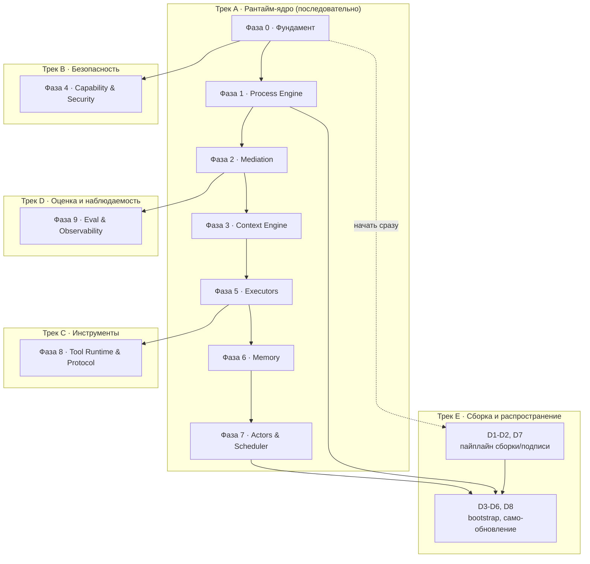

# Roadmap — очередь разработки, декомпозиция, распределение по классам моделей

> Источник — все документы `arch/*.md`, `arch/views/*.md`, `ADR/*.md`. Ничего нового не проектируется — здесь архитектура превращается в исполняемую очередь задач.

## 1. Методология

**Фазы** — не календарные спринты, а слои зависимостей: фаза N не может начаться раньше, чем готовы её входы из фаз, от которых она зависит (граф — в §2). Внутри фазы порядок подзадач необязательно строгий, если явно не указана внутренняя зависимость.

**Сложность подзадачи:**

| Метка | Критерий |
|---|---|
| **S** (простая) | Механическая работа по чёткой спецификации; есть с чем свериться (пример в контракте/документе), минимум развилок |
| **M** (средняя) | Несколько связанных решений о структуре кода внутри одного компонента, есть неочевидные edge case'ы |
| **L** (высокая) | Межкомпонентные инварианты, конкурентность, влияет на инварианты I1–I8; тонкая ошибка ломает архитектурное свойство |
| **XL** (критическая) | Граница доверия/безопасности, sandboxing, криптографическая верификация — «почти правильно» здесь равно «неправильно» |

**Класс модели** — та же шкала, что и в `ADR-0010`/`ADR-0011` для Model Pool самой системы: слабый / средний / сильный.

| Класс | Для какой сложности | Почему |
|---|---|---|
| **Слабый** (локальный/дешёвый) | S | Корректность легко проверяется тестом, не требует удержания архитектурного контекста нескольких файлов сразу |
| **Средний** | M | Нужно одновременно держать в контексте несколько контрактов/файлов и делать согласованный выбор между ними |
| **Сильный** | L, XL | Тесты одни не гарантируют защиту — нужно суждение о обходах (jail, sandbox), гонках, симметричности крипто-проверки |

**Обязательное правило:** любая подзадача сложности **XL** — сильный класс **и** обязательное независимое ревью (второй сильный прогон или человек), не полагаться на один проход генерации, независимо от того, насколько сильна модель, которая её написала.

## 2. Граф зависимостей фаз и параллельные треки

Треки B, D и начало трека E можно вести параллельно основному треку A с момента, когда открыты их стрелки-входы — не дожидаясь полного завершения трека A.

## 3. Milestone 0 — тонкий сквозной срез

Прежде чем углубляться в глубину каждой фазы, стоит собрать одну тривиальную задачу целиком end-to-end — это ловит нестыковки интеграции между компонентами раньше, чем инвестиции в полноту каждого из них по отдельности. Milestone 0 — не отдельная фаза с новыми подзадачами, а минимальный подмножество уже перечисленных ниже, достаточное для одного реального прогона.

**Состав среза:** F1, F2, F3 (фундамент, без F4/F5) → P1, P2, P3 в минимальном варианте — без P5 (конкурентность), P6 (часть лимитов достаточно `max_steps`), P8 (версионирование можно отложить) → M1, M2, M3, M5 в минимальном варианте — без M4 (policy можно ограничить проверкой типов) и без ADR-0011-совместимых повторов (M6) → E1 (только `ToolOnly`, без моделей).

**Цель среза:** прогнать `fixtures/golden/processes/card-delivery-support.yaml` от `fetch_card_status` (шаг `tool`) до записи патча в состояние и события в журнал — без единого обращения к модели. Это проверяет самый нижний слой интеграции (Process Engine ↔ Mediation ↔ Tool Runtime ↔ Storage), не касаясь ещё Model Pool, Capability в полном объёме или CodeAct.

**Определение готовности среза:** `cargo test -p berimor-process-engine` прогоняет один сценарий на этой фикстуре, инстанс проходит `tool`-шаг, патч применяется, событие `step.applied` попадает в журнал, повторный `recover()` по журналу восстанавливает то же состояние (свойство из `process-engine.md` §7).

## 4. Фаза 0 — Фундамент

Цель: примитивы, без которых ничего дальше не имеет смысла писать. Ничего не зависит от предыдущей фазы — это вход в граф.

| ID | Задача | Сложность | Класс | Зависит от | Источник |
|---|---|---|---|---|---|
| F1 | Событийный журнал: таблицы `events`/`snapshots` в SQLite, WAL, append-only запись | M | Средний | — | `arch/stack.md` §3, ADR-0021 |
| F2 | Иммутабельное состояние: тип патча, атомарное применение, свёртка событий → состояние | L | Сильный | F1 | `arch/process-engine.md` §3 |
| F3 | Скелет бинарника: CLI, загрузка конфигурации, точка входа | S | Слабый | — | `arch/stack.md` §2 |
| F4 | Тип-обёртка секрета (без утечки через Display/Debug) + точка маскировки на границе | L | Сильный | F3 | `arch/security-model.md` §2 (L5) |
| F5 | Capability-скелет: канонизация путей (jail), таблица deny-статики, примитив сетевого гейта | XL | Сильный | F3 | `arch/security-model.md` §2 (L3), ADR-0007 |

## 5. Фаза 1 — Process Engine

Цель: детерминированный остов, исполняющий граф шагов без единого обращения к модели.

P6, честная граница: `token_budget`/`cost_budget` не принуждаются
движком — `StepExecutor::execute` возвращает только `Patch`, ни токены,
ни стоимость, а провайдеры Model Pool (E3/E5) их не считают нигде в
системе. Принуждение этих двух прерывателей потребовало бы сначала
завести отчётность об использовании (новое поле в `Patch`/трейте или
отдельный канал) — самостоятельная задача, не выдуманная здесь заранее.
`max_steps`/`timeout` — реальные прерыватели цикла `engine::run`
(`Instant`, эфемерный на вызов, тот же охват, что `steps_this_run`).
`latency_budget` — не прерыватель цикла, а SLA отбора провайдера на
каждом шаге (ADR-0011); проброшен из `ProcessLimits` в `CliExecutor`.

| ID | Задача | Сложность | Класс | Зависит от | Источник |
|---|---|---|---|---|---|
| P1 | ✅ Парсер декларативного описания процесса (граф + хэш версии) | M | Средний | F1 | `arch/process-engine.md` §2 |
| P2 | ✅ Типы шагов без модели: `sequential`/`parallel`/`loop`/`branch`/`checkpoint` | M | Средний | P1 | `arch/process-engine.md` §2 |
| P3 | ✅ Цикл исполнения движка (instantiate/next/apply/emit) + снапшот при мутации | L | Сильный | P1, P2, F2 | `arch/process-engine.md` §4 |
| P4 | ✅ Восстановление после сбоя (replay) + property-тест «свёртка журнала = состояние» | L | Сильный | P3 | `arch/process-engine.md` §7 |
| P5 | Конкурентность: один писатель на инстанс, неймспейсы parallel-шагов, join-барьер | XL | Сильный | P3 | `arch/process-engine.md` §4 |
| P6 | ✅ Детерминированные прерыватели: `max_steps`/`timeout` (движок), `latency_budget` (SLA отбора провайдера, ADR-0011) | M | Средний | P3 | `arch/process-engine.md` §4, ADR-0011 |
| P7 | ✅ Шаг `human_gate` + политика таймаута эскалации | M | Средний | P3 | `arch/process-engine.md` §5 |
| P8 | ✅ Привязка версии к инстансу + операция `migrate_version` | L | Сильный | P3, P4 | `arch/process-engine.md` §2, ADR-0012 |

## 6. Фаза 2 — Mediation

Цель: единственная точка, где вывод модели становится состоянием.

| ID | Задача | Сложность | Класс | Зависит от | Источник |
|---|---|---|---|---|---|
| M1 | Система типов контрактов: derive-схема, запрет неизвестных полей | M | Средний | F3 | `arch/mediation.md` §3 |
| M2 | Стадия `parse` (толерантность к markdown-обёрткам, без эвристик смысла) | S | Слабый | M1 | `arch/mediation.md` §4.1 |
| M3 | Стадия `schema` (типы, обязательность, перечисления, диапазоны, длины) | M | Средний | M1, M2 | `arch/mediation.md` §4.2 |
| M4 | Стадия `policy`: межполевые правила, ссылки на состояние, контроль утечек | L | Сильный | M3, F4 | `arch/mediation.md` §4.3 |
| M5 | Стадия `commit`: разделение патч / аргументы инструмента / публикуемые поля | M | Средний | M4 | `arch/mediation.md` §4.4 |
| M6 | Логика повтора (до 2) и детерминированной эскалации в `human_gate` | M | Средний | M2–M5, P7 | `arch/mediation.md` §5 |
| M7 | Телеметрия отказов (события + доля отказов по процессу/шагу/модели/версии контракта) | S | Слабый | M2–M6 | `arch/mediation.md` §6 |

## 7. Фаза 3 — Context Engine

| ID | Задача | Сложность | Класс | Зависит от | Источник |
|---|---|---|---|---|---|
| C1 | Маршрутизатор: класс задачи → набор слоёв контекста (код-правила) | S | Слабый | P1 | `ideal-agent-architecture.md` §3.5 |
| C2 | Сборщик: фиксированный порядок слоёв | S | Слабый | C1 | `ideal-agent-architecture.md` §3.5 |
| C3 | Оценщик бюджета по классу модели | M | Средний | C1, C2 | `ideal-agent-architecture.md` §3.5, ADR-0010 |

## 8. Фаза 4 — Capability & Security (Трек B, параллельно с Фазой 1+)

| ID | Задача | Сложность | Класс | Зависит от | Источник |
|---|---|---|---|---|---|
| S1 | Анализатор deny-статики: таблица правил по запрещённым классам операций | XL | Сильный | F5 | `arch/security-model.md` §2 (L3) |
| S2 | Jail файловой системы: канонизация путей, защита от symlink-обхода | XL | Сильный | F5 | `arch/security-model.md` §1 |
| S3 | Сетевой гейт: блок-лист приватных адресов на границе HTTP-клиента | L | Сильный | F5 | `arch/views/network-architecture.md` §3 |
| S4 | Режимы подтверждений (`deny`/`smart`/`manual`/`off`) + декларация на инструмент | M | Средний | S1 | `arch/security-model.md` §3 |
| S5 | Интеграция маскировщика на всех 4 границах данных | L | Сильный | F4, M4 | `arch/mediation.md` §4.3 |
| S6 | ✅ Схема ACL-манифеста плагина + статическое применение | L | Сильный | S1 | `arch/security-model.md` §4, ADR-0014 |

## 9. Фаза 5 — Executors

| ID | Задача | Сложность | Класс | Зависит от | Источник |
|---|---|---|---|---|---|
| E1 | `ToolOnly`: резолвинг аргументов из состояния (шаблоны) + диспетч вызова | S | Слабый | P3, S1–S4 | `arch/executors.md` §2 |
| E2 | `StructuredLLM`: сборка подсказки из контракта + пример + срез контекста | M | Средний | M1–M7, C1–C3 | `arch/executors.md` §3 |
| E3 | Model Pool: реестр, поле класса, селектор (локальный → стоимость → фиксированный порядок) | L | Сильный | F3 | ADR-0010, ADR-0011 |
| E4 | Встраивание llama.cpp (локальный инференс, GGUF) | L | Сильный | E3 | `arch/stack.md` §5, ADR-0024 |
| E5 | HTTP-клиент удалённых провайдеров за общим интерфейсом | M | Средний | E3, S5 | `arch/stack.md` §5 |
| E6 | Встраивание Wasmtime: хост, host-функции как стабы инструментов | XL | Сильный | S1–S4, F5 | `arch/executors.md` §4.2, ADR-0022 |
| E7 | Статический анализ сгенерированной программы (белый список идентификаторов) | L | Сильный | E6 | `arch/executors.md` §4.2 |
| E8 | Лимиты песочницы (топливо/память/число вызовов) + результат → Mediation | L | Сильный | E6, E7, M1–M7 | `arch/executors.md` §4.2 |
| E9 | `AgentStep`: свободный цикл, стратегии самокритики/«предложи-выполни-проверь», лимиты | L | Сильный | M1–M7, S4 | `arch/executors.md` §5 |

## 10. Фаза 6 — Memory — ВЫПОЛНЕНО

Все восемь задач реализованы и запушены (`crates/berimor-memory`,
`crates/berimor-storage`, `crates/berimor-mediation`), подтверждены
зелёным CI на Linux/macOS/Windows. MEM7 (XL) прошло обязательное
независимое ревью (ROADMAP §16 п.3) с чистым контекстом — найдено
1 critical + 4 major + 6 minor, критичное и важное исправлено с
регрессионными тестами, minor задокументированы как осознанные
ограничения. 301 тест в воркспейсе на момент закрытия фазы.

| ID | Задача | Сложность | Класс | Зависит от | Источник |
|---|---|---|---|---|---|
| MEM1 | ✅ Рабочая память: сворачивание при переполнении бюджета, оригинал в эпизодической | M | Средний | M1–M7, F2 | `arch/memory-model.md` §4 |
| MEM2 | ✅ Эпизодическая память: индекс FTS5, поиск по сессиям | S | Слабый | F1 | `arch/memory-model.md` §1 |
| MEM3 | ✅ Семантическая память: контракт «предложение факта» + дедупликация | L | Сильный | M1–M7 | `arch/memory-model.md` §2, ADR-0005 |
| MEM4 | ✅ Интеграция `sqlite-vec`, гибридный поиск (вектор + полнотекст, фиксированные веса) | L | Сильный | MEM2, MEM3 | `arch/memory-model.md` §3 |
| MEM5 | ✅ Конфликт-события при противоречии фактов | M | Средний | MEM3 | `arch/memory-model.md` §2 |
| MEM6 | ✅ Процедурная память: формат файла навыка, описание всегда/тело по требованию | M | Средний | C1–C3 | `arch/memory-model.md` §1 |
| MEM7 | ✅ Граф сущностей: `nodes`/`edges`, entity resolution, типизированные контракты | XL | Сильный | MEM3, M1–M7 | `arch/memory-model.md` §4, ADR-0016 |
| MEM8 | ✅ Изоляция профилей (включая профиль типа `actor`), правило межпрофильного чтения | L | Сильный | MEM1–MEM7 | `arch/memory-model.md` §5, ADR-0013 |

Сознательно вне scope Фазы 6 (упомянуто в `memory-model.md`, но не
входит в формулировки задач MEM1–MEM8 — задокументировано в
doc-комментариях соответствующих модулей): персистентность графа
сущностей (MEM7 — только логика, как MEM3 до MEM4), маскировщик секретов
на записи в память и режим персональных данных (§5 — отдельный механизм
на границе записи, не изоляция профилей). Интеграция всего перечисленного
в реальный `berimor run` (вызов через Context Engine, слои Skills/Facts/
Session) — задача будущего Milestone, не этой фазы.

## 11. Фаза 7 — Actors & Scheduler — ВЫПОЛНЕНО

`crates/berimor-actors`, все шесть задач реализованы и запушены, 379
тестов в воркспейсе на момент закрытия фазы. A2 переиспользует
`berimor_capability::plugin::PluginManifest` (S6) как ACL шины событий —
единая ось ACL, не отдельный параллельный механизм (тот же приём, что
ADR-0013 у памяти актора). A4 реализована без нового вида состояния:
`TaskStatus::Escalated` диспетчера (A3) — это и есть остановка
`human_gate`; предел на диспетчере (`Dispatcher::with_human_gate_limit`)
не включён по умолчанию, вызывающий код включает его явно.

| ID | Задача | Сложность | Класс | Зависит от | Источник |
|---|---|---|---|---|---|
| A1 | ✅ Модель актора: задача tokio + почтовый ящик + привязка профиля памяти | L | Сильный | P3, MEM8 | ADR-0009 |
| A2 | ✅ Подпись конвертов (HMAC-SHA256, ключ хоста) + проверка ACL топика на шине событий | L | Сильный | A1, S6 | `arch/security-model.md` §4 |
| A3 | ✅ Диспетчер: доска задач, правила назначения, эскалация после N неудач | M | Средний | A1 | `ideal-agent-architecture.md` §3.8 |
| A4 | ✅ Лимит очереди `human_gate` (диспетчер) + статус `throttled` для расписаний (планировщик) | M | Средний | A3, P7 | `arch/process-engine.md` §5, ADR-0015 |
| A5 | ✅ Планировщик: персистентный min-heap времён срабатывания, защита от двойного тика | L | Сильный | A3 | `ideal-agent-architecture.md` §3.8 |
| A6 | ✅ Аварийная заморозка всех акторов | L | Сильный | A1 | `arch/security-model.md` §2, §4 |

## 12. Фаза 8 — Tool Runtime & Protocol (Трек C) — ВЫПОЛНЕНО

`crates/berimor-tool-runtime` на официальном Rust SDK MCP (`rmcp`), не
самодельном протоколе — ADR-0023 требует готовый стандарт, не изобретать
свой. T1/T2 — механизм (клиент/сервер), не конкретные встроенные
инструменты (терминал, файлы, VCS, ...) — их реализация не входит ни в
одну задачу этой фазы, список из `ideal-agent-architecture.md` §3.9 без
реализации, до отдельной будущей задачи. T3 переиспользует ACL-манифест
плагина из S6 (`berimor_capability::plugin::PluginManifest`) — та же ось
ACL, что и у A2 на шине событий, не отдельный параллельный механизм.

| ID | Задача | Сложность | Класс | Зависит от | Источник |
|---|---|---|---|---|---|
| T1 | ✅ MCP-клиент (потребление внешних серверов инструментов) | M | Средний | E1 | `arch/stack.md` §6, ADR-0023 |
| T2 | ✅ MCP-сервер (отдача собственного набора инструментов) | M | Средний | E1 | `arch/stack.md` §6, ADR-0023 |
| T3 | ✅ Изоляция плагина как процесса (T1) + применение ACL-манифеста (S6) | L | Сильный | T1, S6 | `ideal-agent-architecture.md` §3.9 |

## 13. Фаза 9 — Eval & Observability (Трек D, параллельно с Фазой 2+) — ВЫПОЛНЕНО

`crates/berimor-eval` — новый крейт (по одному на фазу, как Actors/
Tool Runtime), все четыре задачи реализованы. O1 — чтение журнала для
человека/отладки, не переиспользование `engine::recover` (тот
восстанавливает исполняемый `ProcessInstance` под граф процесса и
проверяет версию — другая цель, «продолжить выполнение», не
«посмотреть, что произошло»). O2–O4 — чистые функции от уже собранных
данных (сценариев/журналов/статистики использования); сбор самих данных
(итерация по хранилищу за пределами одного `EventLog::replay`,
подключение к реальному прогону CLI) — вне scope этой фазы, как и
интеграция Фаз 6–8.

| ID | Задача | Сложность | Класс | Зависит от | Источник |
|---|---|---|---|---|---|
| O1 | ✅ Инструмент трассировки/replay событий | S | Слабый | F1 | `ideal-agent-architecture.md` §3.11 |
| O2 | ✅ Стенд офлайн-оценки на золотых наборах (доля веток, доля отказов) | M | Средний | M7, P4 | `ideal-agent-architecture.md` §3.11 |
| O3 | ✅ Контур здоровья навыков: рост отказов + неиспользование → событие ревью | M | Средний | O2, MEM6 | `ideal-agent-architecture.md` §3.11 |
| O4 | ✅ Пайплайн онлайн-метрик (доля успеха задач, скорость подтверждений) | M | Средний | O2 | `ideal-agent-architecture.md` §3.11 |

## 14. Фаза 10 — Deployment & Distribution (Трек E)

| ID | Задача | Сложность | Класс | Зависит от | Источник |
|---|---|---|---|---|---|
| D1 | Матрица кросс-компиляции (cargo + cargo-zigbuild) | M | Средний | F3 | `arch/deployment.md` §7, ADR-0017 |
| D2 | Пайплайн подписи (sigstore/cosign, keyless) | L | Сильный | D1 | `arch/deployment.md` §7, ADR-0026 |
| D3 | Bootstrap-пакет (TypeScript): определение платформы, скачивание, атомарная распаковка | M | Средний | D1 | `arch/deployment.md` §2–3, ADR-0025 |
| D4 | Процесс `agent-self-update` на примитивах Process Engine | L | Сильный | P1–P8, D2 | `arch/deployment.md` §5, ADR-0019 |
| D5 | Формат и управление доверенным списком (событие + подтверждение) | M | Средний | P7, M6 | `arch/deployment.md` §4, ADR-0018 |
| D6 | Процесс установки плагина | L | Сильный | D4, D5, S6, T3 | `arch/deployment.md` §6, ADR-0019 |
| D7 | Провенанс (`npm publish --provenance`) + SBOM | S | Слабый | D2 | `arch/deployment.md` §7 |
| D8 | Тесты внедрения сбоев для обновления (прерванная загрузка, неверная подпись, downgrade) | L | Сильный | D4 | `arch/deployment.md` §8 |

## 15. Definition of Done

Общее для всех подзадач условие закрытия — сначала оно, затем специфика фазы:

1. `cargo check --workspace` (и, где применимо, `npm run build` в `bootstrap/`) проходит без ошибок и без новых предупреждений.
2. Есть тест на фикстуре из `fixtures/golden/` — контрактный тест для подзадач Process Engine/Mediation/Memory, юнит-тест для остального; подзадача без теста не закрывается, независимо от сложности.
3. Doc-комментарий модуля ссылается на источник в `arch/*.md`/ADR — тот же, что указан в столбце «Источник» соответствующей фазы.
4. Подзадачи **XL** — дополнительно: пройдено независимое ревью (см. §1) до мержа, не после.

Специфика по фазам — какой сценарий из `arch/views/quality-attributes.md` должен быть демонстрируемым по завершении фазы:

| Фаза | Сценарий Definition of Done | Источник сценария |
|---|---|---|
| 0 · Фундамент | Секрет не проходит через `Debug`/`Display` ни при каких обстоятельствах (тест компиляции: обёртка не реализует утечку) | `quality-attributes.md`, строка «Безопасность (утечка)» |
| 1 · Process Engine | Fault injection: остановка между двумя шагами → `recover()` не теряет и не дублирует шаг | `quality-attributes.md`, строка «Отказоустойчивость» |
| 2 · Mediation | Контрактный тест на `fixtures/golden/malicious-inputs/*` — оба сценария отклонены на ожидаемой стадии | `mediation.md` §6 |
| 4 · Capability & Security | Deny-таблица блокирует весь перечень запрещённых операций из золотого набора безусловно | `quality-attributes.md`, строка «Безопасность (деструктив)» |
| 5 · Executors | CodeAct: попытка выйти за пределы белого списка идентификаторов отклоняется на статическом анализе, не долетает до Wasmtime | `quality-attributes.md`, строка «Латентность CodeAct» (соседняя гарантия структурной изоляции) |
| 6 · Memory | Два кандидата-факта с высокой близостью эмбеддинга не сливаются автоматически без точного совпадения идентификатора | ADR-0016, `quality-attributes.md` строка «Защита памяти от отравления» |
| 10 · Deployment | Fault injection: поддельная подпись артефакта → `fail_update`, текущая версия остаётся активной | `quality-attributes.md`, строка «Целостность цепочки поставок» |

## 16. Как этим пользоваться

1. Брать подзадачи в порядке фаз из графа §2; внутри фазы — по столбцу «Зависит от».
2. Столбец «Класс» — это модель, которой поручается *написание* этой конкретной подзадачи, а не то, какая модель будет использовать систему после сборки — два разных решения, использующие одну и ту же шкалу.
3. Подзадачи **XL** не закрываются одним прогоном: пишет сильный класс, принимает — независимое ревью (второй сильный прогон с чистым контекстом либо человек). Это относится к F5, S1, S2, E6, MEM7 — все они про границу доверия.
4. Треки B/C/D/E можно вести параллельно основному треку A, как только открыта их стрелка входа в графе §2 — не обязательно ждать, пока трек A закроется целиком.

## 17. Связанные документы

Полный список источников — `arch/README.md`, `ADR/README.md`, `arch/views/README.md`.

## 18. Milestone 1 — полноценный CLI

> Инструкция для агента, продолжающего разработку без контекста сессии,
> где написан этот раздел. Читать после §1–§3 (методология, граф,
> Milestone 0) — предполагается, что Milestone 0 уже закрыт: `cargo test
> --workspace` зелёный (124 теста на момент написания), `berimor-process-engine`
> и `berimor-mediation` реализованы целиком (F1–F3, P1–P3, M1–M7, E1).

### 18.1. Цель

`berimor run fixtures/golden/processes/card-delivery-support.yaml` реально
исполняет процесс от начала до конца через настоящий CLI-бинарник — не
через тест с `FakeExecutor`, как сейчас в `engine.rs`. Это включает хотя бы
один шаг с реальной моделью (`llm_structured`), проходящий через
Capability, а не только `tool`-шаг в обход неё.

### 18.2. Почему именно этот состав, не весь ROADMAP целиком

CLI не требует Memory (Фаза 6), Actors/Scheduler (Фаза 7), Tool Runtime/MCP
(Фаза 8), Eval (Фаза 9) или CodeAct/AgentStep (E6–E9) — все они про то,
чего нет в `card-delivery-support.yaml` вообще (граф сущностей, параллельные
акторы, внешние MCP-серверы, генерация кода). Тянуть их сейчас — работа
не в счёт цели этого milestone.

### 18.3. Порядок выполнения

Строго последовательно там, где указана зависимость; без пометки — можно
параллельно.

1. **S1–S4** (Фаза 4, `Capability & Security`) — deny-статика, jail,
   сетевой гейт, режимы подтверждений. Без этого `ToolOnly` (уже
   реализован в `berimor-executors::tool_only`) работает в обход
   `executors.md` §2 («перед вызовом — capability-слой») — сейчас так и
   есть, это осознанный пробел F1-текста в модуле, не забытый баг.
   S5 (маскировщик) и S6 (ACL плагинов) не нужны для этого milestone —
   плагинов и модели-с-утечками в сценарии нет.
2. **E5** (Фаза 5, HTTP-клиент удалённых провайдеров), НЕ E4
   (llama.cpp) — быстрее довести до работающего конца: один HTTP-вызов
   к внешнему провайдеру проще и надёжнее в CI/песочнице, чем
   встраивание локального инференса. E4 — отдельная задача после того,
   как E5 уже работает, не блокирует Milestone 1.
3. **E3** (Model Pool: реестр, поле класса, селектор) — до E5, селектор
   должен от чего-то выбирать.
4. **C1–C3** (Фаза 3, Context Engine) — в минимальном варианте: `build()`
   может для начала просто отдавать `state` целиком как единственный
   слой, без реального маршрутизатора по классу задачи. Полноценный
   Context Engine — не цель этого milestone, только то, что нужно E2
   для компиляции и для одного реального прогона.
5. **E2** (`StructuredLLM`) — первый исполнитель, реально вызывающий
   модель: подсказка из `Contract::json_schema()` (уже есть с M1) +
   срез контекста (C1–C3) → `Model Pool::select` (E3) →
   `ModelProvider::complete` (E5) → результат → `berimor_mediation::pipeline::mediate`
   (уже реализован целиком, M1–M7) → `Patch`.
6. **CLI1–CLI4** (новые задачи, ниже) — сборка всего вышеперечисленного
   в реальную команду `berimor run`.

### 18.4. Новые задачи: сборка в CLI

Их нет в фазах выше — там были только компоненты, сборка в CLI никогда не
была отдельной задачей ROADMAP. Все — в `crates/berimor-cli`.

| ID | Задача | Сложность | Класс | Зависит от |
|---|---|---|---|---|
| CLI1 | `berimor run <path>`: загрузка процесса (P1) → открытие `SqliteEventLog` по `config.storage_path` (F1/F3) → `instantiate` (P3) → `run()` с реальным `StepExecutor`, маршрутизирующим `Tool`→E1, `LlmStructured`→E2, остальное — понятная ошибка «не поддержано в Milestone 1» | L | Сильный | S1–S4, E2, P3 |
| CLI2 | Обработка `RunOutcome::AwaitingHuman` в CLI: напечатать `reason`, спросить подтверждение в терминале (да/нет), при «да» — вызвать `run()` повторно с тем же `ProcessInstance` | M | Средний | CLI1 |
| CLI3 | `berimor run --resume <instance-id>`: `recover()` (уже реализован, P3) от журнала, продолжить `run()` | M | Средний | CLI1 |
| CLI4 | End-to-end тест: реальный прогон `card-delivery-support.yaml` через `main()` (не через вызов функций напрямую, как в тестах `engine.rs`) — `assert_cmd` или эквивалент, с `E5`, направленным на локальный мок-сервер вместо реального провайдера (не тратить реальные токены/деньги в CI) | M | Средний | CLI1, CLI2, CLI3 |

### 18.5. Definition of Done Milestone 1 — ВЫПОЛНЕНО

Подтверждено реальным CI на всех трёх ОС (`gh run view 30545287702`,
коммит `673a0d1`), не только локальным прогоном:

- [x] `cargo test --workspace` зелёный, включая CLI4 (189 тестов).
- [x] `berimor run fixtures/golden/processes/card-delivery-support.yaml` с
  провайдером (в CLI4 — мок, локальный HTTP-сервер на `std::net`; с
  реальным провайдером — та же цепочка, конфигурация отличается только
  `base_url`/`api_key_env`) доходит до `Finished`, проходя через
  `classify` (E2) → `check_risk` (P2, ветвление) → `fetch_card_status`
  (E1, ToolOnly через Capability) → `answer` (E2). Тест:
  `crates/berimor-cli/tests/e2e_run.rs::full_run_through_finished_produces_expected_state`.
- [x] Прерывание процесса на `human_gate` и `berimor run --resume`
  восстанавливают то же состояние, что и непрерывный прогон того же
  сценария — доказано через реальный CLI-процесс (не вызов функций теста,
  как в P3). Тест:
  `crates/berimor-cli/tests/e2e_run.rs::interrupted_run_resumes_to_same_final_state_as_continuous_run`.
- [x] `clippy -D warnings`, `fmt --check` чисты на ubuntu/macOS/Windows.

Побочный результат: тройная проверка на реальном Windows CI вскрыла два
платформенных бага в `berimor-capability`, отсутствовавших в локальных
прогонах на Linux — `FsJail::new` сравнивал корень ФС буквально с `/`
(на Windows `canonicalize` даёт путь диска), и `/dev`-детектор deny-статики
нормализовал пути через `std::path`, чей `RootDir` на Windows отдаёт `\`
вместо `/`. Оба исправлены строковой, платформо-независимой логикой
(коммит `fa762f4`) — урок: код, работающий с текстом shell-команд
целевого агента, не должен идти через `std::path`, даже когда выглядит
как путь.

### 18.6. Как работать (важные уроки из разработки Milestone 0)

- **Golden-фикстуры — источник истины, не документы.** Несколько раз
  за Milestone 0 документ и реальный `.yaml`/`.json`-пример расходились
  (`model_tier: any` не было в `ModelTier`, `Tool`-шаг без поля `args`,
  `SupportReply` без `card_id`, который требовала заранее написанная
  вредоносная фикстура). Каждый раз фикстуру не подгоняли под
  существующий тип — тип чинили под фикстуру, с объяснением в
  doc-комментарии, почему. Тот же принцип применим и здесь: если
  `card-delivery-support.yaml` или `classification-out.json` не лягут в
  типы Milestone 0 при реальном прогоне — чинить тип, не фикстуру.
- **Каждый модуль — код и тесты, не только сигнатура.** Ни одна задача
  этой сессии не считалась закрытой без юнит-тестов на синтетических
  данных и, где применимо, композиционного теста на golden-фикстуре.
- **Перед тем как считать задачу готовой:** `cargo fmt --all`,
  `cargo clippy --workspace --all-targets -- -D warnings`,
  `cargo test --workspace` — все три, не по отдельности.
- **Реальный прогон CI, не только «похоже на правильное».**
  `release.yml` был написан, синтаксически провалидирован — и всё равно
  не работал с первого раза в реальности (GitHub Immutable Releases не
  позволяет дозаливать ассеты в уже опубликованный релиз). Написанный,
  но не прогнанный пайплайн — не доказательство; для CLI4 то же самое:
  реальный `cargo run --bin berimor -- run ...`, не только юнит-тесты
  внутренних функций.
- **Не заявлять готовность раньше подтверждения.** Если что-то ещё не
  проверено (например, реальный HTTP-вызов к провайдеру в CLI4) — так и
  сказать, не выдавать «написан код» за «работает».
