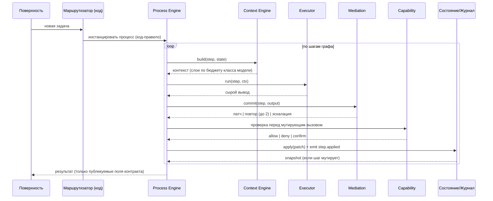
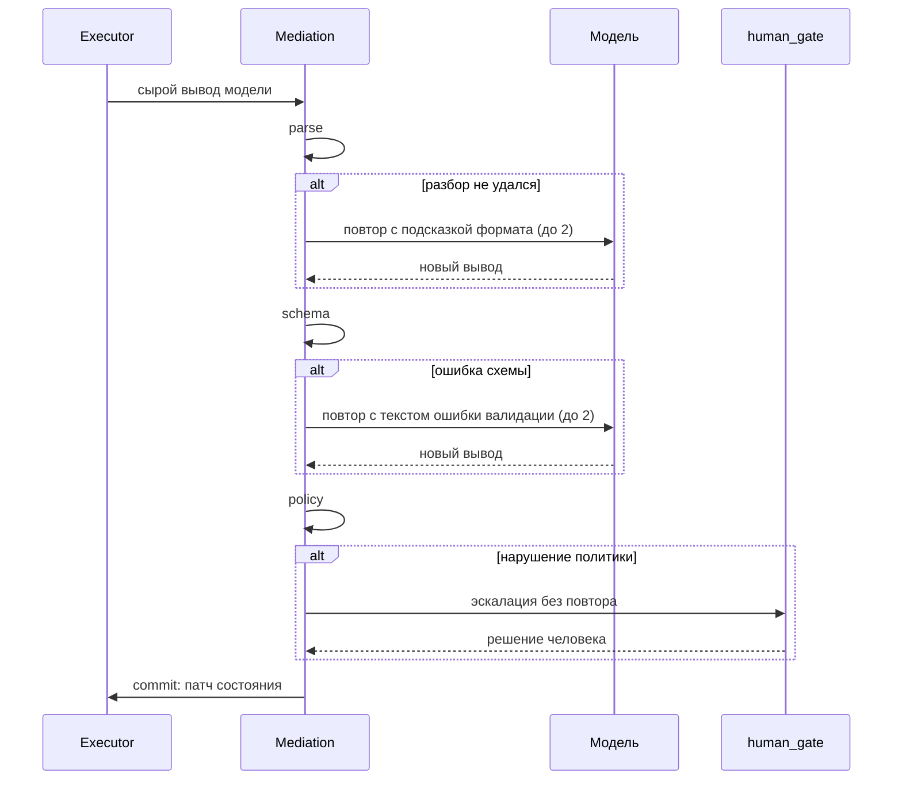
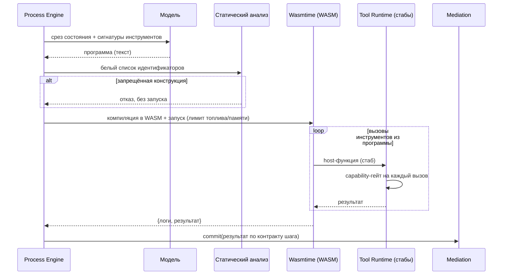
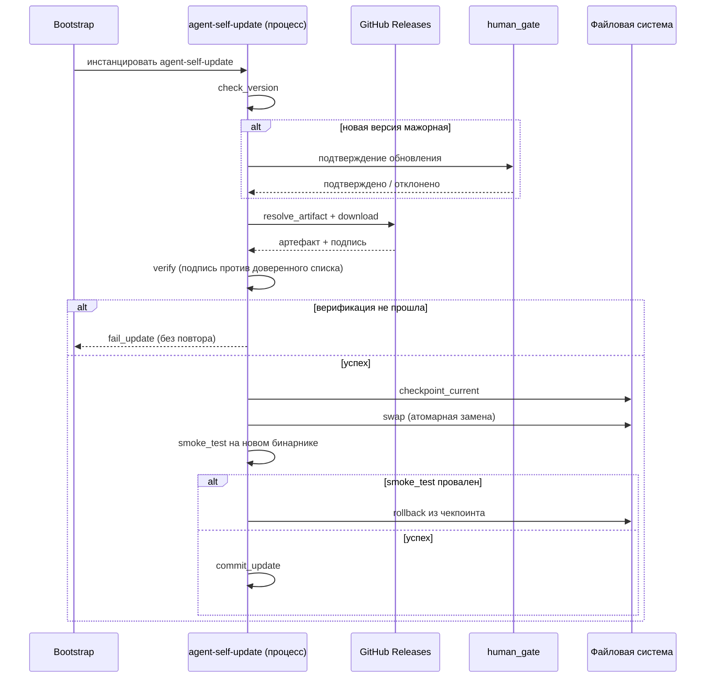
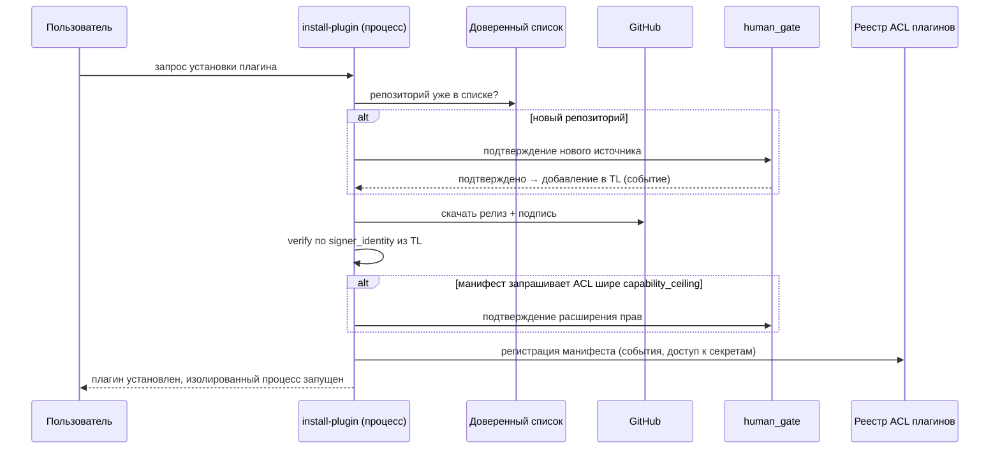

# Runtime View — сценарии взаимодействия во времени

> Диаграммы последовательности для ключевых сценариев. Структурные представления (system/component) показывают связи; здесь — как именно они срабатывают по шагам. См. `ideal-agent-architecture.md` §4, `mediation.md` §2, `deployment.md` §5.
> Интерактивные версии: жизненный цикл задачи — [`diagrams/task-lifecycle.html`](diagrams/task-lifecycle.html); шаг с моделью через Mediation — [`diagrams/mediation-sequence.html`](diagrams/mediation-sequence.html).

## 1. Жизненный цикл задачи (структурированный процесс)

## 2. Mediation: повтор и эскалация

## 3. CodeAct: генерация и изолированное исполнение

## 4. Само-обновление агента

## 5. Установка плагина из доверенного репозитория

## 6. Связанные документы

`ideal-agent-architecture.md` §4; `mediation.md` §2, §5; `executors.md` §4; `deployment.md` §5–6.
