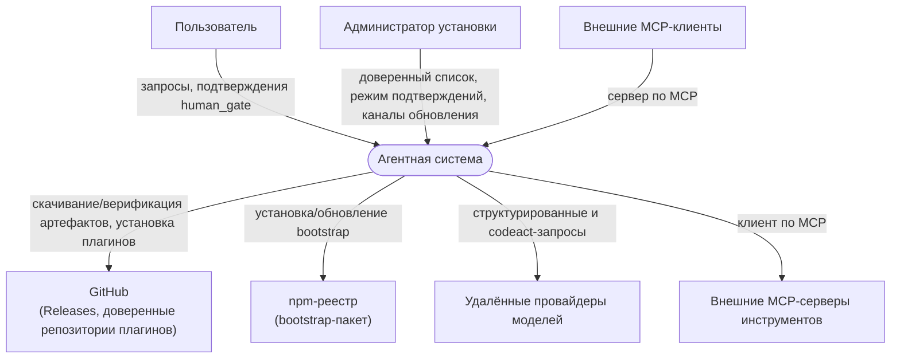
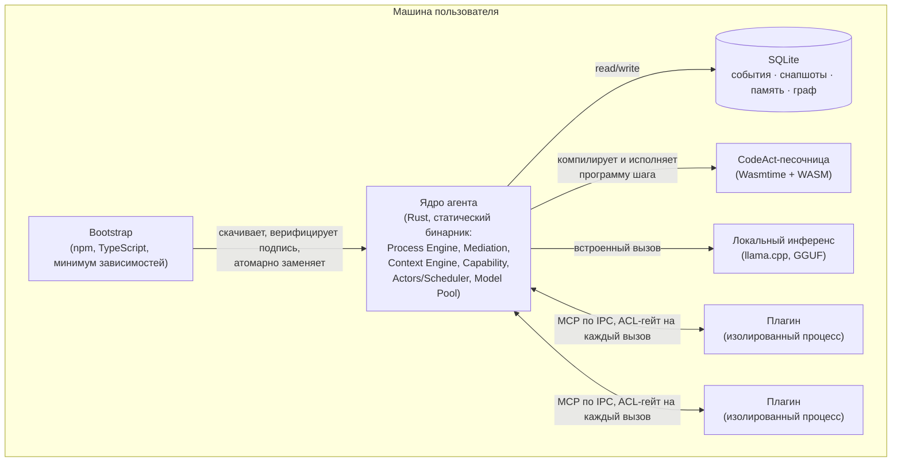
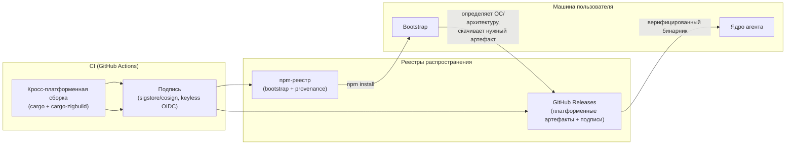

# Системная архитектура — Context, Container, Deployment

> C4, уровни 1–2, плюс диаграмма развёртывания. См. `ideal-agent-architecture.md` §2, `deployment.md`, `stack.md`.
> Интерактивная версия компонентной карты с привязкой к крейтам: [`diagrams/component-map.html`](diagrams/component-map.html).

## 1. Контекст (C4 Level 1)

Кто и что взаимодействует с системой снаружи.

## 2. Контейнеры (C4 Level 2)

Развёртываемые единицы внутри системы — см. `deployment.md` §2, `stack.md` §10.

## 3. Развёртывание (Deployment view)

Физическая топология поставки и обновления — см. `deployment.md` §5–7.

## 4. Таблица контейнеров

| Контейнер | Технология | Ответственность | Специфика |
|---|---|---|---|
| Bootstrap | TypeScript, npm | определение платформы, оркестрация обновления | минимум зависимостей (ADR-0025) |
| Ядро агента | Rust, статический бинарник | Process Engine, Mediation, Context Engine, Capability, Actors/Scheduler, Model Pool | один самодостаточный артефакт (I5, ADR-0020) |
| SQLite | встроенная БД | события, снапшоты, память (4 слоя), граф сущностей | единый файл (ADR-0021) |
| CodeAct-песочница | Wasmtime + WASM | изолированное исполнение сгенерированной программы | структурная изоляция (ADR-0022) |
| Локальный инференс | llama.cpp | инференс без внешнего сервиса | GGUF-веса (ADR-0024) |
| Плагины | изолированные процессы, MCP | интеграция с внешними системами | ACL-манифест, за границей I5 (ADR-0014) |

## 5. Связанные документы

`ideal-agent-architecture.md` §2; `deployment.md`; `stack.md`; ADR-0017, ADR-0020, ADR-0021, ADR-0022, ADR-0024, ADR-0025.
